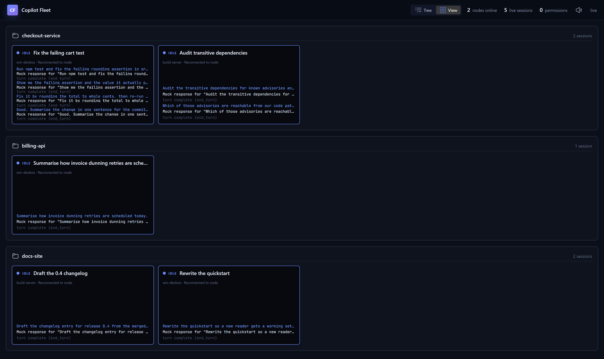
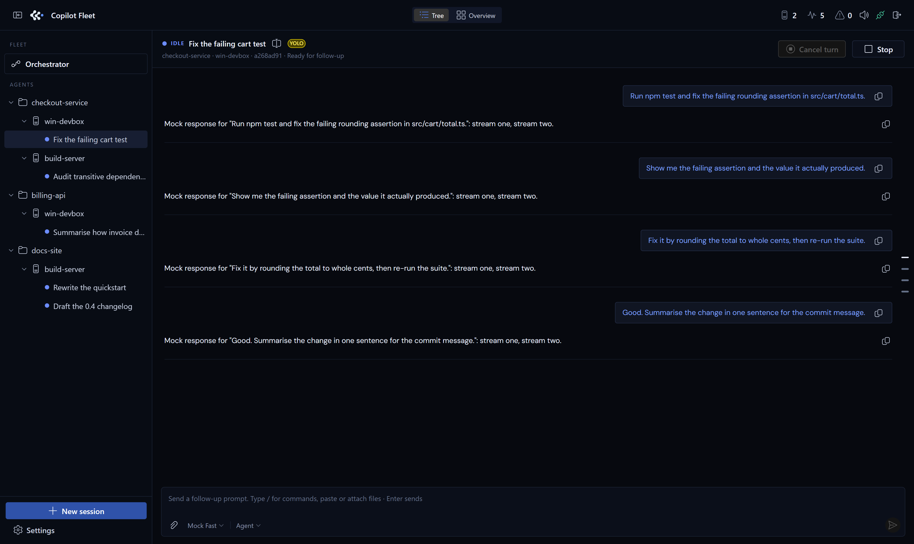
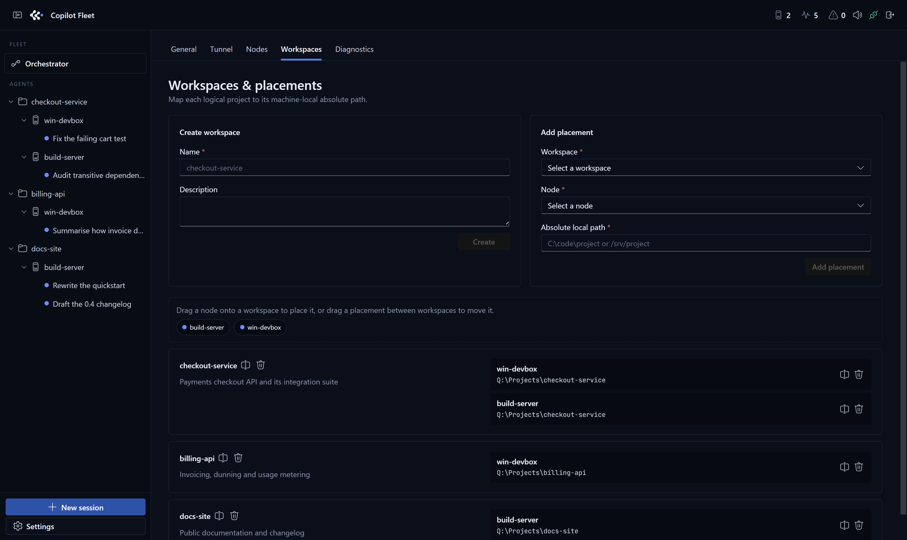
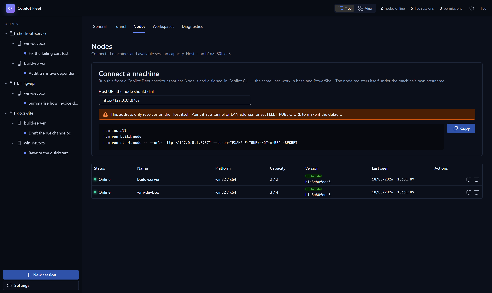
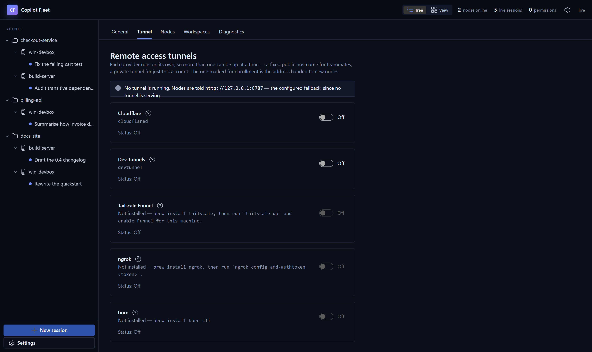
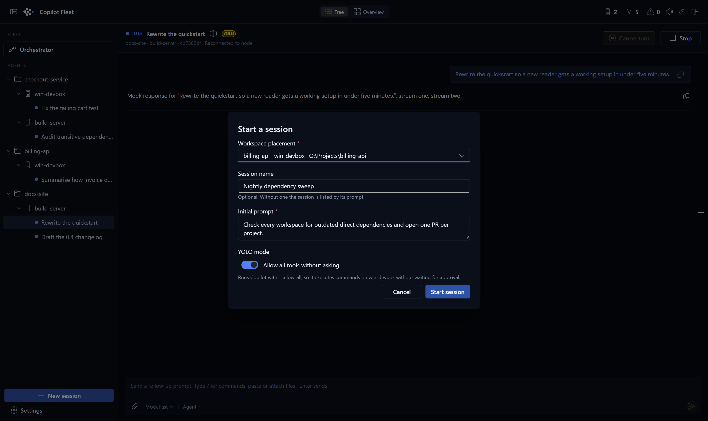

# Copilot Fleet

**English** · [简体中文](README.zh-CN.md)

Copilot Fleet is a self-hosted control plane for supervising GitHub Copilot CLI
agents on multiple machines. The Host combines a Fastify API, WebSocket hub,
SQLite database, and React UI. Each Node makes one outbound connection and owns
an isolated ACP client and Copilot process per live session.

## What it looks like

Every agent in the fleet on one screen, grouped by the project it is working in.
Cards stream their transcript live, so a wall of them is readable without opening
anything.



Open one and you get the whole conversation, the node it runs on, a composer that
takes slash commands and file attachments, and the agent's own Model and Mode
pickers along the bottom.



> Screenshots come from the deterministic `--mock-agent` demo described under
> [Exact proof of concept](#exact-proof-of-concept), so they can be reproduced on
> any machine without a Copilot login. A real node streams real Copilot output in
> exactly the same surfaces.

## Requirements

- Node.js 22.5 or newer and npm 10 or newer
- GitHub Copilot CLI installed and authenticated on each real Node
- An absolute local path for every workspace placement

## Mac/Linux Host

```bash
git clone <repository-url> copilot-fleet
cd copilot-fleet
npm install
cp .env.example .env
```

Set a strong random `ENROLLMENT_TOKEN` in `.env`, then start development mode:

```bash
npm run dev
```

This single command runs the Fastify API on `http://127.0.0.1:8787`, Vite on
`http://127.0.0.1:5173`, and the local Node service. The Node reads its
`FLEET_*` settings from `.env`.

To keep a tunnel URL stable while you edit code, start the tunnel as its own
process instead:

```bash
npm run dev:tunnel
```

The tunnel then survives `tsx watch` reloads, so the public URL stops rotating
every time the Host restarts and remote nodes stay connected. The Host detects
it and leaves its lifecycle alone; the Settings toggle is disabled while it
runs. Stop everything with Ctrl+C as usual.

Open the UI → **Settings**:

- **General** — session defaults, plus export/import to move this Host.
- **Tunnel** — run Cloudflare, Dev Tunnels, Tailscale Funnel, ngrok, or bore;
  each installed provider has its own switch and status.
- **Nodes** — rename/delete machines and copy the enroll command.
- **Workspaces** — map projects to per-machine paths.



A workspace is logical; a placement is the physical `(workspace, node) → path`
pair. The same project can sit at a different absolute path on every machine, and
a session is always started from a stored placement — never from a path typed
into a request.

Connected nodes are told when the Host's public URL changes, so a rotated tunnel
does not strand them — see
[Following the Host to a new URL](#following-the-host-to-a-new-url).

For production (built Host + local Node together):

```bash
npm run build
npm start
```

Or just the Host: `npm run start:host`. Open `http://127.0.0.1:8787` —
Fastify serves the built UI.

## Windows Node (PowerShell)

Install Node.js and authenticate Copilot CLI first. From a checked-out Fleet
directory (or paste the command from the Host's Nodes → Connect card):



```powershell
npm install
npm run build:node
npm run start:node -- --url="https://fleet.example.com" --token="replace-with-host-token"
```

The same three lines work in bash — flags avoid the `$env:` / `VAR=value`
split between shells.

The node name defaults to the machine hostname, and can be changed from either
end — the Host's Nodes tab or the node's own config page. Renaming keeps the
machine's identity, so its placements and sessions come with it; the Host owns
the name, so if both ends changed while the node was offline, the Host's name
wins and is pushed back down. Pass `--max-sessions 8` if you want a capacity
other than 4.

First registration exchanges the enrollment token for a unique node secret.
Credentials are persisted at
`$env:APPDATA\CopilotFleet\node.json`; subsequent starts do not need the
enrollment token. The service uses an outbound WSS connection, so no inbound
Node port is required.

### Node command-line flags

Anything the node reads from the environment can be given as a flag instead, and
a flag wins over both `.env` and the saved `settings.json` — which is what makes
it usable to point one run at a different Host without editing files on that
machine. Run `npm run start:node -- --help` for the current list.

| Flag                              | Replaces                 |
| --------------------------------- | ------------------------ |
| `--url`, `--host-url`             | `FLEET_HOST_URL`         |
| `--name`, `--node-name`           | `FLEET_NODE_NAME`        |
| `--token`, `--enrollment-token`   | `FLEET_ENROLLMENT_TOKEN` |
| `--max-sessions`                  | `FLEET_MAX_SESSIONS`     |
| `--copilot-command`               | `FLEET_COPILOT_COMMAND`  |
| `--permission-timeout-ms`         | `PERMISSION_TIMEOUT_MS`  |
| `--context-tier`                  | `FLEET_CONTEXT_TIER`     |
| `--devtunnel`                     | `FLEET_DEVTUNNEL_ID`     |
| `--config-port`                   | `FLEET_NODE_CONFIG_PORT` |
| `--mock-agent`, `--no-mock-agent` | `FLEET_MOCK_AGENT`       |

Both `--flag value` and `--flag=value` are accepted. The `--` after the npm
script name is npm's own separator; without it npm eats the flags. The same
flags work on `npm run node`, `npm run dev` and `npm start`, where they are
forwarded to the node process only:

```bash
npm start -- --url=https://fleet.example.com
```

Flags apply to that run; edits made later in the config page win until the
process restarts.

Note that `--url` takes effect by restarting the node, which ends the sessions
running on it — they settle as "Node reconnected without this session", and
anything that reached the agent can be picked up again with **Resume**. To
follow a rotated tunnel URL without losing live sessions, retarget from the node
config page instead: it reconnects in place.

The `nodeId` stored in `node.json` is the machine's identity. `--name` proposes a
new label for that identity; it does not create a second node or abandon the
existing node's placements and sessions.

### Rows that fold themselves away

A workspace or node row folds shut once nothing under it is running — every
session on it stopped, finished, or offline while its machine is away — so the
tree stays as short as the work in front of you rather than growing with every
transcript kept for **Resume**.

It opens again the moment work turns up there: a session started on that machine,
or one coming back to life as its node reconnects. Only those changes move a row,
never the standing state, so a dormant branch opened by hand to read an old
transcript stays open until something under it actually happens.

### Ordering and filing by dragging

The sidebar tree can be rearranged by hand at every level: workspace rows, node
rows, and the sessions under them. Drag a row above or below a sibling — the
pointer's half of the target row decides which, and a line appears at that edge —
and the order is stored, so it survives a reload and is the same in every browser
watching the Host.

Dropping _onto_ a row would only ever mean "take its place", which leaves no way
to say "put it last": there is no row after the last one to aim at. The
above/below distinction is what makes the end of a list reachable.

New workspaces, placements and sessions are added at the end rather than sorted
in by name or date, so an arrangement made by hand is not undone by the next
machine or run added. A fleet nobody has rearranged keeps the order it always
had.

Dropping a node row onto a _different_ workspace files that checkout under it
instead of reordering, taking its sessions along: they carry their own workspace
id so the sidebar can group history without a join, and leaving that behind
would file every past run under the project the checkout no longer belongs to.
That move is refused if the target workspace already has a placement on the same
machine, since a workspace can only be in one place on a given node.

In **Workspaces & placements**, the same drags work on the cards: placement rows
reorder within a card, node chips at the top can be dropped on a card to place
that machine there, and a card that cannot take what is being dragged says why on
the card rather than silently refusing.

Sessions only reorder among their own node's list. A session is a live agent
process on one machine, holding that machine's files, so there is nowhere else
for it to go.

### Alerts

A finished turn plays a short rising tone; an agent blocked on a permission
plays a lower one, twice. They are different on purpose: a fleet is watched out
of the corner of an eye, and "it needs you" should be distinguishable from "it
is done" without looking at the screen. The speaker button in the top bar mutes
them, and the choice is remembered.

Both are synthesised in the browser rather than shipped as audio files, so they
work on a Host that has never been online. Nothing sounds on the first view of
the fleet — opening a page onto ten finished sessions is not the same as
watching ten agents finish — and several sessions finishing together produce one
tone rather than a pile of them. A permission that is still waiting is announced
once, not on every refresh.

Permissions are also announced outside the page, with a tab-title count and a
desktop notification that survives until it is clicked, because a request blocks
its agent until the node's timeout expires.

### Attaching files and images

The composer takes files: paste a screenshot straight into the box, or use the
paperclip to pick some. Each one appears as a chip that can be removed until the
message is sent, and a prompt can carry up to six of them at 10 MB each.

How a file reaches the agent depends on what it is. Images go over as ACP image
blocks; everything else is embedded as text, so the agent reads the contents
without needing the file to exist on its own disk — which matters because the
machine running the agent is usually not the machine the file came from. A
binary that is neither, like a zip, is named in the prompt rather than embedded:
decoding it as text would spend the context window on replacement characters and
can read as instructions.

Bytes travel with the prompt in one piece rather than through an upload endpoint.
The agent is often behind a tunnel, and handing it a URL to fetch would mean
giving the Node credentials and a route back to the Host for something already in
the operator's hand. The size ceilings are what keep that from becoming a
WebSocket frame large enough to stall the other sessions sharing the connection.

Only the name, type and size are recorded in the transcript. The event log is
stored on the Host and replayed to every browser watching a session, so keeping
the bytes there would turn a few pasted screenshots into a liability; the
attachment chips under a sent message are the trace that remains.

### Slash commands and session pickers

The composer offers Copilot's own slash commands: type `/` and a list appears,
filtered as you type. Arrow keys move the selection, Enter or Tab picks one, and
Escape closes the menu. A command that takes an argument (`/review`, `/research`)
leaves the caret waiting after it; one that does not (`/usage`, `/context`) runs
straight away. The list is whatever the agent reports for that session, including
skills and plugins, so a machine with extra skills installed shows them without
any change here.

Along the bottom of the composer sit the session's pickers — **Model**, **Mode**,
**Reasoning Effort** — as the agent reports them. Each shows only its current
value and opens a menu upwards; the setting's name lives in that menu rather
than on the strip, so the composer stays one compact object instead of a band of
labelled dropdowns. These are the settings a terminal Copilot opens a chooser
for, which is why `/model` on its own answers "no model is currently selected"
over a wire protocol: there is no terminal to open a chooser in. Changing one
takes effect on the live session without spending a turn, and works while the
agent is mid-run.

Copilot also reports an **Allow All** picker, and the strip leaves it out.
Permission policy is decided once when the session is launched, with or without
`--allow-all`, and is already shown as the session's YOLO badge. Offering it
again as a dropdown can only disagree with that badge — and on a session already
started with `--allow-all`, setting it back to "off" is answered with success and
then ignored, so the control moves and snaps back. Note that YOLO does not imply
Copilot's Autopilot **Mode**: a session launched with `--allow-all` still reports
mode `agent`, so Mode stays on the strip as the only way to reach Plan or
Autopilot.

Picking a value the agent rejects is reported as a notice and leaves the session
alone; it does not end the run. Nodes advertise `session-config`, and the Host
refuses the request rather than sending it to an older node that would not
understand the frame.

**Copilot owns the defaults.** A session is started with nothing but a working
directory, so the model, mode and effort a new session opens on are whatever
Copilot itself resolves for that machine and account — the fleet never sends one.
Changing a picker is scoped to that one session: a second session on the same
node, and the next `copilot` run in a terminal, both still start on Copilot's own
default. Resuming re-reads the live values through `session/load` rather than
trusting what was stored, so a session that comes back shows what it is actually
running on.

Choosing a model can change the other pickers, because not every model offers
every setting — switching to a model without reasoning levels removes the
Reasoning Effort control. The agent's whole option list is republished on every
change for that reason, so the bar never keeps a control the current model has
stopped offering.

### Moving a Host or a Node to another machine

The fleet is two kinds of state, so there are two files.

**Host** — Settings → General → **Export fleet**. The JSON file holds workspaces,
placements, nodes (identity hashes, not plaintext secrets), sessions, transcripts,
defaults, the enrollment token, and tunnel provider/enabled. Import on the new
machine **replaces** whatever is already there.

Existing nodes reconnect with the `node.json` they already have, as long as they
can still reach the Host. A named hostname / `FLEET_PUBLIC_URL` / Tailscale Funnel
address is copied into the archive; a rotating quick-tunnel URL (`*.trycloudflare.com`,
free ngrok, bore) is not — those nodes would have to be retargeted by hand.

**Node** — the local config page (`http://127.0.0.1:8788`) → **Export identity**.
That file is `node.json` plus `settings.json` for this machine. Import on the new
box replaces this process's identity and reconnects. Placement paths stay whatever
the Host already stored for that node id; update them if the checkout lives
somewhere else. Copilot's own session files are not in the archive, so **Resume**
only works if those files are on the machine that runs the agent.

Both files contain secrets. Do not commit them.

### Recovering sessions after a restart


A dropped transport says nothing about the agent behind it, so the Host asks
rather than assumes. The Node reports its inventory **and** which of those
sessions are mid-turn, which is what stops a returning session from landing on
`idle` while its agent still has a prompt in flight.

Sessions survive both processes going down. The Host keeps them in its SQLite
file and the node keeps its identity in `node.json`, so after both come back:

1. The Host marks everything it had running `offline` ("Host restarted").
2. The reconnecting node reports which sessions it still has. A restarted node
   has none, so the rest settle as "Node reconnected without this session".
3. **Resume** re-attaches through Copilot's `session/load`, and the transcript
   continues where it stopped rather than starting over.

A session in that state is shown as **resumable** rather than failed, stays in
the sidebar, and is skipped by **Clear ended** — that button only removes
sessions with nothing left to re-attach to. Use **Dismiss** on a session to drop
a resumable one deliberately.

By default the Host re-attaches those sessions itself as soon as the node is
back, so a restart does not leave a row of buttons to click. It takes only the
sessions settled by _that_ reconnect, newest first, and stops at the node's
capacity — so a restart never resurrects conversations abandoned days ago, and a
resume that fails is left for a person instead of retried every heartbeat.
Re-attaching sends no prompt: the agent lands on idle waiting for input, so
nothing runs until you ask it to. Turn it off under **Settings → General** if
you would rather press Resume yourself.

Three things have to hold for that to work: the Host's `DATABASE_PATH` file is
intact, the node starts with the same `node.json` identity, and Copilot on that
machine still has the agent session on disk. A session that died before its agent
ever started has nothing to re-attach to — it settles as "it never reached the
agent" and offers no Resume.

A node keeps its agents running while the Host is away and buffers the events
they produce, so a Host restart mid-turn no longer costs that part of the
transcript. If the outage outlasts the buffer the Host records the gap and keeps
going; it never refuses the events that follow, because a session that cannot
report its own state again is a session nobody can use.

### Node config page

Each node serves a small settings page at `http://127.0.0.1:8788` (override the
port with `FLEET_NODE_CONFIG_PORT`). Use it to retarget the node when a tunnel
hands out a new URL — the node reconnects in place, so no restart is needed and
running sessions survive.

It also edits the node name, session capacity, Copilot executable path, and
permission timeout. Values are stored in `settings.json` beside the credentials
and take precedence over the environment variables, so an edit here is not
undone by a stale `.env` on the next start. Command-line flags outrank both.

The listener binds to loopback only and is deliberately not exposed: anything
that can repoint a node at a different Host can run commands on that machine.
Reach a remote node's page over SSH port forwarding rather than binding wider.

### Following the Host to a new URL



Each provider runs on its own, so more than one can be up at a time; the one
marked for enrollment is the address handed to new nodes.

When the Host's public address changes — a tunnel comes up, rotates, or is
switched to another provider — it tells the nodes that are still connected. Each
one records the new address, keeps the old one as a fallback, and **does not drop
the connection it already has**: the running sessions on it are unaffected, and
the new address is what the next reconnect dials.

This closes the gap where a rotated tunnel URL left every node dialing an
address that had stopped existing, with no way back except editing
`settings.json` on each machine.

What it does and does not cover:

- A node reached over an address that outlives the change — a LAN address, a
  named tunnel — is told and follows along.
- A node reached _through_ the tunnel that just rotated cannot be told: that
  socket died with the tunnel. It keeps retrying its known addresses, so it
  recovers on its own if one of them still answers.
- A private Dev Tunnel is advertised for enrollment but never pushed as a public
  Host URL. Its nodes use `--devtunnel=<id>`, keep a local `devtunnel connect`
  forward alive, and dial the loopback port that client reports.
- Loopback is never announced. When no tunnel is up and no `FLEET_PUBLIC_URL` is
  set, the Host's idea of its own address is `http://127.0.0.1:8787`, which on
  another machine points at that machine. Nodes are left on the address they
  have instead.
- A node running an older agent is skipped rather than sent a message it would
  reject, so a mixed fleet keeps working.

If an announced address turns out to be unreachable from a particular machine,
that node dials it, fails, and rotates to the previous address on the next
attempt — so an announcement can never strand a machine. Whichever address
answers becomes the one it leads with. The node config page lists the fallbacks
under the Host URL field.

## Keeping nodes up to date


The shape of that diagram is the whole feature: there is exactly one path that
ends in a restart, and every guard that fails leaves the machine running what it
was already running.

The Nodes tab compares each machine's commit with the Host's and marks it **Up
to date**, **Update available**, or **Manual update**. **Update** on a row — or
**Update all** above the table — tells those machines to `git pull --ff-only`,
`npm install`, `npm run build:node`, and restart into the new build. Progress
appears in the row as it happens.

The commit is compared, not the package version: `0.1.0` never moves between
deploys, so comparing it would report every machine as current no matter how far
behind it was.

What it will not do:

- **Update a machine that is running sessions without being told to.** A restart
  takes every agent on that node with it, so a busy node is refused — but the
  refusal names the sessions in the way, and **Update** then offers to stop them
  and go ahead. Each keeps its transcript and can be resumed afterwards.
  **Update all** never does this: it skips busy machines rather than deciding
  for you across the fleet.
- **Move a checkout that has diverged.** `--ff-only` means a machine with local
  commits, or a dirty tree in the way, stops and reports it instead of inventing
  a merge nobody asked for.
- **Restart into a build that does not compile.** `npm run build:node` runs
  before anything is torn down; if it fails the node stays up on the code it
  already had and reports the error.
- **Update a node whose agent predates this feature.** It has no `update_node`
  in its copy of the message union and would close the connection on receiving
  one, so it is marked _Manual update_ and skipped. Update those machines by
  hand once — with the three commands under Windows Node — and every update
  after that can be done from the Host.

A node reports `""` for its commit when its directory is not a git checkout — a
tarball deploy, say. Those show as **Unknown** rather than being guessed at, and
are left out of **Update all**.

### How a node restarts itself

`npm run node` and `npm run start:node` both put a small supervisor in front of
the node (`apps/node/supervisor.mjs`). The node never replaces itself: it exits
with status 75 to ask for a restart, and the supervisor — which had nothing to
do with the update and is therefore still alive — starts the new build in the
same terminal. Nothing is detached and no window appears.

This exists because a process cannot reliably replace itself on Windows. The
version that tried spawned a detached successor, which arrives with a console
window of its own and has to win a race for the instance lock. Under `tsx watch`
it lost that race every time: the pull changed the source, the watcher restarted
its own child, and the successor found the lock taken and exited — which looked
like a terminal flashing open and vanishing, with the node coming back only by
the watcher's accident.

`npm run dev:watch` still runs the node under `tsx watch` for iterating on node
code. Do not use it for a machine you rely on: **a watcher does not restart a
child that exits**, so an update under one leaves the machine with nothing
running.

The supervisor restarts on status 75 and nothing else — a node that crashes
exits with the code it crashed with, so a broken build is visible instead of
looping. It also gives up if the node asks to restart five times in twenty
seconds.

### Restarting under a process supervisor

The built-in supervisor does not survive a reboot and will not restart a node
that crashes. A machine you rely on is better run under something that does —
PM2, NSSM, a systemd unit.

Set `FLEET_RESTART_MODE=exit` and an update stops the process instead of
launching a successor, leaving the restart to the supervisor. Point it at
`apps/node/dist/main.js` directly, not at `supervisor.mjs`; two supervisors is
one more than the job needs.

```bash
# PM2, on any platform
FLEET_RESTART_MODE=exit pm2 start apps/node/dist/main.js --name copilot-fleet-node -- --url=https://fleet.example.com
pm2 save
```

```powershell
# Windows, as a service, with NSSM
nssm install copilot-fleet-node "C:\Program Files\nodejs\node.exe" "Q:\Repos\copilot-fleet\apps\node\dist\main.js"
nssm set copilot-fleet-node AppDirectory Q:\Repos\copilot-fleet
nssm set copilot-fleet-node AppEnvironmentExtra FLEET_RESTART_MODE=exit
nssm start copilot-fleet-node
```

An update exits 75 in this mode too. PM2 and NSSM restart on any exit, so that
is already what you want; a unit file that restarts only on failure needs
`RestartForceExitStatus=75` or `Restart=always`.

## Exact proof of concept

Run the Host in terminal 1:

```bash
cp .env.example .env
npm install
npm run host
```

Run a deterministic no-login Node in terminal 2:

```bash
npm run node -- --url=http://127.0.0.1:8787 \
  --token=change-me \
  --name=mock-node \
  --max-sessions=2 \
  --mock-agent
```

Then open `http://127.0.0.1:5173`:



1. Create a workspace under **Workspaces**.
2. Add a placement for `mock-node` using an existing absolute directory.
3. Start two sessions from **Dashboard**. Give one a name in the dialog; the
   other is listed by its prompt until you rename it from the session header.
4. Open either card to observe independent streamed events, send a follow-up,
   cancel a turn, or stop the process.

The automated equivalent is:

```bash
npm test
```

`apps/node/src/router.test.ts` starts two mock sessions concurrently and proves
that each receives its own ordered event stream without Copilot authentication.

## Architecture and message flow


The vertical split is the whole design: the Host owns desired state and history,
the Node owns execution. Copilot credentials, child processes, and local paths
never cross it, and the Node is the side that dials out.

1. The Node registers once with the enrollment token and receives a node ID and
   secret.
2. The Node authenticates its outbound WebSocket. Heartbeats report active
   session inventory.
3. The browser creates a session from a stored placement. The Host never accepts
   a path in the session-create request.
4. The Host dispatches a deduplicated command. The Node validates and resolves
   the placement directory, enforces capacity, and starts one isolated ACP
   connection.
5. The official `@agentclientprotocol/sdk` performs `initialize`,
   `session/new`, prompt/update streaming, follow-up prompts, and
   `session/cancel`. Stop closes ACP and terminates the child.
6. Node events carry a UUID plus a per-session monotonic sequence. SQLite ignores
   duplicates and records sequence gaps rather than rejecting everything after
   an outage; normalized sessions/events are broadcast to browsers and rebuild
   the transcript after refresh.
7. ACP permission requests become persisted events. Browser allow-once/deny
   decisions round-trip to the waiting ACP request. Timeout or Node/Host
   disconnect denies pending requests. Cancel also denies pending requests before
   `session/cancel`.
8. A transient Host WebSocket disconnect leaves local agent processes running.
   The Node buffers their events and re-announces active and busy sessions when it
   reconnects. The Host keeps them `offline` meanwhile and settles only sessions
   missing from the returning inventory as failed-but-resumable. An explicit Node
   shutdown still stops its local agents.

### The states a session moves through


Two distinctions carry the model. **Cancel** ends the turn and keeps the process,
so the session lands back on `idle` ready for a follow-up; **stop** ends the
process and is terminal. And `failed` is not one thing: a session that reached
the agent keeps its agent session id and is offered as **resumable**, while one
that never got that far is simply over.

## Security notes

- Production startup refuses a missing or default `change-me` enrollment token.
- A successful enrollment creates a unique high-entropy node secret; only its
  SHA-256 hash is stored by the Host.
- Copilot authentication and tokens remain on the Node and are never included
  in Fleet messages.
- Session requests reference preconfigured placement IDs. Nodes also require an
  existing absolute directory and resolve it before process creation.
- Copilot is spawned directly with argument arrays, `shell: false`, and the
  selected placement as `cwd`.
- Permissions are explicit and auditable in the UI (allow-once / deny only).
  For unattended runs, set `FLEET_YOLO=1` on the Node so Copilot starts with
  `--allow-all` (tools, paths, and URLs). Unanswered and disconnected requests
  still fail closed when YOLO is off.
- The MVP has no user authentication. Put an internet-exposed Host behind an
  authenticated reverse proxy or access policy (for example Cloudflare Access)
  and use HTTPS/WSS.

## Commands

```bash
npm run dev
npm run dev:tunnel
npm test
npm run typecheck
npm run build
npm run verify   # everything CI runs, in CI's order
```

`npm run verify` is the one to run before pushing: CI also checks formatting
(`prettier --check`), which `lint` does not cover, and a red build there has
more than once been nothing but unformatted source.

Startup is seed-free. SQLite creates its schema and empty data file on first
launch.
