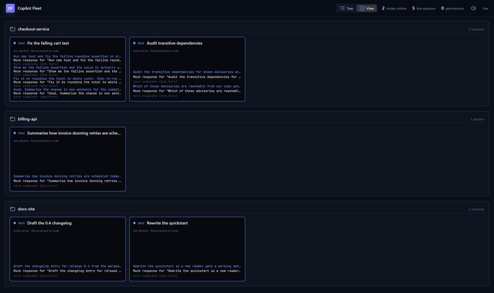
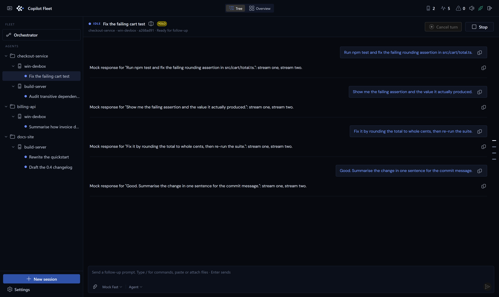
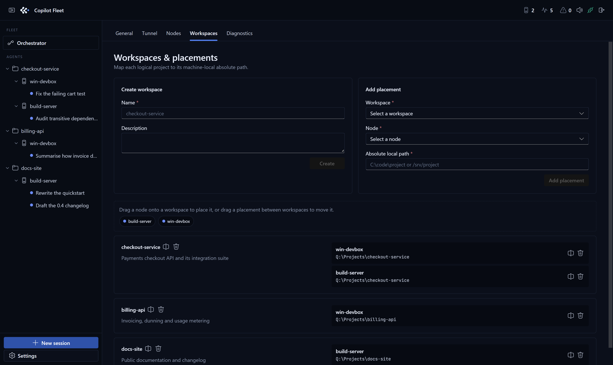
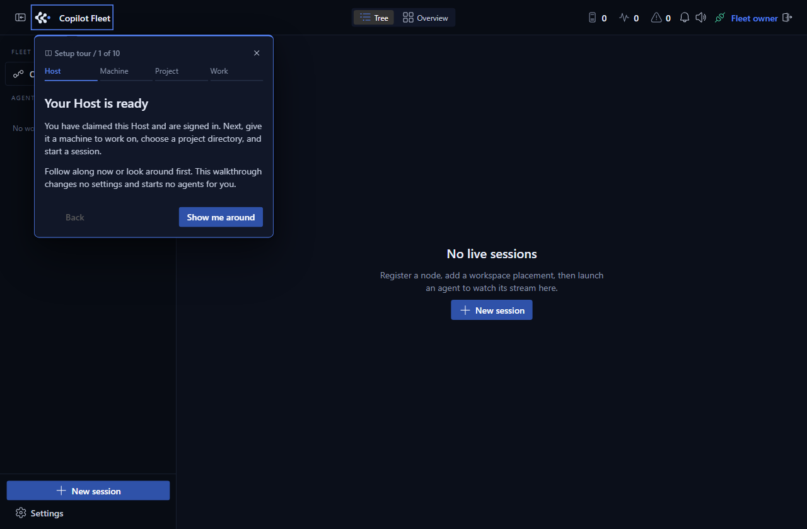
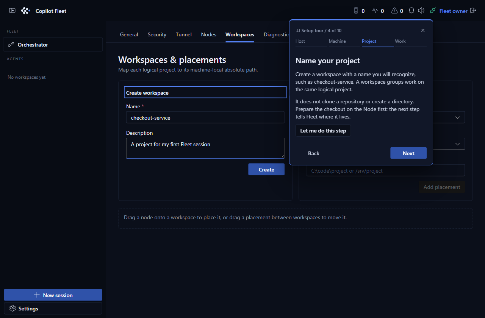
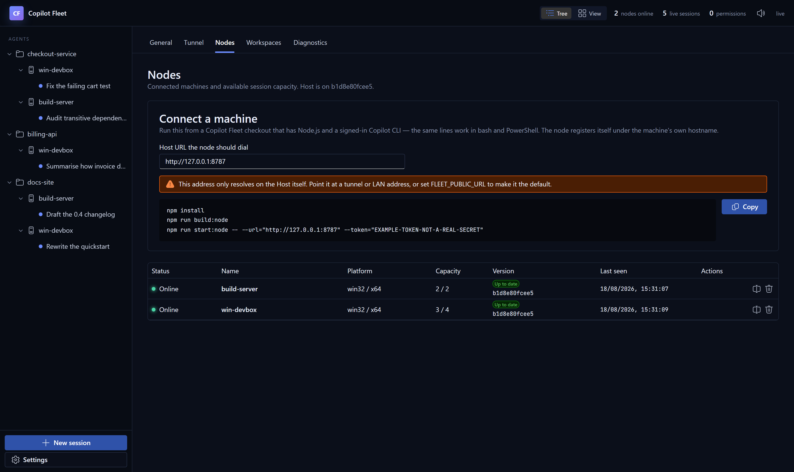
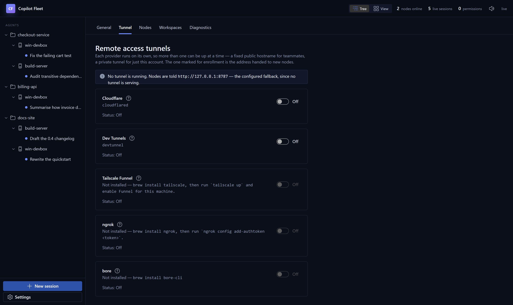
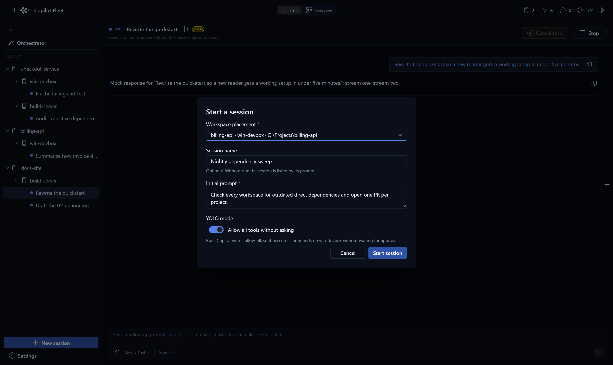

# Copilot Fleet

**English** · [简体中文](README.zh-CN.md)

Copilot Fleet is a self-hosted control plane for supervising GitHub Copilot CLI
agents on multiple machines. The Host combines a Fastify API, WebSocket hub,
SQLite database, and React UI. Each Node makes one outbound connection and owns
an isolated ACP client and Copilot process per live session.

## What it looks like

Every agent in the fleet on one screen, grouped by the project it is working in.
Cards stream their transcript live, so a wall of them is readable without opening
anything.



Open one and you get the whole conversation, the node it runs on, a composer that
takes slash commands and file attachments, and the agent's own Model and Mode
pickers along the bottom.



> The screenshots above come from the deterministic `--mock-agent` demo described under
> [Exact proof of concept](#exact-proof-of-concept), so they can be reproduced on
> any machine without a Copilot login. A real node streams real Copilot output in
> exactly the same surfaces.

### Node health and session navigation

**Settings → Nodes** keeps each machine on one row, with compact blue CPU,
green RAM, and purple disk meters in the **Health** column. Hover or focus a
metric for capacity, scope, and sampling details; clock icons and striped bars
mark readings that are not current. Disk capacity covers the volume containing
the Node user's home directory. Disk is not an
average of every drive or a measure of disk activity; a project on another
volume can have different free space. Updated Nodes sample approximately every
30 seconds and report through their existing connection. Each reading keeps
its own measurement time. Missing readings, stale readings, clock skew, and
offline Nodes are labelled rather than shown as fresh zeroes. Older Nodes keep
working without health telemetry, and health does not change scheduling.

The session header's **Session information** icon opens the same details dialog
in both the full chat and the focused overview chat. It shows the Node, platform,
workspace, current placement path, model, status, timestamps, and both the Fleet
and native Copilot session IDs. Copy buttons provide the path, IDs, and a
shell-quoted local recovery command. Only the native Copilot ID can be passed
to `copilot --resume`; demo sessions and sessions without that ID have no recovery
command.

Run local recovery on the original Node as the same OS user, after stopping or
verifying the old process has exited. The command uses standard Copilot CLI and
the current placement: if either your launcher/configuration or the placement
has changed, use the corresponding original setup. Local recovery does not
reattach the CLI to Fleet or restore orchestration tools; use Fleet's **Resume**
to continue managed work.

Scroll back or select an earlier prompt to reveal **Jump to latest**, even on
an idle or ended chat with no new output. It takes you to the bottom, clears
the unread count, and resumes following streamed output. Reading older messages
never pulls you back down automatically.

## Feature map and contents

Start with the walkthrough, then use this map when you need a specific surface.

- **Install and claim a Host:** [Requirements](#requirements),
  [Set up the Host](#set-up-the-host-windows-macos-linux),
  [First-run walkthrough](#first-run-walkthrough), and
  [claim details](#first-run-claiming-a-fleet).
- **Configure Microsoft sign-in and administrators:**
  [registration and account support](#microsoft-sign-in-registration-and-account-support),
  [signing in remotely](#signing-in-from-somewhere-else),
  [adding/removing administrators](#adding-and-removing-administrators), and
  [security notes](#security-notes).
- **Choose access and tunnel model:**
  [tunnels and who can reach the sign-in page](#tunnels-and-who-can-reach-the-sign-in-page)
  and [following a moved Host URL](#following-the-host-to-a-new-url).
- **Connect or maintain machines:** [Windows Node](#windows-node-powershell),
  [Windows login startup](#windows-login-startup),
  [Node command-line flags](#node-command-line-flags),
  [Node config page](#node-config-page), and
  [keeping nodes up to date](#keeping-nodes-up-to-date).
- **Create projects and start everyday sessions:**
  [workspaces and placements](#first-run-walkthrough),
  [Agency mode](#agency-mode),
  [Exact proof of concept](#exact-proof-of-concept),
  [attachments and images](#attaching-files-and-images), and
  [slash commands and session pickers](#slash-commands-and-session-pickers).
- **Monitor and organize active work:**
  [rows that fold themselves away](#rows-that-fold-themselves-away),
  [drag ordering and filing](#ordering-and-filing-by-dragging), and
  [alerts, sounds, and notifications](#alerts).
- **Coordinate multi-agent work:**
  [Orchestrator quick guide](#orchestrator-quick-guide),
  [Runs: several sessions toward one objective](#runs-several-sessions-toward-one-objective),
  and [Chats as a destination](#chats-as-a-destination).
- **Recover, move, back up, or troubleshoot:**
  [Moving a Host or Node](#moving-a-host-or-a-node-to-another-machine),
  [recovering sessions](#recovering-sessions-after-a-restart),
  [automatic session retention](#automatic-session-retention),
  [Diagnostics](#diagnostics-and-troubleshooting), and
  [local verification](#local-verification-and-test-monitoring).

## Requirements

- [Node.js](https://nodejs.org/en/download) 22.5 or newer, npm 10 or newer, and Git
- [GitHub Copilot CLI](https://docs.github.com/en/copilot/how-tos/copilot-cli/set-up-copilot-cli/install-copilot-cli)
  1.0.69 or newer installed and authenticated on each real Node, with Copilot
  access permitted by your subscription and organization
- An existing absolute local directory for every workspace placement on the Node
  that will run it
- An approved publisher- or operator-owned Microsoft app registration for Host
  sign-in; see [registration and account support](#microsoft-sign-in-registration-and-account-support)
- Optional but recommended for multi-machine access: Microsoft Dev Tunnels
  (`devtunnel`) signed in on the Host and, for private tunnels, on each remote
  Node that will dial through it

## Set up the Host (Windows, macOS, Linux)

The Host can run on Windows, macOS, or Linux. A Node may be the same machine as
the Host or a separate machine; the Node is the side that owns working
directories and Copilot authentication.

Clone the intended private repository with an account that can read it:

```bash
git clone https://github.com/charlesyin_microsoft/copilot-fleet.git
cd copilot-fleet
npm install
```

Create a local `.env` if one is not already present:

```powershell
Copy-Item .env.example .env
```

```bash
cp .env.example .env
```

For a first Host-only run, build the shared protocol, then start the API and UI:

```bash
npm run build -w @fleet/protocol
npm run host
```

The protocol build is required after a clean install: `npm run host` does not
build that workspace for you. By default, the API listens on
`http://127.0.0.1:8787` and Vite serves the UI on `http://localhost:5173`.
Use the Vite URL while developing. If you change `PORT` in `.env`, use that
API port in the configuration and examples below.

Follow the [walkthrough](#first-run-walkthrough) to claim the Host and enroll
your first Node. Once a local Node is enrolled and Copilot CLI is signed in,
`npm run dev` starts Host, UI, and that Node together. Starting a Node process
alone does not enroll it. The Node reads initial `FLEET_*` settings from `.env`,
then persists editable settings in its own `settings.json`.
Choose one launch mode at a time: stop the existing Host/Node processes before
switching to a combined development command or a production launch.

A fresh Host has no password and no administrator. It prints a one-time claim
code to its own console and admits to nothing else until somebody uses it:

```
Copilot Fleet is unclaimed. Claim it at http://127.0.0.1:8787 with this
one-time code:

    v-0MArasdtNAfxqlM5_pnA

It expires in 30 minutes and is printed only here.
```

See [First run: claiming a Fleet](#first-run-claiming-a-fleet) for the two
proofs a claim takes and how to register the Entra app it needs. A normal fresh
public sign-in needs a registered public client/config supplied by the operator
or publisher; this repository does not bundle a working public default.

After enrolling a local Node, use the combined development command below to
keep the tunnel in a separate process while editing:

```bash
npm run dev:tunnel
```

The tunnel then survives `tsx watch` reloads, so the public URL stops rotating
every time the Host restarts and remote nodes stay connected. The Host detects
it and leaves its lifecycle alone; the Settings toggle is disabled while it
runs. Stop everything with Ctrl+C as usual.
For a Host-only development setup, keep `npm run host` running and use
`npm run tunnel` in a second terminal instead; it does not start a Node.

Open the UI → **Settings**:

- **General** — session defaults, the **Take the tour** button, and data export/import.
- **Security** — administrators, invitations, Microsoft sign-in configuration,
  password migration, the Host fingerprint, Node key migration, portable Host
  backup/restore, and this Host's security audit.
- **Tunnel** — manage Dev Tunnels, Cloudflare, Tailscale Funnel, or ngrok.
  Plain-HTTP providers such as bore are shown but cannot be enabled for the
  operator console.
- **Nodes** — rename/delete machines, see update status, and mint a one-time
  connect command.
- **Workspaces** — create logical projects and map them to per-machine paths.
- **Diagnostics** — read Host warnings and errors captured since the Host started.

Settings sections keep their state after you visit them, so switching tabs does
not wipe an in-progress form. Static warnings, such as YOLO risk, stay inline on
their card instead of appearing as transient toasts. On narrow screens the
Settings tab strip scrolls, so every section remains reachable down to a phone
viewport.



A workspace is logical; a placement is the physical `(workspace, node) → path`
pair. The same project can sit at a different absolute path on every machine, and
a session is always started from a stored placement — never from a path typed
into a request. Adding a placement records an existing directory on that Node; it
does not clone a repository or create the directory for you.

Connected nodes are told when the Host's public URL changes, so a rotated tunnel
does not strand them — see
[Following the Host to a new URL](#following-the-host-to-a-new-url).

For production (built Host + local Node together):

```bash
npm run build
npm start
```

Or just the Host: `npm run start:host`. Open `http://127.0.0.1:8787` —
Fastify serves the built UI.

## First-run walkthrough

Follow these steps in order the first time you bring up a fleet. You can do all
of them on one Windows machine, or split Host and Node across machines.

1. **Start the Host.** Complete [Host setup](#set-up-the-host-windows-macos-linux),
   including `npm run build -w @fleet/protocol` before the first `npm run host`.
   Alternatively, run `npm run build` then `npm run start:host` for a built Host.
   Keep the Host console open; the claim code is printed only there and expires
   after 30 minutes.
2. **Claim the Host.** Open `http://localhost:5173` in development or
   `http://localhost:8787` in production. If Fleet shows
   **Configure Microsoft sign-in**, enter the code and select **Unlock setup**.
   Paste an approved Microsoft Application (client) ID, choose **Work/school and
   personal Microsoft accounts** or **One organization (fixed directory)**,
   then **Save and continue**. If sign-in was already configured, enter the
   code and select **Unlock claim** instead. Choose **Claim with Microsoft** and finish sign-in
   with the account that should administer this Host. **Claiming also signs you
   in**; on later visits, use **Sign in with Microsoft** with an authorized
   account rather than claiming again.
3. **Follow the teaching tour, or continue with the steps below.** The tour opens
   after the first successful claim, not on every login. Its 10 stops highlight
   the controls for tunnels, Nodes, workspaces, placements, sessions,
   permissions, Orchestrator, task review, and the rest of Settings.
   **Back** and **Next** move through the guide without changing settings or
   starting agents. Choose **Let me do this step** to put a bubble aside while
   you work, then **Resume tour** to continue. **Open New session** opens the
   session form without submitting it. Close the bubble or press **Escape** to
   skip, or choose **Finish tour** at the end. Your place survives a refresh in
   this tab; skipping, finishing, or signing out clears it. Replay it from
   **Settings → General → Take the tour**, without resetting or reclaiming the
   Host. On small screens, scroll a long bubble to reach its controls.





> These tour screenshots come from an isolated read-only local preview with fake
> demo identity and data. No real credentials are shown or used.

4. **Choose reachability.** For a local-only fleet, loopback is enough. For a
   remote Node, prefer **Settings → Tunnel → Dev Tunnels**. Sign the Host machine
   into the tunnel provider with `devtunnel user login`, then enable the
   provider. This Microsoft sign-in belongs to the tunnel provider; it is
   separate from Fleet's own administrator authorization.
5. **Prepare the Node machine.** Install Node.js and Copilot CLI as the same OS
   user that will run the Node. One installation option is:

   ```bash
   npm install -g @github/copilot
   copilot
   ```

   At the Copilot prompt, use `/login` and complete sign-in, then exit Copilot
   before running the Node commands. See the
   [official installation guide](https://docs.github.com/en/copilot/how-tos/copilot-cli/set-up-copilot-cli/install-copilot-cli)
   for WinGet/Homebrew alternatives or environments that disable npm install
   scripts. Copilot authentication and subscription stay on the Node and are
   separate from Host sign-in.
   Clone this Fleet repository on the Node too, using the same clone command
   from [Host setup](#set-up-the-host-windows-macos-linux), or reuse the checkout
   if Host and Node share a machine.

6. **Connect the Node.** In **Settings → Nodes**, choose **Generate a connect
   command**. Your existing Microsoft administrator session is enough; you do
   not need to sign in again. Copy the command to the Node and run it from a
   Fleet checkout. The one-time grant expires after 15 minutes, authorizes
   exactly one Node key, and pins the Host ID/fingerprint. For a private Dev Tunnel, first run
   `devtunnel user login` on that Node too; the connect command will use
   `--devtunnel=<id>` instead of making the Node answer a browser login.
7. **Add a workspace.** In **Settings → Workspaces**, use **Create workspace**
   to name the logical project, for example `checkout-service`. This only creates
   Fleet metadata.
8. **Add a placement.** Still under **Workspaces & placements**, use
   **Add placement** to choose the workspace, an online Node, and an absolute
   local path that already exists on that Node, such as `C:\code\checkout-service`
   or `/srv/checkout-service`.
9. **Start a session.** Choose **New session**, pick **Where to run**, optionally
   set **Session name**, write the **Initial prompt**, and decide whether **YOLO
   mode** should ask before each tool or run with `--allow-all`. Keep YOLO off
   while learning. The session card streams live output; open it to send
   follow-ups, paste or attach images/files, cancel a turn, stop the process,
   rename the session, or change the agent-reported **Model**, **Mode**, and
   **Reasoning Effort** pickers where available.
10. **Use Orchestrator for multi-agent work.** Open **Orchestrator**, choose
    **Start orchestrator** once an online Node holds a workspace, then either
    talk in its **Conversation** or choose **New task**. Give a clear objective,
    select the workspace, and let the lead plan phases, dispatch worker sessions,
    and report back. Use **Stages**, **List**, or **Dependency** views to watch
    parallel work, open worker transcripts, handle permission prompts, and review
    tasks. When a task is **Ready for you**, choose **Approve** or **Send back**;
    later you can **Archive**, **Reopen**, **Delete**, **Stop orchestrator**,
    **Resume orchestrator**, or **Dismiss orchestrator** as appropriate.

### Diagnostics and troubleshooting

- **No setup appears / Microsoft sign-in fails:** confirm the Host has an
  approved public-client registration, uses the Host API port in the native
  redirect, and is opened as `localhost` for authorization-code sign-in. Remote
  browsers need a local forward or verified device sign-in.
- **Claim code expired or setup timed out:** restart an unclaimed Host for a new
  console code. If setup authorization expires, use **Unlock setup again**; do
  not delete the database just to retry.
- **Connect command button fails:** use an authorized Microsoft administrator
  account, not the legacy shared password. If your session has expired, sign
  in again. A valid session does not need recent reauthentication for this
  action; the browser handles its request protection automatically.
- **Node cannot reach a private Dev Tunnel:** sign the Node machine into the
  tunnel provider with `devtunnel user login`; that is not the same credential as
  Fleet administrator sign-in or Copilot CLI login.
- **Node is online but sessions cannot start:** add a placement on that Node and
  make sure the path is absolute, exists on the Node, and is a directory.
- **Agent reports an authentication problem:** update Copilot CLI to at least
  1.0.69 and run `copilot login` as the Node's service user.
- **ACP startup times out:** Fleet allows up to 180 seconds for cold Copilot and
  MCP initialization. Retry once; if it persists, inspect the Node's Copilot and
  MCP logs for a slow, unavailable, or misconfigured service. The timeout alone
  does not mean Copilot is signed out.
- **Something needs attention:** use the notification bell, the amber
  Orchestrator/task state, the permission banner in the session, and
  **Settings → Diagnostics** for Host runtime logs. The Node's own config page
  (port 8788 by default; its actual URL is printed at startup) shows Node-side
  logs when you can reach that machine. Both show the latest 80 entries,
  including normal activity, and refresh every five seconds. Use **Problems
  only** to focus on warnings/errors. Logs are bounded in memory and clear on
  restart; routine Host HTTP access messages are excluded so polling does not
  drown out useful activity.

## Agency mode

Enable **Settings → General → Agency mode** to prefer
[Agency Copilot](https://aka.ms/agency) across the fleet. It is off by default.
The setting is marked **Staff** and is only shown to Microsoft employees signed
in with an `@microsoft.com` account in Microsoft's corporate tenant. Other
accounts and password-only logins cannot see or change it.
Update the Fleet Host and Nodes to a version with this setting before using it.

Each Node looks for `agency` on its own `PATH` and launches
`agency copilot --acp --stdio` instead of plain `copilot`. This applies to new
and resumed sessions, including Chats, orchestrators, workers, adopted
conversations, and automatic recovery. Existing running sessions are left alone;
stop and resume them to switch launchers. Turning the setting off uses standard
Copilot again on the next launch.

Install Agency and run `agency copilot` interactively as the same user that runs
the Node; use `/login` if prompted, and configure the MCP servers you need in
Agency. Restart the Node after changing its `PATH`. Fleet uses that Node's Agency
configuration rather than copying credentials or MCP configuration from the Host.
Enabling this setting does not automatically enable every Agency MCP server or
grant access to internal services.

Large MCP catalogs can exceed a small model's context budget. If Copilot reports
that its static instructions or tool definitions do not fit, select a
larger-context model; Fleet does not silently override your model choice.

If Agency is absent from a Node's `PATH`, that Node falls back to its configured
Copilot command (`FLEET_COPILOT_COMMAND`, or `copilot`) and records the fallback in
the session log. A broken or unauthenticated Agency installation reports an error
instead of silently switching providers. The existing minimum Copilot version,
YOLO permissions, model/context choices, and Fleet orchestration MCP tools still
apply. Agency mode is saved with the Host and included in Host backups.

## First run: claiming a Fleet

A Fleet Host can start processes and read every transcript on every machine
enrolled in it. Who may do that is decided by Microsoft Entra ID plus this
Host's own list of administrators — and nothing else. A tunnel decides who can
_reach_ the Host; it never decides who may operate it.

Two proofs are needed to claim a fresh Host, and one alone is worth nothing:

1. **The console claim code.** 128 random bits, printed only to the Host's own
   stdout, valid for 30 minutes, and consumed by the first successful claim.
   Holding it proves you have access to the machine — which is the only fact a
   Host can establish about a network caller, because every supported tunnel
   relays into `http://127.0.0.1:<port>` and the source address, `Host` header
   and `x-forwarded-proto` all describe the relay rather than the browser.
2. **A Microsoft account.** Signing in proves who you are. Fleet records the
   account's immutable `(tenant id, object id)` pair and issues its own opaque
   session; no Microsoft access, refresh, or ID token is ever persisted.

The first account to present both becomes the one and only administrator.
Any other account, even one in the same tenant, is refused with a named `403`
and receives no session unless an administrator approves it.

### Microsoft sign-in: registration and account support

The public configuration supports **work/school accounts in any organizational
directory, including Microsoft corporate, and personal Microsoft accounts**.
An organization's consent and Conditional Access policies can still refuse
sign-in; Fleet does not bypass them. An enterprise configuration can instead
restrict authentication to one directory.

**A publisher or operator must supply an approved app registration first.**
There is currently no approved Fleet-owned client ID bundled in this repository.
A fresh install without one shows setup-required; it never silently falls back
to the borrowed Visual Studio client. Users of a distribution that supplies
legitimate configuration need no tenant setup of their own — the publisher has
already done the one-time registration work.

**New to app registrations?** The first-run page includes **First-time setup:
personal or corporate account** before you enter the claim code. Get the
registration ready first; the same help follows your account-type selection in
the configuration form, and all help links open in a new tab without losing
your entries.

Start in the [Microsoft Entra admin center](https://entra.microsoft.com), and
check which directory is selected before registering anything:

| Sign-in you want                                                         | Setup links                                                                                                                                                                                                                                                                                                                                                         | IDs to copy into Fleet                                                                                                                                                                          |
| ------------------------------------------------------------------------ | ------------------------------------------------------------------------------------------------------------------------------------------------------------------------------------------------------------------------------------------------------------------------------------------------------------------------------------------------------------------- | ----------------------------------------------------------------------------------------------------------------------------------------------------------------------------------------------- |
| Personal Outlook/Hotmail/Live, or both personal and work/school accounts | [Create the application/client ID](https://learn.microsoft.com/en-us/entra/identity-platform/quickstart-register-app) in a directory you own or may manage. Choose **Any Entra ID Tenant + Personal Microsoft accounts** (also labeled **Accounts in any organizational directory and personal Microsoft accounts**).                                               | From the app's **Overview**, copy **Application (client) ID**. Select **Work/school and personal Microsoft accounts** in Fleet; it uses `common` automatically, with no tenant ID field.        |
| Corporate/work/school accounts restricted to one directory               | [Create an approved corporate application/client ID](https://learn.microsoft.com/en-us/entra/identity-platform/quickstart-register-app) and [find the directory/tenant ID](https://learn.microsoft.com/en-us/entra/fundamentals/how-to-find-tenant). Choose **Single tenant only - your tenant** (also labeled **Accounts in this organizational directory only**). | Copy **Directory (tenant) ID** and **Application (client) ID** from the app's **Overview**. Select **One organization (fixed directory)** and paste both GUIDs, not a domain name or Object ID. |

A personal Microsoft account alone is not an Entra directory and does not
automatically grant registration permissions. See Microsoft's
[directory setup and eligibility guide](https://learn.microsoft.com/en-us/entra/fundamentals/create-new-tenant)
if you need one; tenant creation has subscription and permission requirements.
Alternatively, ask the Fleet publisher/operator for an approved client ID.
Do not register a private Fleet in your employer's directory. For a
company-owned Fleet, follow the organization's app-registration process; if it
asks for a Service Tree ID or other ownership metadata, ask the owning team or
tenant administrator. A corporate account can also use the public option when
the registration and organization policies allow it.

The publisher/operator registers once in a directory they legitimately control:

1. Register an application with supported account types **Accounts in any
   organizational directory and personal Microsoft accounts** for public use.
2. Under **Mobile and desktop applications**, register the native/public-client
   redirect `http://localhost:<port>/api/auth/entra/callback`, for example
   `http://localhost:8787/api/auth/entra/callback`. Use **neither Web nor SPA**.
   Use the **Host API port** (8787 by default), not the Vite UI port (5173).
   The localhost name and callback path must match; native localhost redirects
   allow the local listener port to vary.
3. Use authorization code with PKCE, **without a client secret**. Fleet requests
   `openid`, `profile`, and `email`; MSAL also adds `offline_access`. No Graph API
   access is needed, and Microsoft access, refresh, and ID tokens are not
   persisted. Device sign-in is optional and separately verified, not a
   prerequisite for PKCE.
4. Maintain registration ownership and recovery, provide appropriate publisher
   support information, and test with authorized personal and organizational
   accounts before distributing the configuration or migrating production.
   Only the public client ID and authority belong in Fleet configuration.

For public account support, replace the placeholder with the approved
Application (client) GUID:

```bash
FLEET_ENTRA_CLIENT_ID=<approved-application-client-guid>
FLEET_ENTRA_TENANT_ID=common
```

With a client ID, omitting `FLEET_ENTRA_TENANT_ID` also selects `common`; blank
or invalid values are rejected. `common` is an **authority selector**, never an
administrator's tenant identity. Fleet still identifies every administrator by
their validated directory and object IDs, not by email.

For a fixed-directory enterprise deployment, use the directory GUID and a
compatible approved registration:

```bash
FLEET_ENTRA_TENANT_ID=<directory-tenant-guid>
FLEET_ENTRA_CLIENT_ID=<approved-enterprise-application-client-guid>
```

Replace both placeholders with GUIDs from the registration. Existing GUID/client
pairs retain their enterprise meaning. The borrowed Visual Studio client cannot
be used with `common`; changing its authority is not a public registration.

Microsoft sign-in only controls access to this Fleet Host. It is separate from
GitHub Copilot credentials and subscription on each Node, and from the tunnel
provider's own authentication. A personal Fleet account does not establish
eligibility or authentication for either of those services.

### The claim itself

1. Start the Host. It attempts to copy the claim code to the local clipboard
   (Windows, macOS, or Linux with `wl-copy`/`xclip`); if unavailable, copy it
   from the console manually. The printed claim link opens the Vite UI at
   `http://localhost:5173` during `npm run dev`, or the Host URL in production.
2. Open `http://localhost:5173` for development, or `http://localhost:8787`
   for production (default port) — use `localhost`, not `127.0.0.1`; the UI
   redirects if you get it wrong, because the registered reply URL is matched by
   name and the transaction cookie follows it.
3. Enter the claim code. If setup is required, supply the approved Application
   (client) ID; **Work/school and personal Microsoft accounts** is the default
   and asks for no tenant ID. Choose the fixed-directory option explicitly for
   enterprise use. Then **Claim with Microsoft**.
4. You are now this Fleet's administrator. Enrol machines from
   **Settings → Nodes**.

The setup authorization lasts ten minutes. If **Save and continue** asks for the
claim code again, use **Unlock setup again** on the same page; your client ID and
account-type selection are retained. Then save again. The console code itself
expires after thirty minutes; restart the unclaimed Host for a new one if needed.
There is no need to delete the database or recreate the app registration.

### Reset Host sign-in without deleting Nodes

Stop the Host, then run:

```bash
npm run host:fresh
```

This rebuilds and starts **only the Host**, using the existing `DATABASE_PATH`
and serving the built UI on the Host port. It clears the Microsoft client/tenant
configuration, administrators, administrator invitations, browser sessions,
password/recovery settings, device-flow setting and browser authentication keys.
The new console claim code lets you configure sign-in and claim the Host again.

**Nodes and connection data are retained:** Node IDs, keys and legacy credentials,
the Host signing identity/fingerprint, enrollment data, saved URL/tunnel settings,
orchestrator keys, workspaces, placements and agent sessions. The security audit
is retained and records the reset. Nodes reconnect normally without re-enrollment;
their processes and Copilot/tunnel login credentials are not reset.

The command refuses to reset a database already in use. It is intentionally
destructive to **browser authentication only** and runs without a file watcher,
so edits cannot repeatedly erase a newly claimed administrator. For this run it
ignores `FLEET_ENTRA_TENANT_ID`, `FLEET_ENTRA_CLIENT_ID` and
`FLEET_OPERATOR_PASSWORD`, without editing `.env`. A later normal startup can use
the Microsoft registration environment settings again if you have not saved a
replacement configuration; password sign-in remains disabled until explicitly enabled.

For the same reset **without restarting the Host or Nodes**, use **Erase auth
settings** at the bottom of **Settings → Security**. It requires a current
Microsoft administrator, authorization-code reauthentication within ten minutes,
and typing `ERASE AUTH` in the confirmation dialog. Have access to the Host
console first: all browsers are signed out, and the new claim code is printed
only there, never returned to the browser. Pending Microsoft/device/bootstrap
transactions are retired and browser authentication keys are rotated. Live Node
connections and their keys, settings and working data are untouched. Close any
other Host instance or database viewer using the same database before erasing;
the running Host acquires exclusive database access and keeps it until shutdown.

### Signing in from somewhere else

Authorization code with PKCE and a loopback callback is the primary flow, so a
remote browser has two options. Public account support does **not** make a
browser-only public tunnel login work: localhost in a callback means the
browser's machine, not the remote Host.

- **Forward the Host to your own machine** and use `http://localhost:<port>`:

  ```bash
  devtunnel connect <tunnel-id>
  ```

  Use SSH `-L` or your provider's client to reach the Host's localhost callback
  on the forwarded port. This is the recommended path when you can establish
  that forward; the existing Vite UI/API port split still applies in development.

- **Device sign-in**, if your organization permits it. Microsoft recommends blocking
  the device code flow by default and Conditional Access commonly does, so
  Fleet keeps it **off** until it has watched one complete. An administrator
  turns it on from **Settings → Security → Verify device sign-in**: the check
  runs whatever the setting currently says, and only a completed flow writes
  it. Enabling it means the Host offers a flow after one successful verification,
  not that every organization's policy is known to allow it. A refused
  verification does not enable it, and another organization can still block a
  later sign-in.

  A device code is the one credential an attacker can ask _you_ to enter on
  their behalf. Only ever enter a code the Fleet page in front of you is
  showing. Fleet additionally requires a fresh authorization-code sign-in — not
  a device sign-in — before removing an administrator, disabling the password,
  changing Microsoft sign-in configuration, or exporting a portable backup.

Fleet sessions are per-origin. A session issued on `localhost` authorises that
forwarded UI and does not set a cookie for a public tunnel domain.

### Adding and removing administrators

Fleet asks for no Graph permission to search your directory. There are two ways
to add an administrator, depending on who will sign in.

**Another account you control:** choose **Settings → Security → Add another
account**, then **Choose account in new tab**. This explicitly authorizes the
account you select to become a full administrator, with no separate approval.
Microsoft's account picker opens in a normal new tab; no private window or
logout is needed. Your original Fleet session stays signed in. After success,
close the new tab and return to Security; the administrator list refreshes.
If popups are blocked, allow them for this Host and retry.

This flow requires a recent Microsoft authorization-code sign-in by an existing
administrator, plus that administrator's still-live session when the new account
finishes signing in. It is a short-lived, single-use, browser-bound operation,
not a link to share. Both accounts must be supported by the Host's registration;
organization consent and Conditional Access still apply.

**Someone else's account:** use an invitation with explicit approval:

1. **Settings → Security → Invite someone else** mints a single-use link that
   expires in 15 minutes.
2. The recipient opens it and signs in with Microsoft.
3. That records them as a **candidate** — it grants nothing. The exact account
   that turned up is shown, with its object and tenant id.
4. An existing administrator approves or rejects that identity.

A leaked link is therefore not an escalation: the wrong person redeeming it
appears in the pending list and is rejected.

Removing an administrator revokes every session they hold and closes their open
browser connections in the same operation, mid-transcript if necessary. The last
active administrator cannot be removed, and removal needs a Microsoft
authorization-code sign-in from the last ten minutes.
You cannot remove your own currently signed-in administrator account: its Remove
button is disabled, and the API refuses self-removal too. Another administrator
can remove that account while signed in as themselves.

### Changing Microsoft sign-in configuration

Upgrades conservatively pin existing claimed Hosts to their prior configuration,
including legacy fixed-directory corporate configurations. Changing environment
variables alone does not switch a claimed Host or broaden its account audience.

1. Keep console access and record the current client ID and directory/authority.
   Export a passphrase-encrypted portable backup from **Settings → Security →
   Move this Host** before switching. The General tab's data-only export does
   not back up the security configuration. Protect the portable backup and keep
   its passphrase separately; never commit or attach either to an issue.
2. Test the proposed registration on a separate fresh Host first. Make sure the
   current administrator can authenticate through both registrations with the
   **same `(tenant ID, object ID)`**. A guest identity and its home identity can
   differ even with the same email. If continuity cannot be proved, keep the
   old configuration; other identities must be added separately by an existing
   administrator, not by automatic migration or edits to the administrator table.
3. As an existing Microsoft administrator, use localhost or a local forward and
   open **Settings → Security → Change Microsoft sign-in configuration**.
   Choose the supported accounts and approved client ID, then **Verify new
   configuration with Microsoft**. This requires an authorization-code sign-in
   from the last ten minutes. If prompted, confirm with Microsoft under the
   current configuration, return to Security, and retry.
4. Sign in through the proposed registration as that same administrator. The
   new configuration is saved **only after successful identity verification**.
   Failure, cancellation, or a different identity leaves the old configuration
   intact. Success clears pending sign-in/device transactions, turns device
   sign-in off until reverified, revokes old sessions, and gives the migrating
   administrator a fresh session. Other administrators remain on the list, but
   the new registration must support their accounts. Narrowing back to a fixed
   directory can prevent administrators from other directories from signing in,
   even though their records are retained. Node identities and placements are
   unchanged.

**Rollback:** if the previous registration still accepts the same administrator,
switch back using this same verified Settings flow. An environment edit is not
a rollback. Retain the portable backup and console access for the documented
[portable restore procedure](#moving-a-host-or-a-node-to-another-machine) if
normal sign-in cannot be recovered. Do not run two Hosts with the same restored
identity at once.

### Migrating off the shared password

Hosts that predate Microsoft identity keep working long enough to migrate.
`FLEET_OPERATOR_PASSWORD` is an explicit, warned-about escape hatch — a fresh
Host without one generates nothing.

1. Sign in with the password the Host already has. Because nobody administers it
   yet, the console shows a migration checkpoint rather than the fleet.
2. If no approved Microsoft registration is configured, complete its setup first.
   **Claim with Microsoft.** The account you sign in with becomes this Fleet's
   first administrator, the shared password is deleted automatically, its
   sessions are revoked, and the console appears.

Microsoft-only is the secure default after claim. An administrator who
explicitly needs both methods can go to **Settings → Security → Enable password
sign-in** and choose a new password of at least **12 characters**, including an
**uppercase letter** and a **special character** (punctuation or a symbol, not
just whitespace). Longer passwords remain supported. The UI and API enforce
the same rule for newly configured passwords; existing passwords and the
environment-based migration path remain compatible.

The console claim code is not needed for any of that: proving the existing
password proves the same thing it stands for, so the Host trades that session
for the same short, browser-bound bootstrap grant and audits it as
`bootstrap_password_granted`. A Host that never had a password, and a portable
restore onto a rebuilt machine, still take the printed code.

Disabling deletes the stored verifier, records the choice so a stale
`FLEET_OPERATOR_PASSWORD` left in a shell profile cannot re-enable it, and
revokes every password session. If you lock yourself out, a local recovery
command on the Host console issues a temporary password and writes an audit
event; disable it again once you are back in.

### Tunnels and who can reach the sign-in page

| Provider                             | Reachability                             | Operator console                    |
| ------------------------------------ | ---------------------------------------- | ----------------------------------- |
| Direct `localhost`                   | This machine only                        | Always allowed                      |
| Dev Tunnels (creator-private)        | Microsoft login at the tunnel            | **Default and recommended**         |
| Dev Tunnels (tenant / anonymous)     | Wider, by your `devtunnel access` policy | Allowed, with a warning             |
| Cloudflare / ngrok / Tailscale HTTPS | Anyone with the URL                      | Allowed after claim, with a warning |
| `bore` and any plain-HTTP relay      | Anyone with the URL, in clear text       | **Refused**                         |

A fresh Host defaults to Dev Tunnels because its URL alone reaches nothing: the
provider demands a Microsoft login before Fleet's own claim screen is even
visible. A public HTTPS provider is fine after the Host is claimed — the sign-in
page grants nothing on its own — but a stranger can at least see it.

`bore` is refused for the operator console by the Host itself, not merely greyed
out in the panel: it relays plain TCP, so the session cookie and every
transcript behind it would cross it readable. The refusal holds for any client,
including one that never renders the UI.

### Chats

Not every question is about a checkout. **Chats** is a workspace the Host creates
for itself, pinned above your projects in the sidebar, for the sessions that only
need an agent and a machine: a question, a bit of reading, research on something
you have not written yet. Every node that reports a home directory gets a Chats
placement there automatically, so there is nothing to set up — pick **Chats** in
**New session** and it runs in that machine's home directory.

Because it is derived rather than filed, it is the one workspace you cannot edit:
it has no rename, no delete, and no placements to add, move or remove. If you
already had a project called Chats, it keeps everything but its label, which moves
to `Chats (2)` so the reserved name is free.

An orchestrator can use it too — see
[Chats as a destination](#chats-as-a-destination).

## Windows login startup

Start automatically **after signing into Windows**, using your current account
and existing GitHub/Copilot/Dev Tunnels credentials. In **Nodes > Connect a
machine**, copy the **npm run service -- node** command block to use a
command that builds, enrolls, and starts the Node without a foreground
connect/Ctrl+C step. The **npm run start:node** block keeps the existing direct
launch. Both blocks are shown together, each with its own Copy button.

```powershell
npm run service -- node --devtunnel="<tunnel-id>" --host-id="<host-id>" --host-fingerprint="<sha256>" --enrollment-grant="<id.secret>"
```

Use `--url="<host-url>"` instead of `--devtunnel` for a direct endpoint. The
service command accepts the same connection and settings flags as `start:node`;
enrollment grants/tokens are used only during setup and are never saved in the
scheduled task. The normal Node identity and settings are saved for later starts.
For an already enrolled Node, stop manual instances first and choose one:

```powershell
npm run service -- node install --existing-node
npm run service -- host+node install --existing-node
```

Installation builds, registers same-user scheduled tasks, and starts them now.
Use `status`, `logs`, `stop`, `start`, `restart`, or `uninstall` instead of
`install`. Stop disables automatic starts until `start`; uninstall preserves
your data. No Windows password or separate service credential file is required.
This does not run before Windows sign-in.

Interactive Node installation, start, and restart check GitHub CLI authentication
before proceeding. Missing or expired credentials open `gh auth login` in the
same terminal; after sign-in is verified, the original command continues.
Automatic logon starts never prompt. Copilot and Dev Tunnels retain their
separate sign-ins.

See [Windows login startup](docs/windows-login-startup.md) for options, lifecycle
details, credential caveats, and all historical design references.

## Windows Node (PowerShell)

Install Node.js, then run `copilot update` and `copilot login` as the same OS
user that will run the Node. Copilot CLI 1.0.69 is the minimum because older ACP
builds can report authentication success while signed out, leaving a Host
session waiting with no failure to display. From a checked-out Fleet directory
(or paste the command from the Host's Nodes → Connect card):



```powershell
npm install
npm run build:node
npm run start:node -- --url="https://fleet.example.com" `
  --host-id="<host-id>" `
  --host-fingerprint="<sha256>" `
  --enrollment-grant="<id>.<secret>"
```

GitHub CLI (`gh`) must also be on PATH. `npm run start:node` and `npm run node`
check its active account before connecting or enrolling. In an interactive
terminal, missing/expired GitHub credentials trigger browser/device sign-in
in that same command, followed by verification and continued startup.
Cancellation stops startup without retrying login. Noninteractive launches
report the required login instead of waiting for input; network and executable
errors do not trigger re-authentication. If an environment token such as
`GH_TOKEN` is invalid, replace or unset it first: it overrides saved login.

The same lines work in bash — flags avoid the `$env:` / `VAR=value` split
between shells. Generate them from **Settings → Nodes → Generate a connect
command**. A signed-in Microsoft administrator can generate or replace a command
without signing in again. The grant is minted on request, is good for one machine
and fifteen minutes, and is never stored by the Host in a form it could hand out
again.

The node generates its own Ed25519 key pair _before_ it contacts anything, and
pins `--host-fingerprint`. A relay or an impostor that answers the URL cannot
produce a signature for the matching key, so the node sends it no enrollment
completion and accepts no command from it — which is what makes a relay merely
a relay.

The node name defaults to the machine hostname, and can be changed from either
end — the Host's Nodes tab or the node's own config page. Renaming keeps the
machine's identity, so its placements and sessions come with it; the Host owns
the name, so if both ends changed while the node was offline, the Host's name
wins and is pushed back down. Pass `--max-sessions 4` if you want a capacity
other than 10.

Enrollment stores the node's private key and the Host's public key at
`$env:APPDATA\CopilotFleet\node.json`; subsequent starts need no grant, and no
reusable shared secret is ever issued. The service uses an outbound WSS
connection, so no inbound Node port is required.

The older fleet-wide `--token` / `ENROLLMENT_TOKEN` exists only for machines that
predate Node keys. A fresh Host has none: it neither requires one to start nor
persists one, and it refuses token registration outright. It is a reusable
credential that authorises any machine and that a node sends before it can tell
the Host from a relay, so it is deprecated. Existing nodes do **not** upgrade
themselves: a shared secret has already reached whatever relays that node's
connection, so nothing sent back over it can prove which Host is answering.
Migrate each machine by minting a fresh Connect command and running it there —
the grant is one-time, the fingerprint comes from your screen rather than the
wire, and enrolling under the machine's existing name reclaims the same node,
keeping its id, placements and session history. **Settings → Security** shows how
many are left and lets an administrator switch the shared secret off for good
once none are.

### Node command-line flags

Anything the node reads from the environment can be given as a flag instead, and
a flag wins over both `.env` and the saved `settings.json` — which is what makes
it usable to point one run at a different Host without editing files on that
machine. Run `npm run start:node -- --help` for the current list.

| Flag                              | Replaces                              |
| --------------------------------- | ------------------------------------- |
| `--url`, `--host-url`             | `FLEET_HOST_URL`                      |
| `--name`, `--node-name`           | `FLEET_NODE_NAME`                     |
| `--enrollment-grant`              | `FLEET_ENROLLMENT_GRANT`              |
| `--host-id`                       | `FLEET_HOST_ID`                       |
| `--host-fingerprint`              | `FLEET_HOST_FINGERPRINT`              |
| `--token`, `--enrollment-token`   | `FLEET_ENROLLMENT_TOKEN` (deprecated) |
| `--max-sessions`                  | `FLEET_MAX_SESSIONS`                  |
| `--copilot-command`               | `FLEET_COPILOT_COMMAND`               |
| `--permission-timeout-ms`         | `PERMISSION_TIMEOUT_MS`               |
| `--context-tier`                  | `FLEET_CONTEXT_TIER`                  |
| `--devtunnel`                     | `FLEET_DEVTUNNEL_ID`                  |
| `--config-port`                   | `FLEET_NODE_CONFIG_PORT`              |
| `--mock-agent`, `--no-mock-agent` | `FLEET_MOCK_AGENT`                    |

Both `--flag value` and `--flag=value` are accepted. The `--` after the npm
script name is npm's own separator; without it npm eats the flags. The same
flags work on `npm run node`, `npm run dev` and `npm start`, where they are
forwarded to the node process only:

```bash
npm start -- --url=https://fleet.example.com
```

Flags apply to that run; edits made later in the config page win until the
process restarts.

Note that `--url` takes effect by restarting the node, which ends the sessions
running on it — they settle as "Node reconnected without this session", and
anything that reached the agent can be picked up again with **Resume**. To
follow a rotated tunnel URL without losing live sessions, retarget from the node
config page instead: it reconnects in place.

The `nodeId` stored in `node.json` is the machine's identity. `--name` proposes a
new label for that identity; it does not create a second node or abandon the
existing node's placements and sessions.

### Rows that fold themselves away

A workspace or node row folds shut once nothing under it is running — every
session on it stopped, finished, or offline while its machine is away — so the
tree stays as short as the work in front of you rather than growing with every
transcript kept for **Resume**.

It opens again the moment work turns up there: a session started on that machine,
or one coming back to life as its node reconnects. Only those changes move a row,
never the standing state, so a dormant branch opened by hand to read an old
transcript stays open until something under it actually happens.

### Ordering and filing by dragging

The sidebar tree can be rearranged by hand at every level: workspace rows, node
rows, and the sessions under them. Drag a row above or below a sibling — the
pointer's half of the target row decides which, and a line appears at that edge —
and the order is stored, so it survives a reload and is the same in every browser
watching the Host.

Dropping _onto_ a row would only ever mean "take its place", which leaves no way
to say "put it last": there is no row after the last one to aim at. The
above/below distinction is what makes the end of a list reachable.

New workspaces, placements and sessions are added at the end rather than sorted
in by name or date, so an arrangement made by hand is not undone by the next
machine or run added. A fleet nobody has rearranged keeps the order it always
had.

Dropping a node row onto a _different_ workspace files that checkout under it
instead of reordering, taking its sessions along: they carry their own workspace
id so the sidebar can group history without a join, and leaving that behind
would file every past run under the project the checkout no longer belongs to.
That move is refused if the target workspace already has a placement on the same
machine, since a workspace can only be in one place on a given node.

In **Workspaces & placements**, the same drags work on the cards: placement rows
reorder within a card, node chips at the top can be dropped on a card to place
that machine there, and a card that cannot take what is being dragged says why on
the card rather than silently refusing.

Sessions only reorder among their own node's list. A session is a live agent
process on one machine, holding that machine's files, so there is nowhere else
for it to go.

### Alerts

A finished turn plays a short rising tone; an agent blocked on a permission
plays a lower one, twice. They are different on purpose: a fleet is watched out
of the corner of an eye, and "it needs you" should be distinguishable from "it
is done" without looking at the screen. The speaker button in the top bar mutes
them, and the choice is remembered.

Both are synthesised in the browser rather than shipped as audio files, so they
work on a Host that has never been online. Nothing sounds on the first view of
the fleet — opening a page onto ten finished sessions is not the same as
watching ten agents finish — and several sessions finishing together produce one
tone rather than a pile of them. A permission that is still waiting is announced
once, not on every refresh.

Permissions are also announced outside the page, with a tab-title count and a
desktop notification that survives until it is clicked, because a request blocks
its agent until the node's timeout expires.

### Attaching files and images

The composer takes files: paste a screenshot straight into the box, or use the
paperclip to pick some. Each one appears as a chip that can be removed until the
message is sent, and a prompt can carry up to six of them at 10 MB each.

How a file reaches the agent depends on what it is. Images go over as ACP image
blocks; everything else is embedded as text, so the agent reads the contents
without needing the file to exist on its own disk — which matters because the
machine running the agent is usually not the machine the file came from. A
binary that is neither, like a zip, is named in the prompt rather than embedded:
decoding it as text would spend the context window on replacement characters and
can read as instructions.

Bytes travel with the prompt in one piece rather than through an upload endpoint.
The agent is often behind a tunnel, and handing it a URL to fetch would mean
giving the Node credentials and a route back to the Host for something already in
the operator's hand. The size ceilings are what keep that from becoming a
WebSocket frame large enough to stall the other sessions sharing the connection.

Only the name, type and size are recorded in the transcript. The event log is
stored on the Host and replayed to every browser watching a session, so keeping
the bytes there would turn a few pasted screenshots into a liability; the
attachment chips under a sent message are the trace that remains.

### Slash commands and session pickers

The composer offers Copilot's own slash commands: type `/` and a list appears,
filtered as you type. Arrow keys move the selection, Enter or Tab picks one, and
Escape closes the menu. A command that takes an argument (`/review`, `/research`)
leaves the caret waiting after it; one that does not (`/usage`, `/context`) runs
straight away. The list is whatever the agent reports for that session, including
skills and plugins, so a machine with extra skills installed shows them without
any change here.

One compact button combines **Model**, **Reasoning Effort**, and **Context window**.
Its upward-opening menu shows each setting's current value and a submenu of
choices. **Mode** remains separate where the operator controls it; a custom agent
remains beside the session title. Model and effort can change while work is running;
context changes require an idle session.

New sessions request
`--context long_context` by default, including Chats, orchestrators, workers, and
reviewers. Turn **Settings → General → Long context by default** off to use
`--context default` instead. A session's own selection survives stop/resume and
automatic recovery. The Host default takes precedence over the node-local context
setting; changing it does not interrupt existing sessions.

Changing the context picker requires an idle session and restarts only that
Copilot process, loading the same conversation with its history, current pickers,
workspace roots, permissions, and Fleet MCP tools intact. The menu explains the
restart and higher cost of extended context. Window sizes vary by model; a CLI
without `--context` support reports that limitation and does not offer the picker.
An accepted flag is not confirmation of a 1M window: some CLI versions drop the
tier in the ACP bridge at creation or model changes
([github/copilot-cli#4275](https://github.com/github/copilot-cli/issues/4275)).
Fleet preserves the request but never substitutes the catalog maximum for the
window Copilot actually reports.

The planned native-backend replacement is documented in the
[Copilot RPC migration runbook](docs/copilot-rpc-migration-runbook.md). That work
belongs to a follow-up PR; the controls described here still use ACP.

A small **context ring beside Send** opens on hover, focus, or click. Its popover
contains **AI credits**, **context details**, and **Compact**, without adding a
second composer row. The ring uses a fresh local `/context` report after each
requested turn completes (including compaction); an explicit `/context` also updates it.
These local status commands do not ask the model to answer. Values rounded by the
CLI are marked as estimates, its percentage is retained, and the popover shows the
report's model and timestamp. Restarting or changing models invalidates old readings.

ACP `usage_update.size` is an **input/prompt budget**, not the full model window:
for example, 272k input plus a 128k output reserve gives the 400k `/context` window.
Its used-token count is also an earlier snapshot, often before the response.
Those readings are labeled separately rather than mixed into the ring's full-window
percentage. A missing `/context` snapshot leaves a neutral ring, not a fake zero.

AI credits come from the session's cumulative
billing checkpoint (`totalNanoAiu / 1,000,000,000`), polled on its node; premium
requests are never relabeled as credits. Metrics not yet reported are shown as
unavailable, not zero. The latest readings persist across browser/Host reloads,
resume, and backup/restore. No account-wide quota or budget is shown.

**Compact** in the popover sends the agent's `/compact` command when it is offered and the session
is idle. It summarizes the live context without clearing the saved transcript or
your unsent draft and attachments.

Copilot also reports an **Allow All** picker, and the strip leaves it out.
Permission policy is decided once when the session is launched, with or without
`--allow-all`, and is already shown as the session's YOLO badge. Offering it
again as a dropdown can only disagree with that badge — and on a session already
started with `--allow-all`, setting it back to "off" is answered with success and
then ignored, so the control moves and snaps back. Note that YOLO does not imply
Copilot's Autopilot **Mode**: a session launched with `--allow-all` still reports
mode `agent`, so Mode stays on the strip as the only way to reach Plan or
Autopilot.

Picking a value the agent rejects is reported as a notice and leaves the session
alone; it does not end the run. Nodes advertise `session-config`, and the Host
refuses the request rather than sending it to an older node that would not
understand the frame.

**Copilot owns the defaults.** A session is started with nothing but a working
directory, so the model, mode and effort a new session opens on are whatever
Copilot itself resolves for that machine and account — the fleet never sends one.
Changing a picker is scoped to that one session: a second session on the same
node, and the next `copilot` run in a terminal, both still start on Copilot's own
default. Resuming re-reads the live values through `session/load` rather than
trusting what was stored, so a session that comes back shows what it is actually
running on.

Choosing a model can change the other pickers, because not every model offers
every setting — switching to a model without reasoning levels removes the
Reasoning Effort control. The agent's whole option list is republished on every
change for that reason, so the bar never keeps a control the current model has
stopped offering.

### Moving a Host or a Node to another machine

The fleet is two kinds of state, so there are two files — and one of them now
comes in two versions, because moving a Host's _data_ and moving its _identity_
are different operations with different risks.

**Host data (version 1)** — Settings → General → **Export fleet data**. The JSON
file holds workspaces, placements, nodes (identity hashes, not plaintext
secrets), sessions, transcripts, defaults, any legacy enrollment token, and
configured tunnel providers, enabled flags, and stable Dev Tunnel IDs. It is
**data only**: import on the new machine
**replaces** the catalog, but deliberately **preserves the security envelope of
the Host it lands in** — administrators, authentication mode and Entra
configuration, the Host signing key, the CSRF and lead-token keys, and password
mode all survive. A data restore can never return a secured Host to `unclaimed`
or silently hand it a different identity, which is exactly why it cannot move a
Host on its own.

**Host identity (portable, version 2)** — Settings → **Security** → **Move this
Host**. This is the file that moves a Host to a new machine intact. Its
security section — administrators, Entra configuration, the Host private key,
CSRF and lead-token keys, Node public keys, and whether mutual Node
authentication is enforced — is encrypted with a passphrase you supply (scrypt +
AES-256-GCM, minimum 14 characters, never persisted). Exporting it, and
importing it into an already claimed Host, both require a Microsoft
authorization-code sign-in from the last ten minutes; importing into a fresh
Host instead takes that Host's console claim code plus the passphrase, and
creates no session — an administrator signs in afterwards through the restored
configuration.
The portable archive already includes the Host data; **import this one file
for a Host move**, not a portable archive followed by a separate data archive.

A fleet that had already retired the shared Node secret restores that way too:
enforcement travels in the sealed section, and the fleet-wide enrollment token
it retired is not written back.

Restoring revokes every browser session and closes browser and Node sockets.
The data and security settings are applied together in one transaction.
**Stop the old Host before starting the moved
one**: two processes sharing one Host identity is a fingerprint two machines can
sign for, and Nodes cannot tell them apart.

**Keeping the same Dev Tunnel during a move**

New data and portable backups include the saved Dev Tunnel ID, including its
region suffix (for example, `fleet-ab123456.usw2`). They retain IDs even for a
disabled provider, and capture a live externally hosted tunnel's ID as well.
Restore restarts Host-managed tunnels with the archived IDs and enabled-provider
settings rather than leaving the destination's old tunnel running.

1. On the source, use a version that supports tunnel-ID backups and wait for
   Dev Tunnels to be ready before exporting the portable backup. Then stop the
   source Host and its separately started tunnel, if any.
2. On the destination, install `devtunnel` and run `devtunnel user login` with
   the account that owns or can host the original tunnel. Keep the same Host
   API `PORT` if existing URLs and Node forwards must continue to work.
   Provider login credentials and port configuration are not moved by the archive.
3. Open the destination Host on `localhost`, then import the portable backup.
   Do not restore through the tunnel being replaced. If a separately managed
   destination tunnel conflicts with the archive, Fleet asks you to stop it
   before restoring; it never kills a process owned by another terminal.
4. Sign in through the restored Microsoft configuration and check
   **Settings → Tunnel**. Existing Nodes can keep their old `--devtunnel=<id>`
   command and `node.json` identity once that tunnel is serving the moved Host.
   Their own Dev Tunnels account still needs permission to connect.

If provider setup fails after the data was restored, the response says so
explicitly and keeps the archived ID for retry. Fix the provider installation
or account, then retry from **Settings → Tunnel**; do not import the backup
again. An ID does not recreate a deleted tunnel, transfer its ownership, or make
an expired cloud resource usable.

Older backups remain readable, but have no source tunnel ID to recover. They
keep an existing destination ID where available; otherwise a new tunnel may be
created. Re-export from the updated source Host to preserve its original ID.
Fleet does not infer the ID from a public URL, because Dev Tunnels can use a
different name in the browser URL.

If the destination is also a Node, start that Node separately under its original
OS account/config directory. It can use the preserved tunnel, or connect directly
to the local Host with `npm run start:node -- --url=http://127.0.0.1:8787`
(substitute the actual API port). For the direct route, omit `--devtunnel` and
unset `FLEET_DEVTUNNEL_ID`. Keep the Node's existing `node.json`; restoring Host
history does not itself start a Node or move its Copilot session files.

Existing nodes reconnect with the `node.json` they already have, as long as they
can still reach the Host. A named hostname / `FLEET_PUBLIC_URL` / Tailscale Funnel
address is copied into the archive; a rotating quick-tunnel URL (`*.trycloudflare.com`,
free ngrok, bore) is not — those nodes would have to be retargeted by hand.

**Node** — the local config page (use the URL printed at startup; default
`http://127.0.0.1:8788`) → **Export identity**.
That file is `node.json` plus `settings.json` for this machine. Import on the new
box replaces this process's identity and reconnects. Placement paths stay whatever
the Host already stored for that node id; update them if the checkout lives
somewhere else. Copilot's own session files are not in the archive, so **Resume**
only works if those files are on the machine that runs the agent.

Both files contain secrets. Do not commit them.

### Recovering sessions after a restart


A dropped transport says nothing about the agent behind it, so the Host asks
rather than assumes. The Node reports its inventory **and** which of those
sessions are mid-turn, which is what stops a returning session from landing on
`idle` while its agent still has a prompt in flight.

Sessions survive both processes going down. The Host keeps them in its SQLite
file and the node keeps its identity in `node.json`, so after both come back:

1. The Host marks everything it had running `offline` ("Host restarted").
2. The reconnecting node reports which sessions it still has. A restarted node
   has none, so the rest settle as "Node reconnected without this session".
3. **Resume** re-attaches through Copilot's `session/load`, and the transcript
   continues where it stopped rather than starting over.

A session in that state is shown as **resumable** rather than failed, stays in
the sidebar, and is skipped by **Clear ended** — that button only removes
sessions with nothing left to re-attach to. Use **Dismiss** on a session to drop
a resumable one deliberately.

By default the Host re-attaches those sessions itself as soon as the node is
back, so a restart does not leave a row of buttons to click. It takes only the
sessions settled by _that_ reconnect, newest first, and stops at the node's
capacity — so a restart never resurrects conversations abandoned days ago, and a
resume that fails is left for a person instead of retried every heartbeat.
Re-attaching sends no prompt: the agent lands on idle waiting for input, so
nothing runs until you ask it to. Turn it off under **Settings → General** if
you would rather press Resume yourself.

Three things have to hold for that to work: the Host's `DATABASE_PATH` file is
intact, the node starts with the same `node.json` identity, and Copilot on that
machine still has the agent session on disk. A session that died before its agent
ever started has nothing to re-attach to — it settles as "it never reached the
agent" and offers no Resume.

A node keeps its agents running while the Host is away and buffers the events
they produce, so a Host restart mid-turn no longer costs that part of the
transcript. If the outage outlasts the buffer the Host records the gap and keeps
going; it never refuses the events that follow, because a session that cannot
report its own state again is a session nobody can use.

### Automatic session retention

By default Fleet automatically deletes **idle or ended sessions after at least
30 days without activity**, including orchestrator conversations. The Host checks
at startup, after a Node has reconciled its inventory and buffered events, and
every six hours. It does not revive expired conversations just to clean them up.

Set `FLEET_SESSION_RETENTION_DAYS` on the **Host** to a whole number of days
from 30 to 36500, or `0` to disable new cleanup. Restart the Host after changing
it. Nodes follow that Host policy; no per-Node timer or setting is needed.
Favorites, running/queued/starting/cancelling sessions, unfinished tasks (including
human review), and recently updated task history are protected. An orchestrator
is also retained while its workers are active, recently used, or favorited.

Activity means opening a conversation, sending a prompt, resuming it, editing
its name/favorite or live options, and actual agent/tool output. Heartbeats,
Host restarts, inventory reconciliation and internal history replay do not
reset that clock. The Node independently checks for current work and recent
local/Copilot activity before deleting anything.

**Deletion is permanent on both sides:** the Node stops an eligible idle process
and uses Copilot's public ACP `session/list` and `session/delete` APIs for that
specific Fleet conversation. Only after its acknowledgement does the Host remove
the session, transcript and per-session preferences. Completed task outputs and
notes remain, without dangling session links. Workspaces, checkouts, credentials,
and unrelated Copilot sessions are never swept.

Offline Nodes are unknown, not inactive. Their sessions remain until they
reconnect. Older Node agents, a Copilot build without the required ACP
capabilities, missing activity metadata, or a failed deletion defer cleanup and
produce a diagnostic instead of falling back to deleting files. Requests and
retries survive Host restarts; a deletion already in progress finishes even if
new cleanup is subsequently disabled. While it is pending, the session and its
associated task cannot be resumed or edited.

Fleet still needs this policy even though Copilot CLI owns conversation storage:
the CLI cannot retire Fleet's SQLite history or understand its orchestrator/task
relationships. Fleet decides **which** sessions may expire; Copilot remains
responsible for deleting its own data through its supported API.

### Node config page

Each node serves a small settings page starting at `http://127.0.0.1:8788`.
If that port is occupied, it tries up to 20 consecutive ports and prints the
actual URL. An exhausted range is reported explicitly; it never scans past 65535.
Set the preferred starting port with `--config-port` or `FLEET_NODE_CONFIG_PORT`.
Service enrollment/start also prints the collision notices and final config URL;
these are kept in the Node's runtime log. This is separate from the Host API's
port 8787, which is not automatically moved.

Use the config page to retarget the node when a tunnel
hands out a new URL — the node reconnects in place, so no restart is needed and
running sessions survive.

It also edits the node name, session capacity, Copilot executable path, and
permission timeout. Values are stored in `settings.json` beside the credentials
and take precedence over the environment variables, so an edit here is not
undone by a stale `.env` on the next start. Command-line flags outrank both.

The listener binds to loopback only and is deliberately not exposed: anything
that can repoint a node at a different Host can run commands on that machine.
Reach a remote node's page over SSH port forwarding rather than binding wider.

### Following the Host to a new URL



Each provider runs on its own, so more than one can be up at a time; the one
marked for enrollment is the address handed to new nodes.

That address is the Host, not a separate handshake channel. The tunnel forwards
to `http://127.0.0.1:8787` (or `PORT`): `/api`, `/ws/node`, `/ws/browser`, and
the built UI when one is there. In `npm run dev` the page you click is Vite on
`http://127.0.0.1:5173`; the tunnel does not point at that. Opening the public
URL still hits the Host, so `/api/health` answers and everything else still
asks for a Microsoft sign-in.

When the Host's public address changes — a tunnel comes up, rotates, or is
switched to another provider — it tells the nodes that are still connected. Each
one records the new address, keeps the old one as a fallback, and **does not drop
the connection it already has**: the running sessions on it are unaffected, and
the new address is what the next reconnect dials.

This closes the gap where a rotated tunnel URL left every node dialing an
address that had stopped existing, with no way back except editing
`settings.json` on each machine.

What it does and does not cover:

- A node reached over an address that outlives the change — a LAN address, a
  named tunnel — is told and follows along.
- A node reached _through_ the tunnel that just rotated cannot be told: that
  socket died with the tunnel. It keeps retrying its known addresses, so it
  recovers on its own if one of them still answers.
- A private Dev Tunnel is advertised for enrollment but never pushed as a public
  Host URL. Its nodes use `--devtunnel=<id>`, keep a local `devtunnel connect`
  forward alive, and dial the loopback port that client reports.
- Loopback is never announced. When no tunnel is up and no `FLEET_PUBLIC_URL` is
  set, the Host's idea of its own address is `http://127.0.0.1:8787`, which on
  another machine points at that machine. Nodes are left on the address they
  have instead.
- A node running an older agent is skipped rather than sent a message it would
  reject, so a mixed fleet keeps working.

If an announced address turns out to be unreachable from a particular machine,
that node dials it, fails, and rotates to the previous address on the next
attempt — so an announcement can never strand a machine. Whichever address
answers becomes the one it leads with. The node config page lists the fallbacks
under the Host URL field.

## Keeping nodes up to date


The shape of that diagram is the whole feature: there is exactly one path that
ends in a restart, and every guard that fails leaves the machine running what it
was already running.

The Nodes tab compares each machine's commit with the Host's and marks it **Up
to date**, **Update available**, or **Manual update**. **Update** on a row — or
**Update all** above the table — tells those machines to `git fetch --prune`,
`git reset --hard` onto the branch they track, `npm install --include=dev`,
`npm run build:node`, and restart into the new build. Progress appears in the row
as it happens.

Build dependencies are included even when the Node runs as a production login
service. An unchanged checkout only skips the build when the running process
also reports that commit; retrying after a failed install/build rebuilds and
restarts instead of falsely reporting "Already up to date".

The Host waits for the restart and verifies the returning revision against the
Node's announced build. Reconnecting during install/build is not success, and a
missing or incorrect revision after restart is reported as a failure. Older
Nodes without an announced build must at least return on a different known
revision.

The commit is compared, not the package version: `0.1.0` never moves between
deploys, so comparing it would report every machine as current no matter how far
behind it was.

What it will not do:

- **Update a machine that is running sessions without being told to.** A restart
  takes every agent on that node with it, so a busy node is refused — but the
  refusal names the sessions in the way, and **Update** then offers to stop them
  and go ahead. Each keeps its transcript and can be resumed afterwards.
  **Update all** never does this: it skips busy machines rather than deciding
  for you across the fleet.
- **Keep local work on a node.** The checkout is reset hard onto the branch it
  tracks, so local commits and local edits to tracked files are discarded — the
  remote is what that machine is meant to be running, and `--ff-only` used to
  mean one stray commit froze a machine behind the fleet until someone logged
  into it. Untracked files are left alone, so the `.env` naming the Host
  survives. A node is a deployment; do the work somewhere else.
- **Move a machine off the branch it is on.** The reset target is the branch's
  own upstream, not `origin/main`, and a branch with no upstream stops with that
  as the reason.
- **Restart into a build that does not compile.** `npm run build:node` runs
  before anything is torn down; if it fails the node stays up on the code it
  already had and reports the error.
- **Update a node whose agent predates this feature.** It has no `update_node`
  in its copy of the message union and would close the connection on receiving
  one, so it is marked _Manual update_ and skipped. Update those machines by
  hand once — with the three commands under Windows Node — and every update
  after that can be done from the Host.

A node reports `""` for its commit when its directory is not a git checkout — a
tarball deploy, say. Those show as **Unknown** rather than being guessed at, and
are left out of **Update all**.

### How a node restarts itself

`npm run node` and `npm run start:node` both put a small supervisor in front of
the node (`apps/node/supervisor.mjs`). The node never replaces itself: it exits
with status 75 to ask for a restart, and the supervisor — which had nothing to
do with the update and is therefore still alive — starts the new build in the
same terminal. Nothing is detached and no window appears.

`npm run service -- node start` uses this same production supervisor. Updating
does not reinstall the scheduled task or replace the Node identity/settings.
If an older service is already stuck after moving its checkout, stop it, run
`npm install --include=dev` and `npm run build:node` in the updated checkout, then
run `npm run service -- node start` once to load the fixed updater.

This exists because a process cannot reliably replace itself on Windows. The
version that tried spawned a detached successor, which arrives with a console
window of its own and has to win a race for the instance lock. Under `tsx watch`
it lost that race every time: the pull changed the source, the watcher restarted
its own child, and the successor found the lock taken and exited — which looked
like a terminal flashing open and vanishing, with the node coming back only by
the watcher's accident.

`npm run dev:watch -w @fleet/node` still runs the node under `tsx watch` for
iterating on node code. Do not use it for a machine you rely on: **a watcher does
not restart a child that exits**, so an update under one leaves the machine with
nothing running.

The supervisor restarts on status 75 and nothing else — a node that crashes
exits with the code it crashed with, so a broken build is visible instead of
looping. It also gives up if the node asks to restart five times in twenty
seconds.

### Restarting under a process supervisor

The built-in supervisor does not survive a reboot and will not restart a node
that crashes. A machine you rely on is better run under something that does —
PM2, NSSM, a systemd unit.

Set `FLEET_RESTART_MODE=exit` and an update stops the process instead of
launching a successor, leaving the restart to the supervisor. Point it at
`apps/node/dist/main.js` directly, not at `supervisor.mjs`; two supervisors is
one more than the job needs.

```bash
# PM2, on any platform
FLEET_RESTART_MODE=exit pm2 start apps/node/dist/main.js --name copilot-fleet-node -- --url=https://fleet.example.com
pm2 save
```

```powershell
# Windows, as a service, with NSSM
nssm install copilot-fleet-node "C:\Program Files\nodejs\node.exe" "Q:\Repos\copilot-fleet\apps\node\dist\main.js"
nssm set copilot-fleet-node AppDirectory Q:\Repos\copilot-fleet
nssm set copilot-fleet-node AppEnvironmentExtra FLEET_RESTART_MODE=exit
nssm start copilot-fleet-node
```

An update exits 75 in this mode too. PM2 and NSSM restart on any exit, so that
is already what you want; a unit file that restarts only on failure needs
`RestartForceExitStatus=75` or `Restart=always`.

## Exact proof of concept

Run the Host in terminal 1:

```bash
cp .env.example .env
npm install
npm run host
```

Claim it: open `http://localhost:8787`, enter the code the Host printed, supply
an approved registration if setup is required, and sign in with Microsoft.
Then mint a connect command from **Settings → Nodes**
and run a deterministic no-login Node in terminal 2:

```bash
npm run node -- --url=http://localhost:8787 \
  --host-id="<host-id>" \
  --host-fingerprint="<sha256>" \
  --enrollment-grant="<id>.<secret>" \
  --name=mock-node \
  --max-sessions=2 \
  --mock-agent
```

Then open `http://localhost:5173`:



1. Create a workspace under **Workspaces**.
2. Add a placement for `mock-node` using an existing absolute directory.
3. Start two sessions with **New session**. Give one a name in the dialog; the
   other is listed by its prompt until you rename it from the session header.
4. Open either card to observe independent streamed events, send a follow-up,
   cancel a turn, or stop the process.

The automated equivalent is:

```bash
npm test
```

`apps/node/src/router.test.ts` starts two mock sessions concurrently and proves
that each receives its own ordered event stream without Copilot authentication.

## Architecture and message flow


The vertical split is the whole design: the Host owns desired state and history,
the Node owns execution. Copilot credentials, child processes, and local paths
never cross it, and the Node is the side that dials out.

1. The Node generates its own key pair, pins the Host fingerprint, and enrols
   with a one-time grant; the Host stores only its public key.
2. The Node authenticates its outbound WebSocket by signing the whole
   handshake, and both ends derive per-direction AEAD keys for it. Heartbeats
   report active session inventory.
3. The browser creates a session from a stored placement. The Host never accepts
   a path in the session-create request.
4. The Host dispatches a deduplicated command. The Node validates and resolves
   the placement directory, enforces capacity, and starts one isolated ACP
   connection.
5. The official `@agentclientprotocol/sdk` performs `initialize`,
   `session/new`, prompt/update streaming, follow-up prompts, and
   `session/cancel`. Stop closes ACP and terminates the child.
6. Node events carry a UUID plus a per-session monotonic sequence. SQLite ignores
   duplicates and records sequence gaps rather than rejecting everything after
   an outage; normalized sessions/events are broadcast to browsers and rebuild
   the transcript after refresh.
7. ACP permission requests become persisted events. Browser allow-once/deny
   decisions round-trip to the waiting ACP request. Timeout or Node/Host
   disconnect denies pending requests. Cancel also denies pending requests before
   `session/cancel`.
8. A transient Host WebSocket disconnect leaves local agent processes running.
   The Node buffers their events and re-announces active and busy sessions when it
   reconnects. The Host keeps them `offline` meanwhile and settles only sessions
   missing from the returning inventory as failed-but-resumable. An explicit Node
   shutdown still stops its local agents.

### The states a session moves through


Two distinctions carry the model. **Cancel** ends the turn and keeps the process,
so the session lands back on `idle` ready for a follow-up; **stop** ends the
process and is terminal. And `failed` is not one thing: a session that reached
the agent keeps its agent session id and is offered as **resumable**, while one
that never got that far is simply over.

### Orchestrator quick guide

Use **Orchestrator** when one lead should coordinate several Fleet sessions.
It is still a normal session on a Node, but the Host gives it scoped tools for
planning tasks, dispatching workers, waking itself after worker results, and
recording the handoff for you to review.

1. Open **Orchestrator** in the sidebar and choose **Start orchestrator**. The
   button is enabled only when an online Node holds at least one workspace.
   The lead starts on one reachable placement, runs unattended so it can wake
   itself, and is instructed not to write code itself.
2. Start work either by talking in **Conversation** or by pressing **New task**.
   The dialog records **What should be done?**, **Workspace**, and optional
   **Name**; the objective is what the lead uses to plan phases and success
   criteria. The lead and workers use the workspace's placements, while a task
   that is pure research can target [Chats](#chats-as-a-destination).
3. Watch work in the top-bar task views: **Stages** groups tasks as Planning,
   In progress, Validation, and Done; **List** compares tasks in rows; and
   **Dependency** shows how dispatched worker steps relate. Counts in the header
   show all tasks, running tasks, and tasks that **need you**.
4. Open a task to see **Phases**, **What done means**, **What happened**, and
   **Dispatched work**. Worker links open the exact session transcript, so you
   can inspect output, permission prompts, and files changed on that Node.
5. When a task is **Ready for you**, read the latest handoff and choose
   **Approve** or **Send back** with instructions. Approval completes the task;
   sending it back wakes the lead with your note and keeps the existing phases,
   criteria, notes, and worker history.
6. Use lifecycle controls deliberately. **Archive** stops live workers but keeps
   the task record; a finished task can be **Reopen**ed with what is still
   wanted or **Delete**d if nothing should be kept. **Stop orchestrator** stops
   the lead and its tasks; **Resume orchestrator** reopens stopped work when its
   sessions are resumable; **Dismiss orchestrator** hides a stopped lead without
   deleting ordinary session history.

For one-off questions that do not need a checkout, start a direct **Chats**
session from **New session**. For shared multi-agent goals, use Orchestrator's
lead **Conversation** and task board so the plan, workers, review, and archive
state stay together.

### Runs: several sessions toward one objective

There are two ways to put several agents on one job.

**Talk to an orchestrator.** The sidebar's first row is **Orchestrator**, above
the workspaces, because it is the fleet's own surface rather than any one
repository's. Start one and you get a session you chat with, which does not
write code itself — it starts other agents that do. Ask it for something and it
picks a machine, dispatches a worker, and ends its turn. When that worker
finishes, the Host wakes the orchestrator with a summary, and it decides what
happens next. Ask it for a review and it dispatches one onto the same checkout
the work happened in, so the reviewer sees the actual changes.


The orchestrator is not a special kind of process. It is an ordinary session on
an ordinary node, and the only thing that makes it a lead is that the Host hands
it a tool surface — an MCP server, with a bearer token scoped to that one
session. Workers are given no tools at all: not denied them, never handed them,
which is what stops orchestration nesting.

Two seams are worth naming, because they are what the awkward cases hang off.
The **scheduler** is pure — a snapshot of runs, steps, sessions and nodes goes
in, a list of actions comes out — so a Host restart mid-dispatch, a node that
vanished, or two steps settling at once are all unit tests rather than
situations you have to reproduce on a real fleet. The **engine** does nothing
but carry those actions out, and it ticks on events plus a 15-second sweep, so a
machine that loses power leaves a step overdue rather than stranded.

The wake — the coral path above — is the whole design. The orchestrator never
sits and waits: it dispatches, ends its turn, and is woken when there is
something to decide. The conversation is durable, so a worker that takes twenty
minutes costs nothing while it runs, and a Host restart does not lose the
thread.

You see all of this in three places. The sidebar lists your conversations; the
**Orchestrator** board shows every conversation's tasks, because "what is the
fleet doing" is a fleet-wide question; and a conversation carries its own tasks
in a panel beside it, so what you just asked for is next to where you asked.
Clicking a dispatched step opens that worker's transcript.

For a later review comment or another revision of the same deliverable, the
orchestrator should reuse the original worker, not start from scratch.
`fleet_list_work` searches its open and closed tasks by a short query such as
a PR number and returns stable task/session IDs, original checkouts, actual
session states, and continuation guidance. `fleet_get_task` supplies the
criteria, notes and worker context needed to make that decision. Use the task
ID in later calls because display names can change or be ambiguous.

These tools are scoped to the current orchestrator, not the whole Host.
A failed name lookup does not establish that the old conversation was deleted;
search first, or return to the owning orchestrator. For a closed task, call
`fleet_reopen_task`, then `fleet_follow_up` on its retained worker. Accepted
follow-ups are persisted and scheduled in the same session. Queued, busy,
stopping or offline does not mean replacement is needed; a repeated pending
follow-up is not sent twice, and a different prompt cannot overwrite it.

### Chats as a destination

An orchestrator picks where each worker runs, and [Chats](#chats) is one of the
choices: naming it as the `workspace` sends that worker to the node's home
directory instead of a checkout. That is how a task that is a question — look
something up, read around a problem, compare two approaches — gets dispatched at
all, without inventing a project for it to be asked in first.

It is the one destination the Host refuses work for. A step that writes or
reviews is never sent there, because a change made in a home directory would pin
the whole task to it, and every later step — the review most of all — would then
be sent somewhere the work has never been. The refusal says so, and names the
alternative: send research to Chats, name a workspace for the repository.

**Or write the plan yourself.** A **run** is an objective plus a budget with a
fixed list of steps, approved once. There is no UI for this; it is the engine's
own fixture, and it is reachable over REST:

```bash
curl -X POST http://127.0.0.1:8787/api/runs \
  -H 'content-type: application/json' \
  -d '{"workspaceId":"<id>","name":"audit","objective":"audit, fix, then test"}'

curl -X POST http://127.0.0.1:8787/api/runs/<runId>/plan \
  -H 'content-type: application/json' \
  -d '{"steps":[
        {"stepKey":"audit","title":"Audit","prompt":"Find the flaky test","category":"explore"},
        {"stepKey":"fix","title":"Fix","prompt":"Fix it","category":"implement","dependsOn":["audit"]},
        {"stepKey":"test","title":"Test","prompt":"Run the suite","category":"test","dependsOn":["fix"]}
      ]}'

curl -X POST http://127.0.0.1:8787/api/runs/<runId>/approve
```

Either way the Host runs it: it picks a placement, waits for `turn_complete` and
then `idle` before calling a step done, pins the whole run to the first checkout
it wrote to, and stops the sessions it still holds when the run ends. A restart
mid-run does not mis-settle anything, because `offline` is read as unknown
rather than as failure.

Approving is deliberately the only gate. A human authorises the objective and
its budget; individual dispatches are not re-approved, and the budget is what
stops a run rather than a prompt each time.

## Security notes

- The web UI and the whole `/api` surface require a Fleet session belonging to a
  live administrator. A Fleet session is issued only after Microsoft Entra ID
  has authenticated the person **and** this Host's own administrator table has
  authorized them: a supported Microsoft account that nobody added is
  refused with a named `403` and gets no session. Sessions are opaque 256-bit
  values stored as SHA-256 digests, `HttpOnly`, `SameSite=Strict`, `Secure` on a
  configured HTTPS endpoint, with a seven-day idle and 30-day absolute life. No
  Microsoft access, refresh, ID or device token is ever persisted.
  `/api/health` and `/api/auth/status` stay unauthenticated so a tunnel URL can
  be probed without becoming an administrator.
- Claiming a fresh Host takes two independent proofs: a 128-bit one-time code
  printed only to the Host's console, and a Microsoft sign-in. Neither is
  sufficient alone, the claim is a single atomic transaction, and a second
  identity racing it gets `409` rather than a second administrator. Request IP,
  apparent loopback, `x-forwarded-proto` and caller-supplied `Host` values are
  not security inputs — every supported tunnel relays into loopback, so all of
  them describe the relay.
- Every state-changing browser request carries an `X-CSRF-Token` derived from
  the session with an HMAC, so nothing per-session is stored to leak.
- High-impact changes — removing an administrator, disabling the password,
  changing Microsoft sign-in configuration, exporting a portable backup —
  additionally require an **authorization-code** sign-in from the last ten minutes. A device
  sign-in does not satisfy it, because an attacker can start a device flow and
  have an administrator finish it.
- Generating a connect command requires a live Microsoft administrator session
  and CSRF protection, but no recent reauthentication. Authorization-code and
  device sign-ins both work for this operation.
- Removing an administrator revokes their sessions and closes their live browser
  sockets in the same operation; a 60-second sweep re-checks every open socket
  against the live session and administrator rows.
- Legacy password sign-in is opt-in, off on a fresh Host, and retired
  automatically by the first Microsoft claim. Disabling it
  deletes the verifier and records the choice, so a stale
  `FLEET_OPERATOR_PASSWORD` cannot re-enable it.
- The Host answers only to names it knows: loopback, `FLEET_PUBLIC_URL`, the
  live tunnel URL, and anything listed in `FLEET_ALLOWED_HOSTS`. Requests
  arriving under any other `Host`, or from another `Origin`, are refused —
  which is what keeps a page the operator happens to visit from reaching the
  fleet through a rebound DNS name. `FLEET_ALLOWED_HOSTS=*` disables the check.
- A session or bootstrap grant is issued only over loopback or an endpoint this
  Host itself published as HTTPS. A plain-HTTP relay such as `bore` is refused
  for the operator console by the Host, not merely disabled in the UI.
- `/mcp` is a separate machine principal, not an operator-cookie exception. It
  accepts only a signed lead token bound to a live lead session, run and node,
  rejects browser `Origin` headers, and audits every refusal without recording
  the bearer value.
- A node's own credentials reach only the workspace and placement endpoints its
  config page relays through, and a node can only create or repoint placements
  on itself.
- New enrollment sends no reusable credential to an unauthenticated Host. A
  one-time grant authorises exactly one Node public key for fifteen minutes;
  the node pins the Host fingerprint before it completes, both ends sign the
  whole handshake, and the connection derives per-direction AES-256-GCM keys
  with sequenced frames — so a relay can carry the traffic without reading,
  forging, or replaying it.
- The legacy fleet-wide enrollment token exists only for machines that predate
  Node keys. A fresh Host never has one, does not persist one, and refuses token
  registration; Settings shows how many machines are left, and enforcement —
  which deletes the stored secrets and retires the token — is refused while any
  node still needs one. There is no automatic upgrade off a shared secret: that
  secret has already reached whatever relays the connection, so a machine
  migrates by running a fresh Connect command, which reclaims its own node row
  against a key.
- Copilot authentication and tokens remain on the Node and are never included
  in Fleet messages.
- Session requests reference preconfigured placement IDs. Nodes also require an
  existing absolute directory and resolve it before process creation.
- Copilot is spawned directly with argument arrays, `shell: false`, and the
  selected placement as `cwd`.
- Permissions are explicit and auditable in the UI (allow-once / deny only).
  YOLO is off by default for new sessions. Turn it on from **Settings →
  General** or in the **Start a session** dialog when you deliberately want the
  Host to start Copilot with `--allow-all` (tools, paths, and URLs) for that
  session. Unanswered and disconnected requests still fail closed when YOLO is
  off.
- Security-relevant decisions are recorded in a local audit kept to the newest
  10,000 rows, readable from Settings → Security. Claim codes, authorization
  codes, device codes, Microsoft tokens, Fleet cookies, invitations, enrollment
  grants, lead tokens and private keys are never logged.
- The node's local config page is bound to loopback and additionally refuses
  requests that do not name `127.0.0.1` (or `localhost`) on its own port, come
  from another origin, or write without `content-type: application/json`. It
  does not defend against another user signed in to the same machine.
- An internet-exposed Host should still use HTTPS/WSS, and putting one behind
  an authenticated reverse proxy or access policy (for example Cloudflare
  Access) remains a good second layer.

## Commands

```bash
npm run dev
npm run dev:tunnel
npm test
npm run test:watch
npm run test:coverage
npm run typecheck
npm run build
npm run verify   # lint, format, types, tests, then production builds
```

### Local verification and test monitoring

The primary repository is
[`charlesyin_microsoft/copilot-fleet`](https://github.com/charlesyin_microsoft/copilot-fleet).
It is private; open it with the corporate GitHub account. Its user-owned
managed-account hosting does not provide GitHub-hosted Actions runners, so this
repository no longer includes a GitHub Actions workflow.

Run **`npm run verify` before pushing**. It retains every validation step from
the former CI workflow and stops with a nonzero exit code on failure. This
includes formatting (`prettier --check`), which `lint` does not cover.

For live feedback while editing, run **`npm run test:watch`** in a terminal.
Vitest displays passing/failing tests and reruns affected tests when files change.
The shared protocol package is rebuilt alongside it; changes to its built
output rerun the selected tests so consumers do not keep testing stale code.
Press **Ctrl+C** to stop both watchers. To focus on an area:

```bash
npm run test:watch -- --project=services apps/host/src/auth/public-signin.test.ts
```

For a browser-readable coverage report, run **`npm run test:coverage`** and open
`coverage/index.html`. Coverage output is local and ignored by Git.

These commands provide local monitoring, not automatic remote push/PR checks or
a Linux runner. A hosted equivalent requires a separately configured CI system,
such as an approved Azure DevOps pipeline, or an organization-owned Microsoft
GitHub repository with suitable runners. No external pipeline is provisioned here.

Startup is seed-free. SQLite creates its schema and empty data file on first
launch.
