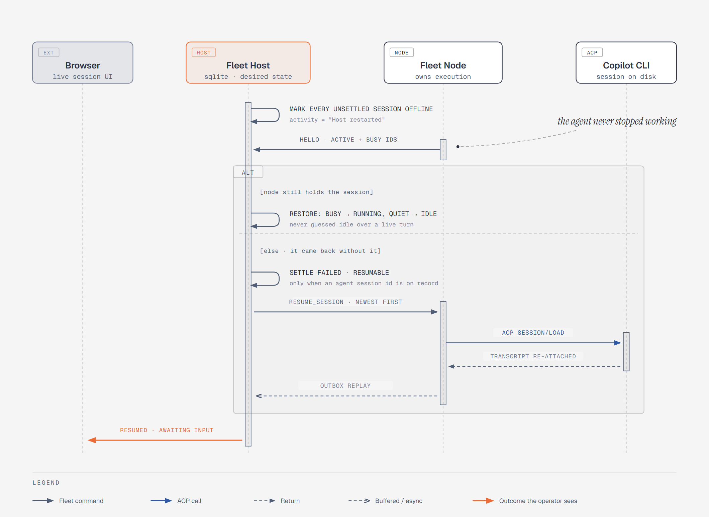
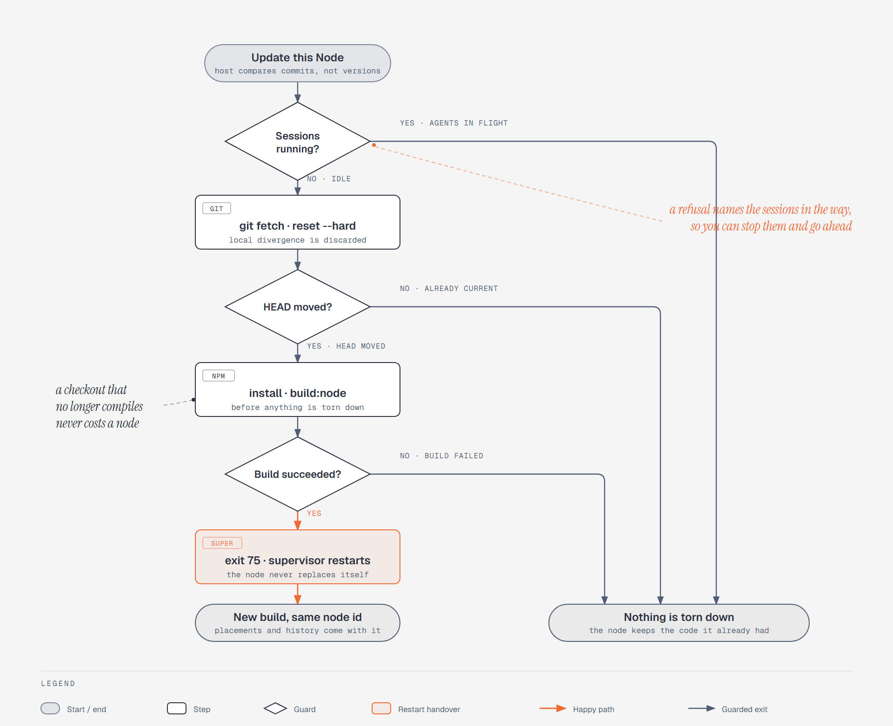
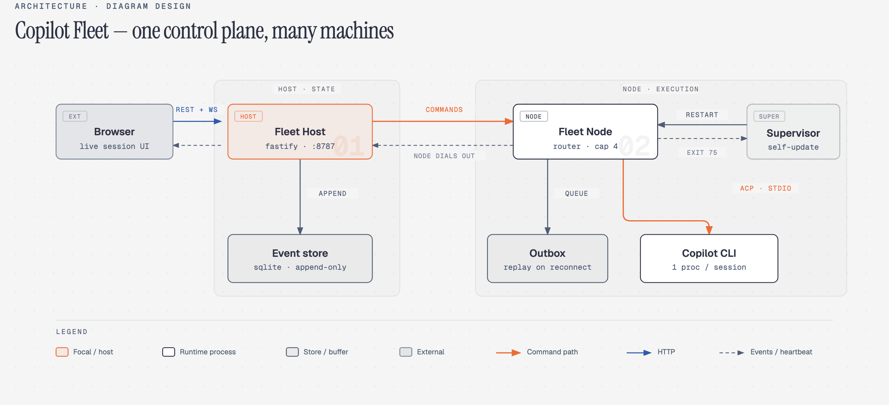
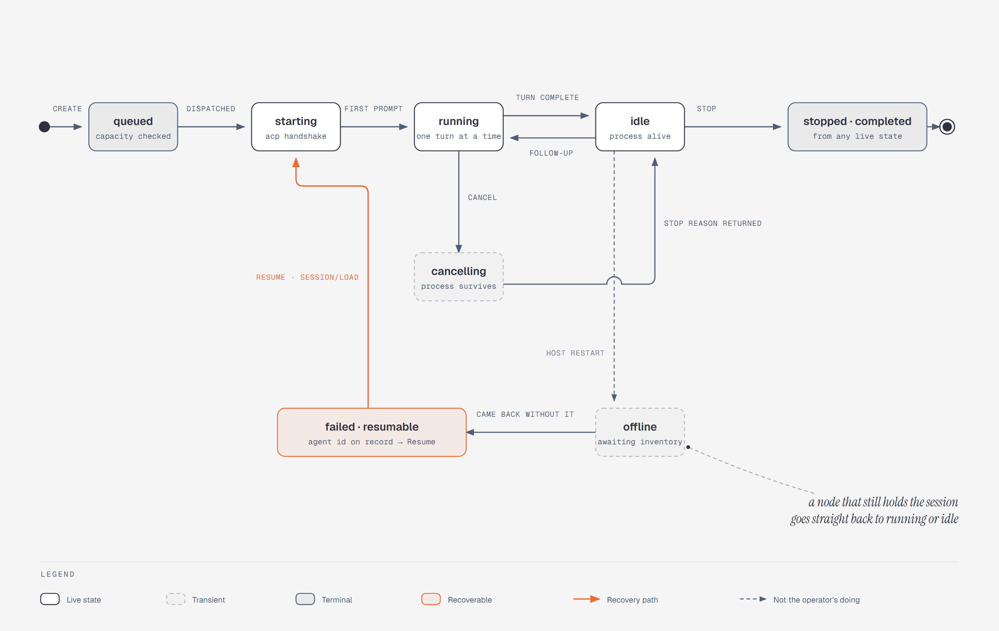

# Copilot Fleet

[English](README.md) · **简体中文**

Copilot Fleet 是一个自托管的控制平面，用于在多台机器上运行并监督 GitHub Copilot CLI
代理。Host 集成了 Fastify API、WebSocket 中枢、SQLite 数据库和 React 界面。每个 Node
只建立一条向外的连接，并为每个在线会话独占一个 ACP 客户端和一个 Copilot 进程。

## 界面预览

整个 fleet 的所有代理都在一屏之内，按它们正在处理的项目分组。卡片会实时滚动各自的
对话内容，所以一整面墙不用点开任何一个也能读懂。


点开其中一个，可以看到完整对话、它运行在哪个节点上、一个支持斜杠命令和附件的输入框，
以及底部由代理自己上报的 Model 与 Mode 选择器。


> 截图取自 [可复现的最小验证](#可复现的最小验证) 中那套确定性的 `--mock-agent` 演示，
> 因此任何人都能在没有 Copilot 登录态的机器上复现。真实节点会在完全相同的界面里
> 输出真实的 Copilot 内容。

## 环境要求

- Node.js 22.5 或更高版本，npm 10 或更高版本
- 每台真实 Node 上都已安装并登录 GitHub Copilot CLI
- 每个工作区放置（placement）都需要一个绝对本地路径

## Mac/Linux 上的 Host

```bash
git clone <repository-url> copilot-fleet
cd copilot-fleet
npm install
cp .env.example .env
```

在 `.env` 中设置一个足够强的随机 `ENROLLMENT_TOKEN`，然后启动开发模式：

```bash
npm run dev
```

这一条命令会同时拉起 `http://127.0.0.1:8787` 上的 Fastify API、`http://127.0.0.1:5173`
上的 Vite，以及本机的 Node 服务。Node 会从 `.env` 读取自己的 `FLEET_*` 配置。

界面在显示任何内容之前会先要一个操作者密码。可以在 `.env` 里用
`FLEET_OPERATOR_PASSWORD` 指定；不指定时，Host 会在首次启动时生成一个并打印到自己的
控制台：

```
No FLEET_OPERATOR_PASSWORD set, so this Host generated one. Sign in with: …
```

如果希望在改代码时隧道地址保持稳定，就把隧道作为独立进程启动：

```bash
npm run dev:tunnel
```

这样隧道就不会随 `tsx watch` 的重载而重建，公网地址不再每次 Host 重启都轮换，远端节点
也就不会掉线。Host 会检测到它并且不去干预它的生命周期；隧道运行期间设置页里的开关是
禁用的。照常用 Ctrl+C 结束全部进程。

打开界面 → **Settings**：

- **General** —— 会话默认值，以及用于迁移 Host 的导出/导入。
- **Tunnel** —— 运行 Cloudflare、Dev Tunnels、Tailscale Funnel、ngrok 或 bore；
  每个已安装的 provider 都有自己的开关和状态。
- **Nodes** —— 重命名/删除机器，复制注册命令。
- **Workspaces** —— 把项目映射到每台机器上的路径。


工作区是逻辑概念，放置（placement）才是物理的 `(工作区, 节点) → 路径` 对。同一个项目在
每台机器上可以位于不同的绝对路径；会话始终从已存储的放置启动，绝不会使用请求里传来的
路径。

Host 的公网地址变化时会通知已连接的节点，所以轮换过的隧道不会把它们困住 —— 见
[跟随 Host 迁移到新地址](#跟随-host-迁移到新地址)。

生产模式（构建后的 Host 与本地 Node 一起运行）：

```bash
npm run build
npm start
```

或者只跑 Host：`npm run start:host`。打开 `http://127.0.0.1:8787` —— Fastify 会直接托管
构建好的界面。

## Windows 上的 Node（PowerShell）

请先安装 Node.js 并登录 Copilot CLI。在一个已检出的 Fleet 目录中执行（或者直接粘贴
Host 的 Nodes → Connect 卡片里给出的命令）：


```powershell
npm install
npm run build:node
npm run start:node -- --url="https://fleet.example.com" --token="replace-with-host-token"
```

同样这三行在 bash 里也能用 —— 用命令行参数就绕开了 `$env:` 与 `VAR=value` 在两种 shell
之间的差异。

节点名默认取机器的主机名，两端都可以改 —— Host 的 Nodes 标签页，或者节点自己的配置页。
重命名不会改变机器身份，它的放置和会话都会跟着走；名字由 Host 拥有，所以如果节点离线
期间两端都改过，以 Host 的名字为准并推送回去。想要 4 以外的并发容量就传
`--max-sessions 8`。

首次注册会用注册令牌换取一个专属的节点密钥。凭据持久化在
`$env:APPDATA\CopilotFleet\node.json`，之后启动不再需要注册令牌。服务使用向外的 WSS
连接，因此节点上不需要开放任何入站端口。

### 节点命令行参数

节点能从环境变量读到的东西都可以改用命令行参数给出，并且参数的优先级高于 `.env` 和已
保存的 `settings.json` —— 这正是它有用的地方：不用改那台机器上的文件，就能把某一次运行
指到另一个 Host。执行 `npm run start:node -- --help` 查看当前完整列表。

| 参数                              | 等价于                   |
| --------------------------------- | ------------------------ |
| `--url`, `--host-url`             | `FLEET_HOST_URL`         |
| `--name`, `--node-name`           | `FLEET_NODE_NAME`        |
| `--token`, `--enrollment-token`   | `FLEET_ENROLLMENT_TOKEN` |
| `--max-sessions`                  | `FLEET_MAX_SESSIONS`     |
| `--copilot-command`               | `FLEET_COPILOT_COMMAND`  |
| `--permission-timeout-ms`         | `PERMISSION_TIMEOUT_MS`  |
| `--context-tier`                  | `FLEET_CONTEXT_TIER`     |
| `--devtunnel`                     | `FLEET_DEVTUNNEL_ID`     |
| `--config-port`                   | `FLEET_NODE_CONFIG_PORT` |
| `--mock-agent`, `--no-mock-agent` | `FLEET_MOCK_AGENT`       |

`--flag value` 和 `--flag=value` 两种写法都支持。npm 脚本名后面的 `--` 是 npm 自己的
分隔符，不写的话 npm 会把参数吃掉。同样的参数在 `npm run node`、`npm run dev` 和
`npm start` 上也有效，并且只会转发给 node 进程：

```bash
npm start -- --url=https://fleet.example.com
```

参数只对那一次运行生效；之后在配置页里做的修改会一直有效，直到进程重启。

注意 `--url` 是通过重启节点生效的，这会结束它上面正在跑的会话 —— 它们会落到
“Node reconnected without this session”，而任何已经抵达代理的会话都可以用 **Resume**
接回来。想在不丢失在线会话的前提下跟随轮换后的隧道地址，请改用节点配置页：它会原地
重连。

`node.json` 中的 `nodeId` 才是机器身份。`--name` 只是为这个身份提出一个新标签，不会注册
第二台机器，也不会丢下原有节点的放置和会话。

### 空闲分支会自动收起

当一个工作区行或节点行下面没有任何还在运行的东西时（会话都已停止、结束，或因所在机器
离线而处于 offline），这一行会自动收起，树只留下眼前真正在做的事，而不会随着为
**Resume** 保留的历史记录越长越长。

一旦那里重新有了动静，它会立刻展开：在那台机器上新建了会话，或者某个会话随着节点重新
连上而恢复运行。只有这些**变化**会移动一行，稳定状态不会，因此手动展开去翻旧记录的分支
会一直开着，直到它下面真的发生了什么。

### 用拖拽排序和归类

侧边栏的树在每一层都能手动重排：工作区行、节点行，以及它们下面的会话。把一行拖到某个
同级项的上方或下方 —— 由指针落在目标行的哪一半决定，对应那一侧会出现一条线 —— 顺序会
被保存下来，刷新后仍然存在，并且在所有观察这个 Host 的浏览器里都一致。

拖到某一行**之上**只可能表示“取代它的位置”，那就没有办法表达“放到最后” —— 最后一行
后面没有可以瞄准的行了。上方/下方的区分正是让列表末尾可达的原因。

新的工作区、放置和会话都追加在末尾，而不是按名字或日期排进去，这样手动整理过的顺序
不会被下一台机器或下一次运行打乱。没人整理过的 fleet 会保持它一贯的顺序。

把节点行拖到**另一个**工作区上，是把这份检出归类到那个工作区下面，而不是重新排序，并
且会带走它的会话：会话自己携带工作区 id，侧边栏才能不做联接就把历史分好组，把这一点
留在原处会让所有历史运行归到这份检出已经不属于的项目下。如果目标工作区在同一台机器上
已经有放置，这个操作会被拒绝 —— 一个工作区在给定节点上只能有一个位置。

在 **Workspaces & placements** 里，同样的拖拽作用在卡片上：放置行在卡片内重排，顶部的
节点小标签可以拖到某张卡片上从而把那台机器放置到那里，而无法接受当前拖拽内容的卡片会
在卡片上说明原因，而不是默默拒绝。

会话只能在自己所属节点的列表内重排。会话是某一台机器上的活代理进程，持有那台机器上的
文件，所以它没有别的地方可去。

### 提示音

一个回合结束时会播放一段上扬的短音；被权限请求卡住的代理会播放两次较低的音。它们特意
做得不一样：fleet 是用眼角余光看的，“它需要你”应该在不看屏幕的情况下就能和“它做完了”
区分开。顶栏的喇叭按钮可以静音，这个选择会被记住。

两种声音都在浏览器里合成，而不是打包成音频文件，所以从未联网的 Host 上也能用。第一次
看到 fleet 时不会响 —— 打开页面看到十个已完成的会话，和看着十个代理陆续完成不是一回事
—— 并且多个会话同时完成只会发出一声，而不是一堆。仍在等待的权限只播报一次，不会每次
刷新都响。

权限还会在页面之外播报：标签页标题上的计数，以及一条会一直留到被点击为止的桌面通知 ——
因为一个请求会一直阻塞它的代理，直到节点的超时到期。

### 附加文件与图片

输入框接受文件：直接把截图粘贴进去，或者用回形针挑选。每个文件会显示为一个小标签，在
消息发送前都可以移除；一条提示词最多带 6 个文件，每个 10 MB。

文件如何抵达代理取决于它是什么。图片作为 ACP image block 传过去；其他内容以文本方式
内嵌，这样代理不需要文件真的存在于自己的磁盘上就能读到内容 —— 这一点很重要，因为跑
代理的机器通常并不是文件来源的那台机器。既不是图片也不是文本的二进制（比如 zip）只会
在提示词里被点名，而不会内嵌：把它当文本解码会把上下文窗口花在替换字符上，而且可能被
当成指令读。

字节随提示词一起整体传输，而不是走上传接口。代理通常在隧道后面，给它一个 URL 去取，
意味着要把 Node 的凭据和一条回到 Host 的通路交出去，而那个东西本来就在操作者手上。
大小上限正是防止这变成一个大到会拖住共享同一条连接的其他会话的 WebSocket 帧。

对话记录里只保存文件名、类型和大小。事件日志存放在 Host 上并会重放给每一个正在观察该
会话的浏览器，把字节留在那里会让几张粘贴的截图变成一项负担；已发送消息下方的附件标签
就是留下来的痕迹。

### 斜杠命令与会话选择器

输入框提供 Copilot 自己的斜杠命令：输入 `/` 会出现一个列表，随输入过滤。方向键移动
选择，Enter 或 Tab 选中，Escape 关闭菜单。需要参数的命令（`/review`、`/research`）会把
光标停在后面；不需要参数的（`/usage`、`/context`）直接执行。列表就是该会话的代理所上报
的内容，包括 skills 和 plugins，所以装了额外 skills 的机器无需这里改动就会显示出来。

输入框底部是该会话的选择器 —— **Model**、**Mode**、**Reasoning Effort** —— 内容由代理
上报。每个只显示当前值并向上打开菜单；设置项的名字放在菜单里而不是条上，这样输入框
仍然是一个紧凑的整体，而不是一排带标签的下拉框。这些正是终端里的 Copilot 会弹出选择器
的设置项，也正因如此，`/model` 单独使用时在线协议上会回答“当前没有选择模型”：没有终端
可以弹出选择器。改动会立即作用于在线会话，不消耗一个回合，代理正在运行时也能改。

Copilot 还会上报一个 **Allow All** 选择器，而这条选择器条把它排除在外。权限策略在会话
启动时就已经决定（带或不带 `--allow-all`），并且已经显示为会话的 YOLO 标记。把它再作为
下拉框提供只可能与那个标记冲突 —— 而且对一个已经以 `--allow-all` 启动的会话，把它设回
“off”会返回成功然后被忽略，于是控件动一下又弹回去。注意 YOLO 并不等于 Copilot 的
Autopilot **Mode**：以 `--allow-all` 启动的会话仍然上报 mode `agent`，所以 Mode 仍然留在
条上，作为进入 Plan 或 Autopilot 的唯一入口。

选择一个代理拒绝的值会以提示的形式报告出来，并且不影响会话，不会结束这次运行。节点会
声明 `session-config` 能力，Host 宁可拒绝这个请求，也不会把一个旧节点看不懂的帧发过去。

**默认值由 Copilot 决定。** 会话启动时只带一个工作目录，所以新会话打开时的模型、模式和
推理强度，都是 Copilot 自己为那台机器和那个账号解析出来的结果 —— fleet 从不发送默认值。
改动某个选择器的作用范围仅限那一个会话：同一节点上的第二个会话，以及终端里下一次
`copilot` 运行，仍然从 Copilot 自己的默认值开始。Resume 会通过 `session/load` 重新读取
在线值，而不是相信存储的内容，所以恢复回来的会话显示的是它实际运行在什么上面。

选择模型会改变其他选择器，因为不是每个模型都提供每一项设置 —— 切换到没有推理级别的
模型会移除 Reasoning Effort 控件。正因如此，每次变更都会重新发布代理的整份选项列表，
这条选择器条不会保留当前模型已经不再提供的控件。

### 把 Host 或 Node 迁移到另一台机器

fleet 有两类状态，所以有两个文件。

**Host** —— Settings → General → **Export fleet**。这个 JSON 文件包含工作区、放置、节点
（身份哈希，不是明文密钥）、会话、对话记录、默认值、注册令牌，以及隧道 provider 与开关
状态。在新机器上导入会**替换**已有的一切。

现有节点只要还能连到 Host，就会用它们已有的 `node.json` 重新连上。命名主机名 /
`FLEET_PUBLIC_URL` / Tailscale Funnel 地址会被复制进归档；轮换型 quick tunnel 地址
（`*.trycloudflare.com`、免费 ngrok、bore）不会 —— 那些节点需要手动重新指向。

**Node** —— 本地配置页（`http://127.0.0.1:8788`）→ **Export identity**。这个文件是这台
机器的 `node.json` 加上 `settings.json`。在新机器上导入会替换本进程的身份并重新连接。
放置路径仍然沿用 Host 为该节点 id 存储的值；如果检出在别的位置，需要更新它们。Copilot
自己的会话文件不在归档里，所以 **Resume** 只在跑代理的那台机器上有那些文件时才有效。

这两个文件都含有机密。不要提交到代码库。

### 重启之后恢复会话



传输断开并不能说明它背后的代理怎么样了，所以 Host 选择去问，而不是去猜。Node 会上报
自己的清单**以及**其中哪些会话正处在回合中 —— 正是这一点，避免了一个返回的会话在代理
还有提示词在飞的时候被落到 `idle`。

会话能在两个进程都宕掉之后存活下来。Host 把它们保存在自己的 SQLite 文件里，节点把身份
保存在 `node.json` 里，所以两边都回来之后：

1. Host 把它此前在运行的一切标记为 `offline`（“Host restarted”）。
2. 重连上来的节点上报它仍然持有哪些会话。重启过的节点一个都没有，所以其余的会落定为
   “Node reconnected without this session”。
3. **Resume** 通过 Copilot 的 `session/load` 重新接上，对话记录从停下的地方继续，而不是
   重新开始。

处于这种状态的会话显示为**可恢复**而不是失败，仍然留在侧边栏里，并且会被
**Clear ended** 跳过 —— 那个按钮只清除已经没有东西可接回的会话。要主动丢弃一个可恢复的
会话，请对它使用 **Dismiss**。

默认情况下，只要节点回来，Host 会自己把这些会话接回去，这样一次重启不会留下一排需要
逐个点击的按钮。它只取那一次重连中落定的会话，从新到旧，并在节点容量处停止 —— 所以
一次重启不会复活几天前就被放弃的对话，而恢复失败的会话会留给人处理，不会每次心跳都
重试。重新接上不会发送提示词：代理落在 idle 等待输入，在你开口之前什么都不会跑。如果
你更希望自己按 Resume，可以在 **Settings → General** 里关掉它。

要让这一切成立需要三个条件：Host 的 `DATABASE_PATH` 文件完好，节点使用同一个
`node.json` 身份启动，以及那台机器上的 Copilot 磁盘上还留着那个代理会话。一个在代理
启动之前就死掉的会话没有任何东西可以接回 —— 它会落定为“从未抵达代理”，并且不提供
Resume。

节点在 Host 缺席期间会让代理继续跑，并缓冲它们产生的事件，所以回合进行中的 Host 重启
不再让那一段对话记录消失。如果中断时间超过缓冲区，Host 会记录这段缺口并继续；它绝不会
拒绝之后的事件，因为一个再也无法上报自身状态的会话，是谁都没法用的会话。

### 节点配置页

每个节点在 `http://127.0.0.1:8788` 上提供一个小设置页（端口可用
`FLEET_NODE_CONFIG_PORT` 覆盖）。当隧道给出新地址时用它重新指向节点 —— 节点会原地重连，
无需重启，在线会话得以保留。

它还能编辑节点名、会话容量、Copilot 可执行文件路径和权限超时。这些值存放在凭据旁边的
`settings.json` 里，并且优先级高于环境变量，因此这里的修改不会被下次启动时过期的
`.env` 覆盖。命令行参数的优先级高于两者。

这个监听只绑定回环地址，并且刻意不对外暴露：任何能把节点重新指向另一个 Host 的东西，
都能在那台机器上执行命令。要访问远端节点的页面，请通过 SSH 端口转发，而不是把监听放宽。

### 跟随 Host 迁移到新地址


每个 provider 各自独立运行，因此可以同时开启多个；被标记用于注册的那个，就是交给新节点
的地址。

那条地址就是 Host，不是另一条「只握手、不管控制面」的通道。隧道转发到
`http://127.0.0.1:8787`（或 `PORT`）：`/api`、`/ws/node`、`/ws/browser`，以及已构建的
UI。`npm run dev` 时你点开的页面是 Vite 的 `http://127.0.0.1:5173`，隧道并不指向它。
在公网 URL 上打开仍然打到 Host，所以 `/api/health` 会应答，其余接口仍然要操作者密码。

当 Host 的公网地址发生变化 —— 隧道启动、轮换，或者切换到另一个 provider —— 它会告诉仍然
连着的节点。每个节点记录新地址，把旧地址留作回退，并且**不会断开已有的连接**：上面正在
跑的会话不受影响，新地址是下一次重连时拨的号。

这弥补了此前的一个缺口：轮换过的隧道地址会让每个节点都去拨一个已经不存在的地址，除了
逐台机器改 `settings.json` 之外没有别的办法。

它覆盖与不覆盖的范围：

- 通过一个能在这次变化之后继续存在的地址访问的节点 —— 局域网地址、命名隧道 —— 会被告知
  并跟上。
- 通过**刚刚轮换掉的那条隧道**访问的节点无法被告知：那条 socket 随隧道一起死了。它会
  继续重试自己已知的地址，所以只要其中一个还能应答，它就能自行恢复。
- 私有 Dev Tunnel 会用于注册，但绝不会作为公网 Host URL 推送给在线节点。对应节点使用
  `--devtunnel=<id>`，持续运行本地 `devtunnel connect` 转发，并拨号到客户端报告的回环端口。
- 回环地址永远不会被广播。当没有隧道且没有设置 `FLEET_PUBLIC_URL` 时，Host 对自身地址的
  认知是 `http://127.0.0.1:8787`，而这在另一台机器上指向的是那台机器。此时节点会保留它
  们已有的地址。
- 运行较旧 agent 的节点会被跳过，而不是收到一条它会拒绝的消息，因此混合版本的 fleet
  仍然可用。

如果广播出去的地址在某台机器上确实不可达，那个节点会拨号、失败，并在下次尝试时轮到上
一个地址 —— 所以一次广播永远不会把机器困死。哪个地址应答，哪个就成为它优先使用的地址。
节点配置页会在 Host URL 字段下方列出这些回退地址。

## 让节点保持最新



这张图的形状就是这个功能的全部：只有唯一一条路径以重启结束，而每一个没通过的判定都让
机器继续跑它本来就在跑的东西。

Nodes 标签页会把每台机器的提交与 Host 的提交做比较，标记为 **Up to date**、
**Update available** 或 **Manual update**。某一行上的 **Update** —— 或者表格上方的
**Update all** —— 会让那些机器执行 `git pull --ff-only`、`npm install`、
`npm run build:node`，然后重启进入新构建。过程会实时显示在该行里。

比较的是提交而不是包版本：`0.1.0` 在两次部署之间不会变，用它比较会把每台机器都报成
最新的，无论它落后多远。

它不会做的事：

- **在没被明确要求的情况下更新一台正在跑会话的机器。** 重启会带走那个节点上的每一个
  代理，所以忙碌的节点会被拒绝 —— 但拒绝会点名挡路的会话，此时 **Update** 会提供“停掉
  它们并继续”的选项。每个会话都保留自己的对话记录，之后可以恢复。**Update all** 从不
  这样做：它会跳过忙碌的机器，而不是替你在整个 fleet 上做决定。
- **移动一个已经分叉的检出。** `--ff-only` 意味着有本地提交、或者工作区脏了的机器会
  停下并报告，而不是凭空造一个没人要的合并。
- **重启进入一个编译不过的构建。** `npm run build:node` 在任何东西被拆掉之前运行；如果
  它失败，节点会停留在原有代码上并报告错误。
- **更新 agent 比这个功能更旧的节点。** 它的消息联合类型里没有 `update_node`，收到时会
  直接断开连接，所以它被标记为 _Manual update_ 并跳过。用 Windows Node 一节里的三条命令
  手工更新这些机器一次，之后每一次更新就都可以从 Host 完成了。

当节点所在目录不是 git 检出时（比如 tarball 部署），它会把提交上报为 `""`。这些机器显示
为 **Unknown** 而不是被猜测，并且被排除在 **Update all** 之外。

### 节点如何重启自己

`npm run node` 和 `npm run start:node` 都会在节点前面放一个小 supervisor
（`apps/node/supervisor.mjs`）。节点从不替换自己：它以状态码 75 退出来请求重启，而
supervisor —— 它没有参与更新，因此仍然活着 —— 会在同一个终端里启动新构建。没有任何东西
被 detach，也不会弹出窗口。

之所以这样做，是因为在 Windows 上一个进程无法可靠地替换自己。曾经尝试这么做的版本会
spawn 一个 detached 的后继进程，它会自带一个控制台窗口，并且必须赢得实例锁的竞争。在
`tsx watch` 下它每次都输：拉取改变了源码，watcher 重启了它自己的子进程，后继进程发现锁
已被占用于是退出 —— 表现出来就是终端一闪而过，而节点只是靠 watcher 的意外才回来。

`npm run dev:watch` 仍然用 `tsx watch` 运行节点，用于迭代节点代码。不要在你依赖的机器上
使用它：**watcher 不会重启一个已经退出的子进程**，所以在它下面做更新会让机器上什么都不
剩。

supervisor 只在状态码 75 时重启，别的一律不重启 —— 崩溃的节点会以它崩溃时的状态码退出，
所以坏掉的构建是可见的，而不是陷入循环。如果节点在二十秒内请求重启五次，它也会放弃。

### 在进程守护程序下重启

内置的 supervisor 不会在重启机器后存活，也不会重启崩溃的节点。你依赖的机器最好交给能做
到这些的东西 —— PM2、NSSM、systemd unit。

设置 `FLEET_RESTART_MODE=exit`，更新时就会停止进程而不是启动后继进程，把重启交给守护
程序。把它直接指向 `apps/node/dist/main.js`，而不是 `supervisor.mjs`；两个 supervisor
比这件事需要的多了一个。

```bash
# PM2，任何平台
FLEET_RESTART_MODE=exit pm2 start apps/node/dist/main.js --name copilot-fleet-node -- --url=https://fleet.example.com
pm2 save
```

```powershell
# Windows，用 NSSM 注册成服务
nssm install copilot-fleet-node "C:\Program Files\nodejs\node.exe" "Q:\Repos\copilot-fleet\apps\node\dist\main.js"
nssm set copilot-fleet-node AppDirectory Q:\Repos\copilot-fleet
nssm set copilot-fleet-node AppEnvironmentExtra FLEET_RESTART_MODE=exit
nssm start copilot-fleet-node
```

这种模式下更新同样以 75 退出。PM2 和 NSSM 在任何退出时都会重启，所以这已经是你想要的
行为；只在失败时重启的 unit 文件需要 `RestartForceExitStatus=75` 或 `Restart=always`。

## 可复现的最小验证

在终端 1 运行 Host：

```bash
cp .env.example .env
npm install
npm run host
```

在终端 2 运行一个确定性的、无需登录的 Node：

```bash
npm run node -- --url=http://127.0.0.1:8787 \
  --token=change-me \
  --name=mock-node \
  --max-sessions=2 \
  --mock-agent
```

然后打开 `http://127.0.0.1:5173`：


1. 在 **Workspaces** 下创建一个工作区。
2. 用一个已存在的绝对目录，为 `mock-node` 添加一个放置。
3. 从 **Dashboard** 启动两个会话。在对话框里给其中一个起名字；另一个在你从会话标题栏
   重命名之前，会以它的提示词列出。
4. 打开任意一张卡片，观察各自独立的事件流，发送追加提示词，取消一个回合，或停止进程。

自动化的等价物是：

```bash
npm test
```

`apps/node/src/router.test.ts` 会并发启动两个 mock 会话，并证明每个会话都在没有 Copilot
登录态的情况下收到自己那份有序的事件流。

## 架构与消息流



那条纵向分界就是整个设计：Host 拥有期望状态与历史，Node 拥有执行。Copilot 凭据、子进程
和本地路径永远不越过它，并且拨号的一方是 Node。

1. Node 用注册令牌注册一次，取得节点 ID 和密钥。
2. Node 认证自己向外的 WebSocket。心跳上报活跃会话清单。
3. 浏览器从已存储的放置创建会话。Host 绝不接受创建会话请求里的路径。
4. Host 下发一条带去重 ID 的命令。Node 校验并解析放置目录，再次执行容量限制，然后启动
   一个隔离的 ACP 连接。
5. 官方的 `@agentclientprotocol/sdk` 执行 `initialize`、`session/new`、提示词/更新流式
   传输、追加提示词和 `session/cancel`。Stop 会关闭 ACP 并终止子进程。
6. 节点事件带有 UUID 以及每会话单调递增的序号。SQLite 忽略重复，并记录序号缺口，而不是
   在中断后拒绝所有后续事件；规范化后的会话/事件被广播给浏览器，用于在刷新后重建对话记录。
7. ACP 权限请求会成为持久化事件。浏览器的 allow-once/deny 决定会回到等待中的 ACP 请求。
   超时或 Node/Host 断连会拒绝待处理的请求。Cancel 也会在 `session/cancel` 之前拒绝待
   处理的请求。
8. Host WebSocket 的短暂断开不会停止本地代理进程。Node 会缓冲它们的事件，并在重连时
   重新上报活跃会话以及其中正处于回合中的会话。Host 在此期间把它们保留为 `offline`，
   只有返回清单中缺失的会话才会落定为可恢复的 failed。显式关闭 Node 仍会停止本地代理。

### 一个会话会经历的状态



两个区分撑起了整个模型。**Cancel** 结束回合但保留进程，所以会话回到 `idle` 等待追加
提示词；**Stop** 结束进程，是终态。而 `failed` 并不是一回事：抵达过代理的会话保留着它的
agent session id，会被作为**可恢复**提供出来；而从未走到那一步的会话就是结束了。

### Run：多个会话朝一个目标

把多个 agent 放到同一件事上，有两条路。

**跟 orchestrator 对话。** 侧边栏第一行就是 **Orchestration**，在所有 workspace 之上——
因为它是整个 fleet 的界面，不属于任何单个仓库。开一个，你就得到一个可以聊天的会话。
它自己不写代码——它启动别的 agent 去写。你交代一件事，它挑机器、派一个 worker，然后
**结束自己这一轮**。那个 worker 干完时，Host 会带着摘要把 orchestrator 叫醒，由它决定
下一步。你让它找人 review，它会把 reviewer 派到工作实际发生的那个 checkout 上，所以
reviewer 看得见真实改动。

界面就是那段对话，旁边一条 rail 列着撒在 fleet 上的活；点某一步就进到那个 worker 的
transcript。

它从不干等，这正是重点：对话是持久的，一个跑二十分钟的 worker 期间不占任何东西，Host
重启也不会把这条线索弄丢。

orchestrator 通过 Host 暴露的 MCP 服务器够到整个 fleet，token 只对它这一个会话有效。
worker 则完全没有工具——不是被禁用，而是从没给过——这就是编排不会嵌套的原因。

**或者自己写计划。** 一个 **run** 是目标加预算，外加一份固定的步骤清单，只批准一次。
它没有界面——那是引擎自己的夹具，只走 REST：

```bash
curl -X POST http://127.0.0.1:8787/api/runs \
  -H 'content-type: application/json' \
  -d '{"workspaceId":"<id>","name":"audit","objective":"审查、修复、再跑测试"}'

curl -X POST http://127.0.0.1:8787/api/runs/<runId>/plan \
  -H 'content-type: application/json' \
  -d '{"steps":[
        {"stepKey":"audit","title":"Audit","prompt":"找出不稳定的测试","category":"explore"},
        {"stepKey":"fix","title":"Fix","prompt":"修好它","category":"implement","dependsOn":["audit"]},
        {"stepKey":"test","title":"Test","prompt":"跑一遍测试","category":"test","dependsOn":["fix"]}
      ]}'

curl -X POST http://127.0.0.1:8787/api/runs/<runId>/approve
```

两条路都由 Host 执行：挑选 placement，必须先收到 `turn_complete` 再看到 `idle` 才判定
一步成功，把整个 run 钉死在它第一次写入的那个 checkout 上，并在 run 结束时停掉仍然持有的
会话。中途重启不会误判，因为 `offline` 被读作「未知」而不是「失败」。

批准是唯一的闸门，这是有意为之：人批准的是目标和预算，之后每一次派发不再单独审批——
真正拦住一个 run 的是预算，而不是每次都弹一个提示。

## 安全说明

- 网页界面和整个 `/api` 面都在一个操作者密码之后。可以设置
  `FLEET_OPERATOR_PASSWORD`；没有设置时，Host 会在首次启动时生成一个并打印到控制台。
  登录会写入一个 `HttpOnly`、`SameSite=Strict` 的会话 Cookie，有效期 12 小时。连续
  猜错会把**整个 Host** 的登录锁上几分钟，而不是按客户端分别计数。`/api/health`
  保持不鉴权，这样探活一条隧道 URL 并不会变成管理员。
- Host 只应答它认识的名字：回环地址、`FLEET_PUBLIC_URL`、当前在线的隧道地址，以及
  `FLEET_ALLOWED_HOSTS` 中列出的名字。以其他 `Host` 头到达、或来自其他 `Origin` 的
  请求会被拒绝——这正是让操作者随手打开的某个页面无法借助被重绑定的 DNS 名字操作
  整个 fleet 的原因。`FLEET_ALLOWED_HOSTS=*` 会关掉这项检查。
- 节点自己的凭据只能触及它的配置页需要中转的工作区与放置接口，并且一个节点只能为
  自己创建或改写放置。
- 生产模式启动时会拒绝缺失的或默认的 `change-me` 注册令牌。
- 注册成功会创建一个高熵的专属节点密钥；Host 只存储它的 SHA-256 哈希。
- Copilot 的认证与令牌留在 Node 上，绝不会出现在 Fleet 的消息中。
- 会话请求引用的是预先配置好的放置 ID。节点还要求目录是存在的绝对路径，并在创建进程
  之前解析它。
- Copilot 以参数数组、`shell: false` 和选定的放置作为 `cwd` 直接启动。
- 权限在界面上是显式且可审计的（只有 allow-once / deny）。YOLO 默认关闭，Host 层面和
  每个新会话都是如此。对于无人值守的运行，可在 Node 上设置 `FLEET_YOLO=1`，让 Copilot
  以 `--allow-all` 启动（工具、路径和 URL）。在 YOLO 关闭时，未应答和断连的请求仍然按
  拒绝处理。
- 节点本地的配置页绑定在回环地址上，并且还会拒绝这些请求：`Host` 不是本机对应端口上的
  `127.0.0.1`（或 `localhost`）、来自其他来源、或写入时没有带
  `content-type: application/json`。它无法防御登录到同一台机器上的其他用户。
- 暴露在公网上的 Host 仍应使用 HTTPS/WSS；把它放在带认证的反向代理或访问策略之后
  （例如 Cloudflare Access）依然是一层值得加的防护。

## 常用命令

```bash
npm run dev
npm run dev:tunnel
npm test
npm run typecheck
npm run build
npm run verify   # CI 会跑的全部内容，按 CI 的顺序
```

`npm run verify` 是推送前该跑的那一条：CI 还会检查格式（`prettier --check`），而 `lint`
并不覆盖它，那边构建变红不止一次仅仅是因为源码没格式化。

启动过程无需种子数据。SQLite 会在首次启动时创建 schema 和空数据文件。
