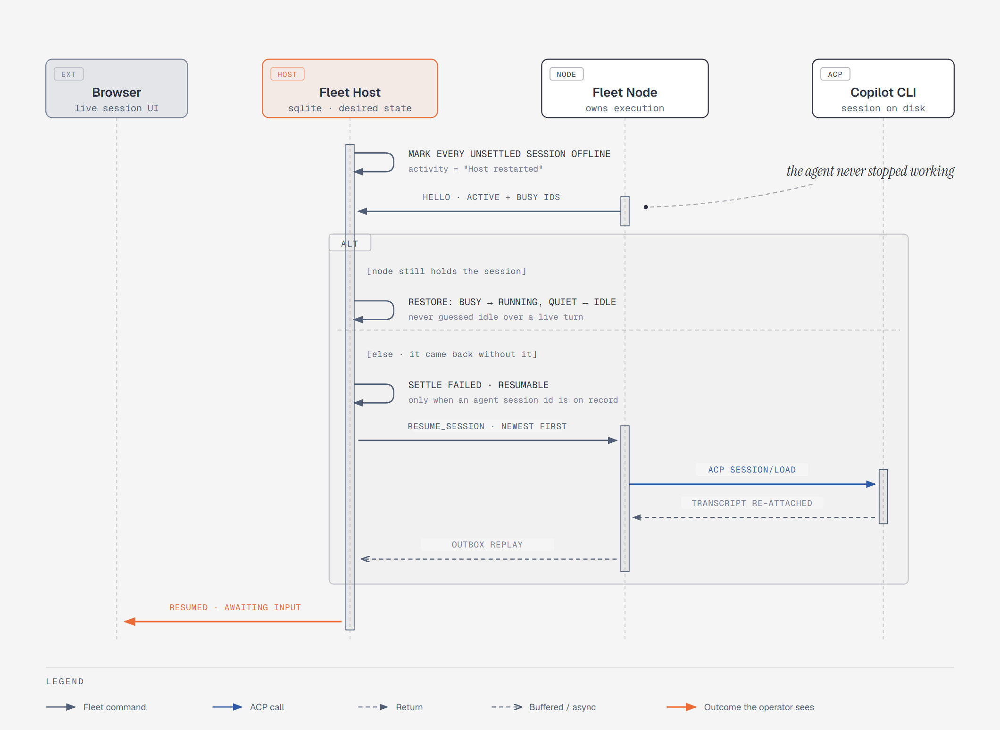
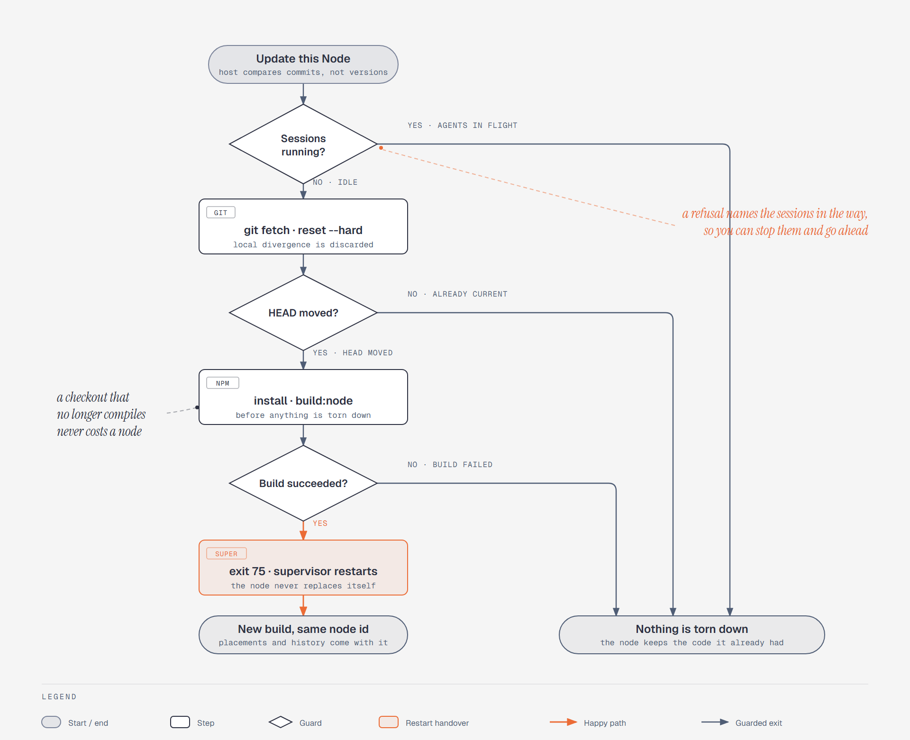
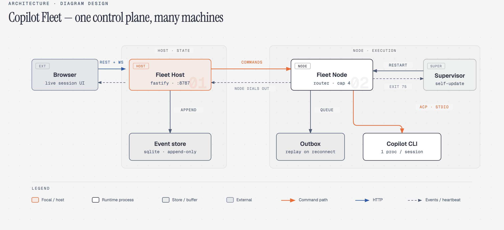
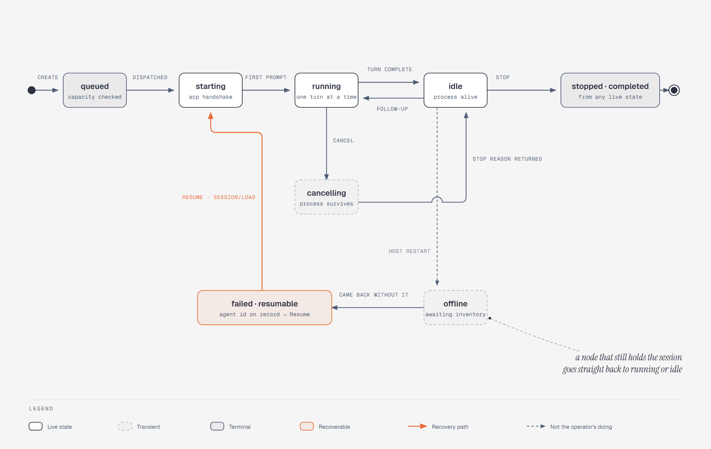

# Copilot Fleet

[English](README.md) · **简体中文**

Copilot Fleet 是一个自托管的控制平面，用于在多台机器上运行并监督 GitHub Copilot CLI
代理。Host 集成了 Fastify API、WebSocket 中枢、SQLite 数据库和 React 界面。每个 Node
只建立一条向外的连接，并为每个在线会话独占一个 ACP 客户端和一个 Copilot 进程。

## 界面预览

整个 fleet 的所有代理都在一屏之内，按它们正在处理的项目分组。卡片会实时滚动各自的
对话内容，所以一整面墙不用点开任何一个也能读懂。


点开其中一个，可以看到完整对话、它运行在哪个节点上、一个支持斜杠命令和附件的输入框，
以及底部由代理自己上报的 Model 与 Mode 选择器。


> 上面的截图取自 [可复现的最小验证](#可复现的最小验证) 中那套确定性的 `--mock-agent` 演示，
> 因此任何人都能在没有 Copilot 登录态的机器上复现。真实节点会在完全相同的界面里
> 输出真实的 Copilot 内容。

### 节点健康与会话导航

侧边栏、会话标题和已派发工作使用统一的状态图标：蓝色旋转圆环表示运行中，
绿色圆圈勾表示完成或成功，灰色圆圈暂停图标表示空闲、可继续追问，红色断开插头
表示离线。红色错误圆圈表示失败，琥珀色表示权限或恢复操作需要关注。排队使用时钟，
停止或取消使用停止方块，跳过使用向前箭头。每个图标都有悬停说明和无障碍名称，
动画遵循系统的减少动态效果设置。已完成步骤会保留结果，不会因工作会话后来空闲或离线而改变。

**Settings → Nodes** 每台机器只占一行，**Health** 列紧凑显示蓝色 CPU、绿色 RAM 和紫色
磁盘进度条。悬停或通过键盘聚焦指标可查看容量、范围和采样详情；时钟图标与条纹标记
非实时读数。CPU、RAM 覆盖整台机器，磁盘容量覆盖 Node 用户主目录所在卷。
磁盘指标不是所有盘的平均值，也不是磁盘读写活动；其他卷上的项目可能有不同的剩余空间。
新版 Node 大约每 30 秒采样一次，通过现有连接上报，每项数据保留自己的采样时间。
缺失、过期、时钟偏差和离线状态会明确标注，不会伪装成实时的零值。旧版 Node 仍可正常
连接，只是不提供健康数据；这些指标不会改变任务调度。

完整聊天和监控墙中的聚焦聊天，都可以通过标题栏的 **Session information** 图标打开
详情弹窗。弹窗显示节点、平台、工作区、当前 placement 路径、模型、状态、时间，以及
Fleet 与 Copilot 各自的会话 ID，并提供路径、ID 和带 shell 转义的本地恢复命令复制按钮。
`copilot --resume` 必须使用原生 Copilot 会话 ID；演示会话和尚未获取该 ID 的会话不会
生成恢复命令。

本地恢复应在原 Node 上，以运行 Node 的同一操作系统用户执行，并先停止旧进程或确认
它已经退出。命令使用标准 Copilot CLI 和当前 placement；如果启动器、配置或路径已经
变化，请使用对应的原始环境。本地恢复不会重新接入 Fleet，也不会恢复编排工具；
需要继续受管任务时，应使用 Fleet 的 **Resume**。

向上滚动或选择较早的提示词后，会出现 **Jump to latest**，即使会话空闲、已经结束或
没有新输出也可以使用。点击后跳到对话底部、清除未读计数，并继续跟随流式输出；
阅读旧消息时不会被新输出自动拉回底部。

## 功能地图与目录

第一次使用时，请先按下方的首次使用指南完成设置；之后可以从这里查找具体功能。

- **安装并认领 Host：** [环境要求](#环境要求)、[设置 Host](#设置-hostwindowsmacoslinux)、
  [首次使用指南](#首次使用指南)、[认领细节](#首次运行认领一个-fleet)。
- **配置 Microsoft 登录与管理员：** [注册与账号范围](#microsoft-登录注册与账号范围)、
  [从别处登录](#从别处登录)、[添加和移除管理员](#添加和移除管理员)、[安全说明](#安全说明)。
- **选择访问方式与隧道：** [隧道与谁能看到登录页](#隧道与谁能看到登录页)、
  [跟随 Host 迁移到新地址](#跟随-host-迁移到新地址)。
- **连接和维护机器：** [Windows Node](#windows-上的-nodepowershell)、
  [节点命令行参数](#节点命令行参数)、[节点配置页](#节点配置页)、[让节点保持最新](#让节点保持最新)。
- **创建项目并启动日常会话：** [工作区和放置](#首次使用指南)、
  [可复现的最小验证](#可复现的最小验证)、[附加文件与图片](#附加文件与图片)、
  [斜杠命令与会话选择器](#斜杠命令与会话选择器)。
- **监控和整理活跃工作：** [自动收起的分支](#空闲分支会自动收起)、
  [拖拽排序和归类](#用拖拽排序和归类)、[提示音和通知](#提示音)。
- **协调多代理任务：** [Orchestrator 快速指南](#orchestrator-快速指南)、
  [Run：多个会话朝一个目标](#run多个会话朝一个目标)、
  [Chats as a destination](#chats-as-a-destination)。
- **恢复、迁移、备份、排障：** [迁移 Host 或 Node](#把-host-或-node-迁移到另一台机器)、
  [重启之后恢复会话](#重启之后恢复会话)、[Diagnostics 与排障](#diagnostics-与排障)、
  [本地验证与测试监控](#本地验证与测试监控)。

## 环境要求

- [Node.js](https://nodejs.org/en/download) 22.5 或更高版本、npm 10 或更高版本，以及 Git
- 每台真实 Node 上都已安装并登录
  [GitHub Copilot CLI](https://docs.github.com/en/copilot/how-tos/copilot-cli/set-up-copilot-cli/install-copilot-cli)
  1.0.69 或更高版本，且订阅与组织策略允许使用 Copilot
- 每个工作区放置（placement）都需要一个已经存在的绝对本地目录；这个目录在运行会话的
  Node 上，而不一定在 Host 上
- Host 登录需要发布者或运维者合法拥有并获准使用的 Microsoft 应用注册，见
  [注册与账号范围](#microsoft-登录注册与账号范围)
- 多机器访问推荐使用 Microsoft Dev Tunnels（`devtunnel`）：Host 需要登录隧道服务；私有
  隧道下，远端 Node 也需要登录同一个隧道 provider

## 设置 Host（Windows、macOS、Linux）

Host 可以运行在 Windows、macOS 或 Linux 上。Node 可以和 Host 是同一台机器，也可以在别的
机器上；真正拥有工作目录和 Copilot 登录态的是 Node。

请用有权限的账号克隆当前私有仓库：

```bash
git clone https://github.com/charlesyin_microsoft/copilot-fleet.git
cd copilot-fleet
npm install
```

如果还没有 `.env`，复制一份本地配置：

```powershell
Copy-Item .env.example .env
```

```bash
cp .env.example .env
```

第一次只启动 Host 时，先构建共享协议包，再运行 API 和 UI：

```bash
npm run build -w @fleet/protocol
npm run host
```

全新安装后不能跳过协议包构建：`npm run host` 不会自动构建它。默认 API 地址为
`http://127.0.0.1:8787`，Vite 界面地址为 `http://localhost:5173`；开发时打开后者。
如果修改了 `.env` 的 `PORT`，后续配置和示例中也要使用对应的 API 端口。

先按[首次使用指南](#首次使用指南)认领 Host 并注册第一台 Node。本机 Node 完成注册且
Copilot CLI 已登录后，可以用 `npm run dev` 同时启动 Host、UI 和该 Node。单纯启动 Node
进程并不会完成注册。Node 第一次从 `.env` 读取 `FLEET_*` 初始设置，之后将可编辑设置保存到
自己的 `settings.json`。
一次只选择一种启动方式；切换到组合开发命令或生产模式前，先停止已经运行的 Host/Node
进程，避免重复占用端口。

全新的 Host 既没有密码也没有管理员。它只会把一次性的认领码打印到自己的控制台，在有人
用它之前不会透露任何别的东西：

```
Copilot Fleet is unclaimed. Claim it at http://127.0.0.1:8787 with this
one-time code:

    v-0MArasdtNAfxqlM5_pnA

It expires in 30 minutes and is printed only here.
```

认领需要两个证据，具体见[首次运行：认领一个 Fleet](#首次运行认领一个-fleet)。普通的全新
公共 Microsoft 登录需要运维者或发布者提供已注册的 public client/config；本仓库没有内置可
公开使用的默认客户端。

本机 Node 注册完成后，可以使用下面的组合开发命令，把隧道保持为独立进程：

```bash
npm run dev:tunnel
```

这样隧道就不会随 `tsx watch` 的重载而重建，公网地址不再每次 Host 重启都轮换，远端节点
也就不会掉线。Host 会检测到它并且不去干预它的生命周期；隧道运行期间设置页里的开关是
禁用的。照常用 Ctrl+C 结束全部进程。
如果只开发 Host，保持 `npm run host` 运行，并在第二个终端运行 `npm run tunnel`；
这不会启动 Node。

打开界面 → **Settings**：

- **General** —— 会话默认值、**Take the tour** 按钮，以及数据导出/导入。
- **Security** —— 管理员、邀请、Microsoft 登录配置、密码迁移、Host 指纹、Node 密钥迁移、
  可迁移 Host 备份/恢复，以及这台 Host 的安全审计。
- **Tunnel** —— 管理 Dev Tunnels、Cloudflare、Tailscale Funnel 或 ngrok。
  bore 等明文 HTTP 提供程序会显示在列表中，但不能用于操作台。
- **Nodes** —— 重命名/删除机器，查看更新状态，生成一次性的连接命令。
- **Workspaces** —— 创建逻辑项目，并映射到每台机器上的路径。
- **Diagnostics** —— 查看 Host 自启动以来捕获的 warning 和 error。

Settings 里的各个 section 访问后会保留自己的状态，所以切换 tab 不会清掉填了一半的表单。
静态警告（例如 YOLO 风险）会留在对应卡片里，而不是变成转瞬即逝的 toast。窄屏上 Settings
的 tab 条会横向滚动，所以一直到手机尺寸都能进入每个 section。


工作区是逻辑概念，放置（placement）才是物理的 `(工作区, 节点) → 路径` 对。同一个项目在
每台机器上可以位于不同的绝对路径；会话始终从已存储的放置启动，绝不会使用请求里传来的
路径。添加 placement 只是记录 Node 上一个已经存在的目录；它不会 clone 仓库，也不会替你
创建目录。

Host 的公网地址变化时会通知已连接的节点，所以轮换过的隧道不会把它们困住 —— 见
[跟随 Host 迁移到新地址](#跟随-host-迁移到新地址)。

生产模式（构建后的 Host 与本地 Node 一起运行）：

```bash
npm run build
npm start
```

或者只跑 Host：`npm run start:host`。打开 `http://127.0.0.1:8787` —— Fastify 会直接托管
构建好的界面。

## 首次使用指南

第一次搭建 fleet 时按这个顺序走。所有步骤可以在一台 Windows 机器上完成，也可以把 Host
和 Node 分在不同机器上。

1. **启动 Host。** 完成[Host 设置](#设置-hostwindowsmacoslinux)，第一次执行
   `npm run host` 前先运行 `npm run build -w @fleet/protocol`。也可以运行
   `npm run build`，再用 `npm run start:host` 启动生产构建。保持 Host 控制台打开：
   认领码只打印在那里，30 分钟后过期。
2. **认领 Host。** 开发模式打开 `http://localhost:5173`，生产模式打开
   `http://localhost:8787`。如果显示 **Configure Microsoft sign-in**，输入认领码并点击
   **Unlock setup**。填写获准使用的 Microsoft Application (client) ID，选择
   **Work/school and personal Microsoft accounts** 或 **One organization (fixed
   directory)**，再点击 **Save and continue**。如果已配置好登录，则输入认领码并使用
   **Unlock claim**。最后点击 **Claim with Microsoft**，用将要管理这台 Host 的账号完成
   登录。**认领成功也就完成了登录**；之后访问时使用已获授权的账号 **Sign in with
   Microsoft**，不需要再次认领。
3. **跟随教学气泡，或继续阅读下面的步骤。** 引导会在第一次认领成功后自动打开，不会在
   每次登录时重复出现。10 个步骤会高亮隧道、Node、工作区、放置、会话、权限、
   Orchestrator、任务审查和其他设置的相关控件。用 **Back** 和 **Next** 浏览，不会自动
   更改设置或启动代理。需要实际操作时，点击 **Let me do this step** 暂时收起气泡，完成
   后用 **Resume tour** 继续。**Open New session** 只打开会话表单，不会提交。
   关闭气泡或按 **Escape** 可以跳过，最后点击 **Finish tour** 结束。当前位置会保留在
   当前浏览器标签页中，刷新后仍在；跳过、结束或退出登录时会清除。随时可以从
   **Settings → General → Take the tour** 重看，无需重置或重新认领 Host。小屏幕上可以滚动
   较长的气泡来查看其按钮。


> 这些 tour 截图来自隔离的只读本地预览，使用假的演示身份和数据；没有展示或使用真实凭据。

4. **选择可达方式。** 只在本机使用时，loopback 就够了。远端 Node 推荐
   **Settings → Tunnel → Dev Tunnels**。先在 Host 机器上运行 `devtunnel user login` 登录
   隧道 provider，再启用 provider。这里的 Microsoft 登录属于隧道服务，和 Fleet 自己的
   管理员授权是两回事。
5. **准备 Node 机器。** 在将要运行代理的机器上安装 Node.js，并以运行 Node 的同一个
   系统用户安装、登录 Copilot CLI。一种安装方法是：

   ```bash
   npm install -g @github/copilot
   copilot
   ```

   在 Copilot 提示符下输入 `/login` 并完成登录，随后退出 Copilot，再执行 Node 的启动命令。
   WinGet、Homebrew 或禁用了 npm 安装脚本的环境，请参阅
   [官方安装指南](https://docs.github.com/en/copilot/how-tos/copilot-cli/set-up-copilot-cli/install-copilot-cli)。
   Copilot CLI 的登录态和订阅留在 Node 上，和 Host 登录无关。
   Node 上也需要 Fleet 代码：使用 [Host 设置](#设置-hostwindowsmacoslinux)中的克隆命令，
   或者在 Host 和 Node 同机时复用已有的代码目录。

6. **连接 Node。** 在 **Settings → Nodes** 点击 **Generate a connect command**。只要现有
   Microsoft 管理员会话仍然有效，就不需要再次登录。把命令复制到 Node，在
   Fleet checkout 中运行。一次性 grant 15 分钟过期，只授权一个 Node key，并绑定 Host
   ID/指纹。私有 Dev Tunnel 下，还要先在这台 Node 上运行 `devtunnel user login`；连接命令
   会使用 `--devtunnel=<id>`，而不是让 Node 去回答浏览器登录。
7. **添加 workspace。** 在 **Settings → Workspaces** 中用 **Create workspace** 创建逻辑
   项目名，例如 `checkout-service`。这一步只创建 Fleet 元数据。
8. **添加 placement。** 仍在 **Workspaces & placements** 下，用 **Add placement** 选择
   workspace、在线 Node，以及该 Node 上已经存在的绝对本地路径，例如
   `C:\code\checkout-service` 或 `/srv/checkout-service`。
9. **启动 session。** 点击 **New session**，选择 **Where to run**，可选填写
   **Session name**，写好 **Initial prompt**，并决定 **YOLO mode** 是每次工具调用前询问，
   还是用 `--allow-all` 直接运行。刚上手时建议保持 YOLO 关闭。会话卡片会实时滚动输出；
   打开后可以继续发提示词、粘贴或附加图片/文件、取消本轮、停止进程、重命名 session，或在
   代理上报时调整 **Model**、**Mode**、**Reasoning Effort**。
10. **用 Orchestrator 做多代理工作。** 打开 **Orchestrator**，当在线 Node 持有一个
    workspace 后点击 **Start orchestrator**。之后可以在它的 **Conversation** 里直接描述
    目标，也可以点 **New task**。给出清楚的 objective，选择 workspace，让 lead 规划阶段、
    派发 worker session，并把结果带回来。用 **Stages**、**List** 或 **Dependency** 视图
    查看并行任务，打开 worker transcript，处理权限请求，审查任务。当任务显示 **Ready for
    you** 时，点击 **Approve** 或 **Send back**；之后可按情况 **Archive**、**Reopen**、
    **Delete**、**Stop orchestrator**、**Resume orchestrator** 或 **Dismiss
    orchestrator**。

### Diagnostics 与排障

- **没有 setup 页面，或 Microsoft 登录失败：** 确认 Host 配置了获准使用的 public-client
  注册，原生回调使用 Host API 端口，并且 authorization-code 登录时用 `localhost` 打开。
  远端浏览器需要本地 forward，或使用已验证的 device 登录。
- **认领码或 setup 授权过期：** 未认领 Host 可以重启来获得新的控制台认领码。如果 setup
  授权过期，用 **Unlock setup again**；不要为了重试而删除数据库。
- **Connect command 按钮失败：** 使用已获授权的 Microsoft 管理员账号，而不是旧的共享
  密码。如果会话已过期，请重新登录；会话仍然有效时，这项操作不要求近期重新认证，浏览器
  会自动处理请求保护。
- **Node 连不上私有 Dev Tunnel：** 在 Node 机器上运行 `devtunnel user login` 登录隧道
  provider；它不是 Fleet 管理员登录，也不是 Copilot CLI 登录。
- **Node 在线但 session 启动不了：** 给这个 Node 添加 placement，并确认路径是绝对路径、
  在 Node 上已经存在且是目录。
- **代理报告认证问题：** 把 Copilot CLI 更新到至少 1.0.69，并用 Node 服务用户运行
  `copilot login`。
- **ACP 启动超时：** Fleet 最多等待 180 秒，以便 Copilot 和 MCP 完成冷启动。先重试一次；
  如果仍然失败，请检查 Node 上的 Copilot 和 MCP 日志，确认是否有服务缓慢、不可用或配置
  错误。仅凭这个超时不能判断 Copilot 已退出登录。
- **有事项需要处理：** 看通知铃铛、Orchestrator/task 的琥珀色状态、session 内的权限横幅，
  以及 **Settings → Diagnostics** 里的 Host 运行日志。能访问 Node 机器时，它自己的
  配置页（默认从 `http://127.0.0.1:8788` 开始，实际地址在启动时输出）会显示 Node 侧日志。
  两个页面默认显示最近 80 条日志，包括正常活动，每五秒刷新；勾选 **Problems only**
  可以只看警告和错误。日志只在内存中保留有限条数，重启后清空；Host 会排除例行 HTTP
  访问日志，避免轮询淹没有用的信息。

## Agency 模式

在 **Settings → General → Agency mode** 中打开开关，即可在整个 Fleet 中优先使用
[Agency Copilot](https://aka.ms/agency)。默认关闭；使用前请将 Fleet Host 和所有 Node
更新到支持此设置的版本。

设置旁会显示 **Staff** 标记，仅对使用 Microsoft 公司租户中的 `@microsoft.com`
账号登录的员工显示。其他账号或仅使用密码登录的用户看不到此设置，也不能修改它。

每个 Node 在自己的 `PATH` 中查找 `agency`，使用 `agency copilot --acp --stdio`
代替普通 `copilot`。此设置覆盖新建、恢复、自动重连和导入的会话，包括 Chats、
orchestrator 和 worker。正在运行的会话不会被中断；停止并恢复后才切换启动方式。
关闭开关后，后续启动重新使用普通 Copilot。

请用运行 Node 的同一用户安装 Agency，并先交互运行 `agency copilot`，需要时使用
`/login` 登录，在 Agency 中配置需要的 MCP 服务。修改 `PATH` 后要重启 Node。
Fleet 使用各 Node 自己的 Agency 配置，不会从 Host 复制凭据或 MCP 配置，也不会因为
打开开关就自动启用全部 MCP 服务或授予内部系统访问权限。

大量 MCP 工具可能超出小模型的上下文预算。如果 Copilot 提示静态指令或工具定义放不下，
请改用支持更大上下文的模型；Fleet 不会静默更改你选择的模型。

Node 的 `PATH` 中没有 Agency 时，会回退到它配置的 Copilot 命令
（`FLEET_COPILOT_COMMAND`，或 `copilot`），并在会话日志中说明。Agency 已安装但启动或
认证失败时会直接报错，不会静默回退。原有 Copilot 最低版本要求、YOLO 权限、
模型和上下文窗口设置，以及 Fleet 的编排 MCP 工具仍然适用。开关会随 Host 持久保存，
并包含在 Host 备份中。

## 首次运行：认领一个 Fleet

一台 Fleet Host 能在所有已注册的机器上启动进程、读取全部记录。谁可以做这件事，由
Microsoft Entra ID 加上这台 Host 自己的管理员名单决定 —— 除此之外没有别的依据。隧道
决定谁能**够到**这台 Host，它从不决定谁可以**操作**它。

认领一台全新的 Host 需要两个互相独立的证据，任何一个单独都不算数：

1. **控制台上的认领码。** 128 位随机值，只打印到 Host 自己的标准输出，30 分钟过期，
   第一次成功认领后作废。持有它证明你能访问那台机器 —— 这也是 Host 唯一能对网络调用方
   确认的事实：目前所有隧道都转发进 `http://127.0.0.1:<port>`，所以来源地址、`Host` 头
   和 `x-forwarded-proto` 描述的都是中继，而不是浏览器。
2. **一个 Microsoft 账号。** 登录证明你是谁。Fleet 只记录账号不可变的
   `(tenant id, object id)`，并签发自己的不透明会话；不会持久化任何 Microsoft 的
   access、refresh 或 ID 令牌。

第一个同时给出这两样东西的账号成为唯一的管理员。任何其他账号，即使来自同一租户，只要
没有得到管理员批准，都会收到明确的 `403`，并且拿不到任何会话。

### Microsoft 登录：注册与账号范围

公共配置支持**任意组织目录中的工作或学校账号（包括 Microsoft 公司账号），以及个人
Microsoft 账号**。组织的同意策略和条件访问仍可能拒绝登录；Fleet 不会绕过这些策略。
企业配置则可以把认证范围限定在一个目录内。

**发布者或运维者必须先提供合法拥有并获准使用的应用注册。** 本仓库目前没有内置获准使用的
Fleet 自有客户端 ID。全新安装在未提供客户端 ID 时会要求完成设置，绝不会悄悄退回借用的
Visual Studio 客户端。如果某个发行版本已经提供了合法配置，普通使用者无需再配置自己的
租户 —— 一次性的应用注册工作已经由发布者完成。

**第一次注册应用？** 首次设置页在输入认领码之前就提供 **First-time setup: personal or
corporate account** 指引。先准备好应用注册，再解锁设置；配置表单中的帮助会随账号类型
切换，所有帮助链接都在新标签页打开，不会丢失已填写的内容。

先打开 [Microsoft Entra 管理中心](https://entra.microsoft.com)，确认选中了正确的目录：

| 希望支持的登录账号                                       | 设置链接                                                                                                                                                                                                                                                                                                                                  | 需要复制到 Fleet 的 ID                                                                                                                                                               |
| -------------------------------------------------------- | ----------------------------------------------------------------------------------------------------------------------------------------------------------------------------------------------------------------------------------------------------------------------------------------------------------------------------------------- | ------------------------------------------------------------------------------------------------------------------------------------------------------------------------------------ |
| 个人 Outlook/Hotmail/Live，或同时支持个人和工作/学校账号 | 在自己拥有或有权管理的目录中[注册应用、获取客户端 ID](https://learn.microsoft.com/en-us/entra/identity-platform/quickstart-register-app)。选择 **Any Entra ID Tenant + Personal Microsoft accounts**（也可能显示为 **Accounts in any organizational directory and personal Microsoft accounts**）。                                       | 从应用的 **Overview** 复制 **Application (client) ID**。在 Fleet 选择 **Work/school and personal Microsoft accounts**；系统自动使用 `common`，无需填写租户 ID。                      |
| 仅一个目录中的公司/工作/学校账号                         | [注册获准使用的公司应用、获取客户端 ID](https://learn.microsoft.com/en-us/entra/identity-platform/quickstart-register-app)，并[查找目录/租户 ID](https://learn.microsoft.com/en-us/entra/fundamentals/how-to-find-tenant)。选择 **Single tenant only - your tenant**（也可能显示为 **Accounts in this organizational directory only**）。 | 从应用的 **Overview** 复制 **Directory (tenant) ID** 和 **Application (client) ID**。在 Fleet 选择 **One organization (fixed directory)**，填写两个 GUID，不要填写域名或 Object ID。 |

拥有个人 Microsoft 账号不等于已经拥有 Entra 目录或应用注册权限。需要目录时，请参阅
Microsoft 的[目录创建与资格要求](https://learn.microsoft.com/en-us/entra/fundamentals/create-new-tenant)；
创建租户受订阅资格和权限限制。也可以向 Fleet 发布者或运维者索取获准使用的客户端 ID。
不要为了私人 Fleet 在雇主的目录中注册应用；公司拥有的 Fleet 应遵循组织的注册流程。
如果要求 Service Tree ID 或其他所有权信息，请联系所属团队或租户管理员。公司账号也可以
使用公共账号选项，前提是注册应用和组织策略允许。

发布者或运维者在自己合法控制的目录中完成一次注册：

1. 为公共使用注册应用，支持的账号类型选为 **Accounts in any organizational directory
   and personal Microsoft accounts**（任意组织目录中的账号和个人 Microsoft 账号）。
2. 在 **Mobile and desktop applications**（移动和桌面应用程序）平台下注册原生/公共客户端
   回调 `http://localhost:<port>/api/auth/entra/callback`，例如
   `http://localhost:8787/api/auth/entra/callback`。**不要选择 Web 或 SPA**。
   使用 **Host API 端口**（默认 8787），不是 Vite UI 端口（5173）。
   `localhost` 名称和回调路径必须匹配；原生 localhost 回调允许本地监听端口变化。
3. 使用带 PKCE 的授权码流程，**不需要客户端机密**。Fleet 请求 `openid`、`profile` 和
   `email`，MSAL 还会加入 `offline_access`。不需要 Graph API 访问，也不会持久化 Microsoft
   的 access、refresh 或 ID 令牌。设备码登录是单独验证的可选功能，不是 PKCE 的前提。
4. 维护注册的所有权、恢复安排和发布者支持信息；分发配置或迁移生产 Host 之前，先使用有权
   使用的个人账号和组织账号验证实际登录。Fleet 配置只包含公开的客户端 ID 和 authority。

公共账号配置如下；把占位符替换为获准使用的应用程序（客户端）GUID：

```bash
FLEET_ENTRA_CLIENT_ID=<approved-application-client-guid>
FLEET_ENTRA_TENANT_ID=common
```

提供客户端 ID 时，省略 `FLEET_ENTRA_TENANT_ID` 也会选择 `common`；空值或无效值会被拒绝。
`common` 是 **authority 选择器**，绝不是管理员身份中的租户 ID。Fleet 仍以经过验证的目录
ID 和对象 ID 标识管理员，不按邮箱合并账号。

固定目录的企业部署使用目录 GUID 和兼容且获准使用的应用注册：

```bash
FLEET_ENTRA_TENANT_ID=<directory-tenant-guid>
FLEET_ENTRA_CLIENT_ID=<approved-enterprise-application-client-guid>
```

把两个占位符替换为应用注册中的 GUID。已有的目录 GUID/客户端配置仍表示固定目录的企业
模式。借用的 Visual Studio 客户端不能与 `common` 搭配；只改 authority 并不等于拥有了
可供公共使用的注册。

Microsoft 登录只决定谁能进入这台 Fleet Host；它与每台 Node 上的 GitHub Copilot 凭据和
订阅、以及隧道提供者自己的认证相互独立。能用个人账号登录 Fleet，不代表这个账号已经
取得另外两种服务的使用资格或登录状态。

### 认领本身

1. 启动 Host。它会尝试将认领码复制到本机剪贴板（Windows、macOS，或安装了
   `wl-copy`/`xclip` 的 Linux）；如果不可用，请从控制台手动复制。打印的认领链接在
   `npm run dev` 下指向 Vite UI `http://localhost:5173`，生产模式下则指向 Host URL。
2. 开发模式打开 `http://localhost:5173`，生产模式打开 `http://localhost:8787`（默认端口）
   —— 用 `localhost`，不要用 `127.0.0.1`；写错了界面会自己
   跳转，因为注册的回调地址是按名字匹配的，事务 cookie 也跟着名字走。
3. 输入认领码。如果出现设置页，提供获准使用的 Application (client) ID；默认的
   **Work/school and personal Microsoft accounts** 不要求输入租户 ID。企业部署才显式选择
   固定目录选项。然后点 **Claim with Microsoft**。
4. 你现在是这个 Fleet 的管理员。到 **Settings → Nodes** 注册机器。

设置授权有效期为十分钟。如果 **Save and continue** 提示重新输入认领码，在同一页通过
**Unlock setup again** 重新解锁，然后再次保存；客户端 ID 和账号类型选择都会保留。
控制台认领码本身三十分钟后过期；需要新码时重启尚未认领的 Host 即可，无需删除数据库
或重新注册应用。

### 重置 Host 登录但保留节点

先停止 Host，然后运行：

```bash
npm run host:fresh
```

该命令重新构建并且**只启动 Host**，继续使用原来的 `DATABASE_PATH`，在 Host
端口提供构建后的界面。它清除 Microsoft 客户端/租户配置、管理员、管理员邀请、
浏览器会话、密码与恢复设置、设备码开关及浏览器认证密钥。使用新打印的控制台认领码，
即可重新配置登录并认领 Host。

**保留节点和连接数据**：Node ID、密钥及旧凭据、Host 签名身份与指纹、节点注册数据、
已保存的 URL/隧道设置、编排器密钥、工作区、放置位置和代理会话。安全审计保留并记录
此次重置。节点正常重连，无需重新注册；节点进程和 Copilot/隧道登录凭据不会被重置。

数据库仍被占用时，命令会拒绝重置。此命令只破坏性地清除**浏览器认证**，且不启用
文件监视重启，避免编辑代码时反复清除刚认领的管理员。本次运行忽略
`FLEET_ENTRA_TENANT_ID`、`FLEET_ENTRA_CLIENT_ID` 和 `FLEET_OPERATOR_PASSWORD`，
但不修改 `.env`。如果尚未保存替代配置，之后正常启动时仍可能使用 Microsoft
注册的环境设置；密码登录保持关闭，直到被显式启用。

如需**不重启 Host 或节点**就完成同样的重置，使用 **Settings → Security** 底部的
**Erase auth settings**。这要求当前 Microsoft 管理员在最近十分钟内完成授权码登录，
并在确认框中输入 `ERASE AUTH`。请先确认能访问 Host 控制台：所有浏览器都会退出，
新认领码只打印在控制台，不会返回浏览器。未完成的 Microsoft/设备码/引导事务全部失效，
浏览器认证密钥会轮换；节点的现有连接、密钥、设置和工作数据不变。操作前请关闭使用
同一数据库的其他 Host 实例或数据库查看工具；当前 Host 会独占数据库直到自身停止。

### 从别处登录

主要流程是带 PKCE 的授权码加环回回调，所以远端浏览器有两个选择。公共账号支持**并没有**
解决只用浏览器访问公网隧道就能完成登录的问题：回调里的 localhost 指浏览器所在的机器，
不是远端 Host。

- **把 Host 转发到自己的机器**，然后用 `http://localhost:<port>`：

  ```bash
  devtunnel connect <tunnel-id>
  ```

  可以使用 SSH `-L` 或 provider 自己的客户端，让转发端口能到达 Host 的 localhost 回调。
  能建立这条转发时，这是推荐做法；开发模式仍需遵循现有的 Vite UI/API 端口分离方式。

- **设备码登录**，前提是你的组织允许。Microsoft 建议默认阻止设备码流，条件访问策略通常
  也确实会阻止，所以 Fleet 在亲眼看到一次成功完成之前一直把它**关着**。管理员可以在
  **Settings → Security → Verify device sign-in** 里打开：这次验证不看当前开关的值，
  只有真正完成的流程才会写入开关。开启只表示 Host 在一次成功验证后愿意提供这个流程，
  不代表已确认所有组织都允许它。被拒绝的验证不会开启此功能，其他组织仍可能拒绝后续登录。

  设备码是唯一一种攻击者可以让**你**代他输入的凭据。只输入你眼前这个 Fleet 页面显示的
  码。此外，移除管理员、关闭密码登录、更改 Microsoft 登录配置、导出可迁移备份之前，
  Fleet 都要求一次新的授权码登录 —— 设备码登录不算数。

Fleet 会话按来源区分。在 `localhost` 上签发的会话授权的是那个转发出来的界面，不会为公网
隧道域名设置 cookie。

### 添加和移除管理员

Fleet 不申请任何用于搜索目录的 Graph 权限。根据由谁登录，可以选择两种添加方式。

**添加自己控制的另一个账号：** 在 **Settings → Security → Add another account** 中点击
**Choose account in new tab**，明确授权接下来选择的账号成为拥有完整权限的管理员，无需
再次审批。Microsoft 的账号选择器会在普通新标签页中打开，不需要无痕窗口或退出当前账号。
原来的 Fleet 会话保持登录；成功后关闭新标签页，回到 Security，管理员列表会自动刷新。
如果浏览器拦截弹出窗口，允许此 Host 打开窗口后重试。

这个流程需要现有管理员最近完成过 Microsoft 授权码登录，而且新账号完成登录时，发起者
的会话仍然有效。操作短时有效、只能使用一次，并绑定当前浏览器，不是可分享的邀请链接。
两个账号都必须属于 Host 注册应用支持的账号类型；组织同意和条件访问策略仍然适用。

**添加其他人的账号：** 使用需要明确审批的邀请：

1. **Settings → Security → Invite someone else** 生成一条一次性链接，15 分钟过期。
2. 收到链接的人打开它并用 Microsoft 账号登录。
3. 这只是把他记为**候选人** —— 不授予任何权限。界面会显示实际出现的那个账号，连同它的
   object id 和 tenant id。
4. 由现有管理员批准或拒绝这个身份。

所以链接泄露并不构成提权：redeem 它的人会出现在待批准列表里，然后被拒绝。

移除管理员会在同一个操作里吊销他持有的所有会话、关闭他打开的浏览器连接，必要时会打断
正在传输的记录。最后一个在用的管理员不能被移除，并且移除需要最近十分钟内的授权码登录。
不能移除当前登录的管理员账号：对应的 Remove 按钮会禁用，API 也会拒绝自我移除。
如需移除该账号，必须由另一位管理员以自己的账号登录后操作。

### 更改 Microsoft 登录配置

升级会保守地固定已认领 Host 之前使用的配置，包括旧版的 Microsoft 公司固定目录配置。
单独更改环境变量不会切换已认领的 Host，也不会扩大它接受的账号范围。

1. 保留控制台访问能力，记录当前客户端 ID 和目录/authority。切换前，从 **Settings →
   Security → Move this Host** 导出带口令加密的可迁移备份。General 页的数据导出不备份
   安全配置。妥善保护可迁移备份，把口令单独保存；不要将任何一项提交到仓库或附在 issue 中。
2. 先在另一台全新的 Host 上测试目标注册。确认当前管理员通过新旧注册登录时，得到的是
   **同一个 `(tenant ID, object ID)`**。来宾身份和归属目录中的身份可能不同，即使邮箱相同。
   如果无法证明身份一致，就保留旧配置；其他身份需要由现有管理员单独添加，不能自动迁移，
   也不能靠修改管理员表来强行匹配。
3. 以现有 Microsoft 管理员身份，通过 localhost 或本地转发打开 **Settings → Security →
   Change Microsoft sign-in configuration**。选择账号范围并输入获准使用的客户端 ID，再点
   **Verify new configuration with Microsoft**。这需要最近十分钟内的授权码登录。如果出现
   确认提示，先在当前配置下用 Microsoft 确认身份，再返回 Security 重试。
4. 通过目标注册使用同一个管理员账号登录。**只有成功验证身份一致之后，才会保存新配置。**
   失败、取消或换成其他身份，都会保留旧配置。成功后会清除待完成的登录/设备事务、关闭设备
   码登录直到重新验证、吊销旧会话，并为执行迁移的管理员签发新会话。其他管理员仍保留在
   名单中，但新注册必须支持他们的账号。重新收窄到固定目录后，其他目录的管理员可能无法
   再登录，即使他们的管理员记录仍然保留。Node 身份和工作区放置不变。

**回滚：** 如果旧注册仍允许同一个管理员登录，就用同样的 Settings 验证流程切回去。
改环境变量不等于回滚。保留可迁移备份和控制台访问能力；无法恢复正常登录时，遵循
[可迁移恢复流程](#把-host-或-node-迁移到另一台机器)。不要同时运行两台使用同一恢复身份的 Host。

### 从共享密码迁移

早于 Microsoft 身份的 Host 仍然可用：密码登录会一直有效，直到管理员关掉它。
`FLEET_OPERATOR_PASSWORD` 现在是一个显式的、会给出警告的应急通道 —— 全新的 Host 不设置
它就什么也不会生成。

1. 用这台 Host 已有的密码登录。因为还没有人管理它，控制台显示的是迁移检查点，而不是
   fleet 本身。
2. 如果尚未配置获准使用的 Microsoft 应用注册，先完成设置。然后 **Claim with Microsoft**。
   你登录用的账号成为这个 Fleet 的第一个管理员；共享密码会自动
   删除，使用它的会话会立即失效，然后控制台出现。

认领后默认只允许 Microsoft 登录。确实需要两种方式的管理员可以到
**Settings → Security → Enable password sign-in**，设置一个至少 **12 个字符**、
包含**大写字母**和**特殊字符**（标点或符号，不能只有空格）的新密码。仍然允许更长的密码；
界面和 API 对新设置的密码执行相同规则，已有密码以及基于环境变量的迁移方式保持兼容。

上面这些都不需要控制台认领码：证明已有的密码，证明的正是认领码所代表的事情，所以 Host 会
把那个会话换成同样短、同样绑定浏览器的 bootstrap 授权，并以 `bootstrap_password_granted`
记入审计。从来没有设过密码的 Host，以及在重建机器上做可迁移恢复，仍然需要打印出来的认领码。

关闭会删除存储的校验值，并把这个选择记下来，这样某个 shell 配置里遗留的
`FLEET_OPERATOR_PASSWORD` 也无法把它重新打开，同时吊销所有密码会话。万一把自己锁在外面，
Host 控制台上的本地恢复命令可以签发一个临时密码并写入审计事件；回来之后再把它关掉。

### 隧道与谁能看到登录页

| Provider                             | 可达性                             | 操作台                 |
| ------------------------------------ | ---------------------------------- | ---------------------- |
| 直连 `localhost`                     | 仅本机                             | 始终允许               |
| Dev Tunnels（creator-private）       | 隧道处即要求 Microsoft 登录        | **默认且推荐**         |
| Dev Tunnels（tenant / anonymous）    | 由你的 `devtunnel access` 策略决定 | 允许，附带提醒         |
| Cloudflare / ngrok / Tailscale HTTPS | 知道地址的人都能到                 | 认领之后允许，附带提醒 |
| `bore` 及任何明文 HTTP 中继          | 知道地址的人都能到，且是明文       | **拒绝**               |

全新的 Host 默认用 Dev Tunnels，因为它的地址本身够不到任何东西：provider 会先要求
Microsoft 登录，之后才看得到 Fleet 自己的认领界面。认领之后换成公网 HTTPS provider 也没
问题 —— 登录页本身不授予任何权限 —— 只是陌生人至少能看到它。

`bore` 是被 Host 自己拒绝的，而不只是在界面上置灰：它中继的是明文 TCP，会话 cookie 和它
背后的所有记录都会以可读形式经过。这个拒绝对任何客户端都成立，包括从不渲染界面的那种。

### Chats

并不是每个问题都关于某个 checkout。**Chats** 是 Host 自己创建的工作区，固定在侧边栏的
项目列表上方，用来承载只需要一个 agent 和一台机器的会话：提问、阅读、调研尚未写成代码的
方案。每个上报了 home directory 的 Node 都会自动得到一个 Chats placement，因此无需额外
配置；在 **New session** 里选择 **Chats**，会话就会在那台机器的 home directory 中运行。

因为它是派生出来的，而不是用户手动归档出来的，所以它也是唯一不能编辑的 workspace：不能
重命名、不能删除，也不能新增、移动或删除 placement。如果你原来已经有一个项目叫 Chats，
它的内容会保留，只是标签会变成 `Chats (2)`，把保留名称空出来。

Orchestrator 也可以使用它，见 [Chats as a destination](#chats-as-a-destination)。

## Windows 上的 Node（PowerShell）

请先安装 Node.js，然后以实际运行 Node 的同一个系统用户执行 `copilot update` 和
`copilot login`。最低版本是 Copilot CLI 1.0.69；更早的 ACP 版本可能在未登录时仍报告
认证成功，导致 Host 上的会话一直等待却没有失败信息。在一个已检出的 Fleet 目录中执行
（或者直接粘贴 Host 的 Nodes → Connect 卡片里给出的命令）：


```powershell
npm install
npm run build:node
npm run start:node -- --url="https://fleet.example.com" `
  --host-id="<host-id>" `
  --host-fingerprint="<sha256>" `
  --enrollment-grant="<id>.<secret>"
```

还需要将 GitHub CLI（`gh`）加入 PATH。`npm run start:node` 和 `npm run node`
会在连接或注册前检查当前 GitHub 账号；凭据缺失或过期时，在同一个终端中启动
浏览器/设备码登录，验证成功后自动继续原命令，无需重新执行。取消登录会停止启动，
不会循环重试。非交互启动只报告需要登录，不会等待输入；网络故障或缺少可执行文件
不会触发重新登录。若 `GH_TOKEN` 等环境变量中的令牌无效，需要先替换或取消该变量，
因为它会覆盖已保存的登录凭据。Windows 服务的交互安装、启动和重启使用同样的流程，
自动登录任务不会弹出登录提示；Copilot 和 Dev Tunnels 仍需各自登录。

同样这些行在 bash 里也能用 —— 用命令行参数就绕开了 `$env:` 与 `VAR=value` 在两种 shell
之间的差异。这些值从 **Settings → Nodes → Generate a connect command** 生成：授权是按需
签发的，只对一台机器有效，15 分钟过期，Host 也不会以能再发一次的形式保存它。
只要 Microsoft 管理员会话仍然有效，生成或更换命令就不需要重新登录。

节点会在联系任何东西**之前**先生成自己的 Ed25519 密钥对，并钉住 `--host-fingerprint`。
应答这个地址的中继或冒充者拿不出对应密钥的签名，所以节点不会向它发送注册完成，也不会接受
它的任何命令 —— 这正是让中继只能是中继的原因。

节点名默认取机器的主机名，两端都可以改 —— Host 的 Nodes 标签页，或者节点自己的配置页。
重命名不会改变机器身份，它的放置和会话都会跟着走；名字由 Host 拥有，所以如果节点离线
期间两端都改过，以 Host 的名字为准并推送回去。想要 10 以外的并发容量就传
`--max-sessions 4`。

注册会把节点的私钥和 Host 的公钥存到
`$env:APPDATA\CopilotFleet\node.json`，之后启动不再需要授权，也从不签发任何可重复使用的
共享密钥。服务使用向外的 WSS 连接，因此节点上不需要开放任何入站端口。

早于 Node 密钥的机器仍然可以用旧的全局 `--token` / `ENROLLMENT_TOKEN`。那是一个可重复
使用、对任何机器都有效、并且节点在能分辨 Host 与中继之前就会发出去的凭据，所以它已被
废弃。现有节点**不会**自动升级：共享密钥在认证时就已经交给了转发这条连接的中继，因此
沿着这条连接发回来的任何内容都无法证明对面是哪一个 Host。请为每台机器重新生成一条
Connect 命令并在该机器上运行——授权是一次性的，指纹来自你的屏幕而不是网络，按机器原有
名称重新注册会认领同一个节点，保留它的 id、放置与会话历史。**Settings → Security** 会
显示还剩多少台，并允许管理员在一台都不剩之后彻底关闭共享密钥。

### 节点命令行参数

节点能从环境变量读到的东西都可以改用命令行参数给出，并且参数的优先级高于 `.env` 和已
保存的 `settings.json` —— 这正是它有用的地方：不用改那台机器上的文件，就能把某一次运行
指到另一个 Host。执行 `npm run start:node -- --help` 查看当前完整列表。

| 参数                              | 等价于                             |
| --------------------------------- | ---------------------------------- |
| `--url`, `--host-url`             | `FLEET_HOST_URL`                   |
| `--name`, `--node-name`           | `FLEET_NODE_NAME`                  |
| `--enrollment-grant`              | `FLEET_ENROLLMENT_GRANT`           |
| `--host-id`                       | `FLEET_HOST_ID`                    |
| `--host-fingerprint`              | `FLEET_HOST_FINGERPRINT`           |
| `--token`, `--enrollment-token`   | `FLEET_ENROLLMENT_TOKEN`（已废弃） |
| `--max-sessions`                  | `FLEET_MAX_SESSIONS`               |
| `--copilot-command`               | `FLEET_COPILOT_COMMAND`            |
| `--permission-timeout-ms`         | `PERMISSION_TIMEOUT_MS`            |
| `--context-tier`                  | `FLEET_CONTEXT_TIER`               |
| `--devtunnel`                     | `FLEET_DEVTUNNEL_ID`               |
| `--config-port`                   | `FLEET_NODE_CONFIG_PORT`           |
| `--mock-agent`, `--no-mock-agent` | `FLEET_MOCK_AGENT`                 |

`--flag value` 和 `--flag=value` 两种写法都支持。npm 脚本名后面的 `--` 是 npm 自己的
分隔符，不写的话 npm 会把参数吃掉。同样的参数在 `npm run node`、`npm run dev` 和
`npm start` 上也有效，并且只会转发给 node 进程：

```bash
npm start -- --url=https://fleet.example.com
```

参数只对那一次运行生效；之后在配置页里做的修改会一直有效，直到进程重启。

注意 `--url` 是通过重启节点生效的，这会结束它上面正在跑的会话 —— 它们会落到
“Node reconnected without this session”，而任何已经抵达代理的会话都可以用 **Resume**
接回来。想在不丢失在线会话的前提下跟随轮换后的隧道地址，请改用节点配置页：它会原地
重连。

`node.json` 中的 `nodeId` 才是机器身份。`--name` 只是为这个身份提出一个新标签，不会注册
第二台机器，也不会丢下原有节点的放置和会话。

### 空闲分支会自动收起

当一个工作区行或节点行下面没有任何还在运行的东西时（会话都已停止、结束，或因所在机器
离线而处于 offline），这一行会自动收起，树只留下眼前真正在做的事，而不会随着为
**Resume** 保留的历史记录越长越长。

一旦那里重新有了动静，它会立刻展开：在那台机器上新建了会话，或者某个会话随着节点重新
连上而恢复运行。只有这些**变化**会移动一行，稳定状态不会，因此手动展开去翻旧记录的分支
会一直开着，直到它下面真的发生了什么。

### 用拖拽排序和归类

侧边栏的树在每一层都能手动重排：工作区行、节点行，以及它们下面的会话。把一行拖到某个
同级项的上方或下方 —— 由指针落在目标行的哪一半决定，对应那一侧会出现一条线 —— 顺序会
被保存下来，刷新后仍然存在，并且在所有观察这个 Host 的浏览器里都一致。

拖到某一行**之上**只可能表示“取代它的位置”，那就没有办法表达“放到最后” —— 最后一行
后面没有可以瞄准的行了。上方/下方的区分正是让列表末尾可达的原因。

新的工作区、放置和会话都追加在末尾，而不是按名字或日期排进去，这样手动整理过的顺序
不会被下一台机器或下一次运行打乱。没人整理过的 fleet 会保持它一贯的顺序。

把节点行拖到**另一个**工作区上，是把这份检出归类到那个工作区下面，而不是重新排序，并
且会带走它的会话：会话自己携带工作区 id，侧边栏才能不做联接就把历史分好组，把这一点
留在原处会让所有历史运行归到这份检出已经不属于的项目下。如果目标工作区在同一台机器上
已经有放置，这个操作会被拒绝 —— 一个工作区在给定节点上只能有一个位置。

在 **Workspaces & placements** 里，同样的拖拽作用在卡片上：放置行在卡片内重排，顶部的
节点小标签可以拖到某张卡片上从而把那台机器放置到那里，而无法接受当前拖拽内容的卡片会
在卡片上说明原因，而不是默默拒绝。

会话只能在自己所属节点的列表内重排。会话是某一台机器上的活代理进程，持有那台机器上的
文件，所以它没有别的地方可去。

### 提示音

一个回合结束时会播放一段上扬的短音；被权限请求卡住的代理会播放两次较低的音。它们特意
做得不一样：fleet 是用眼角余光看的，“它需要你”应该在不看屏幕的情况下就能和“它做完了”
区分开。顶栏的喇叭按钮可以静音，这个选择会被记住。

两种声音都在浏览器里合成，而不是打包成音频文件，所以从未联网的 Host 上也能用。第一次
看到 fleet 时不会响 —— 打开页面看到十个已完成的会话，和看着十个代理陆续完成不是一回事
—— 并且多个会话同时完成只会发出一声，而不是一堆。仍在等待的权限只播报一次，不会每次
刷新都响。

权限还会在页面之外播报：标签页标题上的计数，以及一条会一直留到被点击为止的桌面通知 ——
因为一个请求会一直阻塞它的代理，直到节点的超时到期。

### 浏览长对话

右侧提示词导航条最多显示 40 个标记；对话区域较矮时会进一步减少。短会话仍为每条提示词
显示一个标记，长会话则按位置均匀取样；只要至少容得下两个标记，就保留第一条和最后一条
提示词。悬停或用键盘聚焦标记可以预览它实际对应的提示词，点击即可跳转。高亮标记跟随当前
回合；如果当前提示词没有被取样，就高亮它前面的取样标记。未被取样的提示词仍完整保留在
对话记录中，可以滚动查看。

Fleet 自动生成的控制消息（包括 worker 唤醒摘要和任务审查反馈）显示为可展开的紧凑步骤，
而不是用户聊天气泡。展开后可以阅读完整原始消息。这些消息不会在用户提示词导航条中增加
标记。

### 附加文件与图片

输入框接受文件：直接把截图粘贴进去，或者用回形针挑选。每个文件会显示为一个小标签，在
消息发送前都可以移除；一条提示词最多带 6 个文件，每个 10 MB。

文件如何抵达代理取决于它是什么。图片作为 ACP image block 传过去；其他内容以文本方式
内嵌，这样代理不需要文件真的存在于自己的磁盘上就能读到内容 —— 这一点很重要，因为跑
代理的机器通常并不是文件来源的那台机器。既不是图片也不是文本的二进制（比如 zip）只会
在提示词里被点名，而不会内嵌：把它当文本解码会把上下文窗口花在替换字符上，而且可能被
当成指令读。

字节随提示词一起整体传输，而不是走上传接口。代理通常在隧道后面，给它一个 URL 去取，
意味着要把 Node 的凭据和一条回到 Host 的通路交出去，而那个东西本来就在操作者手上。
大小上限正是防止这变成一个大到会拖住共享同一条连接的其他会话的 WebSocket 帧。

对话记录里只保存文件名、类型和大小。事件日志存放在 Host 上并会重放给每一个正在观察该
会话的浏览器，把字节留在那里会让几张粘贴的截图变成一项负担；已发送消息下方的附件标签
就是留下来的痕迹。

### 斜杠命令与会话选择器

输入框提供 Copilot 自己的斜杠命令：输入 `/` 会出现一个列表，随输入过滤。方向键移动
选择，Enter 或 Tab 选中，Escape 关闭菜单。需要参数的命令（`/review`、`/research`）会把
光标停在后面；不需要参数的（`/usage`、`/context`）直接执行。列表就是该会话的代理所上报
的内容，包括 skills 和 plugins，所以装了额外 skills 的机器无需这里改动就会显示出来。

输入框用一个紧凑按钮合并 **Model**、**Reasoning Effort** 和 **Context window**。向上打开的
菜单显示各项当前值，并通过子菜单选择；可由用户控制的 **Mode** 仍单独显示，自定义代理仍在
会话标题旁。模型和推理强度可在运行时更改，上下文切换必须等待空闲。

新会话默认请求 `--context long_context`，包括
Chats、Orchestrator、worker 和 reviewer；可在 **Settings → General → Long context by
default** 关闭此默认行为，改用 `--context default`。Host 默认值优先于节点本地设置；
单个会话的选择会在恢复和自动重连时保留，修改默认值不会中断已有会话。

切换上下文窗口需要会话空闲，只重启该 Copilot 进程并加载同一会话，保留历史、当前选择器、
工作目录、权限和 Fleet MCP 工具。菜单提示重启行为及长上下文可能增加的费用。实际窗口
大小取决于模型；不支持 `--context` 的 CLI 会明确提示且不显示该选择器。部分 CLI 的 ACP
桥接层会在创建或切换模型时丢弃上下文档位
（[github/copilot-cli#4275](https://github.com/github/copilot-cli/issues/4275)），所以接受启动
参数不等于实际启用了 1M；Fleet 不会用模型目录的最大值替代实际报告的窗口。

后续原生后端迁移见 [Copilot RPC migration runbook](docs/copilot-rpc-migration-runbook.md)。
本次只交付界面和实施计划，迁移将在另一份 PR 中实现；当前仍使用 ACP。

**发送按钮旁的上下文圆环**支持悬停、键盘聚焦或点击打开弹窗，里面显示本会话的 **AI credits**、
上下文详情和 **Compact**，不再额外占用输入框一行。每个回合结束（包括压缩）后读取本地
`/context` 报告；手动执行 `/context` 也会同步更新。此状态命令不会让模型作答。CLI 四舍五入的
数值会标为估计值，并保留其百分比、报告模型和时间戳；重启或切换模型会使旧报告失效。

ACP 的 `usage_update.size` 是**输入预算**而非完整窗口，例如 272k 输入预算加上 128k 输出预留
对应 `/context` 的 400k。ACP 的已用 token 数也通常来自回复之前的快照，因此单独标记，不混入
圆环的完整窗口百分比。没有新报告时圆环保持未知状态，而不是显示虚假的零。

AI credits 来自节点上该会话的累计计费检查点
（`totalNanoAiu / 1,000,000,000`），不会把 premium requests 当成 credits，也不显示账号
总额度。尚未上报的数据标为不可用而非零，已上报数据随刷新、恢复和备份保留。
如果请求大小超限恢复创建了新的 Copilot 对话，用量将切换到新对话，不会继续显示旧数据。
弹窗内的 **Compact** 在空闲且代理支持时发送 `/compact`，压缩在线上下文，但不清除已保存的对话记录
或尚未发送的草稿和附件。

Copilot 还会上报一个 **Allow All** 选择器，而这条选择器条把它排除在外。权限策略在会话
启动时就已经决定（带或不带 `--allow-all`），并且已经显示为会话的 YOLO 标记。把它再作为
下拉框提供只可能与那个标记冲突 —— 而且对一个已经以 `--allow-all` 启动的会话，把它设回
“off”会返回成功然后被忽略，于是控件动一下又弹回去。注意 YOLO 并不等于 Copilot 的
Autopilot **Mode**：以 `--allow-all` 启动的会话仍然上报 mode `agent`，所以 Mode 仍然留在
条上，作为进入 Plan 或 Autopilot 的唯一入口。

选择一个代理拒绝的值会以提示的形式报告出来，并且不影响会话，不会结束这次运行。节点会
声明 `session-config` 能力，Host 宁可拒绝这个请求，也不会把一个旧节点看不懂的帧发过去。

**默认值由 Copilot 决定。** 会话启动时只带一个工作目录，所以新会话打开时的模型、模式和
推理强度，都是 Copilot 自己为那台机器和那个账号解析出来的结果 —— fleet 从不发送默认值。
改动某个选择器的作用范围仅限那一个会话：同一节点上的第二个会话，以及终端里下一次
`copilot` 运行，仍然从 Copilot 自己的默认值开始。Resume 会通过 `session/load` 重新读取
在线值，而不是相信存储的内容，所以恢复回来的会话显示的是它实际运行在什么上面。

选择模型会改变其他选择器，因为不是每个模型都提供每一项设置 —— 切换到没有推理级别的
模型会移除 Reasoning Effort 控件。正因如此，每次变更都会重新发布代理的整份选项列表，
这条选择器条不会保留当前模型已经不再提供的控件。

### 把 Host 或 Node 迁移到另一台机器

fleet 有两类状态，所以有两个文件 —— 其中一个现在有两个版本，因为迁移一台 Host 的**数据**
和迁移它的**身份**是两件风险不同的事。

**Host 数据（版本 1）** —— Settings → General → **Export fleet data**。这个 JSON 文件包含工作区、
放置、节点（身份哈希，不是明文密钥）、会话、对话记录、默认值、旧的注册令牌，以及隧道
提供程序、开关状态和稳定的 Dev Tunnel ID。在新机器上导入会**替换**目录数据，但会刻意**保留它落地那台 Host 的
安全边界**：管理员、认证模式与 Entra 配置、Host 签名密钥、CSRF 与 lead token 密钥、密码
模式都原样保留。数据恢复永远不会把一台已受保护的 Host 退回 `unclaimed`，也不会悄悄换掉
它的身份。

**Host 身份（可迁移，版本 2）** —— Settings → **Security** → **Move this Host**。这才是把一台
Host 整体搬到新机器的文件。它的安全部分 —— 管理员、Entra 配置、Host 私钥、CSRF 与 lead
token 密钥、节点公钥 —— 用你提供的口令加密（scrypt + AES-256-GCM，至少 14 个字符，绝不
持久化）。导出它、以及把它导入一台已认领的 Host，都需要最近十分钟内的授权码登录；导入
一台全新的 Host 则改为需要那台 Host 的控制台认领码加上备份口令，并且不会创建任何会话 ——
恢复之后由管理员通过恢复出来的 Entra 配置登录。
可迁移备份已经包含 Host 数据；**搬迁 Host 时只需导入这一个文件**，不必再导入一次单独的
数据备份。

恢复会吊销所有浏览器会话、关闭浏览器与节点连接。数据与安全设置在同一个事务中整体恢复。
**先停掉
旧的 Host 再启动搬过去的那台**：两个进程共用一个 Host 身份意味着两台机器都能签出同一个
指纹，节点无法分辨。

**搬迁时保留同一个 Dev Tunnel**

新导出的数据备份和可迁移备份都会保存 Dev Tunnel ID，包括区域后缀（例如
`fleet-ab123456.usw2`）。提供程序关闭时，其已保存的 ID 也会保留；独立进程正在托管的
隧道 ID 同样会被记录。恢复后，Host 会按备份中的 ID 和开关状态重启自己管理的隧道，
而不是继续使用目标机器之前的隧道。

1. 在源机器上运行支持隧道 ID 备份的新版本，等 Dev Tunnels 就绪后导出可迁移备份。
   然后停止源 Host，以及单独启动的源隧道（如果有）。
2. 在目标机器安装 `devtunnel`，运行 `devtunnel user login`，使用拥有原隧道或有权托管它的
   账号。若希望现有 URL 和 Node 转发继续可用，请保持 Host API 的 `PORT` 不变。
   备份不会迁移隧道提供程序的登录凭据或端口配置。
3. 通过目标 Host 的 `localhost` 地址导入可迁移备份，不要通过正在被替换的隧道执行恢复。
   如果目标机器已有独立进程管理的隧道与备份冲突，Fleet 会先要求停止它，再允许恢复；
   不会终止另一个终端拥有的进程。
4. 使用恢复出来的 Microsoft 配置登录，再到 **Settings → Tunnel** 查看隧道。
   原隧道开始服务新 Host 后，现有 Node 可以继续使用原来的 `--devtunnel=<id>` 命令和
   `node.json` 身份；Node 的隧道账号仍然需要连接权限。

如果数据已经恢复，但隧道提供程序启动失败，响应会明确说明，并保留备份中的 ID 以便重试。
修复安装或账号问题后，从 **Settings → Tunnel** 重试即可，不要再次导入备份。保存 ID 不会
恢复已删除的隧道、转移云端所有权，或让已过期的云资源重新可用。

旧备份仍然可以读取，但没有源隧道 ID 可供恢复。若目标机器已有 ID，会保留它；否则可能
创建新隧道。需要保留原 ID 时，请从更新后的源 Host 重新导出备份。Fleet 不会根据浏览器 URL
猜测隧道 ID，因为 Dev Tunnels 在 URL 中使用的名字可能不同。

如果目标机器也作为 Node，请用原来的系统账号和配置目录单独启动该 Node。既可以继续使用
保留下来的隧道，也可以执行 `npm run start:node -- --url=http://127.0.0.1:8787` 直连本机
Host（请换成实际 API 端口）。直连时不要传 `--devtunnel`，并清除 `FLEET_DEVTUNNEL_ID`。
保留现有 `node.json`；恢复 Host 历史本身不会启动 Node，也不会搬迁其 Copilot 会话文件。

现有节点只要还能连到 Host，就会用它们已有的 `node.json` 重新连上。命名主机名 /
`FLEET_PUBLIC_URL` / Tailscale Funnel 地址会被复制进归档；轮换型 quick tunnel 地址
（`*.trycloudflare.com`、免费 ngrok、bore）不会 —— 那些节点需要手动重新指向。

**Node** —— 本地配置页（`http://127.0.0.1:8788`）→ **Export identity**。这个文件是这台
机器的 `node.json` 加上 `settings.json`。在新机器上导入会替换本进程的身份并重新连接。
放置路径仍然沿用 Host 为该节点 id 存储的值；如果检出在别的位置，需要更新它们。Copilot
自己的会话文件不在归档里，所以 **Resume** 只在跑代理的那台机器上有那些文件时才有效。

这两个文件都含有机密。不要提交到代码库。

### 重启之后恢复会话



传输断开并不能说明它背后的代理怎么样了，所以 Host 选择去问，而不是去猜。Node 会上报
自己的清单**以及**其中哪些会话正处在回合中 —— 正是这一点，避免了一个返回的会话在代理
还有提示词在飞的时候被落到 `idle`。

会话能在两个进程都宕掉之后存活下来。Host 把它们保存在自己的 SQLite 文件里，节点把身份
保存在 `node.json` 里，所以两边都回来之后：

1. Host 把它此前在运行的一切标记为 `offline`（“Host restarted”）。
2. 重连上来的节点上报它仍然持有哪些会话。重启过的节点一个都没有，所以其余的会落定为
   “Node reconnected without this session”。
3. **Resume** 通过 Copilot 的 `session/load` 重新接上，对话记录从停下的地方继续，而不是
   重新开始。

处于这种状态的会话显示为**可恢复**而不是失败，仍然留在侧边栏里，并且会被
**Clear ended** 跳过 —— 那个按钮只清除已经没有东西可接回的会话。要主动丢弃一个可恢复的
会话，请对它使用 **Dismiss**。

默认情况下，只要节点回来，Host 会自己把这些会话接回去，这样一次重启不会留下一排需要
逐个点击的按钮。它只取那一次重连中落定的会话，从新到旧，并在节点容量处停止 —— 所以
一次重启不会复活几天前就被放弃的对话，而恢复失败的会话会留给人处理，不会每次心跳都
重试。重新接上不会发送提示词：代理落在 idle 等待输入，在你开口之前什么都不会跑。如果
你更希望自己按 Resume，可以在 **Settings → General** 里关掉它。

要让这一切成立需要三个条件：Host 的 `DATABASE_PATH` 文件完好，节点使用同一个
`node.json` 身份启动，以及那台机器上的 Copilot 磁盘上还留着那个代理会话。一个在代理
启动之前就死掉的会话没有任何东西可以接回 —— 它会落定为“从未抵达代理”，并且不提供
Resume。

节点在 Host 缺席期间会让代理继续跑，并缓冲它们产生的事件，所以回合进行中的 Host 重启
不再让那一段对话记录消失。如果中断时间超过缓冲区，Host 会记录这段缺口并继续；它绝不会
拒绝之后的事件，因为一个再也无法上报自身状态的会话，是谁都没法用的会话。

### 自动清理长期不活跃的会话

Fleet 默认自动删除**至少 30 天没有活动的空闲或已结束会话**，包括 Orchestrator 对话。
Host 在启动、Node 完成清单核对和缓冲事件回放之后，以及每六小时检查一次；不会为了清理
而重新启动过期对话。

在 **Host** 上设置 `FLEET_SESSION_RETENTION_DAYS`，可选择 30 到 36500 之间的整数天，
或设为 `0` 禁用新的清理。修改后重启 Host。Node 执行 Host 的统一策略，无需单独的定时器
或配置。收藏的会话、正在运行/排队/启动/取消的会话、未完成的任务（包括等待人工审核），
以及最近更新的任务历史都会保留。只要工作会话仍然活跃、最近被使用或被收藏，
其 Orchestrator 也会保留。

打开对话、发送提示词、恢复会话、修改名称/收藏/实时选项，以及真正的代理或工具输出都会
计入活动。心跳、Host 重启、清单核对和内部历史回放不会重置计时。删除之前，Node 还会独立
检查当前是否有工作，以及本地和 Copilot 的最近活动时间。

**删除会永久作用于两端**：Node 停止符合条件的空闲进程，并通过公开的 ACP `session/list`
和 `session/delete` API 删除指定的 Fleet 对话。只有收到 Node 的确认之后，Host 才删除会话、
对话记录和会话级偏好。已完成任务的输出和笔记仍然保留，但会清除指向已删除会话的链接。
工作区、代码目录、凭据和不属于 Fleet 的 Copilot 会话不会被扫描删除。

离线代表状态未知，不代表不活跃；会话会保留到 Node 重新连接。旧版 Node、缺少所需 ACP
能力的 Copilot、缺失的活动时间信息或删除失败，都会延后清理并输出诊断信息，不会退回到
直接删除文件。请求和重试可跨 Host 重启保留；禁用新的清理之后，已经开始的删除仍会完成。
删除等待期间，相关会话和任务不能恢复或编辑。

即使 Copilot CLI 管理真正的对话存储，Fleet 仍需要自己的策略：CLI 不管理 Fleet 的 SQLite
历史，也不了解 Orchestrator 和任务之间的关系。Fleet 决定**哪些**会话可以过期，
Copilot 则通过它支持的 API 删除自己的数据。

### 节点配置页

每个节点在 `http://127.0.0.1:8788` 上提供一个小设置页（端口可用
`FLEET_NODE_CONFIG_PORT` 覆盖）。当隧道给出新地址时用它重新指向节点 —— 节点会原地重连，
无需重启，在线会话得以保留。

它还能编辑节点名、会话容量、Copilot 可执行文件路径和权限超时。这些值存放在凭据旁边的
`settings.json` 里，并且优先级高于环境变量，因此这里的修改不会被下次启动时过期的
`.env` 覆盖。命令行参数的优先级高于两者。

这个监听只绑定回环地址，并且刻意不对外暴露：任何能把节点重新指向另一个 Host 的东西，
都能在那台机器上执行命令。要访问远端节点的页面，请通过 SSH 端口转发，而不是把监听放宽。

### 跟随 Host 迁移到新地址


每个 provider 各自独立运行，因此可以同时开启多个；被标记用于注册的那个，就是交给新节点
的地址。

那条地址就是 Host，不是另一条「只握手、不管控制面」的通道。隧道转发到
`http://127.0.0.1:8787`（或 `PORT`）：`/api`、`/ws/node`、`/ws/browser`，以及已构建的
UI。`npm run dev` 时你点开的页面是 Vite 的 `http://127.0.0.1:5173`，隧道并不指向它。
在公网 URL 上打开仍然打到 Host，所以 `/api/health` 会应答，其余接口仍然要求 Microsoft 登录。

当 Host 的公网地址发生变化 —— 隧道启动、轮换，或者切换到另一个 provider —— 它会告诉仍然
连着的节点。每个节点记录新地址，把旧地址留作回退，并且**不会断开已有的连接**：上面正在
跑的会话不受影响，新地址是下一次重连时拨的号。

这弥补了此前的一个缺口：轮换过的隧道地址会让每个节点都去拨一个已经不存在的地址，除了
逐台机器改 `settings.json` 之外没有别的办法。

它覆盖与不覆盖的范围：

- 通过一个能在这次变化之后继续存在的地址访问的节点 —— 局域网地址、命名隧道 —— 会被告知
  并跟上。
- 通过**刚刚轮换掉的那条隧道**访问的节点无法被告知：那条 socket 随隧道一起死了。它会
  继续重试自己已知的地址，所以只要其中一个还能应答，它就能自行恢复。
- 私有 Dev Tunnel 会用于注册，但绝不会作为公网 Host URL 推送给在线节点。对应节点使用
  `--devtunnel=<id>`，持续运行本地 `devtunnel connect` 转发，并拨号到客户端报告的回环端口。
- 回环地址永远不会被广播。当没有隧道且没有设置 `FLEET_PUBLIC_URL` 时，Host 对自身地址的
  认知是 `http://127.0.0.1:8787`，而这在另一台机器上指向的是那台机器。此时节点会保留它
  们已有的地址。
- 运行较旧 agent 的节点会被跳过，而不是收到一条它会拒绝的消息，因此混合版本的 fleet
  仍然可用。

如果广播出去的地址在某台机器上确实不可达，那个节点会拨号、失败，并在下次尝试时轮到上
一个地址 —— 所以一次广播永远不会把机器困死。哪个地址应答，哪个就成为它优先使用的地址。
节点配置页会在 Host URL 字段下方列出这些回退地址。

## 让节点保持最新



这张图的形状就是这个功能的全部：只有唯一一条路径以重启结束，而每一个没通过的判定都让
机器继续跑它本来就在跑的东西。

Nodes 标签页会把每台机器的提交与 Host 的提交做比较，标记为 **Up to date**、
**Update available** 或 **Manual update**。某一行上的 **Update** —— 或者表格上方的
**Update all** —— 会让那些机器执行 `git fetch --prune`、对所跟踪分支做
`git reset --hard`、`npm install --include=dev`、`npm run build:node`，然后重启进入新构建。过程会实时
显示在该行里。

生产环境的登录服务也会安装构建所需的开发依赖。只有检出和正在运行的进程都已是目标提交，
才会跳过构建；安装或构建失败后重试，即使 HEAD 已经移动，也会重新构建并重启。
Host 只会在重启后核对 Node 上报的提交与预期构建一致时报告成功；构建期间的普通重连不算
更新成功。重启后提交缺失或不符会报告失败。未上报预期构建的旧 Node 至少必须返回不同的
已知提交。

比较的是提交而不是包版本：`0.1.0` 在两次部署之间不会变，用它比较会把每台机器都报成
最新的，无论它落后多远。

它不会做的事：

- **在没被明确要求的情况下更新一台正在跑会话的机器。** 重启会带走那个节点上的每一个
  代理，所以忙碌的节点会被拒绝 —— 但拒绝会点名挡路的会话，此时 **Update** 会提供“停掉
  它们并继续”的选项。每个会话都保留自己的对话记录，之后可以恢复。**Update all** 从不
  这样做：它会跳过忙碌的机器，而不是替你在整个 fleet 上做决定。
- **在节点上保留本地工作。** 检出会被硬重置到它跟踪的分支上，本地提交和对被跟踪文件的
  本地修改都会被丢弃 —— 远端才是那台机器应该跑的东西，而 `--ff-only` 的后果是：一个随手
  留下的本地提交，就能让一台没人登录的机器永远落在 fleet 后面。未被跟踪的文件不受影响，
  所以指明 Host 的 `.env` 会留下来。节点是部署，不是干活的地方。
- **把机器挪到别的分支上。** 重置的目标是该分支自己的上游，而不是 `origin/main`；分支
  没有上游时会以此为原因停下。
- **重启进入一个编译不过的构建。** `npm run build:node` 在任何东西被拆掉之前运行；如果
  它失败，节点会停留在原有代码上并报告错误。
- **更新 agent 比这个功能更旧的节点。** 它的消息联合类型里没有 `update_node`，收到时会
  直接断开连接，所以它被标记为 _Manual update_ 并跳过。用 Windows Node 一节里的三条命令
  手工更新这些机器一次，之后每一次更新就都可以从 Host 完成了。

当节点所在目录不是 git 检出时（比如 tarball 部署），它会把提交上报为 `""`。这些机器显示
为 **Unknown** 而不是被猜测，并且被排除在 **Update all** 之外。

### 节点如何重启自己

`npm run node` 和 `npm run start:node` 都会在节点前面放一个小 supervisor
（`apps/node/supervisor.mjs`）。节点从不替换自己：它以状态码 75 退出来请求重启，而
supervisor —— 它没有参与更新，因此仍然活着 —— 会在同一个终端里启动新构建。没有任何东西
被 detach，也不会弹出窗口。

`npm run service -- node start` 使用同一个生产 supervisor，更新无需重新安装计划任务，
也不会替换 Node 身份或设置。如果旧服务已在更新途中卡住，请先停止服务，在更新后的检出中
执行 `npm install --include=dev` 和 `npm run build:node`，再执行
`npm run service -- node start` 一次来加载修复后的更新器。

之所以这样做，是因为在 Windows 上一个进程无法可靠地替换自己。曾经尝试这么做的版本会
spawn 一个 detached 的后继进程，它会自带一个控制台窗口，并且必须赢得实例锁的竞争。在
`tsx watch` 下它每次都输：拉取改变了源码，watcher 重启了它自己的子进程，后继进程发现锁
已被占用于是退出 —— 表现出来就是终端一闪而过，而节点只是靠 watcher 的意外才回来。

`npm run dev:watch -w @fleet/node` 仍然用 `tsx watch` 运行节点，用于迭代节点代码。不要在
你依赖的机器上使用它：**watcher 不会重启一个已经退出的子进程**，所以在它下面做更新会让
机器上什么都不剩。

supervisor 只在状态码 75 时重启，别的一律不重启 —— 崩溃的节点会以它崩溃时的状态码退出，
所以坏掉的构建是可见的，而不是陷入循环。如果节点在二十秒内请求重启五次，它也会放弃。

### 在进程守护程序下重启

内置的 supervisor 不会在重启机器后存活，也不会重启崩溃的节点。你依赖的机器最好交给能做
到这些的东西 —— PM2、NSSM、systemd unit。

设置 `FLEET_RESTART_MODE=exit`，更新时就会停止进程而不是启动后继进程，把重启交给守护
程序。把它直接指向 `apps/node/dist/main.js`，而不是 `supervisor.mjs`；两个 supervisor
比这件事需要的多了一个。

```bash
# PM2，任何平台
FLEET_RESTART_MODE=exit pm2 start apps/node/dist/main.js --name copilot-fleet-node -- --url=https://fleet.example.com
pm2 save
```

```powershell
# Windows，用 NSSM 注册成服务
nssm install copilot-fleet-node "C:\Program Files\nodejs\node.exe" "Q:\Repos\copilot-fleet\apps\node\dist\main.js"
nssm set copilot-fleet-node AppDirectory Q:\Repos\copilot-fleet
nssm set copilot-fleet-node AppEnvironmentExtra FLEET_RESTART_MODE=exit
nssm start copilot-fleet-node
```

这种模式下更新同样以 75 退出。PM2 和 NSSM 在任何退出时都会重启，所以这已经是你想要的
行为；只在失败时重启的 unit 文件需要 `RestartForceExitStatus=75` 或 `Restart=always`。

## 可复现的最小验证

在终端 1 运行 Host：

```bash
cp .env.example .env
npm install
npm run host
```

先认领它：打开 `http://localhost:8787`，输入 Host 打印的认领码；如果要求设置，先提供获准
使用的应用注册，再用 Microsoft 账号登录。
然后从 **Settings → Nodes** 生成一条连接命令，在终端 2 运行一个确定性的、无需登录的 Node：

```bash
npm run node -- --url=http://localhost:8787 \
  --host-id="<host-id>" \
  --host-fingerprint="<sha256>" \
  --enrollment-grant="<id>.<secret>" \
  --name=mock-node \
  --max-sessions=2 \
  --mock-agent
```

然后打开 `http://localhost:5173`：


1. 在 **Workspaces** 下创建一个工作区。
2. 用一个已存在的绝对目录，为 `mock-node` 添加一个放置。
3. 从 **Dashboard** 启动两个会话。在对话框里给其中一个起名字；另一个在你从会话标题栏
   重命名之前，会以它的提示词列出。
4. 打开任意一张卡片，观察各自独立的事件流，发送追加提示词，取消一个回合，或停止进程。

自动化的等价物是：

```bash
npm test
```

`apps/node/src/router.test.ts` 会并发启动两个 mock 会话，并证明每个会话都在没有 Copilot
登录态的情况下收到自己那份有序的事件流。

## 架构与消息流



那条纵向分界就是整个设计：Host 拥有期望状态与历史，Node 拥有执行。Copilot 凭据、子进程
和本地路径永远不越过它，并且拨号的一方是 Node。

1. Node 用注册令牌注册一次，取得节点 ID 和密钥。
2. Node 认证自己向外的 WebSocket。心跳上报活跃会话清单。
3. 浏览器从已存储的放置创建会话。Host 绝不接受创建会话请求里的路径。
4. Host 下发一条带去重 ID 的命令。Node 校验并解析放置目录，再次执行容量限制，然后启动
   一个隔离的 ACP 连接。
5. 官方的 `@agentclientprotocol/sdk` 执行 `initialize`、`session/new`、提示词/更新流式
   传输、追加提示词和 `session/cancel`。Stop 会关闭 ACP 并终止子进程。
6. 节点事件带有 UUID 以及每会话单调递增的序号。SQLite 忽略重复，并记录序号缺口，而不是
   在中断后拒绝所有后续事件；规范化后的会话/事件被广播给浏览器，用于在刷新后重建对话记录。
7. ACP 权限请求会成为持久化事件。浏览器的 allow-once/deny 决定会回到等待中的 ACP 请求。
   超时或 Node/Host 断连会拒绝待处理的请求。Cancel 也会在 `session/cancel` 之前拒绝待
   处理的请求。
8. Host WebSocket 的短暂断开不会停止本地代理进程。Node 会缓冲它们的事件，并在重连时
   重新上报活跃会话以及其中正处于回合中的会话。Host 在此期间把它们保留为 `offline`，
   只有返回清单中缺失的会话才会落定为可恢复的 failed。显式关闭 Node 仍会停止本地代理。

### 一个会话会经历的状态



两个区分撑起了整个模型。**Cancel** 结束回合但保留进程，所以会话回到 `idle` 等待追加
提示词；**Stop** 结束进程，是终态。而 `failed` 并不是一回事：抵达过代理的会话保留着它的
agent session id，会被作为**可恢复**提供出来；而从未走到那一步的会话就是结束了。

### Orchestrator 快速指南

当你希望一个 lead 协调多个 Fleet session 时，使用 **Orchestrator**。它本质上仍是运行在
某个 Node 上的普通 session，但 Host 会给它一组受限工具，用来规划 task、派发 worker、在
worker 有结果后唤醒自己，并把交付记录留给你审查。

1. 在侧边栏打开 **Orchestrator**，点击 **Start orchestrator**。只有当在线 Node 持有至少
   一个 workspace 时按钮才可用。lead 会从一个可达 placement 启动，以无人值守方式运行以便
   后续唤醒自己，并被明确要求不要自己写代码。
2. 可以在 **Conversation** 里直接发起工作，也可以点 **New task**。对话框会记录
   **What should be done?**、**Workspace** 和可选的 **Name**；objective 是 lead 规划阶段
   和成功标准的依据。lead 和 worker 使用该 workspace 的 placements；纯研究任务可以派到
   [Chats](#chats-as-a-destination)。
3. 用顶部的任务视图观察进度：**Stages** 把 task 分成 Planning、In progress、Validation、
   Done；**List** 用表格比较多个 task；**Dependency** 展示已派发 worker step 之间的依赖。
   页头数字会显示全部 task、正在运行的 task，以及哪些 task **needs you**。
4. 打开单个 task，可以看到 **Phases**、**What done means**、**What happened** 和
   **Dispatched work**。worker 链接会打开对应 session transcript，便于查看输出、权限请求
   和该 Node 上的文件变更。
5. task 显示 **Ready for you** 时，阅读最新 handoff，然后选择 **Approve** 或带说明的
   **Send back**。Approve 会完成 task；Send back 会用你的 note 唤醒 lead，并保留原有阶段、
   成功标准、记录和 worker 历史。
6. 生命周期操作要有意识地使用。**Archive** 会停止仍在运行的 worker，但保留 task 记录；
   已结束的 task 可以用 **Reopen** 说明还想要什么，也可以用 **Delete** 丢弃记录。
   **Stop orchestrator** 会停止 lead 和它的 tasks；当 session 可恢复时，**Resume
   orchestrator** 会重开被停止的工作；**Dismiss orchestrator** 只隐藏已停止的 lead，不删除
   普通 session 历史。

如果只是一次不需要 checkout 的问题，请从 **New session** 直接启动 **Chats** session。
如果是共享的多代理目标，请使用 Orchestrator 的 lead **Conversation** 和 task board，让计划、
worker、审查和归档状态留在同一处。

### Run：多个会话朝一个目标

把多个 agent 放到同一件事上，有两条路。

**跟 orchestrator 对话。** 侧边栏第一行就是 **Orchestrator**，在所有 workspace 之上——
因为它是整个 fleet 的界面，不属于任何单个仓库。开一个，你就得到一个可以聊天的会话。
它自己不写代码——它启动别的 agent 去写。你交代一件事，它挑机器、派一个 worker，然后
**结束自己这一轮**。那个 worker 干完时，Host 会带着摘要把 orchestrator 叫醒，由它决定
下一步。你让它找人 review，它会把 reviewer 派到工作实际发生的那个 checkout 上，所以
reviewer 看得见真实改动。

你会在三个地方看到这些工作：侧边栏列出 lead conversations；**Orchestrator** 页面用任务板
回答“fleet 正在做什么”；打开某个 lead 的 **Conversation** 时，旁边也会列出它自己的 tasks。
点一个 dispatched step 就会进入对应 worker 的 transcript。

它从不干等，这正是重点：对话是持久的，一个跑二十分钟的 worker 期间不占任何东西，Host
重启也不会把这条线索弄丢。

orchestrator 通过 Host 暴露的 MCP 服务器够到整个 fleet，token 只对它这一个会话有效。
worker 则完全没有工具——不是被禁用，而是从没给过——这就是编排不会嵌套的原因。

**或者自己写计划。** 一个 **run** 是目标加预算，外加一份固定的步骤清单，只批准一次。
它没有界面——那是引擎自己的夹具，只走 REST：

```bash
curl -X POST http://127.0.0.1:8787/api/runs \
  -H 'content-type: application/json' \
  -d '{"workspaceId":"<id>","name":"audit","objective":"审查、修复、再跑测试"}'

curl -X POST http://127.0.0.1:8787/api/runs/<runId>/plan \
  -H 'content-type: application/json' \
  -d '{"steps":[
        {"stepKey":"audit","title":"Audit","prompt":"找出不稳定的测试","category":"explore"},
        {"stepKey":"fix","title":"Fix","prompt":"修好它","category":"implement","dependsOn":["audit"]},
        {"stepKey":"test","title":"Test","prompt":"跑一遍测试","category":"test","dependsOn":["fix"]}
      ]}'

curl -X POST http://127.0.0.1:8787/api/runs/<runId>/approve
```

两条路都由 Host 执行：挑选 placement，必须先收到 `turn_complete` 再看到 `idle` 才判定
一步成功，把整个 run 钉死在它第一次写入的那个 checkout 上，并在 run 结束时停掉仍然持有的
会话。中途重启不会误判，因为 `offline` 被读作「未知」而不是「失败」。

批准是唯一的闸门，这是有意为之：人批准的是目标和预算，之后每一次派发不再单独审批——
真正拦住一个 run 的是预算，而不是每次都弹一个提示。

### Chats as a destination

Orchestrator 也可以把 worker 派到 [Chats](#chats)：在任务里把 `workspace` 指向 Chats，
就会让 worker 在该 Node 的 home directory 中运行，而不是在某个 checkout 中运行。这样，
“查资料、比较方案、读一圈背景”这类问题不需要先虚构一个项目才能派发。

这是 Host 会主动约束的目标：会写代码或 review 代码的 step 不会被派到 Chats。否则一次在
home directory 里发生的修改会把整个 task 钉在那里，后续步骤——尤其是 review——就会被送到
一个从未发生真实改动的位置。拒绝信息会说明原因，并给出替代做法：研究型工作发到 Chats，
涉及仓库的工作指定具体 workspace。

## 安全说明

- 网页界面和整个 `/api` 面都要求一个属于在用管理员的 Fleet 会话。会话只在 Microsoft
  Entra ID 认证了这个人**并且**这台 Host 自己的管理员表授权了他之后才签发：即使属于支持的
  Microsoft 账号类型，只要没被添加过，就会收到明确的 `403`，并且拿不到任何会话。会话是 256 位
  不透明值，只以 SHA-256 摘要存储，`HttpOnly`/`SameSite=Strict`，在已发布的 HTTPS 端点
  上带 `Secure`，空闲 7 天、绝对 30 天过期。任何 Microsoft 的 access、refresh、ID 或设备
  令牌都不会被持久化。`/api/health` 和 `/api/auth/status` 保持不鉴权，这样探活一条隧道
  URL 并不会变成管理员。
- 认领一台全新的 Host 需要两个互相独立的证据：只打印到 Host 控制台的 128 位一次性认领码，
  以及一次 Microsoft 登录。单独任何一个都不够，认领本身是一个原子事务，第二个身份来抢会
  得到 `409` 而不是第二个管理员。请求 IP、看起来像回环、`x-forwarded-proto` 和调用方给出
  的 `Host` 都不是安全依据 —— 所有隧道都转发进回环地址，它们描述的都是中继。
- 每个会改变状态的浏览器请求都带一个从会话用 HMAC 派生出来的 `X-CSRF-Token`，因此没有
  任何按会话存储的机密可以泄露。
- 影响面大的操作 —— 移除管理员、关闭密码登录、更改 Microsoft 登录配置、
  导出可迁移备份 —— 还额外要求最近十分钟内的**授权码**登录。设备码登录不算数：攻击者
  可以发起一个设备码流程，再让管理员替他完成。
- 生成连接命令仍要求有效的 Microsoft 管理员会话和 CSRF 保护，但不要求近期重新认证。
  授权码登录和设备码登录都可以用于这项操作。
- 移除管理员会在同一个操作里吊销他的会话并关闭他打开的浏览器连接；另有 60 秒一次的巡检，
  用在用的会话与管理员记录重新校验每个打开的连接。
- 旧的密码登录是显式开启的，全新 Host 上默认关闭。关闭它会删除校验值并记下这个选择，
  所以遗留的 `FLEET_OPERATOR_PASSWORD` 无法把它重新打开。
- Host 只应答它认识的名字：回环地址、`FLEET_PUBLIC_URL`、当前在线的隧道地址，以及
  `FLEET_ALLOWED_HOSTS` 中列出的名字。以其他 `Host` 头到达、或来自其他 `Origin` 的
  请求会被拒绝——这正是让操作者随手打开的某个页面无法借助被重绑定的 DNS 名字操作
  整个 fleet 的原因。`FLEET_ALLOWED_HOSTS=*` 会关掉这项检查。
- 会话或引导授权只会在回环地址、或这台 Host 自己发布过的 HTTPS 端点上签发。像 `bore`
  这样的明文 HTTP 中继会被 Host 拒绝用于操作台，而不只是在界面上置灰。
- `/mcp` 是一个独立的机器主体，而不是操作者 Cookie 的例外：它只接受绑定到在用 lead 会话、
  run 和节点的签名 lead token，拒绝浏览器 `Origin`，并且在不记录该凭据的前提下审计每一次
  拒绝。
- 节点自己的凭据只能触及它的配置页需要中转的工作区与放置接口，并且一个节点只能为
  自己创建或改写放置。
- 新的注册流程不会向未经认证的 Host 发送任何可重复使用的凭据。一次性授权只对一个节点公钥
  有效、15 分钟过期；节点在完成之前先钉住 Host 指纹，两端都对整个握手签名，连接再派生出
  按方向分开的 AES-256-GCM 密钥和递增序号 —— 中继可以转发流量，但读不了、伪造不了、也
  重放不了。
- 全局的注册令牌只为早于 Node 密钥的机器保留。Settings 会显示还剩多少台；在还有节点需要它
  的时候，强制启用（会删除已存的密钥）是被拒绝的。
- Copilot 的认证与令牌留在 Node 上，绝不会出现在 Fleet 的消息中。
- 会话请求引用的是预先配置好的放置 ID。节点还要求目录是存在的绝对路径，并在创建进程
  之前解析它。
- Copilot 以参数数组、`shell: false` 和选定的放置作为 `cwd` 直接启动。
- 权限在界面上是显式且可审计的（只有 allow-once / deny）。新会话默认关闭 YOLO。只有在
  你明确希望 Host 为该会话以 `--allow-all` 启动 Copilot（工具、路径和 URL 都不再询问）
  时，才从 **Settings → General** 或 **Start a session** 对话框打开它。在 YOLO 关闭时，
  未应答和断连的请求仍然按拒绝处理。
- 与安全相关的决定会写入本地审计（保留最新一万条），可在 Settings → Security 查看。认领码、
  授权码、设备码、Microsoft 令牌、Fleet Cookie、邀请、注册授权、lead token 和私钥都不会
  被写进去。
- 节点本地的配置页绑定在回环地址上，并且还会拒绝这些请求：`Host` 不是本机对应端口上的
  `127.0.0.1`（或 `localhost`）、来自其他来源、或写入时没有带
  `content-type: application/json`。它无法防御登录到同一台机器上的其他用户。
- 暴露在公网上的 Host 仍应使用 HTTPS/WSS；把它放在带认证的反向代理或访问策略之后
  （例如 Cloudflare Access）依然是一层值得加的防护。

## 常用命令

```bash
npm run dev
npm run dev:tunnel
npm test
npm run test:watch
npm run test:coverage
npm run typecheck
npm run build
npm run verify   # 依次检查 lint、格式、类型、测试以及生产构建
```

### 本地验证与测试监控

主仓库是
[`charlesyin_microsoft/copilot-fleet`](https://github.com/charlesyin_microsoft/copilot-fleet)，
属于私有仓库，需要使用公司 GitHub 账号访问。托管用户账号直接拥有的仓库不提供
GitHub 托管的 Actions runner，因此这里已移除 GitHub Actions 工作流。

**推送前运行 `npm run verify`**。它保留原 CI 工作流的全部验证步骤，失败时返回非零
退出码，包括 `lint` 没有覆盖的格式检查（`prettier --check`）。

开发时在终端运行 **`npm run test:watch`**：Vitest 显示测试通过/失败情况，并在文件
变化后重跑受影响的测试。共享协议包同时自动重建，其构建输出变化也会触发所选测试，
避免 Host/Node 测试继续使用旧协议代码。按 **Ctrl+C** 同时停止两个监视进程。
也可以只关注某个范围：

```bash
npm run test:watch -- --project=services apps/host/src/auth/public-signin.test.ts
```

运行 **`npm run test:coverage`** 后打开 `coverage/index.html`，可在浏览器查看覆盖率。
这些报告仅保存在本地，并被 Git 忽略。

这些命令提供本地监控，不会自动检查远程 push/PR，也不是 Linux runner。若需要托管
CI，应另行配置经批准的 Azure DevOps pipeline，或将仓库放入支持相应 runner 的
Microsoft GitHub organization。这里没有创建外部流水线。

启动过程无需种子数据。SQLite 会在首次启动时创建 schema 和空数据文件。
