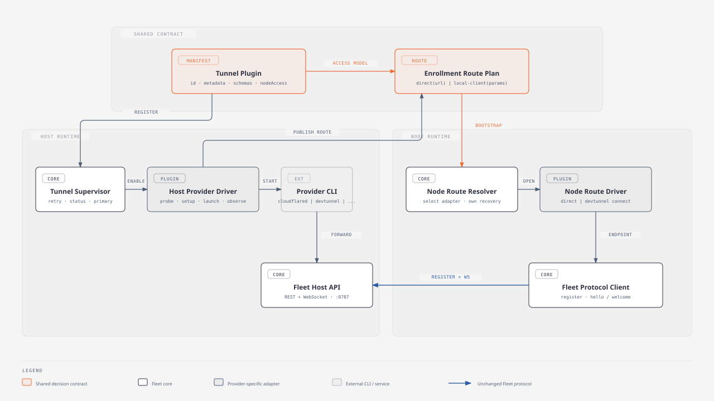

# Tunnel Plugin Decoupling Implementation Plan

**Date:** 2026-08-20
**Status:** Proposed

**Goal:** Separate tunnel-provider behavior from Fleet's Host and Node cores while
preserving the current tunnel lifecycle, enrollment UX, reconnect behavior, and
provider-specific safety rules.

**Architecture:** Use a compile-time plugin registry with one shared serializable
connection plan, separate Host and Node driver contracts, and generic core
supervisors. The Host core continues to own desired state, retries, primary
selection, persistence, and broadcasting. A Host driver owns provider setup and
runtime observation. A Node driver opens a route and returns the endpoint that
the unchanged Fleet registration and WebSocket code should dial.

**Tech stack:** TypeScript, Zod, Node child processes, Fastify, React, Vitest.

## Proposed flow



This is the target of the plan, not the current implementation. The current
coupling being replaced is described below.

## Why this change

The Host is already close to a plugin design:

- `apps/host/src/tunnel-providers.ts` holds provider commands and output parsers.
- `apps/host/src/tunnel.ts` owns common lifecycle and supervision.
- `TunnelSupervisor` already runs one manager per provider.

The remaining coupling is concentrated in four places:

1. `TunnelManager` knows the exact shape of a CLI-backed provider.
2. `nodeDialable` is a boolean that cannot describe how a Node reaches a
   login-walled provider.
3. `apps/node/src/main.ts` contains a Dev Tunnels branch throughout startup,
   reconnect, diagnostics, and shutdown.
4. The Connect card detects Dev Tunnels by URL suffix and builds provider-specific
   commands in the UI.

The refactor should remove those provider checks from core code without creating a
runtime extension system that the product does not yet need.

## Non-goals

- Loading third-party provider packages at runtime.
- Changing Fleet registration or the `hello` / `welcome` protocol.
- Replacing the existing `--url` or `--devtunnel` CLI in this refactor.
- Changing tunnel restart, primary-selection, external-process, or broadcast
  behavior.
- Adding another tunnel provider as part of the abstraction work.

## Decisions

### 1. Compile-time plugins first

Providers remain registered in source and shipped with Fleet. Do not load arbitrary
JavaScript packages or executable manifests at runtime.

Runtime third-party plugins would require:

- versioned Host and Node plugin APIs,
- installation and upgrade coordination across machines,
- capability negotiation,
- frontend metadata loading,
- trust and sandboxing for arbitrary process execution.

Those costs are not justified until an external provider must ship independently.

### 2. Host and Node use different interfaces

There is one plugin identity and metadata record, but Host and Node behavior is not
forced into one symmetric interface.

The Host exposes a service and supervises its lifecycle. The Node consumes a route
and may need a local helper process. Most providers need only the Host half.

### 3. Core owns `enable` and retry policy

`enable`, `disable`, desired state, restart backoff, primary selection, and
broadcast policy stay in `TunnelSupervisor` / `TunnelManager`.

A provider must not independently decide whether it should be running. It only
implements setup and returns a running session handle.

### 4. The Node driver opens a route; it does not handshake

The terms `hello` and `welcome` already describe Fleet authentication. A tunnel
driver must not own or wrap that handshake.

Its responsibility ends after it returns a dialable endpoint:

```ts
interface NodeRouteSession {
  readonly endpoint: string;
  onEndpointChanged(listener: (endpoint: string) => void): () => void;
  recover(): void;
  stop(): Promise<void>;
}
```

Fleet core then performs registration, opens `/ws/node`, sends `hello`, and waits
for `welcome` exactly as it does today.

### 5. Enrollment carries an explicit connection plan

Do not infer behavior from a hostname such as `*.devtunnels.ms`.

```ts
type NodeConnectionPlan =
  | {
      kind: "direct";
      url: string;
    }
  | {
      kind: "provider";
      provider: TunnelProvider;
      params: Record<string, unknown>;
    };
```

The provider's Node driver validates `params` with its own Zod schema. Dev Tunnels
uses `{ tunnelId: string }`. Cloudflare, Tailscale, ngrok, and bore produce a
`direct` plan and share the built-in direct route.

### 6. Preserve the existing CLI during migration

Keep `--url` and `--devtunnel` working. The first refactor is internal, not a
forced command-line migration for existing Nodes.

The enrollment API should return structured bootstrap data so the UI no longer
contains provider detection:

```ts
type NodeBootstrap = {
  connection: NodeConnectionPlan;
  prerequisites: Array<{ label: string; command: string }>;
  startArgs: string[];
};
```

For Dev Tunnels, `startArgs` can continue to contain
`--devtunnel=<qualified-id>`. A future generic CLI encoding can be introduced only
if a second Node-side provider proves it useful.

### 7. Preserve public URL and live-node broadcast as separate decisions

The URL shown for enrollment is not necessarily safe to broadcast to a running
Node.

- `activeTunnelUrl()` continues to answer what enrollment displays.
- Broadcast selection uses the connection plan: only a `direct` plan may be
  announced as a Host URL.
- A provider route such as Dev Tunnels is enrollment-capable but not directly
  broadcastable.

This replaces `nodeDialable: boolean` with an explicit behavior model.

### 8. Core owns the shared binary-probe cache

Provider manifests declare the binary and version arguments. The Host core keeps
the shared TTL and in-flight probe cache so polling `/api/tunnel` cannot regress to
one process spawn per provider on every request.

## Target contracts

### Shared manifest

```ts
type TunnelPluginManifest = {
  id: TunnelProvider;
  label: string;
  binary: string;
  versionArgs: string[];
  installHint: string;
  setupSteps: string[];
  docsUrl?: string;
  caveat?: string;
};
```

The manifest is serializable and safe to expose through `/api/tunnel`.

### Host provider

```ts
type HostTunnelContext = {
  target: LocalTarget;
  persistedId?: string;
  log(message: string): void;
};

type PreparedTunnel = {
  tunnelId?: string;
};

interface HostTunnelProvider {
  readonly manifest: TunnelPluginManifest;
  prepare(context: HostTunnelContext): Promise<PreparedTunnel>;
  start(
    context: HostTunnelContext,
    prepared: PreparedTunnel,
  ): Promise<HostTunnelSession>;
  enrollment(snapshot: HostTunnelSnapshot): NodeBootstrap;
}

interface HostTunnelSession {
  snapshot(): HostTunnelSnapshot;
  onUpdate(listener: (snapshot: HostTunnelSnapshot) => void): () => void;
  readonly closed: Promise<TunnelExit>;
  stop(): Promise<void>;
}
```

All current providers should use a shared `createCliTunnelSession` helper. Dev
Tunnels supplies setup hooks, identifier parsing, and inspector URL parsing rather
than reimplementing process supervision. The manager persists the prepared or
observed tunnel identifier; the provider does not write Host settings directly.

### Node route provider

```ts
interface NodeRouteProvider<TParams> {
  readonly id: TunnelProvider;
  readonly paramsSchema: z.ZodType<TParams>;
  open(params: TParams, context: NodeRouteContext): Promise<NodeRouteSession>;
}
```

The registry contains only providers that require Node-side work. A direct plan is
handled by a built-in no-process route.

## Task 1: Lock current behavior with characterization tests

**Files:**

- Modify: `apps/host/src/tunnel.test.ts`
- Modify: `apps/node/src/devtunnel.test.ts`
- Modify: `apps/node/src/host-endpoints.test.ts`
- Modify: `apps/host/ui/src/lib/enroll-command.test.ts`
- Modify: `packages/protocol/src/index.test.ts`

**Steps:**

1. Add a Host matrix test covering every current provider:
   - command and arguments,
   - URL extraction,
   - optional identifier and inspector URL,
   - whether enrollment is direct or provider-assisted.
2. Add tests proving the core lifecycle behavior that must not move into plugins:
   - idempotent enable/disable,
   - restart backoff,
   - primary fallback,
   - external-process ownership.
3. Preserve the Dev Tunnels Node tests for:
   - forwarded-port discovery,
   - reconnect backoff,
   - fatal login and visibility failures,
   - `recover()` behavior when the process is alive but the Host is unreachable,
   - endpoint-change notification.
4. Add a test proving a direct route requires no child process.
5. Add a UI test proving enrollment rendering can use structured bootstrap data
   without inspecting the URL suffix.
6. Run:

   ```bash
   npx vitest run apps/host/src/tunnel.test.ts \
     apps/node/src/devtunnel.test.ts \
     apps/node/src/host-endpoints.test.ts \
     apps/host/ui/src/lib/enroll-command.test.ts \
     packages/protocol/src/index.test.ts
   ```

## Task 2: Add the shared connection-plan protocol

**Files:**

- Modify: `packages/protocol/src/index.ts`
- Modify: `packages/protocol/src/index.test.ts`
- Modify: `apps/host/ui/src/hooks/useEnrollment.ts`

**Steps:**

1. Add `NodeConnectionPlanSchema` with `direct` and `provider` variants.
2. Add `NodeBootstrapSchema` containing the connection plan, prerequisite commands,
   and structured start arguments.
3. Add an `EnrollmentSchema` rather than maintaining a UI-local response type.
4. Keep `hostUrl` and `tunnelId` as deprecated response fields for compatibility;
   the new UI must use `bootstrap`.
5. Test:
   - valid direct plans,
   - valid Dev Tunnels provider plans,
   - rejection of missing provider parameters,
   - strict validation of URLs and provider parameters before they become
     command arguments.
6. Build the protocol before touching Host or Node consumers:

   ```bash
   npm run build -w @fleet/protocol
   ```

## Task 3: Create the Host plugin registry

**Files:**

- Add: `apps/host/src/tunnels/types.ts`
- Add: `apps/host/src/tunnels/cli-session.ts`
- Add: `apps/host/src/tunnels/registry.ts`
- Add: `apps/host/src/tunnels/providers/cloudflare.ts`
- Add: `apps/host/src/tunnels/providers/tailscale.ts`
- Add: `apps/host/src/tunnels/providers/ngrok.ts`
- Add: `apps/host/src/tunnels/providers/bore.ts`
- Add: `apps/host/src/tunnels/providers/devtunnel.ts`
- Modify: `apps/host/src/tunnel-providers.ts`
- Modify: `apps/host/src/tunnel.test.ts`

**Steps:**

1. Define the manifest, provider, session, snapshot, and exit contracts.
2. Keep one shared `BinaryProbe` in the supervisor and probe each provider from
   its manifest's `binary` and `versionArgs`.
3. Move generic process spawning, bounded output buffering, URL observation, and
   graceful shutdown into `createCliTunnelSession`.
4. Move each current provider's command, setup, parser, metadata, and enrollment
   builder into its provider module.
5. Keep `tunnel-providers.ts` as a temporary compatibility re-export so the
   manager and tests can migrate without a big-bang rename.
6. Add registry conformance tests:
   - every `TunnelProvider` has exactly one Host provider,
   - manifest IDs match registry keys,
   - every provider returns a valid bootstrap plan,
   - only registered Node-assisted providers emit `kind: "provider"`.

## Task 4: Make the Host manager depend only on the provider contract

**Files:**

- Modify: `apps/host/src/tunnel.ts`
- Modify: `apps/host/src/tunnel-process.ts`
- Modify: `apps/host/src/external-tunnel.ts`
- Modify: `apps/host/src/server.ts`
- Modify: `apps/host/src/routes/system.ts`
- Modify: `apps/host/src/tunnel.test.ts`
- Modify: `apps/host/src/external-tunnel.test.ts`

**Steps:**

1. Inject a `HostTunnelProvider` into each `TunnelManager`; remove provider
   switching from a manager after construction.
2. Keep these responsibilities in `TunnelManager`:
   - desired enabled state,
   - status and error transitions,
   - restart timers,
   - external-session ownership,
   - persistent provider identifier storage.
3. Replace direct `spawn`, output parser, and `ProviderSpec` access with
   `provider.prepare()` and `provider.start()`.
4. Make `TunnelSupervisor` construct managers from the registry.
5. Make `tunnel-process.ts` use the same registry and CLI session helper rather
   than duplicating launch and parsing behavior.
6. Drive manager updates and restart scheduling from the session's update and
   `closed` signals.
7. Persist identifiers returned by preparation or later reported by the running
   session, preserving the cluster-qualified Dev Tunnels behavior.
8. Extend external tunnel state only if the structured enrollment plan needs data
   beyond `provider`, `url`, and `tunnelId`.
9. Preserve the current API response shape until Task 5 migrates the UI.

## Task 5: Make enrollment provider-neutral

**Files:**

- Modify: `apps/host/src/tunnel.ts`
- Modify: `apps/host/src/routes/system.ts`
- Modify: `apps/host/ui/src/hooks/useEnrollment.ts`
- Modify: `apps/host/ui/src/lib/enroll-command.ts`
- Modify: `apps/host/ui/src/lib/enroll-command.test.ts`
- Modify: `apps/host/ui/src/components/ConnectNodeCard.tsx`
- Modify: `apps/host/src/routes.test.ts`

**Steps:**

1. Add `activeBootstrap()` beside `activeTunnelUrl()`.
2. Return `EnrollmentSchema` from `/api/enrollment`.
3. Generate prerequisites and Node arguments on the Host from the active provider.
4. Change `enrollCommand` to accept `startArgs: string[]`; it should only quote
   arguments and append the enrollment token.
5. Render prerequisite command blocks generically in `ConnectNodeCard`.
6. Remove `isDevTunnelUrl`, `devTunnelLoginCommand`, and all URL-suffix branching
   from the UI.
7. Keep local-only URL warnings based on a direct connection plan, not on provider
   hostname detection.
8. Test direct and Dev Tunnels enrollment responses end to end.

## Task 6: Create the Node route registry

**Files:**

- Add: `apps/node/src/tunnels/types.ts`
- Add: `apps/node/src/tunnels/direct.ts`
- Add: `apps/node/src/tunnels/registry.ts`
- Move: `apps/node/src/devtunnel.ts` to
  `apps/node/src/tunnels/devtunnel.ts`
- Move: `apps/node/src/devtunnel.test.ts` to
  `apps/node/src/tunnels/devtunnel.test.ts`
- Add: `apps/node/src/tunnels/registry.test.ts`

**Steps:**

1. Define `NodeRouteProvider`, `NodeRouteSession`, and `NodeRouteContext`.
2. Implement the direct route as a session whose endpoint is the supplied URL and
   whose recovery and stop operations are no-ops.
3. Adapt `connectDevTunnel` to the common session interface:
   - `url` becomes `endpoint`,
   - `recycle` becomes `recover`,
   - `rebuildNow` remains an optional operator action exposed as diagnostics
     metadata rather than a core method.
4. Register Dev Tunnels with a Zod parameter schema requiring a qualified
   `tunnelId`.
5. Reject an unknown provider or invalid params with an actionable startup error.
6. Preserve the existing supervision tests while renaming only the public
   abstraction.

## Task 7: Remove Dev Tunnels branches from Node core

**Files:**

- Modify: `apps/node/src/main.ts`
- Modify: `apps/node/src/cli.ts`
- Modify: `apps/node/src/cli.test.ts`
- Modify: `apps/node/src/host-endpoints.ts`
- Modify: `apps/node/src/host-endpoints.test.ts`
- Modify: `apps/node/src/config-server.ts`
- Modify: `apps/node/src/config-server.test.ts`
- Modify: `apps/node/src/settings.ts`

**Steps:**

1. Resolve a `NodeConnectionPlan` from command-line/environment inputs before
   loading effective settings.
2. Ask the route registry to open it and seed settings from
   `routeSession.endpoint`.
3. Replace `TunnelMode = "devtunnel" | "direct"` with route-session policy:
   - a direct session can rotate among direct known URLs,
   - a provider session owns its endpoint and does not dial unrelated fallbacks.
4. Replace direct calls to `devTunnel.recycle()` with `routeSession.recover()`.
5. Replace Dev Tunnels-specific config status with generic route status:
   `{ provider, endpoint, state, actions }`.
6. Keep `--devtunnel` and `FLEET_DEVTUNNEL_ID` as a compatibility input that the
   Dev Tunnels plugin translates into a provider connection plan.
7. Ensure `main.ts` imports no provider implementation and contains no
   `devtunnel` hostname or command checks.

## Task 8: Replace the broadcast boolean with route semantics

**Files:**

- Modify: `apps/host/src/tunnel.ts`
- Modify: `apps/host/src/host-url.ts`
- Modify: `apps/host/src/host-url.test.ts`
- Modify: `apps/node/src/host-endpoints.ts`
- Modify: `apps/node/src/host-endpoints.test.ts`
- Modify: `packages/protocol/src/index.ts`

**Steps:**

1. Remove `nodeDialable` from provider metadata.
2. Make `broadcastTunnelUrl()` consider only active `direct` connection plans.
3. Keep the defense-in-depth hostname check for manually configured
   `FLEET_PUBLIC_URL`; a typed Dev Tunnels URL must still never be broadcast.
4. Test:
   - Dev Tunnels is advertised for enrollment but not broadcast,
   - direct providers remain broadcastable,
   - a manually entered login-walled URL remains blocked,
   - route changes never cause a provider-backed Node to adopt a public login URL.

## Task 9: Remove compatibility shims and document the extension point

**Files:**

- Delete: `apps/host/src/tunnel-providers.ts` after all imports move
- Modify: `ARCHITECTURE.md`
- Modify: `README.md`
- Modify: `README.zh-CN.md`
- Modify: `docs/superpowers/specs/2026-08-17-devtunnel-provider-design.md`

**Steps:**

1. Remove the temporary `tunnel-providers.ts` re-export after all internal imports
   move. Keep the documented legacy enrollment fields until a separately versioned
   API cleanup.
2. Document the ownership boundary:
   - core owns lifecycle and Fleet authentication,
   - Host plugins expose tunnels,
   - Node plugins open routes,
   - direct providers share the built-in direct route.
3. Add a concise "adding a provider" checklist:
   - register manifest and Host driver,
   - select direct or provider-assisted enrollment,
   - add a Node driver only when required,
   - add parser and conformance tests,
   - document authentication and URL stability.
4. Mark the Dev Tunnels design as historical implementation evidence and point
   future provider work to this plan's final architecture.

## Validation

Run the smallest relevant groups while implementing, then the complete repository
gate:

```bash
npm run lint
npm run format:check
npm run typecheck
npm test
npm run build
```

Manual checks:

1. Enable every installed Host provider and verify status/URL parsing.
2. Run two providers concurrently and change the enrollment primary.
3. Enroll a direct Node from the generated command.
4. Enroll a Dev Tunnels Node from the generated prerequisite and start commands.
5. Restart the Dev Tunnels Host and confirm the Node route recovers and follows a
   changed forwarded port.
6. Confirm a private Dev Tunnels URL is never sent in a `host_url` message.
7. Run an external tunnel process and confirm the Host observes it but cannot stop
   it.

## Acceptance criteria

- Adding a direct CLI-backed Host provider requires one provider ID entry, one
  provider module, and tests; no change to `TunnelManager`, `TunnelSupervisor`,
  Node `main.ts`, or the Connect card.
- Adding a provider-assisted route requires one Host provider and one Node route
  provider, joined by a validated connection plan.
- `apps/node/src/main.ts` has no Dev Tunnels-specific branches.
- The UI does not inspect provider URL suffixes.
- Fleet `hello` / `welcome`, registration, event buffering, and session behavior
  are unchanged.
- All existing tunnel and reconnect regression tests remain green.
- No arbitrary runtime plugin loading is introduced.
