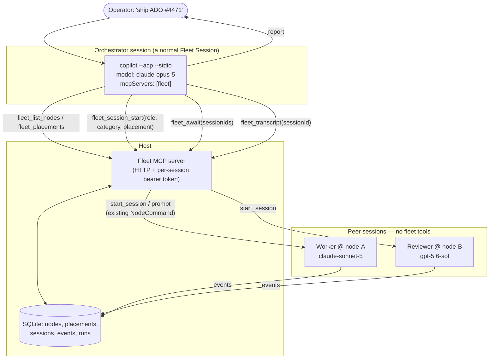

# Fleet orchestrator: an agent that runs the fleet

**Date:** 2026-08-18
**Status:** Draft — exploration
**Scope:** A session whose job is deciding what other sessions should exist. It picks the Node, picks the model, decides whether a result needs review, and decides when the work is done — by reasoning, not by a fixed pipeline.

**Companion:** `2026-08-18-orchestrator-harness-choice.md` covers which harness
should hold the orchestrator role — Copilot, Pi via `pi-acp`, or another. This
document assumes Copilot because Fleet already runs it; the tool surface below is
harness-agnostic and is what makes that choice swappable.

**Supersedes the relay half of** `2026-08-17-session-relay-design.md`. That document
established that ACP has no peer channel and the Host must carry information
between sessions. It then proposed a static `SessionLink` — worker fires,
reviewer runs, every time. That is the thing this design rejects. The transport
analysis in it still holds and is not repeated here.

## The requirement

> I don't want the flow fixed like PR → Review. I want the orchestration to
> smartly decide what to do. When I give it work or an ADO item, it should know
> which Nodes are actively working on which project and occupied, and assign a
> different VM. Once ACP returns done, it should know whether to open a review
> session — maybe with a different model for a complex PR — or, on a simple PR,
> just agree.

Every verb in that paragraph is a judgement call: *smartly decide*, *know which
Nodes*, *whether to review*, *maybe a different model*, *just agree*. None of
them is a lookup. A `SessionLink` row cannot hold "maybe", and a scheduler
function cannot hold "this PR is simple enough to wave through".

So the orchestrator cannot be a rules engine with good defaults. **It has to be a
model.** The Host's job is not to make these decisions; it is to give a model the
tools to make them and the guardrails to make them safely.

## The one-line answer

**Make the orchestrator a Fleet Session, and give it the fleet as MCP tools.**

It is a normal session — one `copilot --acp --stdio` process on a Node, with a
transcript, a state machine, cancel/stop, and auto-resume. The only thing that
distinguishes it is that its `session/new` carries an MCP server pointing back at
the Host, so its tool calls are `fleet_list_nodes` and `fleet_session_start`
instead of `bash` and `edit`.

That is the whole idea. Everything below is consequences and guardrails.

## Why this is viable: three things verified, not assumed

Against `copilot --acp --stdio` version **1.0.81-0**:

**1. Copilot's ACP accepts HTTP MCP servers.** `initialize` answers:

```json
{
  "protocolVersion": 1,
  "agentCapabilities": {
    "loadSession": true,
    "mcpCapabilities": { "http": true, "sse": true },
    "promptCapabilities": { "image": true, "embeddedContext": true },
    "sessionCapabilities": { "close": {}, "list": {} }
  },
  "agentInfo": { "name": "Copilot", "version": "1.0.81-0" }
}
```

`mcpCapabilities.http: true` is the load-bearing fact. `session/new` takes an
`mcpServers` array, and `McpServerHttp` carries `url` **and** `headers` — so the
Host can hand one session a bearer token scoped to itself. Fleet currently sends
`mcpServers: []` (`apps/node/src/agents.ts`), so this is unused capacity, not a
missing feature.

There are, however, two cheaper doors to the same room, and both matter for the
build order below. Copilot CLI reads MCP servers from
`~/.copilot/mcp-config.json` — `type: "http"` entries with `headers` and a
per-server `tools` allowlist are already in use on a developer machine today —
and it accepts `--additional-mcp-config <json>` (a JSON string, or `@file`,
repeatable) which augments that config for one invocation. Attaching fleet tools
therefore needs no ACP change at all: a config file for the first orchestrator, a
launch argument when the Host should decide per session.

**2. A session's model can be changed at runtime, per session.** A fresh
`session/new` reports these pickers:

| `configId` | `category` | Values |
|---|---|---|
| `model` | `model` | `auto`, `claude-sonnet-5`, `claude-opus-5`, `claude-opus-4.8`, `gpt-5.6-sol`, `gpt-5.6-terra`, `gpt-5.6-luna`, `gpt-5.5`, `gpt-5.3-codex`, `gemini-3.1-pro-preview`, `gemini-3.7-flash`, `grok-4.6`, `grok-4.5`, `mai-code-1.1-flash`, … (24 total) |
| `reasoning_effort` | `thought_level` | `low`, `medium`, `high`, `xhigh`, `max` |
| `mode` | `mode` | `agent`, `plan`, `autopilot` |
| `agent` | `_agent` | custom agents registered on that machine |
| `allow_all` | `permissions` | `on`, `off` |

"A different model for a complex PR" is therefore `set_config_option`, which
Fleet already implements end to end — `NodeCommandSchema`'s `set_config_option`,
`SessionAgent.setConfigOption`, and the `SESSION_CONFIG_CAPABILITY` gate. Four
distinct model families are reachable, which is what makes an *independent*
review independent rather than the same model marking its own homework.

**3. The Host already knows everything the orchestrator needs to reason about.**
`listNodes()` gives online state, `maxSessions`, `activeSessions`;
`reservedSessionCount()` gives true occupancy including queued and offline rows;
`listPlacements()` maps workspace → node → path; `listEvents()` gives any
session's transcript.

Nothing here needs a new ACP feature, a Copilot change, or a fork.

## Architecture



The orchestrator never touches a Node socket. It calls the Host, and the Host
issues the same `start_session` / `prompt` / `set_config_option` commands a
browser click issues today. Rule 1 of ARCHITECTURE.md — the Host owns desired
state — is preserved exactly: the orchestrator *proposes*, the Host *disposes*.

## The tool surface

This is the actual design work. The tools decide what the orchestrator is
capable of thinking about.

```ts
// Reading the world
fleet_list_nodes()      // → [{ nodeId, name, os, online, maxSessions,
                        //      reserved, free, capabilities, staleness }]
fleet_list_placements() // → [{ placementId, workspace, nodeId, localPath }]
fleet_list_sessions()   // → [{ sessionId, role, workspace, nodeId, state,
                        //      model, currentActivity, ageSeconds, runId }]
fleet_transcript({ sessionId, since?, types?, maxBytes? })
                        // → ordered events, truncated from the newest end

// Acting
fleet_session_start({ placementId, prompt, category, role, name, yolo? })
fleet_session_prompt({ sessionId, prompt })
fleet_session_config({ sessionId, configId, value })
fleet_session_cancel({ sessionId })
fleet_session_stop({ sessionId })

// Waiting — the one that makes orchestration possible at all
fleet_await({ sessionIds, until: "idle" | "terminal", timeoutSeconds })
                        // → [{ sessionId, state, stopReason, lastText }]

// Durable shared context (omo's notepads)
fleet_note_write({ runId, topic, body })
fleet_note_read({ runId, topic? })
```

Three of these deserve argument.

### `fleet_await` is the hard one

Without it the orchestrator has to busy-poll `fleet_list_sessions`, burning a
tool call and tokens every few seconds across a task that may run for twenty
minutes. With a naive implementation — hold the HTTP response open until the
worker finishes — it hits every timeout between the model and the Host.

Make it **bounded and resumable**: `timeoutSeconds` capped at ~60, returning the
current state whether or not anything settled. The orchestrator loops, and each
lap is one cheap tool call with no output when nothing changed. A model handles
"still running, call me again" perfectly well; what it handles badly is a socket
that dies silently at 30 seconds.

The Host implements the wait off the event stream it already has — `handleEvent`
is the single funnel for every session event (verified: sole call site
`gateway/node-socket.ts:173`) — so a waiter is a promise resolved by a
`state → idle` or terminal transition, not a database poll.

### `category`, not `model`

`fleet_session_start` takes `category: "implement" | "review-deep" |
"review-quick" | "explore" | "test"`, and the **Host** maps category → model +
reasoning effort + mode. Three reasons, the first of which is omo's and is the
good one:

1. **Naming a model biases the model.** omo's orchestration guide is explicit
   that `task({agent: "gpt-5.6-sol"})` leaks the implementation into the
   decision, and that a category "describes INTENT, not implementation". Asking
   your orchestrator to pick from 24 model ids invites it to reason about vendor
   trivia instead of about the work.
2. **The list moves.** Those 24 ids will not be those 24 ids in three months. A
   category table is one config edit; a system prompt full of model names is a
   slow leak.
3. **It is where cross-family review gets enforced.** `review-deep` can be
   *defined* as "a family other than the implementer's", which is a property you
   want guaranteed by the Host rather than hoped for from the prompt.

Keep `fleet_session_config` for the deliberate override, so the orchestrator can
still say "escalate this reviewer to `max` effort" when it has a reason.

### `role` is a guard, not a label

`role: "orchestrator" | "worker" | "reviewer"` is stored on the session, and the
Host uses it for exactly one critical thing: **only `role: "orchestrator"` gets
the fleet MCP server attached.** A worker cannot spawn workers. This is omo's
"no nested teams — members cannot call `team_create`", and it is the difference
between a fleet and a fork bomb.

## What the orchestrator actually does

Nothing below is coded. It is what the model does, given the tools and a system
prompt. The point of the design is that this list can change without a deploy.

```
Operator: "Ship ADO #4471."

1. Reads the work item — via its own shell (`az boards work-item show`),
   not a Host tool. The Host has no business knowing about ADO.
2. fleet_list_placements + fleet_list_nodes + fleet_list_sessions
   → "node-A has 3/4 used and two of them are on this same workspace;
      node-B is idle at 0/4. Put it on node-B."
3. fleet_session_start(placement=B/payments, category="implement",
                       role="worker", prompt=<brief built from the work item>)
4. fleet_await([worker], until="idle", 60) ... loop
5. fleet_transcript(worker) → reads what changed.
6. DECIDES:
      - touched one string constant, tests green    → approve, report, done
      - touched auth middleware, 40 files, no tests → spawn reviewer,
        category="review-deep" (Host picks a different family),
        prompt = the diff + what to look for
      - worker got stuck / asked a question         → answer it via
        fleet_session_prompt, or cancel and restart with a better brief
      - worker is wandering                         → fleet_session_cancel
7. If reviewed: fleet_await(reviewer) → read verdict → decide whether to
   send it back to the worker, accept it, or escalate to the operator.
8. fleet_note_write(runId, "learnings", ...) so the next task benefits.
9. Reports to the operator.
```

Step 6 is the entire feature. It is a paragraph of system prompt, not a state
machine, and that is deliberate: the branch list is *not* known in advance, which
is precisely why the previous design's fixed edge was wrong.

## Guardrails

An LLM with `fleet_session_start` and a credit card is a novel category of
incident. These are not v2.

| Risk | Guard |
|---|---|
| Fork bomb | Only `role: "orchestrator"` receives fleet tools. No nesting. |
| Runaway spend | Per-run budget: max sessions spawned, max wall clock, max total turns. Tools return a structured refusal when exhausted, so the model reports honestly instead of retrying blind. |
| Capacity race | `fleet_session_start` re-checks `reservedSessionCount` inside the same transaction that creates the session, and on refusal returns the *current* capacity table so the model can immediately pick elsewhere. |
| Ping-pong review | Hop counter per run; after N worker↔reviewer rounds the orchestrator must escalate to the operator rather than iterate. |
| Silent divergence | Every spawn, prompt and stop is a `system` event on the orchestrator's transcript **and** on the target's. The operator reads the reasoning, not just the outcome. |
| Orchestrator dies | It is a normal session with an `agentSessionId`, so existing auto-resume re-attaches it. The run row on the Host is the durable state; the transcript is the memory. |
| Blast radius | The orchestrator's own working directory should be a scratch path, not a repo. It reasons and delegates; it should not be able to edit code directly. omo enforces exactly this on Atlas ("what Atlas MUST delegate: writing or editing code files"). |

### On YOLO

The orchestrator will make dozens of tool calls per run. With `allow_all: off`
every one raises a browser permission prompt, which defeats the purpose. With
`allow_all: on` it can spawn sessions unattended.

Resolve it by **scope, not by trust**: the fleet MCP tools are what the
orchestrator needs unattended, and its shell is what it does not. Run it with
`allow_all: on` in a scratch cwd, where the dangerous verbs are the fleet ones —
and those are already bounded by the run budget and the capacity checks above.
If that is too loose to start with, run the first version with permissions on and
approve spawns by hand; it is slower but it is a very good way to read the
model's judgement before trusting it.

## Two shapes, and which to build

**Hub-and-spoke (recommended).** One orchestrator; peers never talk to each
other; every result flows back through the hub. This is omo's Atlas, and it fits
Fleet's existing ownership rules without amendment. It is also debuggable: one
transcript explains the whole run.

**Peer-to-peer mailbox.** Sessions message each other directly; the Host carries
the mail. This is omo's Team Mode — `team_send_message`, per-member inboxes as
atomic files, fire-and-forget with no synchronous reply. Note what omo bounds it
with: 8 members, 4 in flight, 32 KB per message, 256 KB unread per recipient,
10 000 messages per run, 120 minutes wall clock, 500 turns per member. Those
numbers are what peer-to-peer costs in guardrails.

Build hub-and-spoke. It delivers the entire requirement above. Add a mailbox only
when you have a concrete case where two peers must coordinate *without* the
orchestrator in the middle — and note that Fleet's session events are already
most of a mailbox if you get there.

## MCP or the REST API? Neither — and both

A natural reading of the above is that the fleet MCP server is an *alternative*
to the Host's existing REST API. It is not. They are different doors onto the
same room:

```text
      Browser  ──REST/WS──┐
                          ├──▶  FleetService  ──▶  store / node sockets
  Orchestrator ──MCP─────┘        (the actual behaviour)
```

`FleetService` already exists and already contains the choreography —
`dispatch()`, `handleEvent()`, capacity checks. The MCP server is a **facade**
over it: a second presentation of the same operations, shaped for a model
instead of for a UI. Building it does not replace `/api/sessions`; both call the
same method.

So the real question is not "MCP *or* API" but **how the orchestrator reaches the
Host**, and there the fork is genuine:

| | MCP tools | Shell + `curl` at the REST API |
|---|---|---|
| Host code needed | The MCP facade | **None — it works today** |
| Discovery | Tool schemas, in-context automatically | You must document the API in the prompt |
| Errors | Structured, typed, actionable | Raw HTTP bodies the model has to parse |
| Permissions | One MCP server to allow | Broad shell access |
| **Guardrails** | **Live here** | **Nowhere to live** |

The last row settles it. Every guard in the table below — run budget, role
gating, hop limits, capacity re-check inside the create transaction — is
orchestrator-specific. The REST API has no concept of a *run*, and it must not
grow one: it serves a browser where a human is the budget.

There is also a security asymmetry worth naming. The Node transport is
authenticated (enrollment token exchanged for a per-Node secret), but **the
browser-facing REST API has no authentication at all** — a deliberate MVP
position, stated in ARCHITECTURE.md's security boundary and unchanged in
`routes/`. Pointing an
autonomous agent at that API means handing it, and anything else that can reach
the port, the whole fleet with no budget and no role. The MCP facade is the
natural place to put the token, the role, and the ceiling that the API
deliberately does not have.

Use `curl` for a throwaway spike if you want to feel the loop. Do not let it
become the interface.

## Bootstrapping orchestrator #1

Verified against the installed Copilot CLI (1.0.81) and this machine's config.
The first orchestrator needs **no changes to Fleet at all** beyond the MCP server
itself — three mechanisms already exist:

**1. Custom agents are already selectable per session.** `session/new` reports an
`agent` picker (`category: "_agent"`), and on this machine it already offers
`feature-dev:feature-dev` and `feature-dev:fd-phase-runner`. Fleet already
drives that picker through `set_config_option`. An agent is a Markdown file with
frontmatter:

```yaml
---
name: fleet-orchestrator
description: Decides what sessions should exist, on which node, with which model.
tools:            # an allowlist — this is the role gate, declared
  - fleet_list_nodes
  - fleet_session_start
  - fleet_await
  - bash
---
# system prompt: how to think about capacity, review, and escalation
```

The `tools:` list is the important part. The design's rule — *only the
orchestrator gets fleet tools* — stops being a Host-side convention and becomes a
property of the agent definition, with `--available-tools` as a second enforcement
point at launch.

**2. MCP servers can be attached without touching ACP.** Copilot CLI reads
`~/.copilot/mcp-config.json`, which supports `type: "http"` entries with
`headers` and a `tools` allowlist. Dropping a `fleet` entry there on the
orchestrator's Node is enough to give that machine the tools.

The CLI also accepts `--additional-mcp-config <json>` — a JSON string or `@file`,
repeatable, augmenting the user config. That is the per-session route, and it is
a *smaller* change than threading ACP `mcpServers`: it is one more argument in
`copilotLaunchArgs`, which already takes per-session inputs (`yolo`,
`contextTier`) and already has the pattern for probing whether the installed
Copilot supports a flag before passing it.

**3. Model and effort are already per-session.** The `model` and
`reasoning_effort` pickers, via the existing `set_config_option` path.

The consequence: **start by writing the MCP server and an agent Markdown file.**
Everything else is configuration of machinery that already ships.

## Build order

0. **Spike (optional, hours).** Point a Copilot session at the REST API with
   `curl` and hand-hold one real task. You are not building anything — you are
   finding out whether the model's *judgement* about capacity and review is worth
   automating, before you build tools for it.
1. **Fleet MCP server on the Host**, HTTP, bearer token, read-only tools first
   (`list_nodes`, `list_placements`, `list_sessions`, `transcript`). A facade over
   `FleetService`, not a reimplementation.
2. **Attach it by config**, via `~/.copilot/mcp-config.json` on one Node, and
   write `fleet-orchestrator.agent.md` with a `tools:` allowlist. Select the agent
   on a session with the existing config picker.
   *Milestone: a session that can describe the fleet it lives in — no Fleet code
   changed.*
3. **Write tools + run budget**: `session_start`, `session_prompt`,
   `session_config`, `cancel`, `stop`, all role-gated and budget-checked.
4. **`fleet_await`** off `handleEvent`, bounded and resumable.
5. **Category table** mapping intent → model + effort + mode, with `review-deep`
   defined as cross-family.
6. **Notes** (`fleet_note_write` / `_read`) for cross-session learnings.
7. **Per-session MCP config**: add `--additional-mcp-config` to
   `copilotLaunchArgs`, probed the way `--context` is, so the Host — not a file on
   a Node — decides which session gets fleet tools and with which token. This is
   what makes the role gate airtight and the fleet multi-orchestrator.
8. **UI**: mark the orchestrator session, draw the run tree beneath it, show the
   budget burning down, and put a stop-the-run button on it.

Steps 1–4 are the system. Step 5 is where its judgement lives, and — like the
review prompt in the previous design — it is worth tuning by hand before it is
fixed in code. Step 7 is what turns a hand-configured machine into a fleet
capability; it can wait until the first orchestrator has earned it.

Note that ACP `mcpServers` threading, which an earlier draft of this document put
at step 2, is not on the critical path at all. `--additional-mcp-config` reaches
the same outcome through the argument list Fleet already controls.

## Non-goals

- A scheduler. Placement is chosen by the orchestrator reading live capacity, not
  by a bin-packing function. The Host only refuses what is impossible.
- ADO integration in the Host. The orchestrator has a shell and `az`; the control
  plane should not grow a work-tracker dependency.
- Nested orchestration.
- Automatic git worktree creation — still an MVP non-goal, and still the honest
  answer to two agents sharing one checkout (see the filesystem hazard in the
  relay design; it applies unchanged here).
- Replacing the operator. Escalation is a first-class outcome, and an
  orchestrator that cannot say "I need a human" is a worse one.
