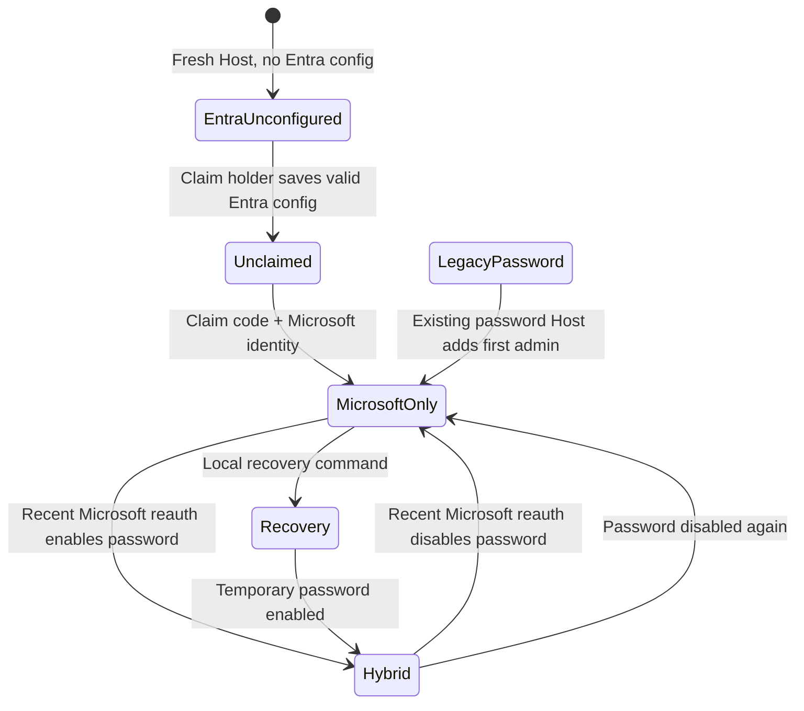
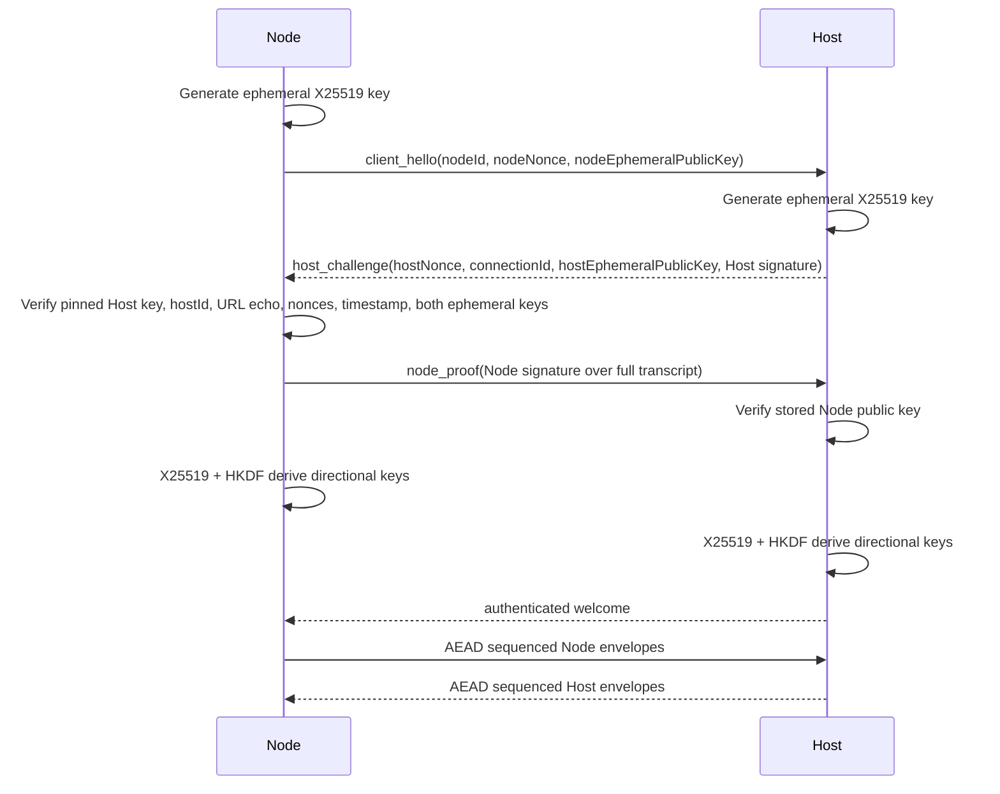

# Microsoft identity ownership and authenticated Fleet control plane

**Area**: Copilot Fleet / Security
**Engineer**: Charles Yin
**EM owner**: TBD
**Architect**: TBD
**Program Manager**: N/A
**Status**: Implemented; simplified for local Microsoft-corporate use
**Original date**: 2026-08-27
**Revision date**: 2026-08-28

## Revision summary

The first review accepted the identity model but found three invalid premises:

1. Device code flow cannot be the only login path because tenant Conditional
   Access policy may block it.
2. A single-tenant client ID cannot be baked into a generally published npm
   package.
3. A Host behind local tunnel relays cannot infer that a request originated on
   loopback or trust its apparent source IP.

This revision changes the preferred design accordingly:

- Authorization code with PKCE and a loopback redirect is the primary flow.
- Device code is an optional remote fallback, enabled only after Phase 0 proves
  the target tenant permits it.
- The default local distribution preconfigures the Microsoft corporate tenant
  and KYC's Visual Studio public client; environment overrides remain available
  for another approved registration.
- Fresh Hosts have an explicit `entra-unconfigured` state.
- First claim requires a high-entropy, one-time claim code printed only to the
  Host console plus Microsoft authentication. Request IP, forwarded headers,
  and apparent loopback origin are not security inputs.
- `/mcp` is modeled as a separate machine-principal control plane.
- New Node enrollment uses one-time grants and asymmetric Node keys. Node
  credentials are not sent to an unauthenticated Host.
- Backup/restore preserves the security boundary and Host identity.

### Product simplification (2026-08-31)

The implemented local-VM-manager experience preconfigures the Microsoft
corporate tenant and the same Visual Studio public client used by KYC. Normal
users do not enter tenant or client IDs: after the password/console bootstrap,
they click **Sign in with Microsoft**, choose an account, and Fleet records that
identity. `FLEET_ENTRA_TENANT_ID` and `FLEET_ENTRA_CLIENT_ID` remain advanced
overrides only.

The built-in client requires the hostless `http://localhost:<port>/` callback.
This intentionally narrows the default distribution to Microsoft corporate
local use; a generally distributed multi-tenant product would need a separately
owned registration.

## Related documents

| Document | Link |
| --- | --- |
| Current Fleet architecture | [`ARCHITECTURE.md`](../../../ARCHITECTURE.md) |
| Existing operator authentication | [`apps/host/src/auth.ts`](../../../apps/host/src/auth.ts) |
| Central request guard | [`apps/host/src/request-guard.ts`](../../../apps/host/src/request-guard.ts) |
| Current Node handshake | [`apps/host/src/gateway/node-socket.ts`](../../../apps/host/src/gateway/node-socket.ts) |
| Current orchestration bearer endpoint | [`apps/host/src/orchestrator/mcp-routes.ts`](../../../apps/host/src/orchestrator/mcp-routes.ts) |
| npm distribution proposal | [`2026-08-21-npx-distribution-design.md`](2026-08-21-npx-distribution-design.md) |
| KYC local-development authentication reference | [FabricRM-KYC `/src/auth`](https://dev.azure.com/powerbi/Power%20BI/_git/FabricRM-KYC?path=/src/auth) and `/server/auth.cjs` |
| Register an application in Microsoft Entra ID | [Microsoft Learn](https://learn.microsoft.com/entra/identity-platform/quickstart-register-app) |
| Authorization code flow | [Microsoft Learn](https://learn.microsoft.com/entra/identity-platform/v2-oauth2-auth-code-flow) |
| Redirect URI localhost exceptions | [Microsoft Learn](https://learn.microsoft.com/entra/identity-platform/reply-url#localhost-exceptions) |
| Block authentication flows with Conditional Access | [Microsoft Learn](https://learn.microsoft.com/entra/identity/conditional-access/policy-block-authentication-flows) |
| Dev Tunnels security | [Microsoft Learn](https://learn.microsoft.com/azure/developer/dev-tunnels/security) |

## Feature desired outcome

A fresh Copilot Fleet Host has no reusable shared operator password. Its local
console prints a one-time claim code. The person who proves possession of that
code and successfully authenticates with Microsoft becomes the first
administrator. From then on, only explicitly stored Microsoft identities can
use the administrative UI, REST API, or browser WebSocket. Every authorized
identity is an administrator in MVP.

The one-time claim code is an unavoidable bootstrap proof, not an ongoing login
credential. Microsoft authentication proves who the person is; the console code
proves that person is allowed to claim this particular Host.

Tunnel reachability, human authorization, orchestration authorization, Node
identity, and Host identity remain separate:

- A tunnel determines whether traffic can reach the Host.
- Entra plus Fleet's administrator table determines which people can operate it.
- A live lead-session bearer token determines which orchestrator process can
  call `/mcp`.
- A Node key determines which machine is connected.
- A Host signing key determines whether commands came from the real Host.

## MVP goals

| MVP goal | Revised design decision | Acceptance evidence |
| --- | --- | --- |
| 1. A user can log in without an operator password on first launch but must authenticate with a Microsoft account. | Fresh Hosts print a one-time claim code. After optional Entra configuration, claim requires that code and Microsoft authorization-code + PKCE login. Device flow is only a verified fallback. | A clean Host is never operable with only the claim code or only a Microsoft identity; both are required. No reusable password is generated by default. |
| 2. The first Microsoft account receives full UI and API permission; no other account does. | The first valid claim atomically inserts one `(tenantId, objectId)` administrator. A valid Microsoft identity absent from the table receives `403` and no Fleet session. | Two-account test: A claims and succeeds; B authenticates and is denied. |
| 3. Settings can grant more Microsoft accounts; all are administrators. | An administrator creates a short-lived, one-time invitation. Acceptance records the authenticated identity as pending; an existing administrator explicitly approves that exact `(tid, oid)` before it becomes active. | B authenticates, A approves B, and B gains the same permissions. Leaked, expired, reused, or unapproved invitations grant no access. |
| 4. Host tunnel choice and URL may vary. Dev Tunnel is default; a public tunnel is acceptable after Fleet authentication is enabled. | Login does not depend on a public callback URL. Local or locally forwarded access uses loopback PKCE. Direct remote access may use device flow if allowed. Public external access requires an HTTPS-capable configured provider. | Switching between supported HTTPS providers does not alter the admin list. Unknown users remain denied through a public URL. |
| 5. Nodes accept requests only from the real Host with a credential. | Host and Nodes use pinned Ed25519 identities. Enrollment is authorized by a one-time grant bound to the Node public key. Each connection authenticates ephemeral X25519 keys and derives an AEAD channel. | An impostor or relay cannot enroll a different key, steal a reusable Node secret, read or forge commands, inject events, or replay frames. |

## Release evaluation

| Scenario | Expected result |
| --- | --- |
| Fresh Host without Entra configuration | Only configuration/claim UI is available; no Fleet data or control API |
| Fresh Host with Entra configuration | Console claim code plus Microsoft identity can claim exactly one first admin |
| Correct claim code without Microsoft login | No administrator created |
| Microsoft login without claim code on an unclaimed Host | No administrator created |
| Claimed Host, stored administrator signs in | Full UI, API, and browser WebSocket access |
| Claimed Host, valid Microsoft identity not in admin table | `403`; no Fleet session |
| Admin invitation accepted but not approved | Candidate has no Fleet access |
| Candidate approved by existing admin | Identity becomes a full administrator |
| Administrator removed | REST requests fail and open browser sockets close |
| Direct public HTTPS tunnel | Unknown users cannot read or control Fleet |
| Apparent `127.0.0.1` source through a tunnel | Does not bypass claim or authorization |
| Tenant blocks device flow | Loopback PKCE remains usable; direct remote UI explains the required local forward |
| Node connects to an impostor Host | Node sends no reusable credential and accepts no command |
| Relay forwards a genuine Host proof | Relay cannot derive the connection keys, read traffic, or forge application frames |
| Version 1 backup imported into a secured Host | Current administrators, auth configuration, and Host identity remain intact |
| Portable version 2 backup moved to a new machine | Administrators and Host identity restore; existing Nodes reconnect |

The feature is ready only after the matrix passes in automated tests and a
manual two-account, two-machine exercise against the target Entra tenant.

## Terminology

| Term | Meaning |
| --- | --- |
| Microsoft identity | A work or school account authenticated by the configured Entra tenant. Fleet keys authorization by immutable `tid` plus `oid`; username is display metadata only. Personal Microsoft accounts are not supported in MVP. |
| Administrator | A Microsoft identity explicitly allowed by this Host. MVP has one role and full authority. |
| Claim code | A random, one-time bootstrap secret printed to Host stdout. It grants no access by itself. |
| Authorization-code login | Browser sign-in using OAuth authorization code, PKCE, state, nonce, and a loopback callback. |
| Device login | Optional OAuth device authorization flow for direct remote access. Tenant policy may block it. |
| Fleet session | Fleet's opaque server-side browser session, issued only after Microsoft authentication and Fleet authorization. |
| Admin invitation | A random, short-lived, one-time Fleet token that lets an identity request admin access. An existing admin must approve the authenticated identity. |
| Enrollment grant | A random, short-lived, one-time token authorizing one Node public key to enroll. |
| Lead token | A signed bearer token scoped to one live orchestrator lead session and accepted only by `/mcp`. |
| Host identity | A stable Ed25519 signing key pair used to authenticate Host protocol frames. |
| Node identity | An Ed25519 key pair generated and retained by one Node. The Host stores only the public key. |

## Security boundary and principal classes

### Protected assets

- Ability to start processes and execute commands across every Node.
- Session prompts, transcripts, attachments, repository paths, and run output.
- Administrator membership and browser sessions.
- Claim codes, admin invitations, enrollment grants, and legacy enrollment
  tokens during migration.
- Host and Node private keys.
- Lead bearer tokens and the `/mcp` control plane.
- Host database and portable backups.

### Principal classes

| Principal | Credential | Permitted surface |
| --- | --- | --- |
| Anonymous browser | None | Static UI, health, auth status, bounded login/bootstrap endpoints |
| Fleet administrator | Opaque Fleet session plus CSRF proof | Operator REST API and browser WebSocket |
| Legacy password operator | Legacy Fleet session while password mode is explicitly enabled | Same operator surface during migration only |
| Node | Signed Node-key protocol connection | Node gateway and scoped catalog relay |
| Orchestrator lead | Signed lead bearer token tied to a live lead session | `/mcp` tools only |
| Enrollment client | One-time enrollment grant plus newly generated Node key | Enrollment challenge and completion only |

### Attackers addressed

- An internet user who discovers a public tunnel URL.
- A valid tenant user who is not a Fleet administrator.
- A removed administrator retaining an old cookie.
- An attacker initiating a device flow and phishing its code.
- A client spoofing `Host`, `Origin`, `x-forwarded-proto`, or source IP.
- A caller with a stale, forged, or stolen lead token.
- An endpoint impersonating the Host to a Node.
- An endpoint replaying enrollment or WebSocket protocol messages.
- A restore operation that would otherwise erase authentication settings or
  rotate Host identity.

### Trust assumptions

- Entra and MSAL are trusted to authenticate identities and validate protocol
  responses.
- The Host operating-system account and local administrators control the Host.
- Claim-code secrecy is equivalent to Host-console access and is inside that OS
  trust boundary.
- Public operator traffic uses HTTPS/WSS from browser to tunnel ingress.
- Tunnel-provider TLS provides confidentiality. Fleet's signed Node protocol
  provides end-to-end authenticity and replay protection, not payload secrecy
  from a malicious relay.
- The Host database and portable backups are root-sensitive.

### Out of scope for MVP

- Viewer/operator/admin role differences.
- Cross-tenant administrators for one Fleet.
- Graph user search or group-based authorization.
- Hardware-backed Host or Node keys.
- Protecting the Host from its own local OS administrator.
- End-to-end encryption of Node payloads against a malicious tunnel relay.
- A centrally operated multi-tenant Fleet identity application.

## Design options considered

| Option | Advantages | Disadvantages | Decision |
| --- | --- | --- | --- |
| Shared operator password | Already implemented and tunnel-independent | Shared secret, no user identity, no individual revocation, no Entra policy | Migration/recovery only |
| Device flow only | No redirect URI and works from a direct remote browser | Microsoft recommends blocking it by default; phishing exposure; tenant policy can lock out all Hosts | Rejected |
| Authorization code + PKCE through each public tunnel URL | Familiar SSO | Every rotating public URL would need registration | Rejected |
| Authorization code + PKCE through loopback | Public client, no secret, localhost port ignored by Entra, works on Host or through a local port forward | Direct remote public URL needs a forward or fallback | **Primary flow** |
| Device flow as fallback | Direct remote browser works without a local listener | May be blocked by CA; code phishing risk | Optional only after tenant verification |
| Baked single-tenant client ID | Zero setup and KYC-like sign-in in the Microsoft tenant | Distribution is intentionally limited to that tenant; app ownership is centralized | **Preferred for this local internal manager** |
| Fleet-owned multi-tenant client ID | Zero BYO setup across tenants | Larger governance, consent, and abuse boundary than requested | Non-MVP |
| BYO single-tenant registration | Least privilege and compatible with another tenant | Extra setup that does not fit the local manager UX | Advanced override only |
| Infer safe claim from loopback/IP | No claim secret | All current tunnels relay into local loopback; source and forwarded headers are untrustworthy | Rejected |
| Console claim code plus Microsoft login | Network attacker lacks console proof; works through any tunnel | One-time copy step | **Preferred bootstrap** |
| Node shared secret plus Host proof | Small change | Secret is sent before/through a relay; channel is not bound | Rejected for new enrollment |
| Node public key plus authenticated ephemeral channel | No reusable Node secret in transit; mutual authentication, confidentiality, and replay protection | Larger protocol migration | **Preferred Node model** |

## Preferred architecture

```mermaid
graph TD
    Console[Host console] -->|one-time claim code| Browser[Operator browser]
    Browser --> Transport[Loopback, local forward, or HTTPS tunnel]
    Transport --> Guard[Host principal-aware request guard]
    Browser -->|Auth code + PKCE, primary| Entra[Microsoft Entra ID]
    Browser -->|Device flow, optional| Entra
    Guard --> Auth[Auth and authorization service]
    Auth --> Admins[(Administrators)]
    Auth --> Sessions[(Operator sessions)]
    Auth --> API[Operator REST and browser WebSocket]

    Lead[Lead agent] -->|lead bearer token| MCP[/mcp]
    MCP --> Runs[(Live lead session and run)]

    Node[Node VM with private key] -->|AEAD Node frames| NodeGateway[Node gateway]
    NodeGateway -->|AEAD Host frames| Node
    NodeGateway --> NodeKeys[(Node public keys)]
    HostKey[Host private key] --> NodeGateway
```

## Entra registration and package distribution

### Shipping decision

Fleet preconfigures the Microsoft corporate tenant and KYC's Visual Studio
public client for the default local experience. There is no first-run Entra
configuration screen. Environment overrides support testing another compatible
approved public client.

### Required registration configuration

| Setting | Value |
| --- | --- |
| Supported accounts | Single tenant |
| Platform | Mobile and desktop/public client |
| Redirect URI | `http://localhost:<port>/` |
| Public client flows | Enabled; Fleet's device fallback remains disabled until separately verified |
| Client secret/certificate | None |
| Requested scopes | `openid profile` and optional `email` display hint |
| Microsoft APIs | None |
| Refresh token persistence | None |

Entra ignores the port when matching a localhost redirect URI. A login may
therefore use:

```text
http://localhost:<current-local-port>/api/auth/entra/callback
```

without registering each port or tunnel URL.

The `email` scope does not guarantee an `email` claim. Fleet relies only on
MSAL-validated `tid` and `oid` for identity and uses `preferred_username`,
`name`, or `email` only as untrusted display metadata.

MSAL's token cache remains process-memory only for the duration of the
transaction and is discarded after Fleet extracts the validated identity. No
cache plugin serializes access, refresh, or ID tokens.

### Runtime configuration

```text
FLEET_ENTRA_CLIENT_ID=<application client id>
FLEET_ENTRA_TENANT_ID=<tenant id>
```

The client ID and tenant ID are configuration, not secrets.

When they are absent, the Host uses the built-in Microsoft corporate
configuration. `entra-unconfigured` remains a fail-closed state for an explicit
override that cannot be loaded, not a normal first-run screen.

Phase 0 must prove both flows against the actual target tenant:

- authorization code + PKCE through direct localhost
- authorization code + PKCE through `devtunnel connect` and a local forwarded
  port
- device flow, recording the exact Conditional Access result

Device flow defaults off for each Host. An administrator may run a verification
from Security settings; the first successful completion enables it for that
Host. A known Conditional Access block keeps it disabled and becomes a named,
supported state rather than a generic login error. Phase 0 performs the same
verification for the initial target tenant, but BYO tenants must verify their
own policy.

## Host ownership state



| State | Condition | Permitted access |
| --- | --- | --- |
| `entra-unconfigured` | No administrators, no stored Entra config, password not explicitly enabled | Configuration/claim endpoints only |
| `unclaimed` | Entra configured, no administrators, password not enabled | Claim endpoints only |
| `legacy-password` | Password enabled, no administrators | Password operator access plus add-first-admin flow |
| `hybrid` | Administrators exist and password enabled | Microsoft administrators or password |
| `microsoft-only` | Administrators exist and password disabled | Microsoft administrators |
| `recovery` | Local command enabled a temporary password | Microsoft administrators or temporary password |

### Configuration precedence

1. Persisted `auth.passwordEnabled=0` wins over a stale
   `FLEET_OPERATOR_PASSWORD`.
2. Existing stored password verifier preserves legacy access during upgrade.
3. A fresh database with an explicitly supplied `FLEET_OPERATOR_PASSWORD`
   enters `legacy-password`; this is an opt-in compatibility escape hatch and
   logs a warning.
4. A fresh database without a password uses Entra configuration from
   environment or persisted setup.
5. A fresh database with neither enters `entra-unconfigured`.

Fresh default installs do not generate an operator password.

## Safe first claim

The Host does not attempt to classify a request as local, tunnel, LAN, or
internet traffic. Current tunnel providers all relay into
`http://127.0.0.1:<port>`, so socket IP and forwarded headers are not reliable
security facts.

Instead, every unclaimed boot:

1. Generates a 128-bit random claim code.
2. Writes it directly to Host stdout with the local setup URL, bypassing the
   HTTP-readable diagnostic log buffer.
3. Keeps only its hash in process memory.
4. Expires it after 30 minutes and supports an explicit console regeneration
   command.
5. Clears it after a successful claim.

The browser submits the code to:

```text
POST /api/auth/bootstrap
```

On success, the Host issues a random `HttpOnly`, `SameSite=Strict` bootstrap
cookie valid for ten minutes. The bootstrap cookie may configure Entra and
start the first Microsoft login. It cannot read Fleet data or call operator
APIs.

The first admin transaction requires the live bootstrap grant:

```text
BEGIN IMMEDIATE
  assert bootstrap grant valid and unconsumed
  assert administrator count == 0
  insert administrator(tid, oid, display metadata, added_via='claim')
  consume bootstrap grant
  set auth mode = microsoft-only
COMMIT
```

If two authenticated identities race, one transaction wins. The other receives
`409 Host already claimed` and no Fleet session.

### Bootstrap abuse limits

Source IP is not used. Limits are:

- one active bootstrap grant per binding cookie
- five failed claim-code attempts per binding cookie per ten minutes
- one active auth transaction per binding cookie
- a global token bucket for claim checks and unauthenticated auth starts, which
  returns a short `429` but never invalidates the real claim code
- bounded concurrent auth transactions
- no sensitive response before successful claim

The first-run UI can be reached through a tunnel, but the network URL alone is
insufficient to claim the Host.

Claim/configuration endpoints are refused on a Host-owned external mapping whose
scheme is plain HTTP. They are allowed on direct loopback HTTP and configured
external HTTPS.

## Microsoft login flows

### Primary: authorization code + PKCE

This flow is offered when the UI is opened on a loopback URL, including a local
port created by `devtunnel connect`, SSH forwarding, or another explicit local
forward.

`localhost` is the canonical login host because it is the registered redirect
name. A UI opened at `127.0.0.1` redirects to the equivalent
`http://localhost:<port>` URL before starting the transaction so the Lax
transaction cookie is returned to the callback host.

```mermaid
sequenceDiagram
    participant B as Browser
    participant H as Fleet Host
    participant E as Entra
    participant D as Fleet database

    B->>H: POST /api/auth/code/start
    H-->>B: Authorization URL; set Lax transaction cookie
    B->>E: Authorize with state, nonce, PKCE challenge
    E-->>B: Redirect to http://localhost:port/api/auth/entra/callback
    B->>H: callback(code, state) through local listener/forward
    H->>E: Redeem code with PKCE verifier
    E-->>H: MSAL-validated identity
    H->>D: Claim or check administrator
    H-->>B: Set Strict Fleet session; redirect to /
```

Requirements:

- `state`, `nonce`, and PKCE verifier are generated by the Host.
- The short transaction cookie is `HttpOnly`, `SameSite=Lax`, and bound to the
  stored transaction.
- The transaction expires after ten minutes and is single-use.
- MSAL performs protocol and token validation. Fleet does not hand-roll JWT
  signature, issuer, audience, nonce, or timestamp validation.
- The resulting identity must match the configured tenant ID.

The apparent loopback hostname only decides whether this flow can technically
return to the Host. It is not used to authorize claim.

### Optional fallback: device flow

Direct browsers on a public tunnel URL may use device flow only if Phase 0
proves tenant policy allows it.

The browser flow is bound with a random flow ID and `HttpOnly`,
`SameSite=Strict` binding cookie. Only that browser can exchange the completed
flow for a Fleet session.

Device-flow phishing remains a residual risk: an attacker can initiate a flow
and ask an administrator to enter the attacker's code. Mitigations:

- Unclaimed Hosts additionally require the console bootstrap grant.
- The Microsoft page displays the dedicated app name.
- Fleet warns users to enter only a code displayed by the Fleet page they are
  actively using.
- Admin removal, password disable, and portable security-backup restore require
  recent authorization-code reauthentication, not device reauthentication.
- Tenant policy can disable device flow entirely.

If device flow is unavailable, direct remote UI displays instructions to create
a local forward and use the primary loopback flow.

Fleet sessions are origin-specific. A session issued on `localhost` authorizes
that local-forwarded UI; it does not set a cookie for a public tunnel domain.
Direct use of the public origin therefore needs its own successful device login
when device flow is enabled. Otherwise the administrator continues using the
local forwarded URL.

### Login outcome

| Microsoft result | Fleet state | Result |
| --- | --- | --- |
| Valid configured-tenant identity plus bootstrap grant | `unclaimed` | Atomically create first admin and session |
| Valid identity in active administrator table | claimed | Create Fleet session |
| Valid identity absent/disabled | claimed | `403`; no Fleet session |
| Wrong tenant | any | `403`; no Fleet session |
| Device flow blocked by CA | any | Named error with loopback-forward guidance |
| Expired, denied, wrong state, or wrong nonce | any | No Fleet session |

## Fleet browser sessions

Microsoft tokens are never browser credentials for Fleet. After authorization,
the Host generates a random 256-bit opaque Fleet session:

- Browser receives the plaintext value only as `fleet_operator`.
- SQLite stores only `SHA-256(sessionToken)`.
- Cookie is `HttpOnly`, `SameSite=Strict`, path `/`.
- Cookie is `Secure` for a configured HTTPS external hostname.
- Idle lifetime is seven days.
- Absolute lifetime is 30 days.
- High-impact settings require authorization-code reauthentication within ten
  minutes.

The longer lifetime avoids forcing interactive Microsoft login during long
runs while improving substantially on the current ten-year session.

### CSRF

The database does not store a CSRF secret per session. The browser-visible
token is derived:

```text
csrf = HMAC(auth.csrfKey, sessionTokenHash)
```

`GET /api/auth/csrf` returns that value. State-changing browser requests send it
in `X-CSRF-Token`; the Host recomputes and constant-time compares it. The
persisted CSRF signing key is included in the protected security backup
envelope.

### Live browser WebSocket revocation

The browser gateway registers each socket with:

- session token hash
- administrator ID, if Microsoft-authenticated
- absolute expiry

Removing an administrator or revoking a session closes matching sockets in the
same operation. A 60-second timer also revalidates session expiry and the live
administrator row. A socket that fails revalidation closes with a dedicated
authentication close code before receiving more snapshots or events.

## Administrator management

MVP administrators are peers.

### Add administrator

Fleet does not request Graph permission to search users:

1. Existing admin selects **Add administrator**.
2. Host creates a 256-bit invitation, stores only its hash, and returns a link.
3. Invitation expires in 15 minutes and is single-use.
4. Recipient opens the link and completes Microsoft login.
5. Host atomically consumes the invitation and records the authenticated
   `(tid, oid)` as a pending candidate.
6. Existing admin reviews the exact candidate identity and approves or rejects
   it.
7. Approval inserts or reactivates the administrator. The candidate signs in
   again to receive an administrator session.

An invitation link is therefore insufficient by itself. If it leaks and the
wrong tenant user redeems it, the inviting admin sees that identity and rejects
it before any Fleet authority is granted.

If device flow is blocked, the invitation page instructs the recipient to
create a local forward and use authorization-code login.

### Remove administrator

- Any admin may remove another.
- Self-removal is allowed only if another active admin remains.
- The final active admin cannot be removed.
- Removal sets `disabled_at`, revokes all sessions, and closes all browser
  sockets in the same operation.
- Removal requires recent authorization-code reauthentication.

### Password policy after claim

The first successful Microsoft claim automatically deletes the legacy verifier,
revokes password sessions, and leaves the Host `microsoft-only`.

An administrator may explicitly enable password login only when:

- at least one active Microsoft admin exists
- the current principal is a Microsoft admin
- authorization-code reauthentication occurred within ten minutes
- the chosen password is at least 16 characters

Enabling stores a newly salted verifier and moves the Host to `hybrid`.
Disabling again:

- deletes the stored password verifier
- persists `auth.passwordEnabled=0`
- revokes legacy password sessions and closes their sockets
- ignores a stale `FLEET_OPERATOR_PASSWORD`

A local recovery command may generate a temporary password. Recovery requires
Host console/filesystem access and emits a security audit event.

Existing signed password cookies are intentionally invalidated when the new
opaque-session schema first lands. Users perform one forced password sign-in,
then migrate to Microsoft identity.

## Principal-aware request guard

The literal `OPEN_PATHS` set is replaced by ordered method/path matchers. Each
matcher names its expected principal:

```ts
type GuardRule = {
  method: string | "*";
  pattern: RegExp;
  principal:
    | "anonymous"
    | "bootstrap"
    | "operator"
    | "node"
    | "enrollment"
    | "lead";
};
```

Open and separately authenticated routes include:

| Method/path | Principal |
| --- | --- |
| `GET /api/health` | Anonymous |
| `GET /api/auth/status` | Anonymous |
| `POST /api/auth/bootstrap` | Anonymous, globally/binding limited |
| `POST /api/auth/configure` | Bootstrap |
| `POST /api/auth/code/start` | Anonymous or bootstrap depending on Host state |
| `GET /api/auth/entra/callback` | Auth transaction |
| `POST /api/auth/device/start` | Anonymous or bootstrap; enabled only by policy |
| `POST /api/auth/device/poll/<flowId>` | Exact device-flow binding |
| `POST /api/auth/login` | Legacy password only when `auth.passwordEnabled=1` |
| `POST /api/auth/logout` | Current operator session |
| `POST /api/nodes/enrollment/challenge` | Enrollment |
| `POST /api/nodes/register` | Enrollment |
| `GET /ws/node` | Node protocol |
| `POST /mcp` | Lead bearer token |

Everything else under `/api` or `/ws` requires an operator or the existing
explicitly scoped Node HTTP principal.

Host and Origin allow-list checks remain for browser and operator routes. They
also apply to `/mcp` Host validation; `/mcp` rejects browser `Origin` headers
and does not accept operator cookies.

## `/mcp` machine authorization

`/mcp` is not an anonymous or operator path. It is a second control-plane
principal.

Lead tokens remain high-entropy signed bearer credentials and are upgraded to
versioned claims:

```ts
type LeadTokenClaims = {
  version: 1;
  sessionId: string;
  runId: string;
  nodeId: string;
  issuedAt: string;
};
```

Every request verifies:

- signature under the persisted lead-token key
- Host name against the configured allow-list
- no browser `Origin`
- session exists
- session is a non-terminal `lead`
- run and node still match the claims

Revocation remains the live lead-session state: stopping or completing the
lead invalidates the next request. Node deletion and run cancellation also
invalidate it. Failed validation is audited without recording the bearer value.

The endpoint remains reachable through a public tunnel because Node agents may
need that route, but possession of a live lead token is required. A later
node-local MCP relay may remove public reachability; it is not required for
this MVP.

## Tunnel behavior

### Security facts

- The Host does not trust `request.ip` to distinguish local and remote callers.
- The Host does not trust client-supplied `x-forwarded-proto` for enforcement.
- Rate limiting does not key only on apparent IP.
- Audit records configured provider and matched allowed hostname, not a claimed
  physical source class.

### External scheme map

The Tunnel supervisor and configured `FLEET_PUBLIC_URL` produce a Host-owned
mapping:

```text
hostname -> expected external scheme and provider
```

This map drives:

- whether an external hostname is eligible for operator login
- whether Fleet sessions use `Secure`
- whether an enabled provider is acceptable

Loopback browser URLs may use HTTP. External browser URLs must be configured as
HTTPS. `bore` is not eligible for operator UI/API because it is plain HTTP.

### Provider policy

| Provider/path | Before claim | After claim |
| --- | --- | --- |
| Direct localhost | Setup and claim | Allowed |
| Dev Tunnel creator-private | Setup and claim with console code | Default/recommended |
| Dev Tunnel tenant access | Console code still required to claim | Recommended after claim for multiple admins |
| Dev Tunnel anonymous | Console code still required; disabled by default | Allowed with warning |
| Cloudflare/ngrok HTTPS | Console code still required; disabled by default | Allowed with warning |
| Tailscale HTTPS/Funnel | Console code still required | Allowed |
| Custom HTTPS `FLEET_PUBLIC_URL` | Console code still required | Allowed |
| bore/plain external HTTP | No operator login/session | No operator login/session |

For a fresh installation, Dev Tunnel is the preferred first provider. If the
CLI is installed and signed in, Fleet may provision a named creator-private Dev
Tunnel and show its URL beside the console claim code. Failure leaves the Host
local-only; Fleet does not fall back to an anonymous tunnel.

After claim, Settings may widen Dev Tunnel access:

```text
devtunnel access create <tunnel-id> --tenant
```

Tunnel configuration failure never silently falls back to anonymous access.

## Node enrollment and mutual authentication

### Current gap

Today a new Node sends the fleet-wide enrollment token to
`/api/nodes/register` before authenticating the Host. It then sends a reusable
Node secret in the first WebSocket frame. Host proof alone would not fix a
relay: a relay can forward the proof and observe the secret.

### New enrollment credential

The global enrollment token is replaced for new enrollment by a short-lived,
single-use enrollment grant created from the authenticated Connect card.

- 256 random bits
- 15-minute expiry
- one Node only
- stored as `SHA-256(grantSecret)` because the digest is used as a short-lived
  HMAC key
- excluded from backup
- atomically consumed

The Connect command contains:

```text
--url or --devtunnel
--host-id
--host-fingerprint
--enrollment-grant=<grant-id>.<grant-secret>
```

The Node generates its Ed25519 key pair before contacting the Host.

### Enrollment protocol

```mermaid
sequenceDiagram
    participant N as New Node
    participant H as Fleet Host

    N->>N: Generate Node Ed25519 key pair and nodeNonce
    N->>H: challenge(grantId, nodeNonce, nodePublicKey, registrationHash, dialedHostUrl)
    H-->>N: hostId, hostPublicKey, hostNonce, challengeId, Host signature
    N->>N: Verify configured Host fingerprint and signed transcript
    N->>H: complete(challengeId, registration payload, Node signature, grant HMAC)
    H->>H: Verify Host challenge, payload hash, Node signature, grant HMAC; consume grant
    H-->>N: Signed enrollment receipt with nodeId
    N->>N: Persist nodeId, Node private key, Host public key
```

The challenge endpoint accepts only an unexpired, unconsumed, unguessable grant
ID but receives no grant secret. The grant HMAC key is
`SHA-256(grantSecret)` and covers:

```text
challengeId || hostId || hostNonce || nodeNonce ||
nodePublicKey || registrationPayloadHash || dialedHostUrl
```

A relay may forward the exchange, but it cannot:

- learn a reusable Node secret, because none is issued
- change the Node key or metadata
- replay the grant against another challenge
- complete future Node authentication without the Node private key

### WebSocket mutual authentication



Every post-authentication frame is:

```ts
type AuthenticatedEnvelope = {
  connectionId: string;
  sequence: number;
  ciphertext: string;
  authenticationTag: string;
};
```

The Host and Node:

1. Authenticate the complete handshake transcript with their persistent
   Ed25519 identity keys.
2. Derive an X25519 shared secret.
3. Run HKDF-SHA256 over the shared secret and transcript hash to derive separate
   Host-to-Node and Node-to-Host AES-256-GCM keys.
4. Derive each 96-bit GCM nonce from a direction constant plus the 64-bit
   sequence number.
5. Include protocol version, Host ID, Node ID, connection ID, and sequence as
   authenticated additional data.

Each direction has an independent strictly increasing sequence. Invalid tags,
duplicate sequences, gaps, or out-of-order envelopes close the connection.

This binds the persistent identities to one ephemeral connection and provides
end-to-end authenticity, confidentiality, and replay protection even when the
tunnel is a relay. Tunnel TLS remains required to protect browser/operator
traffic and metadata outside the Node protocol.

### Legacy migration

The gateway must accept either frame 1:

- legacy `hello`
- new `client_hello`

It cannot continue hard-rejecting every non-`hello` first frame.

There is deliberately **no automatic upgrade over a legacy connection**. An
earlier revision of this design had the Host request a key over the connection a
legacy Node had just authenticated, proving itself with an HMAC keyed on
`SHA-256(node secret)`. That does not work: a legacy Node authenticates by
sending its shared secret to whatever terminates the connection, so by the time
the request is answerable the terminating relay holds the same key the proof is
computed with. It can forge the request, hand the Node a Host identity of its
own, and be that machine's Host permanently — the exact outcome Node keys exist
to prevent. The flaw is the credential rather than the ordering, so no
rearrangement of the exchange fixes it.

Rollout:

1. Host accepts both protocols.
2. A legacy Node keeps working with its existing secret until enforcement.
3. Settings shows how many machines are still on the shared secret.
4. The operator mints a Connect command per machine and runs it there. The grant
   is one-time, the Host fingerprint comes from the operator's screen rather
   than from the wire, and enrolling under the machine's existing name reclaims
   its row — same node id, same placements, same session history — replacing the
   secret with the key it just proved.
5. The Node reports `mutual-auth-v1` from that point on.
6. Admin enables **Require mutual Node authentication** once every active Node
   has re-enrolled.
7. Host deletes any remaining legacy secret hashes after enforcement.

The `request_node_key` / `node_key` / `node_key_accepted` frames remain in the
protocol union so that neither end drops a connection over a frame the other
still sends, and both ends ignore them: the Host records no key offered over a
legacy connection, and the Node generates none.

New Nodes never receive a reusable shared secret.

The legacy fleet-wide `ENROLLMENT_TOKEN` remains only while old Nodes or old
Connect commands exist. Upgrade rotates it once, removes it from portable
backup, labels it deprecated in Settings, and disables its registration path
when mutual Node authentication is enforced.

## Data model

```sql
CREATE TABLE IF NOT EXISTS administrators (
  id TEXT PRIMARY KEY,
  tenant_id TEXT NOT NULL,
  object_id TEXT NOT NULL,
  username TEXT NOT NULL DEFAULT '',
  display_name TEXT NOT NULL DEFAULT '',
  added_by_admin_id TEXT NOT NULL DEFAULT '',
  added_via TEXT NOT NULL,
  created_at TEXT NOT NULL,
  last_login_at TEXT NOT NULL DEFAULT '',
  disabled_at TEXT NOT NULL DEFAULT '',
  UNIQUE(tenant_id, object_id)
);

CREATE TABLE IF NOT EXISTS operator_sessions (
  token_hash TEXT PRIMARY KEY,
  administrator_id TEXT REFERENCES administrators(id),
  auth_method TEXT NOT NULL,
  authenticated_at TEXT NOT NULL,
  last_seen_at TEXT NOT NULL,
  expires_at TEXT NOT NULL,
  revoked_at TEXT NOT NULL DEFAULT ''
);

CREATE INDEX IF NOT EXISTS idx_operator_sessions_admin
  ON operator_sessions(administrator_id);

CREATE TABLE IF NOT EXISTS administrator_invitations (
  token_hash TEXT PRIMARY KEY,
  created_by_admin_id TEXT NOT NULL REFERENCES administrators(id),
  created_at TEXT NOT NULL,
  expires_at TEXT NOT NULL,
  consumed_at TEXT NOT NULL DEFAULT '',
  candidate_tenant_id TEXT NOT NULL DEFAULT '',
  candidate_object_id TEXT NOT NULL DEFAULT '',
  candidate_username TEXT NOT NULL DEFAULT '',
  candidate_display_name TEXT NOT NULL DEFAULT '',
  decided_by_admin_id TEXT NOT NULL DEFAULT '',
  decided_at TEXT NOT NULL DEFAULT '',
  decision TEXT NOT NULL DEFAULT ''
);

CREATE TABLE IF NOT EXISTS enrollment_grants (
  id TEXT PRIMARY KEY,
  token_hash TEXT NOT NULL UNIQUE,
  created_by_admin_id TEXT NOT NULL REFERENCES administrators(id),
  created_at TEXT NOT NULL,
  expires_at TEXT NOT NULL,
  consumed_at TEXT NOT NULL DEFAULT '',
  consumed_by_node_id TEXT NOT NULL DEFAULT ''
);

CREATE TABLE IF NOT EXISTS security_audit (
  id TEXT PRIMARY KEY,
  event_type TEXT NOT NULL,
  actor_kind TEXT NOT NULL,
  actor_id TEXT NOT NULL DEFAULT '',
  target_id TEXT NOT NULL DEFAULT '',
  request_host TEXT NOT NULL DEFAULT '',
  tunnel_provider TEXT NOT NULL DEFAULT '',
  outcome TEXT NOT NULL,
  detail TEXT NOT NULL DEFAULT '',
  created_at TEXT NOT NULL
);

CREATE INDEX IF NOT EXISTS idx_security_audit_created
  ON security_audit(created_at);
```

Add to `nodes`:

```sql
ALTER TABLE nodes ADD COLUMN public_key TEXT NOT NULL DEFAULT '';
ALTER TABLE nodes ADD COLUMN auth_protocol TEXT NOT NULL DEFAULT 'legacy-secret';
```

Security audit is trimmed to the newest 10,000 rows in the same transaction that
appends a row.

`detail` is a bounded sanitized reason code/message, not arbitrary request or
provider output, and is capped at 500 characters.

Pending PKCE/device transactions, claim code, and protocol challenges live in
bounded process memory and expire on restart.

Host and Node private keys are stored under the existing Host/Node data
directories with user-only file permissions. Windows ACLs must grant access
only to the running user, local Administrators, and SYSTEM; Unix files use mode
`0600`. Hardware/OS keystore wrapping is a later hardening step because local
administrators are already inside the accepted trust boundary.

Persisted settings:

```text
auth.mode
auth.passwordEnabled
auth.operatorPassword             # legacy/hybrid only
auth.entraTenantId
auth.entraClientId
auth.deviceFlowEnabled
auth.csrfKey
host.identity.id
host.identity.privateKey
host.identity.publicKey
host.identity.fingerprint
orchestrator.tokenKey
node.mutualAuthentication.required
```

## Backup and restore

Backup behavior is part of the security implementation, not documentation
cleanup.

### Data restore on the same Host

Importing a legacy version 1 backup preserves the current security envelope:

- administrators
- auth mode and Entra config
- Host identity
- CSRF and lead-token keys
- password mode/verifier

It replaces catalog, sessions, runs, events, placements, and Node inventory as
the existing operation intends. It must never delete all settings blindly and
must never return a secured Host to `unclaimed`.

### Portable version 2 backup

A portable backup can move the Host identity and administrators. Its security
section is encrypted with a user-supplied backup passphrase:

```text
scrypt(passphrase, randomSalt) -> encryption key
AES-256-GCM(security envelope)
```

The envelope stores a format version, random 16-byte salt, versioned scrypt
parameters, random GCM nonce, authentication tag, and ciphertext. The UI
requires a minimum 14-character passphrase and never persists it.

The encrypted envelope contains:

- administrators
- auth mode and Entra configuration
- legacy password verifier if still enabled
- Host private/public key and ID
- CSRF key
- lead-token signing key
- Node public keys and legacy secret hashes during migration

It excludes:

- operator sessions
- admin invitations
- enrollment grants
- pending auth/challenge state

Portable export requires recent authorization-code reauthentication. Import
into an already claimed Host requires the same. Import into a fresh
`entra-unconfigured` or `unclaimed` Host instead requires the current console
claim code plus the backup passphrase; after restore, no browser session is
created and an administrator must sign in through the restored Entra
configuration.

Restore revokes all browser sessions, closes browser and Node sockets, and
restores atomically. The old Host must be stopped before the moved Host starts
to avoid two processes sharing one identity.

## API contracts

### Authentication and bootstrap

| Method | Path | Principal | Purpose |
| --- | --- | --- | --- |
| `GET` | `/api/auth/status` | Anonymous | Return `entra-unconfigured`, `unclaimed`, `signed-out`, `authenticated`, or `forbidden` |
| `POST` | `/api/auth/bootstrap` | Anonymous | Exchange console claim code for short bootstrap cookie |
| `POST` | `/api/auth/configure` | Bootstrap | Save/validate tenant and client ID |
| `POST` | `/api/auth/code/start` | Anonymous/bootstrap | Start PKCE transaction |
| `GET` | `/api/auth/entra/callback` | Auth transaction | Complete PKCE login |
| `POST` | `/api/auth/device/start` | Anonymous/bootstrap | Start optional device flow |
| `POST` | `/api/auth/device/poll/:flowId` | Flow binding | Complete optional device flow |
| `POST` | `/api/auth/login` | Legacy mode | Password login only while enabled |
| `GET` | `/api/auth/csrf` | Operator session | Return derived CSRF proof |
| `POST` | `/api/auth/logout` | Operator session | Revoke current session and close socket |

### Administrator and security settings

| Method | Path | Principal | Purpose |
| --- | --- | --- | --- |
| `GET` | `/api/auth/administrators` | Admin | List administrators |
| `POST` | `/api/auth/administrator-invitations` | Recent code-flow admin | Create invitation |
| `DELETE` | `/api/auth/administrator-invitations/:id` | Admin | Revoke invitation |
| `POST` | `/api/auth/administrator-invitations/:id/approve` | Recent code-flow admin | Approve the recorded candidate identity |
| `POST` | `/api/auth/administrator-invitations/:id/reject` | Recent code-flow admin | Reject the recorded candidate identity |
| `DELETE` | `/api/auth/administrators/:id` | Recent code-flow admin | Disable administrator and revoke sessions |
| `POST` | `/api/auth/password/disable` | Recent code-flow admin | Disable legacy password |
| `POST` | `/api/auth/password/enable` | Recent code-flow admin | Explicitly enable a new shared password |
| `POST` | `/api/enrollment-grants` | Recent admin | Create one-time Node grant and command |
| `GET` | `/api/security/audit` | Admin | Read bounded local security audit |

### Node enrollment

| Method | Path | Principal | Purpose |
| --- | --- | --- | --- |
| `POST` | `/api/nodes/enrollment/challenge` | Enrollment client | Receive signed Host challenge |
| `POST` | `/api/nodes/register` | Grant + Node key | Complete bound enrollment |

## Settings UX

Add a **Security** tab containing:

- current auth state
- signed-in Microsoft identity
- configured tenant/client ID and validation result
- whether device flow is enabled or blocked by tenant policy
- administrator list, invitation creation, and removal
- pending administrator candidates with approve/reject actions
- password migration/disable state
- Host fingerprint
- Node mutual-auth migration progress
- active tunnel provider and external scheme
- local security audit

`AuthGate` states:

1. **Configure Microsoft sign-in** (`entra-unconfigured`)
2. **Claim this Fleet** (`unclaimed`)
3. **Sign in with Microsoft**
4. **Waiting for device login**, only when enabled
5. **Account not authorized**
6. **Device login blocked; use a local forward**

First-run sequence becomes:

1. Start Host.
2. Use localhost or the optional creator-private Dev Tunnel.
3. Copy console claim code.
4. Configure Entra if needed.
5. Authenticate and claim.
6. Widen/change the tunnel if desired.
7. Create an enrollment grant and connect Nodes.

Before claim, Node registration returns `423 Host must be claimed before Nodes
can enroll` and the UI does not show a Connect card.

## Authorization invariants

1. Microsoft authentication is not Fleet authorization.
2. Every operator REST route and browser WebSocket requires a live operator
   session and live administrator or explicitly enabled legacy-password mode.
3. `/mcp` is a separate lead principal, not an operator-cookie exception.
4. Node gateway and enrollment use separate Node/enrollment principals.
5. Open path matching is method plus regex, never a literal list that misses
   parameterized routes.
6. First claim requires both console bootstrap proof and Microsoft identity.
7. Request IP, apparent loopback, `x-forwarded-proto`, and caller-supplied Host
   values do not prove local access.
8. Administrator identity is `(tid, oid)`, never email.
9. Removing an administrator revokes sessions and closes sockets immediately.
10. The last active administrator cannot be removed.
11. Microsoft access, refresh, ID, and device tokens are not persisted.
12. Public operator traffic is allowed only on a Host-configured HTTPS external
    endpoint.
13. New enrollment sends no global reusable enrollment token to an
    unauthenticated Host.
14. New Nodes store a private key; the Host stores only the public key.
15. Nodes accept only AEAD-authenticated, current, correctly sequenced Host
    frames on a connection bound to the pinned Host identity.
16. Host accepts only AEAD-authenticated, current, correctly sequenced Node
    frames on a connection bound to the stored Node public key.
17. Restore cannot erase the active security envelope or silently rotate Host
    identity.

## Failure handling

| Failure | Behavior |
| --- | --- |
| Entra not configured | Configuration-only UI plus console bootstrap; no Fleet access |
| Device flow blocked by CA | Disable device option and direct user to loopback/local-forward PKCE |
| Entra unavailable | Existing Fleet sessions continue until local expiry; new login fails closed |
| Claim code expired | Regenerate from Host console |
| Wrong claim code | Global/binding limiter; no distinction revealing code state |
| Valid but unauthorized Microsoft user | Dedicated `403` page; no Fleet session |
| Admin removed with open UI | Matching WebSocket closes immediately; subsequent REST returns `401/403` |
| Lead token invalid/stale | `/mcp` returns `401`; no operator fallback |
| Plain HTTP external provider | Operator login and session issuance refused |
| Enrollment grant expired/reused | Node remains unenrolled; generate a new Connect command |
| Host key mismatch | Node displays expected/received fingerprints and sends no enrollment completion or protocol frames |
| Frame authentication failure, replay, or out-of-order sequence | Connection closes and reconnects with a new connection ID and new ephemeral keys |
| Version 1 backup restore | Preserve current security envelope |
| Portable security restore fails authentication/decryption | No partial restore; current Host remains unchanged |

No failure silently falls back to a weaker principal or authentication method.

## Audit events

- `bootstrap_code_accepted`
- `bootstrap_code_rejected`
- `entra_configuration_changed`
- `fleet_claimed`
- `microsoft_login_succeeded`
- `microsoft_login_denied_not_admin`
- `device_flow_blocked`
- `administrator_invitation_created`
- `administrator_invitation_consumed`
- `administrator_candidate_approved`
- `administrator_candidate_rejected`
- `administrator_removed`
- `password_login_disabled`
- `operator_session_revoked`
- `browser_socket_revoked`
- `public_tunnel_enabled`
- `lead_token_rejected`
- `enrollment_grant_created`
- `enrollment_grant_consumed`
- `node_key_upgraded`
- `node_host_proof_failed`
- `node_channel_authentication_failed`
- `mutual_node_authentication_enforced`
- `portable_security_backup_exported`
- `portable_security_backup_restored`

Raw claim codes, authorization codes, device codes, Microsoft tokens, Fleet
cookies, invitations, enrollment grants, lead tokens, and private keys are
never logged.

## Review finding dispositions

| Finding | Disposition |
| --- | --- |
| B1 device flow may be blocked | PKCE loopback is primary; device flow optional and Phase 0-verified |
| B2 single-tenant ID cannot be baked into public npm | BYO single-tenant default; explicit `entra-unconfigured`; internal preconfiguration optional |
| B3 loopback/source IP unknowable | Console claim code is the bootstrap proof; IP/forwarded headers removed from security decisions |
| M4 `/mcp` omitted | Added separate lead principal, validation, revocation, host checks, and audit |
| M5 enrollment token sent before Host proof | Replaced new enrollment with Host challenge, one-time grant HMAC, and Node key |
| M6 Host proof lacks channel binding | Removed reusable Node secret; persistent identities authenticate ephemeral X25519 keys and derive per-connection AEAD keys |
| M7 restore unclaims Host | Version 1 imports preserve security; version 2 portable backup encrypts and restores it |
| M8 session UX and open socket revocation | Seven-day idle/30-day absolute lifetime; immediate and periodic socket revalidation |
| N9 CSRF hash contradiction | CSRF proof is derived with HMAC; no per-session CSRF storage |
| N10 audit table missing | Added `security_audit` DDL and retention |
| N11 exact open-path matching | Replaced with method/regex principal rules |
| N12 untrusted `x-forwarded-proto` | HTTPS policy derives from Host-owned provider/public URL map |
| N13 fresh `FLEET_OPERATOR_PASSWORD` ambiguity | Explicit precedence and legacy opt-in state |
| N14 registration before claim | First-run sequence claims Host before showing Connect card |
| N15 frame-1 compatibility | Gateway accepts legacy `hello` or new `client_hello` |
| N16 existing cookie bridge | Existing cookies intentionally invalidated once |
| N17 flow DoS/display/manual token validation | Binding/global limits; display claims remain non-authoritative; MSAL validates protocol |

## Premortem

| Risk | Likelihood | Impact | Mitigation |
| --- | --- | --- | --- |
| Tenant blocks device code | H | H | PKCE loopback is primary; Phase 0 verifies CA; remote UI has local-forward path |
| User publishes package without Entra config | H | M | Explicit `entra-unconfigured` state and console-bound configuration UI |
| Internet attacker claims first | M | H | 128-bit console claim code plus Microsoft identity and atomic claim |
| Valid employee assumes tenant membership grants access | H | H | Exact admin-table lookup; no session on denial |
| Invitation link leaks to another tenant user | M | H | Redemption creates only a pending candidate; existing admin approves the exact identity |
| Device-code phishing | M | H | Optional flow, claim code for first claim, warnings, code-flow reauth for sensitive actions |
| Public tunnel causes auth-start DoS | H | M | Per-binding concurrency plus global token bucket and hard bounds |
| Removed admin keeps live transcript socket | M | H | Immediate close plus periodic live session/admin revalidation |
| `/mcp` bearer leaks | L | H | Token tied to live lead/run/node; terminal state revokes; browser Origin rejected; failures audited |
| Relay observes or modifies Node protocol | M | H | No reusable Node secret; authenticated ephemeral key exchange and AEAD sequenced frames |
| Restore erases admins or rotates Host key | M | H | Preserve security on v1 data restore; encrypted v2 security envelope and atomic restore |
| Host key duplicated by portable restore | L | H | Explicit move warning; old Host must stop; audit and fingerprint visibility |
| Long session increases stolen-cookie window | M | H | HttpOnly/Strict/Secure, server-side revocation, idle expiry, recent code-flow reauth for high-impact settings |

## Quality and verification

### Phase 0 empirical gates

- Confirm authorization code + PKCE with `http://localhost` in the target
  tenant.
- Confirm the registered callback path works on varying local forwarded ports.
- Run device flow in the target tenant and record CA outcome.
- Validate BYO application setup from a clean npm install.
- Decide whether an internal approved registration will be preconfigured in an
  internal distribution. This does not change public npm behavior.

If loopback PKCE fails, implementation does not proceed. If device flow fails,
remote direct-url device login is removed, not worked around.

### Unit tests

- auth-state derivation and configuration precedence
- claim-code hashing, expiry, cooldown, and atomic claim race
- `tid + oid` allow-list decisions
- PKCE state/nonce/transaction expiry
- device-flow enabled/blocked behavior
- session hash, idle/absolute expiry, CSRF derivation, revocation
- final-admin protection, invitation single-use, and candidate approval
- method/regex principal route classification
- external hostname-to-scheme policy
- lead token claim validation and live-session revocation
- enrollment grant binding and replay
- Host/Node persistent signature, ephemeral-key binding, AEAD, and sequence checks
- backup security preservation and encrypted envelope failure atomicity

### Integration tests

- Fresh `entra-unconfigured` Host exposes no data/control API.
- Claim requires bootstrap plus Microsoft identity.
- Authenticated non-admin gets no session.
- Admin removal closes an active browser socket.
- Parameterized auth routes bypass neither too much nor too little.
- Forged IP/Host/forwarded headers do not affect claim.
- Public HTTPS tunnel host remains protected.
- Plain HTTP external host cannot receive an operator session.
- `/mcp` rejects operator cookie without lead token.
- Enrollment completes only for the key/payload bound to its grant.
- Node sends no legacy secret in new protocol.
- Relay cannot decrypt or modify authenticated Node envelopes.
- Legacy and new frame 1 coexist during rollout.
- Version 1 restore preserves security settings and Host fingerprint.
- Version 2 portable restore keeps Node connectivity and revokes browser
  sessions.

### Manual release exercise

1. Start a clean npm Host without Entra variables.
2. Configure a BYO app using the console claim code.
3. Claim with Microsoft account A through localhost PKCE.
4. Authenticate account B and observe denial.
5. Invite B, accept through a local forward, verify B is still denied, then
   approve B.
6. Remove A while A has an open browser WebSocket.
7. Switch from private Dev Tunnel to a public HTTPS provider and verify B still
   authorizes while an unknown account does not.
8. Confirm device flow either works under CA or is clearly disabled.
9. Enroll a new key-based Node and attempt an impostor Host/relay.
10. Import v1 data backup, then move with v2 portable backup.

## External dependencies

- Microsoft Entra ID.
- A BYO or approved preconfigured public-client registration.
- `@azure/msal-node`.
- Dev Tunnel CLI for the default tunnel and local forwarding.
- Node.js Ed25519, HMAC, scrypt, and AES-GCM support.

## Performance and limits

| Resource | Bound |
| --- | --- |
| Bootstrap grant | One per binding, ten minutes |
| Claim code | 128 bits, 30 minutes, five attempts per binding per ten minutes |
| PKCE transaction | One per binding, ten minutes |
| Device flows | One per binding; global token bucket and hard concurrent cap |
| Admin invitation | 15 minutes, one use |
| Enrollment grant | 15 minutes, one use |
| Operator session idle | Seven days |
| Operator session absolute | 30 days |
| Recent high-impact reauth | Ten minutes, authorization code only |
| Admin count | 20 |
| Audit records | Newest 10,000 |
| Browser session revalidation | Every 60 seconds |
| AEAD frame sequence | 64-bit monotonic counter per direction/connection |

Auth is outside the hot event path. The Node handshake adds Ed25519 verification
and one X25519 exchange per connection; steady-state messages use AES-GCM rather
than a public-key signature per frame. The Node prototype measures heartbeat,
attachment, and transcript throughput before locking framing limits.

## Execution plan

| Phase | Description and objective | Depends on |
| --- | --- | --- |
| 0 | Empirically verify target-tenant PKCE and device policy; prove variable-port local forwarding; settle BYO vs internal preconfiguration | Nothing |
| 1 | Add auth state, admin/session/invitation/audit schema; add backup v2 security envelope and v1 security-preserving restore before new identity state exists | Phase 0 |
| 2 | Implement claim code, configuration-only bootstrap, PKCE login, optional device fallback, route-principal guard, session/CSRF lifecycle, and safe claim transaction as one security slice | Phase 1 |
| 3 | Implement browser socket binding/revalidation, administrator invitation/removal, password migration, recovery, and forced legacy-cookie invalidation | Phase 2 |
| 4 | Build AuthGate and Security Settings UX; update first-run ordering so claim precedes Node enrollment | Phases 2-3 |
| 5 | Implement Host-owned external scheme policy, Dev Tunnel access controls, public HTTPS warnings, and non-IP rate limits | Phase 2 |
| 6 | Bring `/mcp` into principal-aware guarding; version lead token claims and audit failures | Phase 2 |
| 7 | Implement one-time enrollment grants, Host identity, Node key generation, bound enrollment protocol, and Connect command changes | Phases 1-2 |
| 8 | Implement authenticated ephemeral Node WebSocket channels, AEAD sequenced envelopes, dual first-frame compatibility, legacy key upgrade, migration UI, and enforcement switch | Phase 7 |
| 9 | Update README, Chinese README, `.env.example`, architecture, backup/recovery runbooks, and app-registration instructions | Phases 4-8 |
| 10 | Run full authorization matrix, performance measurement, accessibility checks, two-account/two-machine exercise, and final security review | All prior phases |

Safe claim is not deferred after login implementation. Backup security lands
before Host identity. Both ordering corrections are release-blocking.

## Implementation file map

| Surface | Expected change |
| --- | --- |
| `apps/host/src/auth.ts` | Auth state, bootstrap, PKCE/device provider, server-side sessions, CSRF derivation, legacy migration |
| `apps/host/src/routes/auth.ts` | Bootstrap, configure, code callback, optional device, admins, invitations, password disable |
| `apps/host/src/request-guard.ts` | Principal-aware method/regex routing and external scheme policy |
| `apps/host/src/store.ts` | New security tables, atomic revocation, audit trim, backup preservation/restore |
| `apps/host/src/server.ts` | MSAL/config wiring, claim-code console output, browser registry, no source-IP assumptions |
| `apps/host/src/gateway/browser-socket.ts` | Bind socket to session/admin and revalidate/close |
| `apps/host/src/orchestrator/lead-tokens.ts` | Versioned lead token claims |
| `apps/host/src/orchestrator/mcp-routes.ts` | Lead-principal guard, host/origin validation, audit |
| `apps/host/src/tunnel-providers.ts` | External scheme/access metadata and Dev Tunnel access setup |
| `apps/host/src/routes/system.ts` | Security-aware backup and enrollment-grant output |
| `apps/host/src/routes/nodes.ts` | Enrollment challenge/completion and legacy transition |
| `apps/host/src/gateway/node-socket.ts` | Dual first frame, persistent-key challenge, ephemeral key exchange, AEAD envelopes |
| `apps/host/ui/src/components/AuthGate.tsx` | Configure, claim, PKCE, optional device, denied states |
| `apps/host/ui/src/components/SettingsPanel.tsx` | Security tab |
| `apps/host/ui/src/components/SecurityPanel.tsx` | Admins, auth policy, Host fingerprint, audit, migration |
| `apps/host/ui/src/components/ConnectNodeCard.tsx` | One-time grant, Host ID/fingerprint, key-based command |
| `apps/host/ui/src/lib/enroll-command.ts` | New enrollment flags |
| `packages/protocol/src/index.ts` | Auth DTOs, backup v2, enrollment messages, authenticated envelopes, capability |
| `apps/node/src/config.ts` | Persist Node private/public key and pinned Host identity |
| `apps/node/src/main.ts` | Bound enrollment, mutual handshake, signed protocol |
| `README.md`, `README.zh-CN.md`, `.env.example`, `ARCHITECTURE.md` | Setup, migration, security boundary, recovery |

## Frontend and accessibility

- The app shell remains hidden until auth status resolves.
- Login errors distinguish unconfigured, unauthenticated, unauthorized,
  device-flow-blocked, and bootstrap failure.
- Claim-code input is password-masked and never echoed after submission.
- Redirect login preserves focus and returns to an announced status.
- Device code is selectable and has an explicit copy action.
- Status changes use a polite live region.
- Administrator and audit tables are keyboard accessible.
- Destructive actions name the affected identity and revocation consequence.
- Local-forward instructions are copyable and provider-specific.

## Documentation and supportability

Repository documentation must explain:

- how to create the minimal BYO Entra registration
- why loopback PKCE is primary and device flow may be unavailable
- how a local forward lets a remote operator use the loopback callback
- why Microsoft authentication and Fleet authorization are separate
- why the one-time console code is necessary
- how to invite and remove administrators
- how public HTTPS tunnels remain protected
- why `/mcp` and Nodes use separate machine credentials
- how to recover Microsoft access locally
- how Host and Node fingerprints work
- how v1 data restore differs from v2 portable security restore
