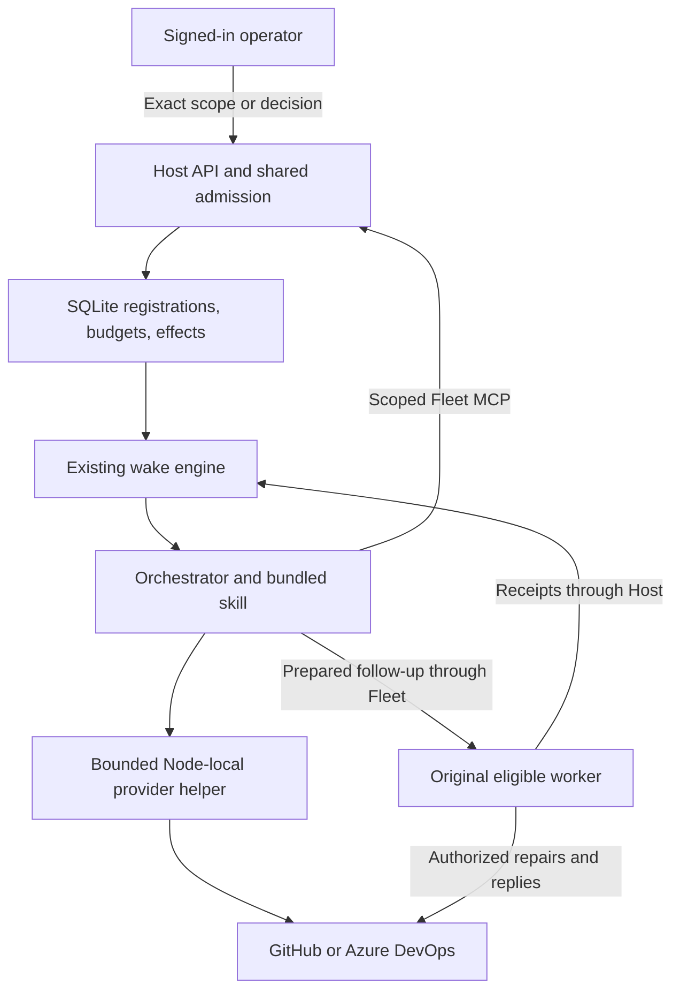
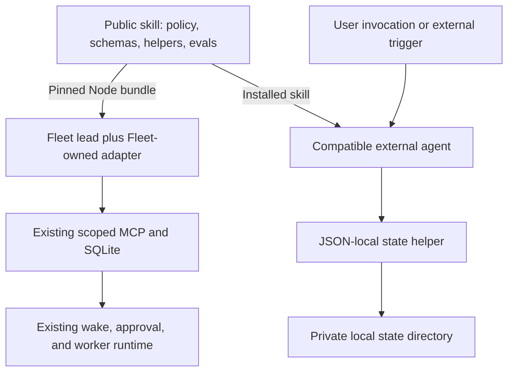
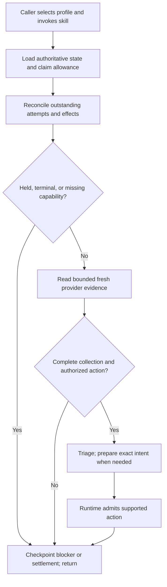

# Portable PR-maintenance skill and JSON state

**Area**: Orchestrator, PR maintenance, skill distribution<br>
**Engineer**: Not assigned; this document proposes work, not an implementation<br>
**EM owner**: N/A for this repository-maintained tool<br>
**Architect**: Repository owner; independent review requested from Opus 5<br>
**Program Manager**: Not assigned<br>
**Driver / Approver**: Charles Yin, repository owner; an AI review is advisory<br>
**Contributors / Informed**: Fleet maintainers and future standalone-skill users<br>
**Status**: Draft for independent review; implementation and public release not approved<br>
**Created / Last updated**: 2026-09-21<br>
**Impact**: High: cross-runtime state, authority, and recovery semantics; no Fleet DB migration proposed<br>
**Decision deadline**: Not set<br>
**Source baseline**: `48d3e40ed856796290ad290a0333b96d28f6d054` on `main`<br>
**Work item**: Not supplied

## Related documents

| **Document**                       | **Link**                                                                                                                                                                                                                        |
| ---------------------------------- | ------------------------------------------------------------------------------------------------------------------------------------------------------------------------------------------------------------------------------- |
| **Feature Lifecycle Process**      | Independent design review, then implementation approval. The [team template lifecycle](https://dev.azure.com/powerbi/AI/_wiki/wikis/AI.wiki/90809/Feature-Lifecycle-Process) is background, not a Fleet deployment requirement. |
| **PM Functional spec**             | User discussion: export PR maintenance as a public skill containing instructions, scripts, and JSON schemas, usable by Copilot, Codex, and Claude without requiring Fleet. Preserve Fleet's existing built-in experience.       |
| **UX Design**                      | Retain Fleet's current proposal, authorization, maintenance, and human-decision surfaces. Standalone use is a CLI/agent workflow, not a new dashboard.                                                                          |
| Existing maintenance design        | [PR maintenance mode](2026-09-17-pr-maintenance-mode.md)                                                                                                                                                                        |
| Current architecture and lifecycle | [Architecture](../../../ARCHITECTURE.md), [orchestration lifecycle](../../orchestration-lifecycle.md), [managed worktrees](../../managed-worktree-isolation.md)                                                                 |
| Current packaged policy            | [SKILL.md](../../../apps/node/skills/pr-maintenance/SKILL.md), [helper contract](../../../apps/node/skills/pr-maintenance/helper-contract.md), [ADO contract](../../../apps/node/skills/pr-maintenance/ado-contract.md)         |
| Skill packaging standard           | [Agent Skills specification](https://github.com/agentskills/agentskills/blob/69ef37e9424c0a7ea9dd2293b559e43ec8176379/docs/specification.mdx)                                                                                   |

**Decision proposed:** extract a runtime-neutral maintenance policy, provider
readers, evidence contracts, and evaluations. Supply a cooperative, local JSON
state implementation for standalone agents. Keep Fleet's authoritative
SQLite/MCP, authorization, scheduler, and worker-admission machinery behind a
Fleet-owned adapter.

**This is not a proposal to replace Fleet's database with JSON.** It supersedes
the earlier design's rejection of local checkpoints only for a new standalone
profile. Fleet-managed jobs still have one authoritative Host record.

All new file names, commands, schemas, and contract terms below are proposed.
Existing Fleet MCP names are explicitly identified. No public repository has
been created, no dependency has been added, and no runtime behavior has changed.

## Feature desired outcome

A user can install one versioned skill package, start a supported agent, and
recover the PRs it is maintaining without relying on conversation memory or a
Fleet installation. Fleet consumes the same policy and provider evidence while
retaining its existing operational guarantees.

The primary deliverable is **portable maintenance behavior**, not merely a
portable serialization format. Copying Fleet task/session IDs into JSON does
not remove Fleet coupling.

### Scope and release profiles

| Profile                         | Initial supported behavior                                                                                                                                                  | Authority and execution                                                                                      |
| ------------------------------- | --------------------------------------------------------------------------------------------------------------------------------------------------------------------------- | ------------------------------------------------------------------------------------------------------------ |
| `fleet`                         | Existing observation and explicitly authorized repair/answer maintenance, including GitHub and ADO                                                                          | Existing scoped MCP, authenticated operator grants, admission, and retained worker                           |
| `json-local-observe`            | Registration, bounded observation, triage/reporting, checkpoints, reminders as returned data, pause/recovery; usable by compatible Copilot, Codex, and Claude installations | Single-machine cooperative owner; existing provider read credentials; no remote mutations or repair dispatch |
| `json-local-interactive-repair` | Gated follow-on profile, not included in the initial compatibility claim                                                                                                    | Requires a concrete runtime approval/execution adapter and its own conformance evidence before enablement    |

The portable policy includes the repair procedure from the start; an agent may
execute only the operations advertised and authorized by its selected runtime
profile. The initial standalone profile is deliberately observation-only.
Supporting full autonomous repair outside Fleet is a separate release gate,
not something inferred from successful JSON reads. Review question Q4 asks
whether interactive repair must be pulled into the first release.

In scope:

- One shared skill with discoverable metadata, common policy, provider scripts,
  machine-readable schemas, reference material, and reproducible evaluations.
- Persistent, schema-validated JSON state outside the installed skill by default.
- Explicit runtime selection, bounded invocations, stable operation identities,
  conservative recovery, and no hidden fallback between storage backends.
- Fleet consumption of a pinned public release without a new scheduler or MCP
  server and without direct public-helper access to Fleet's database.
- A real standalone path with no `@fleet/protocol` or Fleet service dependency.

Out of scope:

- Automatic merge/auto-complete, force-push, automatic rebase, new review-agent
  sessions, autonomous credential changes, or expansion of existing grants.
- A distributed JSON database, network-drive locking, cross-Host coordination,
  a generic plugin framework, or a replacement orchestration service.
- Adding another coding-agent execution engine inside Fleet.
- Automatically transferring active Fleet jobs, workers, grants, or unknown
  effects into standalone execution.
- Publishing arbitrary repository/runtime data with the public skill.

### Observable acceptance criteria

| ID    | Required outcome and evidence                                                                                                                                                                                        |
| ----- | -------------------------------------------------------------------------------------------------------------------------------------------------------------------------------------------------------------------- |
| AC-01 | A clean installation runs the read-only provider helper and a standalone observation pass without Fleet, its packages, its DB, or its MCP endpoint.                                                                  |
| AC-02 | The same public skill and JSON store can be used sequentially by the supported Copilot/Codex/Claude configurations; each recovers the same job identity, holds, counters, and evidence without conversation history. |
| AC-03 | No production import in the public artifact resolves to `@fleet/protocol`, a Fleet checkout, or a private runtime package.                                                                                           |
| AC-04 | The selected profile is explicit. Missing Fleet MCP never creates a JSON job or changes the execution/authorization path.                                                                                            |
| AC-05 | Restart, lost replies, stale revisions, malformed JSON, abandoned locks, and uncertain actions never produce an empty-success record or a duplicate mutation.                                                        |
| AC-06 | Fleet preserves its current authorization, ownership, fairness, budget, recovery, retention, and exact retained-worker continuation behavior.                                                                        |
| AC-07 | A public helper retains GitHub/ADO identity, completeness, policy, HEAD, self-effect, and pagination semantics; unknown policy cannot become ready.                                                                  |
| AC-08 | Updating or reinstalling the skill leaves runtime data untouched. Neither public source nor release artifacts contain real PR state, credentials, or private evidence.                                               |
| AC-09 | Unchanged complete evidence produces no repair/answer dispatch; ready remains nonterminal. Observation and lead costs are measured rather than called zero.                                                          |
| AC-10 | Only one cooperative owner may run a local pass against a state directory; partial file writes and cross-job ownership conflicts are rejected deterministically.                                                     |
| AC-11 | A runtime that lacks a required capability returns a specific blocker or an explicitly selected narrower profile, never fabricated Fleet-equivalent guarantees.                                                      |

Verification combines deterministic contract/storage/provider tests with actual
agent evaluations. Reuse the existing versioned semantic scenarios, with at least
30 representative cases and three repetitions per advertised agent/model/profile
configuration. All mandatory design/authority cases must remain held or escalated;
unauthorized remote actions must be zero. The existing >=90% independently
repairable completion target applies only to repair-enabled profiles, not to
observation-only runs. These are proposed release gates, not measured results.

### Background and source-grounded current state

The product already packages a dedicated skill. The remaining coupling is
concrete, not hypothetical:

| Source at the baseline                                                                                                                                                      | Current responsibility / extraction implication                                                                                                              |
| --------------------------------------------------------------------------------------------------------------------------------------------------------------------------- | ------------------------------------------------------------------------------------------------------------------------------------------------------------ |
| [`apps/node/skills/pr-maintenance/SKILL.md`](../../../apps/node/skills/pr-maintenance/SKILL.md)                                                                             | Common maintenance policy is mixed with Fleet wake, task, MCP, authorization, and worker instructions.                                                       |
| [`apps/node/src/agents.ts`](../../../apps/node/src/agents.ts), `withMaintenanceResources`                                                                                   | Fleet-enabled ACP prompts receive absolute packaged asset paths. Preserve this built-in delivery mechanism.                                                  |
| [`snapshot.mjs`](../../../apps/node/skills/pr-maintenance/snapshot.mjs)                                                                                                     | Provider routing imports Fleet's PR URL parser.                                                                                                              |
| [`host-observation.mjs`](../../../apps/node/skills/pr-maintenance/host-observation.mjs) and [`ado-snapshot.mjs`](../../../apps/node/skills/pr-maintenance/ado-snapshot.mjs) | Observation validation and provider identities import `@fleet/protocol`; the GitHub reader also imports the Host converter. A folder copy is not standalone. |
| [`packages/protocol/src/pr-maintenance.ts`](../../../packages/protocol/src/pr-maintenance.ts)                                                                               | PR evidence, provider identity, Fleet registration/binding, grants, budgets, and UI progress currently share one module.                                     |
| [`apps/host/src/pr-maintenance-store.ts`](../../../apps/host/src/pr-maintenance-store.ts)                                                                                   | SQLite owns registrations, proposals, fair scans, wake allowances, ownership uniqueness, admission, and settlement. This stays in Fleet.                     |
| [`orchestrator/engine.ts`](../../../apps/host/src/orchestrator/engine.ts), `remindIdleLeads` / `wakeMaintenanceRecovery`                                                    | Existing ordinary/completion/recovery wakes and approximately 30-minute idle reminders. No additional timer is needed.                                       |
| [`orchestrator/tools.ts`](../../../apps/host/src/orchestrator/tools.ts), `getPrMaintenance` / `followUp`                                                                    | Host-derived wake IDs, request reservations, immutable prepared prompts, and accepted attempts. A model cannot replace these with claims in JSON.            |
| [`routes/orchestrators.ts`](../../../apps/host/src/routes/orchestrators.ts)                                                                                                 | Browser-operator authorization is separate from the lead MCP principal.                                                                                      |

The 30-minute idle reminder is distinct from Node liveness heartbeats. It is
best-effort, not a polling SLA; ordinary turns can inspect due work sooner, and
busy/offline leads can inspect later.



This is a logical flow: worker dispatch and completion still traverse Fleet's
admission and execution machinery. Diagrams use GitHub fenced Mermaid because
this document is published in GitHub, not ADO wiki syntax.

### Assumptions

| ID  | Assumption                                                                                                   | Confidence                                                            | Invalidation trigger / response                                                                                                   |
| --- | ------------------------------------------------------------------------------------------------------------ | --------------------------------------------------------------------- | --------------------------------------------------------------------------------------------------------------------------------- |
| A1  | Preserving Fleet's current DB and authority boundary is more valuable than replacing storage for uniformity. | High; user wants portability, not a Fleet storage migration           | A separate requirement explicitly asks to replace Fleet storage; revisit the design rather than dual-write.                       |
| A2  | First standalone users can accept one machine, one configured state root, and one active owner.              | Medium; proposed operating envelope                                   | Required concurrent independent agents or shared/network storage; use a transactional host, not stronger claims about files.      |
| A3  | The selected agents can read skill resources and execute an installed Node helper.                           | Medium; profile-dependent                                             | Missing shell/file access, unsupported Node, or agent discovery differences; declare that configuration unsupported until tested. |
| A4  | Observation-only standalone support is a useful first release.                                               | Medium; requires owner review                                         | Full unattended external repair is required immediately; specify and review that runtime before implementation.                   |
| A5  | Local state and the installed skill are controlled by a trusted operator.                                    | High as a stated trust boundary, not as a claim about all deployments | Untrusted agents/users can modify both policy and state; JSON-local is not a suitable security boundary.                          |
| A6  | Tested local filesystems support the required exclusive-create and replacement semantics.                    | Unverified until prototype P1                                         | Any supported-platform crash/concurrency fixture fails; do not advertise that storage profile there.                              |

### Decision criteria

Criteria precede the alternatives; qualitative weights are not fabricated scores.

| Criterion                                                | Weight     | Decision rule                                                                                                   |
| -------------------------------------------------------- | ---------- | --------------------------------------------------------------------------------------------------------------- |
| Preserve Fleet's authority and uncertain-effect handling | Must-have  | No migration or mirror may weaken existing admission or fabricate settlement.                                   |
| Standalone use without Fleet                             | Must-have  | A supported external agent must execute a real bounded pass, not merely read prose about unavailable MCP tools. |
| One authoritative store per job                          | Must-have  | No independent JSON/SQLite masters and no active-copy handoff.                                                  |
| Cross-agent portability and inspectability               | High       | Common instructions, JSON contracts, deterministic helpers, and explicit profiles.                              |
| Small implementation and operational surface             | High       | Reuse policy, provider logic, existing scheduler, and installed tooling; avoid a new service.                   |
| Reversible rollout                                       | High       | Pin packages and contracts; preserve existing records and operator holds.                                       |
| Concurrent/distributed standalone operation              | Low for v1 | An explicit non-goal, not a reason to build a database in files.                                                |

## Terminologies <!-- optional -->

**Skill package**: immutable/versioned instructions, scripts, schemas, references,
and evaluation assets. It is not an authority, daemon, or database.

**Portable job**: PR maintenance facts meaningful across runtimes, including
identity, observations, findings, holds, pending effects, counters, and lifecycle.

**Runtime binding**: the connection from a job to a particular owner, execution
environment, state implementation, approval channel, and capabilities. Fleet
task/session IDs belong here, not in the public job contract.

**Pass**: one bounded control-plane invocation that recovers state, inspects due
work, decides permissible next actions, checkpoints, and returns. It is not an
unbounded watch loop or the lifetime of a repair worker.

**Batch / effect**: a coherent repair/answer request / one externally observable
action. Observed, prepared, accepted, execution-settled, and effect-settled are
different facts.

**Cooperative JSON state**: validated local storage for cooperating callers under
one operator. It is not hostile-agent isolation or proof that a human approved.

## Design options considered

| Option                                                                        | Advantages                                                                              | Costs / failures against criteria                                                                                            | Relative effort                   | Decision              |
| ----------------------------------------------------------------------------- | --------------------------------------------------------------------------------------- | ---------------------------------------------------------------------------------------------------------------------------- | --------------------------------- | --------------------- |
| Keep the existing Fleet-only package                                          | No behavior change; existing guards remain                                              | Fails standalone-use criterion; policy stays tied to Fleet MCP                                                               | None now                          | Baseline / do nothing |
| Publish the folder and replace Fleet records with agent-edited JSON inside it | Easy to describe; human-readable files                                                  | Does not remove Fleet imports/contracts; update/data-loss risk; weakens authority and concurrent ownership; fails must-haves | Appears small, recovery cost high | Reject                |
| Portable policy/evidence plus JSON-local and a Fleet adapter                  | Real standalone use; existing Fleet protections; inspectable state; incremental rollout | Requires a contract split, file-state semantics, packaging, and profile-specific evaluation                                  | Medium                            | Recommended           |
| Extract a standalone daemon/database/MCP service                              | Could coordinate many agents and hosts                                                  | Duplicates Fleet runtime and operational burden before a second deployment requires it                                       | Large                             | Defer                 |

The recommendation satisfies the must-haves while accepting a deliberately
limited standalone concurrency/authority envelope. JSON is the reference local
backend and interchange format, not a claim that it is a better Fleet database.
No delivery-date or monetary estimate is justified before the storage and
packaging prototypes.

## Preferred option

### 1. Architecture and dependency direction



The public core owns procedure and PR evidence, not the surrounding runtime.
GitHub/ADO provider differences and Fleet/standalone runtime differences are
separate axes. A GitHub-specific script is not provider-neutral merely because
several coding agents can run it.

The first adapter is a small explicit binding, not an extensible RPC framework:

- Common policy describes duties and required capabilities.
- The Fleet binding names the real existing MCP operations and maps evidence.
- The standalone binding names the state/helper CLI and its narrower authority.
- Bootstrap chooses exactly one profile. Tool failure never changes that choice.

The Node continues to advertise absolute installed resource paths. A compatible
agent may discover `SKILL.md` natively or receive an explicit path from its caller.
An agent lacking required file/shell access is not silently considered supported.

### 2. Package layout and mutable-state location

Illustrative public source/release layout:

```text
pr-maintenance\
  SKILL.md
  release.json
  schemas\
    store.schema.json
    job.schema.json
    observation.schema.json
    invocation.schema.json
    result.schema.json
  scripts\
    state.mjs
    snapshot.mjs
    github-snapshot.mjs
    ado-snapshot.mjs
    contracts.mjs
  references\
    policy.md
    helper-contract.md
    runtime-contract.md
    standalone.md
    github.md
    azure-devops.md
  examples\
    empty-store.json
  evals\
    scenarios.json
    grade.mjs
  tests\
  LICENSE
```

The release must carry required runtime dependencies or document an explicit
operator installation step. It must not opportunistically run `npm install`,
download code, log in, or install an ADO extension during a maintenance pass.
Reuse the existing Node helpers and validation approach rather than changing
languages or adding a second provider implementation during extraction.

The default runtime state root is outside the installed package:

```text
<explicit private state directory>\
  store.json
  writer.lock\                 (short-lived helper serialization)
  store.<operation-id>.tmp     (only during replacement)
```

The caller supplies the absolute state root; do not infer it from the helper's
working directory or from untrusted PR text. A project-local
`<workspace>\.pr-maintenance` is permitted only after Git exclusion and filesystem
permissions have been checked. An operator-selected private user-state directory
is preferable when several checkouts share one maintained PR portfolio.
Canonicalize the selected root before use and reject unexpected link/reparse
redirection or a changed root binding; aliases must not accidentally create two
cooperative owners of the same store.

No tokens, Fleet bearer credentials, or sign-in artifacts are stored here. Real
PR URLs, comments, evidence, and local paths may still be sensitive. Restrict
filesystem access; exclude the directory from commits, packages, skill sync, and
public examples. Missing ignore/permission prerequisites are reported, not
silently repaired through a global settings change.

**Refinement from the brainstorm:** initially use one authoritative `store.json`,
not independent `jobs/<id>.json` files. Cross-job PR/head-ref ownership, pass
allowances, and oldest-due scan progress can then commit in one replacement.
Per-job JSON files may be explicit read-only exports, not a second source of
truth. Sharding would require another transaction design and is not part of v1.

A `runtime` subdirectory inside an installed skill is not the default supported
location. Supporting it later requires an explicit data-preservation contract
for every installer/updater; adding `.gitignore` alone does not provide that.

### 3. Public contracts and schema ownership

Extract only provider identity, observations, findings/effects, and neutral
invocation/result shapes from the current combined protocol module. Leave
Fleet registrations, sessions, grants, RunSteps, UI projections, and database
migrations in Fleet.

The public package publishes JSON Schema Draft 2020-12 artifacts. Runtime
validation and published schemas must have one source of truth, with generated
schema/validator parity fixtures. Reuse the existing validation library when
practical; do not maintain independent handwritten copies. Normalization and
cross-field/state-transition rules that JSON Schema cannot express remain
explicit helper checks with shared fixtures.

All supported documents are versioned, bounded UTF-8 JSON. Reject unknown
required versions, unexpected properties, invalid timestamps/SHAs/ref formats,
excessive nesting, and oversized inputs. Resolve schema references only from the
installed package; `$schema`/`$ref` is not authority to fetch or execute content.
Do not use PR/repository display names as filesystem paths.

| Contract    | Required meaning                                                                                                                                                                                                                                  |
| ----------- | ------------------------------------------------------------------------------------------------------------------------------------------------------------------------------------------------------------------------------------------------- |
| Store       | `schemaVersion`, stable `storeId`, monotonically increasing `revision`, selected runtime binding, active-pass receipt, persisted scan, jobs, idempotent transition receipts                                                                       |
| Job         | Stable job ID, generation, job version, provider identity, policy/package version, requested scope, authority reference/history, lifecycle, observations, counters, findings, batches/effects, decisions, next-check hint, ownership-release fact |
| Observation | Actual collection time, identity/HEAD/base pins, collection completeness, independent check/review completeness, provider state, sources/revisions, obligations, mergeability, fingerprint, sanitized error, usage and bounded continuation       |
| Invocation  | Contract/profile version, job/binding reference, runtime-issued pass identity, capabilities, effective authority evidence, remaining allowance, checkpoint version and provider budget/deadline                                                   |
| Result      | Stable pass identity and operation receipts, explicit outcome, current revision, evidence references, usage, unfinished execution/effects, and next-action/next-check hint                                                                        |

The following is a complete proposed **empty-store example**, not a job approval:

```json
{
  "schemaVersion": 1,
  "storeId": "6a295ac7-10d2-4c23-8a31-f1f63f4e0f19",
  "revision": 0,
  "runtime": {
    "profile": "json-local-observe",
    "contractVersion": 1,
    "bindingId": "e142e758-78a9-4a82-bae6-459dc9c878b1"
  },
  "activePass": null,
  "scan": {
    "cutoff": null,
    "unservedJobIds": []
  },
  "jobs": {},
  "operationReceipts": {}
}
```

Initialization is explicit and exclusive. A missing/corrupt store at a previously
bound location is `state_missing`/`state_corrupt`, not permission to initialize
an empty one and forget pending work.

#### Identity and portability

Preserve current provider identities: GitHub host and stable repository IDs,
PR number, exact head/base repository identities and case-sensitive full refs;
ADO also includes organization and project/repository GUIDs. Do not infer the
head repository from `origin` or flatten ADO policy into GitHub approval votes.

Runtime binding fields are opaque to the common policy. Fleet uses existing
task/session/placement/binding-generation fields internally; standalone uses its
own canonical state/workspace binding. Neither is an interchangeable execution
credential. A portable export omits live runtime handles and authority proofs.

#### State dimensions

Preserve the existing lifecycle vocabulary `active`, `paused`, `merged`, `closed`,
with a separate ownership-release fact. "Draining" is a projection of outstanding
execution/effects after pause or terminal observation, not a competing lifecycle
that can erase evidence.

Keep batch states `prepared`, `accepted`, `reconciling`, `uncertain`, `succeeded`,
`partial`, `failed`, `cancelled`, and `superseded`. Keep effect states `reserved`,
`known`, `uncertain`, and `not_performed`. A terminal batch label is insufficient
unless execution and effects are actually settled.

Keep finding outcome separate from stage and verification HEAD. For example,
a published fix with a failed reply remains incomplete at the reply stage; it
must not cause a second implementation or push.

`ready` is a derived result bound to current complete evidence and its fingerprint.
It is not a merged state, an approval, or permission to stop future observations.
Do not persist an independently editable UI-stage field.

### 4. One bounded pass, independent of storage



1. Resolve the declared profile and its compatibility; recover state by stable
   identity. Read unfinished work even if the original task is completed.
2. Obtain a real pass/turn receipt and claim a due visit before provider I/O.
   Continue persisted oldest-due progress, not a model-reconstructed list.
3. Reconcile previously accepted execution and known/uncertain effects before
   admitting another batch. Unknown is not failed, idle is not authority, and
   queued is already accepted.
4. Honor pause, terminal, authority, identity, binding, completeness, and design
   holds. A capability-recovery route cannot clear an unrelated hold.
5. Run the bounded provider helper with actual remaining allowance. Persist the
   attempted observation even when incomplete; retain the last successful
   observation separately.
6. Triage all obligations: comments, edited/reopened threads, CI-only failures,
   review decisions, policy, mergeability, and previously incomplete responses.
   Complete collection is distinct from complete policy/check evidence.
7. Prepare an immutable intent before an admitted effect or batch. In the
   observation-only profile, the permissible result is diagnosis/reporting or
   human attention, never repair/answer dispatch.
8. Checkpoint receipts/outcomes and return. Do not sleep, self-message, spawn a
   watcher, or mint a new pass to replenish the old allowance.

Proposed outcomes are `waiting`, `work_accepted`, `needs_human`, `blocked`, `ready`,
and `terminal_pending_settlement`, with an explicit reason. They are result
vocabulary, not replacements for Fleet Run/session states.

The initial observer budgets retain the current shape: up to five PR visits,
40 initiated provider requests, and 120 seconds per control-plane pass, or a
smaller runtime allowance. Failed requests and lost reservations count. Preserve
provider-specific defaults, including ADO's larger complete-scan requirements.
An implementation must not reinterpret the 120-second control-plane allowance
as a repair worker's execution/test deadline.

Fleet's defaults of three published repair batches, three answer-only batches,
and 100 mutation attempts per authorization remain unchanged. A different runtime
must define and enforce its own explicit execution budget before advertising
repair capability. Counters survive new HEADs, compaction, retry, and restart;
only the appropriate authority can renew them.

### 5. JSON-local state helper

#### Interface and typed transitions

Use one installed Node helper with JSON on stdin/stdout. Proposed operations:
`initialize`, `list`, `get`, `begin_pass`, `checkpoint`, `end_pass`, `pause`,
`recover`, and `export`. These are CLI operation names, not new Fleet MCP tools.
Document the invocation syntax when implementation freezes it.

Mutations carry a helper-issued pass reference when applicable, stable
`operationId`, expected store/job revision, generation, and a typed payload.
There is no generic "replace job", arbitrary JSON patch, or "set approved" call.
Helper-side preconditions validate permitted transitions and preserve counters,
holds, exact identities, and unfinished evidence.

On retry, the same operation ID and payload hash return the original application
receipt plus the current revision, without repeating a provider action. Reusing
the ID with different content fails. An external-action receipt is never a
request to perform that action again.

State-transition receipts live for the job generation, subject to explicit
settled archival. IDs/generations are never reused. Capacity exhaustion refuses
new work; it does not silently evict the receipts needed to reject retries.

#### Atomic update protocol

Every cooperating writer performs the following operation against one canonical
state root:

1. Exclusively create a short-lived writer-lock directory. If it already exists,
   return `state_busy`; do not spin or steal it by age.
2. Read and validate the current store. Check idempotent receipts before
   rejecting an already-applied retry for a stale expected revision.
3. Verify the revision/generation, selected binding, active-pass ownership, typed
   transition, resource uniqueness, and capacity reservation.
4. Serialize the fully validated next store to a uniquely named, exclusively
   created temporary file in the same directory/filesystem. Flush and close it.
5. Replace `store.json` using the tested platform primitive. Never delete the
   old file first, truncate it in place, or fall back to copy-overwrite.
6. Complete the supported durability flushes, then return a committed receipt.
   A failure after replacement is an uncertain acknowledgement: retry by the
   same operation ID and read the authoritative store.
7. Remove only the matching invocation's temporary file/lock when safe. A
   surviving temporary file is not automatically newer authoritative state.

This promises validated replacement and process-crash consistency only on tested
local filesystems. Power-loss durability differs by platform/filesystem; it is
not advertised without fault-injection evidence. Storage corruption/rollback
recovery disables actions and requires reobservation and operator reconciliation.
A checksum detects damage, not authenticity.
A complete older store restored outside the helper cannot reliably be detected
without an independent monotonic authority. JSON-local is not a rollback-proof
audit log; known restore/import must enter recovery, and the initial read-only
profile does not turn restored counters into unattended mutation authority.

The first implementation uses exclusive creation from the standard library;
it does not add a lock service, timed lease, or distributed fencing protocol.
The correctness gate is the multi-process/crash prototype, not an assumption
that every `rename` is equally durable on every OS.

#### Pass ownership versus file locking

The short-lived lock serializes a file transaction. A persisted `activePass`
reserves the **whole maintenance invocation** across separate helper calls.
Releasing the file lock does not authorize another owner to start a pass.

The runtime/bootstrap creates the owner/pass identity; the model does not choose
an arbitrary new wake ID to reset allowances. Claiming a pass records its cutoff,
deadline, visits, request reservations, and owner binding before I/O. Later calls
use that receipt. A receipt lost to compaction is recovered from the binding,
not replaced with a new pass.

An expired deadline closes action admission; it does not prove that a process,
read, worker, or remote effect stopped. Receipt-only reconciliation remains
available. `end_pass` requires settled observer work or a runtime-proven,
persisted handoff; JSON-local-observe has no detached-worker handoff capability.

There is **no automatic stale-lock/pass takeover** in v1. If an owner disappears,
the store remains visibly blocked. Explicit operator recovery follows termination
of the prior owner and all relevant children; inability to establish that means
continued blocking. Unlocking does not settle effects, replenish budgets, or
clear a design/authority hold.

This is cooperative coordination. Another process with arbitrary filesystem or
provider access can ignore the helper. JSON state cannot fence a rogue shell
command; the supported trust model must say so.

#### Cross-job ownership and operating limits

Under the same lock, validate unique retained claims for exact PR identity and
remote head-repository/ref identity. Two PRs with different bases but the same
head ref cannot acquire independent repair ownership. Compute claims from the
retained jobs rather than keeping a second independently writable index.

One state directory has one active pass. Several jobs are inspected serially
within that pass; persisted cutoff/carry-forward scanning prevents a noisy job
from starving others. This ceiling is intentional.

Initial proposed storage ceilings are 100 retained jobs and a 16 MiB committed
store, whichever is reached first; observer continuations retain the existing
1 MiB per-observation ceiling. These numbers require review and P1 measurement.
Do not multiply a per-job maximum into an implied larger guaranteed capacity.

Reserve worst-case checkpoint/receipt growth before starting bounded work.
Admission must leave capacity for its known maximum completion/failure receipt.
Reject new work before the limit, not after a provider action. Read, diagnostic,
and compact error/reconciliation paths must remain available. Never prune
unsettled evidence to make room. Detailed receipt-size bounds and reserved
headroom are implementation exit criteria for P1, not optional tuning.

Only one configured state root may own a given PR/head-ref portfolio. There is
no coordination across copied roots, multiple machines, OneDrive/Dropbox-style
sync, SMB/NFS, or independently deployed Fleet Hosts. Requiring that coordination
invalidates A2 and needs a transactional runtime.

### 6. Authority, untrusted inputs, and capability profiles

Separate three facts:

1. A job may **request** a repair/reply/reviewer scope.
2. Its runtime may present evidence that a real authority **granted** that scope.
3. Its execution tools must still **permit** the exact operation.

Stored JSON is not proof of the second or third fact. A model-written
`approved: true`, copied grant ID, PR comment, or previous agent summary cannot
expand permissions. The JSON-local helper is a correctness mechanism, not an
independent authenticated approval service.

In Fleet, current browser-operator authorization remains the authority. The
adapter uses the effective parsed grant, preserving legacy scope/default
semantics; new preparation still defaults to observe-only with explicitly
requested mutation permissions. Do not reinterpret a legacy grant while
normalizing it, or infer all reply/reviewer rights merely from a new "repair" label.

JSON-local-observe advertises only provider reads, local checkpoints, and local
reports. It cannot send provider comments, resolve threads, request reviewers,
retry CI, modify code, commit, or push as maintenance actions.
The caller's independently selected profile is checked against the stored
binding. Changing the store's `runtime.profile` does not select a new capability
set; mismatches block bootstrap.

A future interactive repair profile must define a real current user-approval
channel, exact repository/ref scope, executor identity, operation/elapsed-time
budgets, process ownership, publication preflight, and result reconciliation.
It cannot be enabled through editing profile/approval fields in a store. If the
agent's runtime cannot supply those semantics, it is not a repair-enabled host.

Provider text and helper snapshots are task data. Do not interpolate them into
shell commands, paths, approval instructions, or skill policy. Helpers remain
read-only against the provider, use existing Node-local authentication, redact
credential-bearing errors, and never log in or copy tokens.

Keep the current policy boundary: local repairs restore approved invariants;
architecture/API/schema/dependency/trust-policy changes or uncertainty hold the
whole PR. Scope does not become safe because a reviewer labels it a nit.
Neither matching schemas nor optimistic versions make a falsified file trusted.

### 7. Provider extraction and evidence fidelity

Move PR URL/identity parsing and neutral observation validation out of
`@fleet/protocol` into the public contract boundary. Separate the GitHub helper
from its unconditional Host converter import. Keep the ADO and GitHub readers'
existing bounded collection and consistency logic.

Public helpers return versioned neutral evidence. Fleet's adapter validates and
maps it into the existing `PrMaintenanceObservationSchema` and checkpoint shape.
If a required fact cannot be represented, return a compatibility blocker; do
not discard it, treat missing as false, or manufacture completeness.

Required preservation:

- Exact stable repository IDs, full case-sensitive refs, provider and generation
  pins, current HEAD/base, and actual observation start time.
- Bounded pagination/continuation, explicit incomplete/error output, request/time
  accounting, and fresh consistency verification on resumes.
- Collection completeness separate from required-check/review-policy
  completeness. Unknown ADO policy can coexist with collected actionable
  feedback; it still cannot establish readiness.
- GitHub branch rules/review obligations and ADO iteration/policy/build/reviewer
  semantics remain provider-specific. Positive ADO votes are not policy proof.
- Failed required checks remain actionable sources even without comments.
- Finding suppression remains bound to verified code HEAD and source revision;
  external commits or reopened/edited feedback require revalidation.
- Known-effect matching uses recorded provider IDs or a unique marker plus the
  expected actor/content/action identity. Same-author comments are not all ignored.
- Capability limitations and actual provider access denial remain distinct.
  Alternate evidence never clears identity, Stop, authority, or unknown-effect holds.

Keep exit 0 for complete collection and exit 2 for explicit incomplete output
where that existing helper contract applies. Readiness is decided from the
structured completeness/obligation fields, not from exit 0 alone. Unsupported
profile/schema and storage failures use documented structured error codes and
nonzero exits; exact assignments are frozen with the CLI contract tests.

### 8. Fleet adapter: reuse existing APIs

| Portable duty                   | Existing Fleet operation / owner                                        | Constraint                                                                                             |
| ------------------------------- | ----------------------------------------------------------------------- | ------------------------------------------------------------------------------------------------------ |
| Prepare a bounded scope         | `fleet_prepare_pr_maintenance`, advanced `fleet_propose_pr_maintenance` | Saves an unapproved proposal; only the authenticated operator action enables it.                       |
| Recover or claim due work       | `fleet_get_pr_maintenance`, including `takeDue`                         | Preserve Host-derived wake identity, oldest-due scan, and pre-I/O allowance reservation.               |
| Read task/executor eligibility  | `fleet_get_task`                                                        | Idle alone is not eligibility; do not replace a busy/offline retained worker.                          |
| Save observation/intent/outcome | `fleet_checkpoint_pr_maintenance`                                       | Preserve expected version, generation, immutable batch identity/prompt, and failure/recovery receipts. |
| Continue an authorized repair   | `fleet_follow_up` with maintenance reference                            | Existing atomic accepted-attempt linkage and scheduler admission remain authoritative.                 |
| Hold for a design decision      | `fleet_escalate` plus existing task decision UI                         | Ordinary reopen/approve cannot consume a pending maintenance decision.                                 |
| Pause and lifecycle actions     | Existing maintenance MCP/operator controls                              | Model pause capability does not become model approval/resume/release authority.                        |
| Observe on another Node         | Existing approved command execution                                     | Use an authorized helper placement, not a bypass into a reserved maintenance checkout.                 |
| Wake and retain continuity      | Existing engine, store, Node execution, retention                       | No public helper timer, direct DB writes, replacement worker, or automatic cleanup of unsettled work.  |

The adapter is Fleet-owned because it must track real Host API and permission
semantics. A small `fleet-adapter.md` plus a deterministic observation/contract
bridge is sufficient initially. Do not introduce a public generic MCP server or
rename every Fleet tool.

Fleet profiles never create authoritative JSON state files. Debug exports must
be marked read-only snapshots, with source revision and time; replaying an export
cannot update the Host. Common core changes are consumed only after adapter
conformance passes.

Fleet's current admission checks at discovery, prepare, dispatch, queued
execution, task lifecycle, publication, and cleanup remain. This is not permission
to replace those code checks with shared prose.

### 9. Restart, lost acknowledgements, and terminal work

| Failure or change                                         | Required next behavior                                                                                                                            |
| --------------------------------------------------------- | ------------------------------------------------------------------------------------------------------------------------------------------------- |
| Crash before a state replacement                          | Old store remains authoritative; incomplete temp data is not promoted. No action may have started before its reservation committed.               |
| Replacement committed, CLI reply lost                     | Retry the same transition ID/body; return its receipt and current revision. Do not redo provider I/O or reset allowance.                          |
| Lock/pass survives an owner crash                         | Block; explicit quiescence/recovery is required. No age-only takeover.                                                                            |
| Invalid/truncated store, rollback, or incompatible schema | Read-only diagnostics and operator recovery; never silently initialize, downgrade, or select a convenient backup. Reobserve before future action. |
| Helper collection incomplete or newer attempt failed      | Keep exact failure/progress and last successful evidence separately; no fabricated ready state.                                                   |
| Prepared dispatch reply lost                              | Reconcile recorded acceptance/attempt; never build a different retry prompt.                                                                      |
| Push/reply result unknown                                 | Retain the effect and ownership. Reobserve or obtain a receipt; no blind retry and no exactly-once claim.                                         |
| PR merged/closed while work is active                     | Inhibit new work, request targeted runtime cancellation, drain accepted execution/effects, and release only when settled.                         |
| Human design hold or explicit Stop                        | Preserve the hold through restart, import, generic task reopening, and package updates.                                                           |
| New agent against the same JSON root                      | Admit only after the previous pass is settled/recovered and runtime capabilities match. Reuse evidence, not another runtime's authority.          |

JSON serialization does not make provider mutations transactional. Prepared
intent, runtime acceptance, and reconciliation reduce duplicate risk; they
cannot establish exactly-once external effects across an arbitrary crash.

### 10. Distribution, compatibility, and handoff

`release.json` identifies package version, policy version, contract/schema
versions, tested Node/platform/profile combinations, and artifact digest.
The repository/package name and publisher are approval items, not assumed URLs.
Select an explicit license and preserve provenance/notices before public release.

Fleet vendors/bundles a reviewed immutable upstream release as part of its Node
distribution. Keep the existing resolved-path injection; do not fetch a moving
branch on wake or rely on a user's personal skill installation. A digest verifies
the selected artifact, not arbitrary publisher trust. Pin updates are reviewed
changes, not agent-driven self-updates.

Initial compatibility rules:

- Record policy/contract versions with jobs and runtime bindings. Unknown versions
  or absent matching assets block actions.
- Preserve current Fleet schema-v1 records and effective permissions. No initial
  DB rewrite, backfill into JSON, or dual-write.
- First cutover requires affected maintenance paused and accepted effects settled,
  unless an explicit tested compatibility path proves safe continuation.
- Do not switch an in-flight prepared intent to a different policy/adapter version.
  A security-revoked old package causes a hold, not silent execution or downgrade.
- File migrations are explicit, locked, validated, and fail-closed; never rewrite
  a newer schema merely because an older agent starts.
- Reinstall/uninstall operates on package files, never the external state root.

V1 supports diagnostic/read-only exports, not active execution handoff. An
external agent may sequentially use an existing JSON-local job after the previous
owner settles and the profile/binding is revalidated. Copying a store to a second
root or importing a Fleet export does not convey ownership or approvals.

Any future import starts paused, creates a new runtime binding/generation as
needed, and revalidates identity, checkout, authority, budgets and effects.
Unknown work must be resolved in the original runtime rather than laundered
through an import. Automatic cross-runtime handoff needs a separate design.

### Premortem analysis

| **Risk**                                                                     | **Likelihood** (L/M/H) | **Impact** (L/M/H) | **How the design addresses it**                                                                                                                 |
| ---------------------------------------------------------------------------- | ---------------------- | ------------------ | ----------------------------------------------------------------------------------------------------------------------------------------------- |
| "Portable" helpers still import Fleet or require unpublished dependencies    | M                      | H                  | Clean-directory artifact test; production import-graph check; explicit public evidence boundary.                                                |
| Skill update erases maintenance state or publishes private evidence          | M                      | H                  | External state root; read-only package test; public artifact allowlist and synthetic fixtures.                                                  |
| JSON edit is mistaken for authenticated permission                           | M                      | H                  | Observation-only initial local profile; authority remains runtime-owned; no helper approval operation; explicit trust limits.                   |
| Two agents repair the same head through different PRs                        | M                      | H                  | Single root/owner envelope; same-store PR/head-ref uniqueness; no distributed claim; retain Fleet constraints.                                  |
| Owner crashes and a stale-lock timeout admits a second writer                | M                      | H                  | No automatic takeover; persistent active pass and explicit quiescence/recovery.                                                                 |
| Disk fills after a request is sent, losing its receipt                       | M                      | H                  | Reserve completion footprint before I/O; bounded output; fault-injection gate; no eviction of unsettled evidence.                               |
| Observation completeness or ADO policy semantics weaken during normalization | M                      | H                  | Differential provider/adapter fixtures; separate collection/check/review completeness; no lossy mappings.                                       |
| Agent repeatedly starts fresh passes or resets state to evade budgets        | M                      | H                  | Runtime-issued pass identity, helper reservations, persistent receipts/counters, explicit reset/recovery authority; no hostile-agent guarantee. |
| Public policy and Fleet adapter drift                                        | M                      | H                  | Immutable version pin; compatibility manifest; conformance gate; no fallback store or schema downgrade.                                         |
| Model behavior differs across agents despite identical files                 | H                      | M                  | Advertise tested configurations only; real profile-specific evaluations, not synthetic grader claims.                                           |
| Single JSON store grows too slow or blocks unrelated jobs                    | M                      | M                  | Explicit size/job/concurrency ceilings; measure P1; use a transactional runtime if the ceiling is insufficient.                                 |

### Prototypes <!-- optional -->

No executable prototype has been run for this proposal. Prior source inspection
and diagrams establish the architecture, not storage durability or agent parity.

| **Prototype no** | **Evaluation description**                                                                                                                                                                     | **Reference(s)**              | **Learnings**                                                                                             |
| ---------------- | ---------------------------------------------------------------------------------------------------------------------------------------------------------------------------------------------- | ----------------------------- | --------------------------------------------------------------------------------------------------------- |
| P1               | Minimal state helper: multi-process contention, revision/idempotency handling, every replacement crash boundary, disk-full/size limits, lock/pass recovery on each advertised local filesystem | Sections 5 and 9; AC-05/10    | Required before JSON-local is called supported; durability and receipt-headroom claims remain unmeasured. |
| P2               | Clean public bundle with GitHub/ADO provider fixtures and observation conversion, no Fleet checkout/package resolution                                                                         | Sections 3 and 7; AC-01/03/07 | Must expose all hidden imports and unsupported policy mappings.                                           |
| P3               | Sequential fresh-conversation passes using actual supported Copilot, Codex, and Claude configurations against the same synthetic store                                                         | Sections 4 and 6; AC-02/04/11 | Determines real skill discovery/tool/profile compatibility; do not infer it from package format.          |

## Tracking open questions

| **Open question no** | **Open issue description**                                                                                   | **Findings and references**                                                                                                                                        | **Resolution reached**                                                             |
| -------------------- | ------------------------------------------------------------------------------------------------------------ | ------------------------------------------------------------------------------------------------------------------------------------------------------------------ | ---------------------------------------------------------------------------------- |
| Q1                   | Is one authoritative store per local state root an acceptable first implementation instead of per-job files? | Atomic cross-job claims/budgets/scans avoid a new multi-file transaction protocol.                                                                                 | Recommended; owner and Opus review pending.                                        |
| Q2                   | Which local OS/filesystem combinations and durability level are advertised?                                  | Native Node helpers exist; replacement/flush/crash behavior still needs P1 evidence. Synced/network storage is excluded.                                           | Open until prototype results.                                                      |
| Q3                   | Are the proposed 100-job/16 MiB ceilings and bounded receipt headroom suitable?                              | Conservative proposed envelope, not measured capacity. Admission must reserve receipt growth.                                                                      | Open; freeze exact bounds with P1 before coding the full backend.                  |
| Q4                   | Must standalone interactive repair ship in v1?                                                               | Current recommendation exports full policy but advertises only observation locally; Fleet repair is unchanged. Repair requires a real authority/executor contract. | Recommended as gated follow-on; explicit owner decision required if scope expands. |
| Q5                   | Which public repository/publisher/license and release-update process should own the package?                 | No repository or license chosen by this design. External code examples are references, not copied implementations.                                                 | Owner decision before public release.                                              |
| Q6                   | How much current generic agent/briefing text should become a thin trigger rather than duplicate the skill?   | Reduce policy duplication while preserving permanent registry-read and safety instructions across compaction/rollover.                                             | Proposed split; conformance review required.                                       |
| Q7                   | Do existing active Fleet jobs need live migration on the first extraction release?                           | Paused/settled cutover is simpler and reversible; current grants must not be reinterpreted.                                                                        | Recommend no live migration initially.                                             |

The independent review should prioritize authority confusion, JSON crash/ownership
semantics, completeness loss in the provider split, and whether the supported
standalone profile meets the intended product value. It should not treat
publication of this document as approval to implement or release.

# Common core checklist

- **Quality(verification)**: Execute the deterministic and real-agent gates below.
  Add contract-version/profile/package identity, pass/operation IDs, attempted and
  successful observation times, usage, duplicate suppression, storage/recovery
  failures, holds, and outcome counters to bounded diagnostics. Do not log tokens,
  complete private transcripts, or raw credential-bearing errors. Production
  signals include repeated incidents, stalled scans, duplicate actions, cost per
  unchanged observation, and false readiness/unauthorized-action reports.
- **External dependencies**: Node and the already-authenticated provider CLI/API
  path remain explicit prerequisites. Keep provider API limitations visible.
  Public package availability is a release-time dependency, not a wake-time one.
  Schema validation dependencies must be included/pinned and disclosed.
- **Supportability**: Preserve exact sanitized errors, current revisions, pending
  pass/intent/effect IDs, and recovery instructions. A lock or corruption problem
  must not become a suggestion to delete the state directory. Support bundles
  redact secrets and clearly distinguish facts from model claims.
- **Performance**: Measure local load/validate/replace latency and memory at the
  proposed ceilings, helper request counts, resume cost, and idle/no-change model
  cost. No performance improvement is claimed without measurement. Fleet's
  existing fairness and capacity behavior must remain unchanged.
- **Fundamentals**: Apply least privilege, privacy, bounded resource use,
  fail-closed compatibility, and accessible existing Fleet controls. Fabric
  deployment/fundamentals approvals are not applicable to this standalone tool;
  the template is structural guidance, not a new Fabric service dependency.
- **Execution Plan**: Follow the gated phases below; start with failing
  extraction/conformance/storage fixtures before product changes.
- **Engineering Wiki updates**: Update the repository's skill install/use guide,
  profile/capability matrix, state location/recovery guide, provider prerequisites,
  pinned-release procedure, and Fleet architecture documentation. No internal
  organization wiki is required for standalone use.

### Verification matrix

| ID  | Required scenario                                                                      | Expected evidence                                                                                                                                     |
| --- | -------------------------------------------------------------------------------------- | ----------------------------------------------------------------------------------------------------------------------------------------------------- |
| V1  | Clean install and read-only installed skill directory                                  | Scripts run without Fleet resolution; all mutable writes go only to the selected state root.                                                          |
| V2  | Package reinstall/update, malformed/unknown schema, missing state                      | User data preserved; unsupported/missing state blocks rather than reinitializes or downgrades.                                                        |
| V3  | Two processes claim a pass or create different jobs for the same PR/head ref           | One admitted owner/claim; loser receives a stable explicit refusal. No lost revisions.                                                                |
| V4  | Crash before/after temp flush, replacement, acknowledgement, and lock cleanup          | Old/new complete valid store or explicit recovery hold; never partial JSON or forgotten accepted state.                                               |
| V5  | Same operation retry, changed payload with same ID, stale revision                     | Receipt replay without effects; conflicting payload/version refused.                                                                                  |
| V6  | Abandoned lock/pass, PID reuse/unknown liveness, deadline expiry                       | No age-only unlock, fresh budget, or claim of quiescence.                                                                                             |
| V7  | Disk full, permission loss, oversized continuation/store/receipt                       | Refuse admission before unrecordable work; preserve facts and bounded diagnostic/reconciliation paths.                                                |
| V8  | Provider pagination/ref changes, edited/reopened feedback, stale HEAD, CI-only failure | Existing GitHub/ADO fixture semantics preserved; partial stays partial; valid actionable sources retained.                                            |
| V9  | Unknown ADO policy / GitHub branch rule, pending checks, approval dismissal            | No ready result from unsupported or stale obligation evidence.                                                                                        |
| V10 | Known self-reply, ambiguous actor/effect, lost mutation result                         | No self-triggered loop or blind retry; uncertain remains unsettled.                                                                                   |
| V11 | Stop/design hold, task reopen/approve, terminal PR with accepted batch                 | Holds survive; exact authority required; drain before release.                                                                                        |
| V12 | Missing Fleet MCP or mismatched public package/adapter                                 | No JSON fallback, new worker, fabricated grant, or direct DB access.                                                                                  |
| V13 | Existing Fleet grant/defaults and current repair flow                                  | Effective scope unchanged; exact prepared prompt and accepted attempt preserved; existing regression suites remain green.                             |
| V14 | New external agent conversation after a settled pass                                   | Recovers job facts from JSON; does not invent caller authority or reuse live runtime handles.                                                         |
| V15 | Public release packaging                                                               | No real state/credentials/private evidence; license/provenance reviewed; manifest pins exact tested artifact.                                         |
| V16 | Existing semantic model-evaluation suite per advertised profile                        | Real recorded outputs and independent evidence; mandatory holds intact, zero unauthorized actions; repair threshold only for enabled repair profiles. |

Fixture suites must not mutate real GitHub/ADO PRs, start paid reviewers, or spend
model credits automatically. Real-agent evaluation and any live provider exercise
require separate explicit authorization and bounded test targets.

### Execution Plan

| Phase | Objective and concrete changes                                                                                       | Depends on                                             | Exit gate                                                                  |
| ----- | -------------------------------------------------------------------------------------------------------------------- | ------------------------------------------------------ | -------------------------------------------------------------------------- |
| D0    | Independent Opus review, owner decisions on Q1-Q7, finalize supported profile and bounds                             | This document                                          | Review findings resolved or explicitly accepted; implementation approved   |
| P0    | Add failing clean-bundle, provider differential, schema/validator parity, and Fleet adapter fixtures                 | D0                                                     | Tests reproduce current Fleet-only imports and define behavior to preserve |
| P1    | Implement/prove the narrow JSON-local state helper and P1 fault/concurrency prototypes                               | P0                                                     | V2-V7 pass on every advertised filesystem; receipt/headroom contract fixed |
| P2    | Split neutral contracts and provider readers; move common policy from Fleet binding; retain exact provider semantics | P0                                                     | P2 and V1/V8-V10 pass with no Fleet dependency                             |
| P3    | Wire Fleet adapter and resource injection to pinned local bundle; retain current Host/MCP/DB/worker paths            | P2                                                     | V11-V13 and current maintenance/continuity/recovery/retention suites pass  |
| P4    | Run actual standalone observation profiles, compaction/new-conversation and sequential-agent evaluations             | P1, P2                                                 | P3 prototype and V14/V16 pass for each advertised configuration            |
| P5    | Review public provenance/license; publish immutable package; consume it in Fleet through a reviewed pin              | P3, P4                                                 | V15, compatibility/cutover and rollback rehearsal pass                     |
| Later | Consider interactive external repair or a concrete autonomous external host                                          | Separate authority/execution design and owner approval | No implied support from the observation release                            |

**Action owners and dates:** repository owner coordinates D0 and public release;
implementation owners and delivery dates are not assigned. Do not turn this plan
into an implied staffing or schedule commitment.

### Rollout and rollback

Keep Fleet's existing implementation available until the adapter/package
conformance gate passes. Start with fixtures and standalone observation; then
exercise Fleet on explicitly authorized non-production/test PRs.

Do not start another registration for a live PR simply to compare implementations.
Shadow comparison uses recorded/read-only fixtures and cannot dispatch or mutate.
Cut over only with compatible versions and the paused/settled preconditions.

Rollback restores the previous reviewed package/adapter only when current state
remains compatible. Otherwise pause and reconcile; do not downgrade newer JSON,
erase operation receipts, replay intents, or restore old budgets to force a
rollback. Fleet keeps its authoritative DB throughout.

### Outcome

**Decision: pending independent review and owner approval.**

Record the accepted option, accepted risks, final standalone profile, supported
platforms, and any changes to the bounds/authority/rollout contract here after
review. A design-only commit to `main` is not an enablement switch.

# Backend (workload) checklist <!-- optional -->

- **State/Metadata**: Versioned neutral contracts; local single-store replacement
  with explicit recovery; Fleet keeps transactional SQLite. One authoritative
  state implementation per job. Backups/exports cannot grant authority or silently
  discard uncertain effects.
- **Config options and resource consumption**: Explicit state root/profile,
  tested runtime/package versions, bounded store/job/continuation sizes, pass
  requests/time/visits and runtime-owned execution budgets. Do not expose a
  "disable validation/holds" setting.
- **MWC DMS workload - Coding Best Practices**: Not applicable; no Fabric DMS
  endpoint or workload is introduced. The portable pass is bounded, and accepted
  Fleet worker execution remains asynchronous through existing mechanisms.
- **Warehouse MWC workloads - Integration**: Not applicable. Reuse Fleet's actual
  admission, scheduling, command, and worker paths rather than a new controller.
- **Public/Other APIs**: Version the helper schemas/results and publish explicit
  errors. The public artifact has no Fleet bearer endpoint or general SQL access.
- **MWC Error handling**: No MWC dependency. Surface validation, capability,
  authority, ownership, quota, partial-observation, and storage errors distinctly;
  no success-shaped fallback.

# Frontend (UX) checklist <!-- optional -->

- **Integration with Fabric Platform**: Not applicable; retain existing Fleet
  task/maintenance controls.
- **Impact on external Fabric UX artifacts/extensions**: None.
- **Corner cases**: Clearly display profile, observation-only scope, blocked
  recovery, pending human decision, uncertain effects, and package incompatibility.
  Missing tools must not look like a fresh empty portfolio.
- **Error-handling**: Show a specific actionable reason and preserved record IDs.
  Do not offer deletion/reset as the default recovery action.
- **UX extension telemetry**: Reuse Fleet diagnostics/notifications; no external
  tracking or automatic upload from the standalone skill.
- **Config options and resource consumption**: No browser-authoritative state or
  localStorage mirror. JSON state stays in the explicit filesystem root.
- **Fabric UX Feature Switches**: No Fabric switch. Fleet rollout is a reviewed
  compatible package/adapter pin and existing explicit job authorization.
- **Accessibility**: No new frontend is required. Any changed profile/hold/error
  controls must preserve keyboard and screen-reader behavior; Fabric MSIT
  FastPass is not applicable to this repository's release.

## Appendix A - Examples of feature execution plans <!-- optional -->

### Backend example <!-- optional -->

| **Phase**                         | **Description & objective**                                                  | **Depends on**      |
| --------------------------------- | ---------------------------------------------------------------------------- | ------------------- |
| Contract tests                    | Freeze neutral evidence, state transitions, profile and adapter expectations | D0                  |
| Local state / provider extraction | Prove replacement/recovery and remove Fleet dependencies                     | Contract tests      |
| Fleet adoption                    | Reuse existing Host runtime through the adapter                              | Provider extraction |
| Release                           | Profile evaluation, provenance, compatible pinned rollout                    | All gates           |

### Frontend example <!-- optional -->

No separate frontend project is proposed. If implementation needs a profile or
compatibility explanation in existing Fleet controls, it follows the adapter
contract and existing accessibility/notification patterns.

| **Phase**                             | **Description & objective**                                          | **Depends on**         |
| ------------------------------------- | -------------------------------------------------------------------- | ---------------------- |
| Existing-surface audit                | Check that scopes/holds/errors remain truthful                       | P3                     |
| Minimal copy/status changes if needed | Explain actual profile or incompatibility without adding a dashboard | Existing-surface audit |

## Appendix B - Public precedents and what not to copy

The following are source-verified architectural precedents, not dependencies or
execution-tested integrations for this proposal.

| Reference                                                                                                                                                                                                                                                                                                                                                                                                                                                                                                                      | Useful precedent                                                                | Limit / design consequence                                                                                                                                                                                                                                                               |
| ------------------------------------------------------------------------------------------------------------------------------------------------------------------------------------------------------------------------------------------------------------------------------------------------------------------------------------------------------------------------------------------------------------------------------------------------------------------------------------------------------------------------------ | ------------------------------------------------------------------------------- | ---------------------------------------------------------------------------------------------------------------------------------------------------------------------------------------------------------------------------------------------------------------------------------------- |
| [Agent Skills specification](https://github.com/agentskills/agentskills/blob/69ef37e9424c0a7ea9dd2293b559e43ec8176379/docs/specification.mdx) and [client integration/trust guidance](https://github.com/agentskills/agentskills/blob/69ef37e9424c0a7ea9dd2293b559e43ec8176379/docs/client-implementation/adding-skills-support.mdx)                                                                                                                                                                                           | Standard content package with instructions/scripts/references                   | Does not supply scheduler, credentials, tool implementation, or portable enforcement.                                                                                                                                                                                                    |
| [Codex babysit-pr skill](https://github.com/openai/codex/blob/05f39d7346e6b6e1f9c7908ebf96a4353dea87a6/.codex/skills/babysit-pr/SKILL.md) and [watcher](https://github.com/openai/codex/blob/05f39d7346e6b6e1f9c7908ebf96a4353dea87a6/.codex/skills/babysit-pr/scripts/gh_pr_watch.py)                                                                                                                                                                                                                                         | Real PR skill, `--once`/`--watch`, state file, bounded flaky-check retries      | Borrow the single-pass seam, not an attached polling loop or equivalence between "seen" and settled.                                                                                                                                                                                     |
| [OpenAI gh-fix-ci](https://github.com/openai/skills/blob/49f948faa9258a0c61caceaf225e179651397431/skills/.curated/gh-fix-ci/SKILL.md), [CI inspection script](https://github.com/openai/skills/blob/49f948faa9258a0c61caceaf225e179651397431/skills/.curated/gh-fix-ci/scripts/inspect_pr_checks.py), and [gh-address-comments](https://github.com/openai/skills/blob/49f948faa9258a0c61caceaf225e179651397431/skills/.curated/gh-address-comments/SKILL.md)                                                                   | Procedural instructions plus deterministic evidence helpers for CI and feedback | Interactive GitHub-specific workflows, not persistent scheduling or ADO policy support. Normalize output contracts rather than assuming every script branch returns JSON.                                                                                                                |
| [Claude Code Ralph setup script](https://github.com/anthropics/claude-code/blob/7974a70773fa229e4cc65aa1b356cc21f5c216c4/plugins/ralph-wiggum/scripts/setup-ralph-loop.sh) and [stop hook](https://github.com/anthropics/claude-code/blob/7974a70773fa229e4cc65aa1b356cc21f5c216c4/plugins/ralph-wiggum/hooks/stop-hook.sh)                                                                                                                                                                                                    | In-session repeat/verify control                                                | Claude hook integration, not durable wake scheduling; default unlimited iteration is not our policy.                                                                                                                                                                                     |
| [OpenClaw heartbeat](https://github.com/openclaw/openclaw/blob/7b1e6eb6656d95b006c59b574f71f60983476cd7/docs/gateway/heartbeat.md) and [automation persistence/recovery](https://github.com/openclaw/openclaw/blob/7b1e6eb6656d95b006c59b574f71f60983476cd7/docs/automation/cron-jobs/how-it-works.md)                                                                                                                                                                                                                         | Runtime-owned wakeups and persistent automation                                 | Requires its running Gateway; not a service Fleet needs to add.                                                                                                                                                                                                                          |
| [GitHub Agentic Workflows PR review](https://github.com/github/gh-aw/blob/ff2eccd10a30d6a7bfaf0da449194e907a206555/.github/workflows/daily-pr-review-cursor.md), [compiled schedule](https://github.com/github/gh-aw/blob/ff2eccd10a30d6a7bfaf0da449194e907a206555/.github/workflows/daily-pr-review-cursor.lock.yml), and [safe outputs](https://github.com/github/gh-aw/blob/ff2eccd10a30d6a7bfaf0da449194e907a206555/docs/src/content/docs/reference/safe-outputs.md)                                                       | Actions-owned trigger/execution and separately permissioned outputs             | Runtime-specific; [cache-memory limits](https://github.com/github/gh-aw/blob/ff2eccd10a30d6a7bfaf0da449194e907a206555/docs/src/content/docs/reference/cache-memory.md) make it unsuitable as a permanent authoritative ledger. The inspected workflow uses Copilot despite its filename. |
| [GitHub Agentic Workflows engine integration](https://github.com/github/gh-aw/blob/ff2eccd10a30d6a7bfaf0da449194e907a206555/docs/src/content/docs/reference/engines.md)                                                                                                                                                                                                                                                                                                                                                        | A concrete multi-agent runtime comparison                                       | A shared skill does not eliminate engine-specific authentication, tool, or network configuration.                                                                                                                                                                                        |
| [Symphony specification](https://github.com/openai/symphony/blob/be10a1b79df723d6d7612b5651c8522704dafb2e/SPEC.md), [orchestrator](https://github.com/openai/symphony/blob/be10a1b79df723d6d7612b5651c8522704dafb2e/elixir/lib/symphony_elixir/orchestrator.ex), [workflow configuration](https://github.com/openai/symphony/blob/be10a1b79df723d6d7612b5651c8522704dafb2e/elixir/WORKFLOW.md), and [land skill](https://github.com/openai/symphony/blob/be10a1b79df723d6d7612b5651c8522704dafb2e/.codex/skills/land/SKILL.md) | Policy separate from a long-running orchestrator                                | Far larger runtime than this extraction; tracker/filesystem reconstruction is not exact scheduler-state restoration. Its merge/landing policy is not Fleet's policy.                                                                                                                     |
| [Loop engineering](https://addyosmani.com/blog/loop-engineering/)                                                                                                                                                                                                                                                                                                                                                                                                                                                              | Discovery, execution, verification, and memory belong to a surrounding system   | A practice label, not a shared interoperability specification.                                                                                                                                                                                                                           |
| [Public PR-babysitter pattern](https://github.com/cobusgreyling/loop-engineering/blob/main/patterns/pr-babysitter.md)                                                                                                                                                                                                                                                                                                                                                                                                          | Concrete PR loop separates scheduling and persistent state                      | A design pattern, not a drop-in Fleet implementation or proven authority/recovery boundary. This reference follows upstream main rather than an inspected release pin.                                                                                                                   |
| [Copilot skill locations/support](https://github.com/github/docs/blob/main/content/copilot/concepts/agents/about-agent-skills.md) and [Codex skill-root implementation](https://github.com/openai/codex/blob/05f39d7346e6b6e1f9c7908ebf96a4353dea87a6/codex-rs/ext/skills/src/host_roots.rs)                                                                                                                                                                                                                                   | Concrete evidence for cross-agent package discovery                             | Discovery support is not execution/permission parity. The Copilot documentation link follows current upstream guidance; advertised profiles still require P3 evaluation.                                                                                                                 |

### Applying the references to Fleet's next loop improvements

| Improvement to investigate                                     | Start with                                                              | Keep from Fleet / do not weaken                                                                        |
| -------------------------------------------------------------- | ----------------------------------------------------------------------- | ------------------------------------------------------------------------------------------------------ |
| Cleaner one-pass input/output and less prompt/tool coupling    | Codex babysit-pr `--once`; Agent Skills integration guidance            | Exact identities, completeness flags, bounded usage, existing Host checkpoints                         |
| Better CI-only failure diagnosis and targeted repair briefs    | gh-fix-ci, its inspection script, gh-address-comments                   | Design gates, current-HEAD verification, provider-specific policy and permitted publication scope      |
| More predictable retry/no-progress stopping                    | Ralph iteration mechanics; babysit-pr flaky-check budget                | Finite persistent budgets, no age-only ownership release, no in-session endless polling                |
| Clearer wake/recovery semantics and lower idle work            | OpenClaw heartbeat/automation docs; compiled Agentic Workflows schedule | Existing Fleet wake delivery, persisted fair scans, no duplicate scheduler or replacement worker       |
| Stronger separation between agent intent and external mutation | Agentic Workflows safe outputs                                          | Authenticated operator grants, runtime admission, accepted-attempt and effect reconciliation           |
| Better long-running continuity and workflow-policy packaging   | Symphony specification/workflow/land skill                              | Fleet's no-auto-merge policy and distinction between execution completion and remote-effect settlement |
| Measurable agent portability                                   | Copilot/Codex skill-loading references; Agentic Workflows engine docs   | Real profile-specific evaluations, not claims based only on matching SKILL.md syntax                   |

Use these as comparison inputs for future changes, with a recorded hypothesis
and evaluation. Do not install or execute third-party examples, introduce their
permissions, or adopt their merge/retry defaults merely because they are linked.

The extraction reuses Fleet's own established provider semantics. Copying third
party scripts is not necessary, and any later reuse requires separate provenance,
license, behavior, and security review.
